# DATA MODEL — SAKIP LLDIKTI Wilayah XVI

**Status dokumen:** Baseline penyelarasan keputusan grill-me atas instruksi pengguna, 18 September 2026, di branch `development`; pembaruan Q4 oleh PM dipertahankan. Persetujuan ini bukan klaim seluruh parameter operasional telah disahkan Tim Perencanaan. Penyebut IKU 8 dan interpretasi angka historis IKU 3 tetap memerlukan konfirmasi. Skema 35 entitas dirancang sejak Fase Awal (MVP), mencakup alur penuh dasar aturan (regulasi) → Renstra → Perjanjian Kinerja → jadwal & periode → rencana aksi → kegiatan → pengukuran berbasis komponen → rekomendasi Pimpinan → status capaian, serta model hak akses **RBAC dengan pengecualian eksplisit** (peran, grant, deny) yang dievaluasi saat request.

**Basis data target:** PostgreSQL — dipilih secara sadar karena beberapa kapabilitas yang dipakai langsung oleh skema ini: tipe kolom `jsonb` untuk `audit_log` (menampung struktur nilai lama/baru yang berbeda-beda per entitas tanpa memerlukan tabel audit terpisah per entitas), **exclusion constraint** (`EXCLUDE USING gist` dengan ekstensi `btree_gist`) sebagai lapisan pertahanan kedua untuk menegakkan rentang tahun Renstra yang tidak boleh beririsan, **partial unique index** untuk menjamin tepat satu `jadwal_tahunan` berstatus aktif per kombinasi Renstra-tahun, dan penanganan **NULL pada index unik** lewat `COALESCE` untuk constraint yang melibatkan kolom nullable — dipakai pada `klaim_kegiatan.komponen_id` maupun pada `user_permission_granted.unit_id`/`user_permission_denied.unit_id`, karena PostgreSQL memperlakukan `NULL` sebagai nilai berbeda antarbaris pada unique index standar.

**Catatan cakupan:** Dokumen ini menetapkan kontrak skema, bukan bukti migrasi/implementasi sudah tersedia. Tabel dan kolom MVP berikut menjadi target migrasi Laravel Fase Awal, termasuk keenam tabel model hak akses (`permissions`, `roles`, `role_permissions`, `user_roles`, `user_permission_granted`, `user_permission_denied`). Yang ditunda ke Fase Lanjutan hanya jalur pemakaian/UI atas kolom-kolom tertentu; kolom itu sendiri tetap ada di skema agar tidak perlu migrasi besar/berisiko di kemudian hari, dan diberi anotasi eksplisit `-- (kolom tersedia, jalur pengisian/pemakaian menyusul fase lanjutan)`.

---

## 1. Diagram Relasi Entitas (ERD)

```mermaid
erDiagram
    USERS ||--o{ USER_ROLES : "memiliki"
    USERS ||--o{ USER_PERMISSION_GRANTED : "menerima grant"
    USERS ||--o{ user_permission_denied : "menerima deny"
    USERS ||--o{ PENANGGUNG_JAWAB : "ditugaskan sebagai"
    USERS ||--o{ PENGUKURAN : "membuat/mengubah"
    USERS ||--o{ STATUS_CAPAIAN : "menetapkan"
    USERS ||--o{ AUDIT_LOG : "melakukan tindakan"
    USERS ||--o{ RENSTRA : "membuat"
    USERS ||--o{ REGULASI : "membuat"
    USERS ||--o{ UNIT : "membuat"
    USERS ||--o{ PENGATURAN : "mengubah"
    USERS ||--o{ RENCANA_AKSI : "membuat/mengesahkan"
    USERS ||--o{ KEGIATAN : "membuat"
    USERS ||--o{ KLAIM_KEGIATAN : "membuat"
    USERS ||--o{ INDIKATOR_KOMPONEN : "membuat/mengubah"
    USERS ||--o{ JENIS_BERKAS : "membuat/mengubah"
    USERS ||--o{ BERKAS : "mengunggah"
    USERS ||--o{ REKOMENDASI_PIMPINAN : "menetapkan"

    ROLES ||--o{ USER_ROLES : "dipegang oleh"
    ROLES ||--o{ ROLE_PERMISSIONS : "berisi"
    PERMISSIONS ||--o{ ROLE_PERMISSIONS : "menjadi isi peran"
    PERMISSIONS ||--o{ USER_PERMISSION_GRANTED : "diberikan"
    PERMISSIONS ||--o{ user_permission_denied : "dicabut"

    UNIT ||--o{ INDIKATOR : "memiliki"
    UNIT ||--o{ USER_PERMISSION_GRANTED : "menjadi scope (nullable)"
    UNIT ||--o{ user_permission_denied : "menjadi scope (nullable)"
    UNIT ||--o{ JADWAL_SNAPSHOT : "salinan konteks"
    UNIT ||--o{ KEGIATAN : "memiliki"

    RENSTRA ||--o{ SASARAN : "memiliki"
    RENSTRA ||--o{ RENSTRA_PK : "memiliki PK per tahun"
    RENSTRA ||--o{ JADWAL_TAHUNAN : "memiliki jadwal per tahun"

    SASARAN ||--o{ INDIKATOR : "memiliki"

    INDIKATOR ||--o{ TARGET_TAHUNAN : "memiliki target per tahun"
    INDIKATOR ||--o{ PENANGGUNG_JAWAB : "memiliki riwayat PJ"
    INDIKATOR ||--o{ JADWAL_SNAPSHOT : "dibekukan ke"
    INDIKATOR ||--o{ PENGUKURAN : "diukur pada"
    INDIKATOR ||--o{ RENCANA_AKSI : "memiliki rencana aksi per tahun"
    INDIKATOR ||--o{ INDIKATOR_KOMPONEN : "memiliki komponen"
    INDIKATOR ||--o{ JENIS_BERKAS : "membatasi jenis berkas (nullable)"
    INDIKATOR ||--o{ REKOMENDASI_PIMPINAN : "menerima rekomendasi"

    RENSTRA_PK ||--o{ JADWAL_TAHUNAN : "direferensikan saat aktivasi"
    RENSTRA_PK ||--o{ BERKAS : "berkasable (polimorfik)"
    REGULASI ||--o{ RENSTRA : "menjadi dasar hukum (nullable)"
    REGULASI ||--o{ INDIKATOR : "menjadi dasar hukum (nullable)"
    REGULASI ||--o{ BERKAS : "berkasable (polimorfik)"
    RENSTRA ||--o{ BERKAS : "berkasable (polimorfik)"

    PERIODE ||--o{ PENGUKURAN : "menjadi satuan waktu"
    PERIODE ||--o{ JADWAL_PERIODE : "direferensikan"
    PERIODE ||--o{ RENCANA_AKSI_TARGET : "menjadi satuan waktu target"
    PERIODE ||--o{ KEGIATAN : "menjadi periode rencana"
    PERIODE ||--o{ REKOMENDASI_PIMPINAN : "menjadi periode evaluasi"

    JADWAL_TAHUNAN ||--o{ JADWAL_PERIODE : "menentukan periode diharapkan"
    JADWAL_TAHUNAN ||--o{ JADWAL_SNAPSHOT : "menghasilkan (saat aktivasi)"
    JADWAL_TAHUNAN ||--o{ RENCANA_AKSI : "menaungi"

    JADWAL_SNAPSHOT ||--o{ PENGUKURAN : "menjadi konteks beku"
    JADWAL_SNAPSHOT ||--o{ RENCANA_AKSI : "konteks target"
    JADWAL_SNAPSHOT |o--o{ JADWAL_SNAPSHOT : "menggantikan versi sebelumnya"
    PERIODE ||--o{ JADWAL_SNAPSHOT : "mulai berlaku"
    JADWAL_SNAPSHOT ||--o{ JADWAL_SNAPSHOT_KOMPONEN : "membekukan komponen"

    RENCANA_AKSI ||--o{ RENCANA_AKSI_TARGET : "target periode manual atau komponen"
    RENCANA_AKSI ||--o{ KLAIM_KEGIATAN : "menerima klaim"
    RENCANA_AKSI ||--o{ BERKAS : "berkasable (polimorfik)"
    RENCANA_AKSI ||--o{ RENCANA_AKSI_VERSI : "membekukan pengajuan"
    RENCANA_AKSI_VERSI |o--o{ PENGUKURAN_VERSI : "dasar target sah"
    JADWAL_SNAPSHOT ||--o{ RENCANA_AKSI_VERSI : "konteks versi"
    JADWAL_SNAPSHOT ||--o{ PENGUKURAN_VERSI : "konteks versi"

    INDIKATOR_KOMPONEN |o--o{ RENCANA_AKSI_TARGET : "menjadi target"
    INDIKATOR_KOMPONEN ||--o{ PENGUKURAN_KOMPONEN : "diukur pada"
    INDIKATOR_KOMPONEN ||--o{ KLAIM_KEGIATAN : "menjadi sasaran dampak (nullable)"

    KEGIATAN ||--o{ KLAIM_KEGIATAN : "diklaim"
    KEGIATAN ||--o{ BERKAS : "berkasable (polimorfik, bukti SPJ & lampiran bebas)"
    KEGIATAN ||--o{ KEGIATAN : "digeser dari (kegiatan_asal_id)"

    PENGUKURAN ||--o{ STATUS_CAPAIAN : "memiliki status akhir"
    PENGUKURAN ||--o{ PENGUKURAN_VERSI : "membekukan pengajuan"
    PENGUKURAN_VERSI ||--o{ STATUS_CAPAIAN : "dinilai per versi"
    BERKAS |o--o{ BERKAS : "menggantikan bukti sebelumnya"
    INDIKATOR_KOMPONEN ||--o{ JADWAL_SNAPSHOT_KOMPONEN : "identitas sumber beku"
    PENGUKURAN ||--o{ PENGUKURAN_KOMPONEN : "memiliki nilai komponen"
    PENGUKURAN ||--o{ KLAIM_KEGIATAN : "sumber klaim (nullable)"
    PENGUKURAN ||--o{ BERKAS : "berkasable (polimorfik)"

    JENIS_BERKAS ||--o{ BERKAS : "menentukan jenis, tahap & mode yang diizinkan (nullable)"

    USERS {
        uuid id PK
        string keycloak_id UK
        string nama
        string email
        string nomor_telepon "nullable"
    }

    UNIT {
        uuid id PK
        string nama
        enum status
        uuid created_by FK
        timestamp created_at
    }

    PERMISSIONS {
        uuid id PK
        varchar kode UK
        varchar entitas
        varchar aksi
        text keterangan "nullable"
        enum butuh_scope
        boolean sensitif
        boolean aktif
        timestamp created_at
        timestamp updated_at
    }

    ROLES {
        uuid id PK
        varchar kode UK
        string nama
        text keterangan "nullable"
        boolean is_sistem
        int urutan
        boolean aktif
    }

    ROLE_PERMISSIONS {
        uuid id PK
        uuid role_id FK
        uuid permission_id FK
        timestamp created_at
    }

    USER_ROLES {
        uuid id PK
        uuid user_id FK
        uuid role_id FK
        uuid diberikan_oleh FK
        timestamp created_at
    }

    USER_PERMISSION_GRANTED {
        uuid id PK
        uuid user_id FK
        uuid permission_id FK
        uuid unit_id FK "nullable"
        text alasan
        uuid diberikan_oleh FK
        timestamp created_at
    }

    user_permission_denied {
        uuid id PK
        uuid user_id FK
        uuid permission_id FK
        uuid unit_id FK "nullable"
        text alasan
        uuid ditetapkan_oleh FK
        timestamp created_at
    }

    REGULASI {
        uuid id PK
        enum jenis
        varchar nomor
        int tahun
        text tentang
        date tanggal "nullable"
        varchar tautan_sumber "nullable"
        text catatan "nullable"
        boolean aktif
        uuid created_by FK
        timestamp created_at
        timestamp updated_at
    }

    RENSTRA {
        uuid id PK
        string nama
        text keterangan
        text dasar_hukum
        uuid regulasi_id FK "nullable"
        int tahun_mulai
        int tahun_akhir
        enum status
        uuid created_by FK
        timestamp created_at
        timestamp updated_at
    }

    RENSTRA_PK {
        uuid id PK
        uuid renstra_id FK
        int tahun
        string nomor_pk
        date tanggal_pk
        uuid created_by FK
        timestamp created_at
        timestamp updated_at
    }

    SASARAN {
        uuid id PK
        uuid renstra_id FK
        string nama
        text keterangan
        int urutan
    }

    INDIKATOR {
        uuid id PK
        uuid sasaran_id FK
        uuid unit_id FK
        uuid regulasi_id FK "nullable"
        string nama
        text definisi
        string satuan
        smallint presisi
        smallint desimal_tampilan
        enum arah
        enum tipe_perhitungan
        int tahun_mulai_berlaku
        enum status
        boolean wajib_catatan
        uuid created_by FK
        string created_by_role
        timestamp created_at
        timestamp updated_at
    }

    TARGET_TAHUNAN {
        uuid id PK
        uuid indikator_id FK
        int tahun
        numeric nilai "nullable"
        numeric baseline "nullable"
        uuid updated_by FK
        timestamp updated_at
    }

    PERIODE {
        uuid id PK
        string nama
        int urutan
        boolean aktif
        boolean is_nilai_akhir
    }

    JADWAL_TAHUNAN {
        uuid id PK
        uuid renstra_id FK
        int tahun
        boolean pakai_persetujuan_pimpinan
        date persetujuan_mulai "nullable"
        date persetujuan_selesai "nullable"
        date rencana_aksi_mulai "nullable"
        date rencana_aksi_selesai "nullable"
        date penutupan
        enum status
        uuid renstra_pk_id FK
        timestamp activated_at "nullable"
        timestamp closed_at "nullable"
        timestamp koreksi_mulai "nullable"
        timestamp koreksi_sampai "nullable"
        jsonb lingkup_koreksi "nullable"
    }

    JADWAL_PERIODE {
        uuid id PK
        uuid jadwal_id FK
        uuid periode_id FK
        date pengisian_mulai
        date pengisian_selesai
        date reviu_mulai
        date reviu_selesai
    }

    JADWAL_SNAPSHOT {
        uuid id PK
        int nomor_versi
        uuid menggantikan_id FK "nullable"
        text alasan_koreksi "nullable"
        text rujukan_koreksi "nullable"
        uuid periode_mulai_id FK
        uuid jadwal_id FK
        uuid indikator_id FK
        uuid unit_id
        string nama
        text definisi
        string satuan
        smallint presisi
        smallint desimal_tampilan
        enum arah
        enum tipe_perhitungan
        numeric target "nullable"
        numeric baseline "nullable"
    }

    JADWAL_SNAPSHOT_KOMPONEN {
        uuid id PK
        uuid jadwal_snapshot_id FK
        uuid komponen_id FK
        varchar kode
        text label
        enum peran
        numeric bobot
        int urutan
    }

    PENANGGUNG_JAWAB {
        uuid id PK
        uuid indikator_id FK
        uuid user_id FK
        date tanggal_mulai_berlaku
        uuid ditetapkan_oleh FK
        text alasan "nullable"
        timestamp created_at
    }

    RENCANA_AKSI {
        uuid id PK
        uuid indikator_id FK
        int tahun
        uuid unit_id FK
        uuid jadwal_tahunan_id FK
        uuid jadwal_snapshot_id FK
        uuid penanggung_jawab_id FK
        text uraian "nullable"
        enum status_alur
        int versi
        text alasan_revisi "nullable"
        uuid created_by FK
        timestamp created_at
        timestamp updated_at
        timestamp disahkan_at "nullable"
        uuid disahkan_by FK "nullable"
    }

    RENCANA_AKSI_TARGET {
        uuid id PK
        uuid rencana_aksi_id FK
        uuid periode_id FK
        uuid komponen_id FK "nullable, hanya target manual"
        numeric nilai "nullable"
        text keterangan "nullable"
        uuid updated_by FK
        timestamp updated_at
    }

    KEGIATAN {
        uuid id PK
        uuid unit_id FK
        int tahun
        uuid periode_id FK
        string nama
        text tujuan
        int sasaran_peserta "nullable"
        varchar keterangan_peserta "nullable"
        varchar lokasi "nullable"
        date tanggal_rencana "nullable"
        date tanggal_realisasi "nullable"
        numeric anggaran "nullable"
        enum status
        int realisasi_peserta "nullable"
        text justifikasi "nullable"
        uuid kegiatan_asal_id FK "nullable"
        text uraian_pelaksanaan "nullable"
        text kendala "nullable"
        text strategi_tindaklanjut "nullable"
        uuid created_by FK
        timestamp created_at
        timestamp updated_at
    }

    KLAIM_KEGIATAN {
        uuid id PK
        uuid rencana_aksi_id FK
        uuid kegiatan_id FK
        uuid komponen_id FK "nullable"
        enum arah_dampak
        varchar catatan "nullable"
        enum sumber_klaim
        uuid pengukuran_id FK "nullable"
        uuid created_by FK
        timestamp created_at
    }

    INDIKATOR_KOMPONEN {
        uuid id PK
        uuid indikator_id FK
        varchar kode
        text label
        enum peran
        numeric bobot
        int urutan
        varchar satuan "nullable"
        boolean aktif
        uuid created_by FK
        timestamp created_at
        timestamp updated_at
    }

    PENGUKURAN {
        uuid id PK
        uuid indikator_id FK
        int tahun
        uuid periode_id FK
        uuid jadwal_snapshot_id FK
        numeric nilai "nullable, turunan utk non-manual"
        enum sumber_nilai
        enum status_perhitungan
        text alasan_tidak_dapat_dihitung "nullable"
        text alasan_historis "nullable"
        text sumber_historis "nullable"
        text catatan "nullable"
        enum status_alur
        int versi
        uuid created_by FK
        timestamp created_at
        timestamp updated_at
    }

    PENGUKURAN_KOMPONEN {
        uuid id PK
        uuid pengukuran_id FK
        uuid komponen_id FK
        numeric nilai "nullable"
        uuid updated_by FK
        timestamp updated_at
    }

    JENIS_BERKAS {
        uuid id PK
        string nama
        enum tahap
        uuid indikator_id FK "nullable"
        boolean wajib
        text keterangan "nullable"
        boolean izinkan_file
        boolean izinkan_tautan
        boolean izinkan_teks
        boolean semua_mode_wajib
        int urutan
        varchar format_diizinkan "nullable"
        int ukuran_maks_kb "nullable"
        boolean aktif
        uuid created_by FK
        timestamp created_at
        timestamp updated_at
    }

    BERKAS {
        uuid id PK
        uuid jenis_berkas_id FK "nullable"
        uuid menggantikan_id FK "nullable"
        text alasan_koreksi "nullable"
        varchar berkasable_type "enum 6 nilai"
        uuid berkasable_id
        enum mode
        varchar nama_asli "nullable, wajib utk mode file"
        varchar path "nullable, wajib utk mode file"
        varchar mime "nullable, wajib utk mode file"
        bigint ukuran_bytes "nullable, wajib utk mode file"
        varchar tautan "nullable, wajib utk mode tautan"
        text isi_teks "nullable, wajib utk mode teks"
        uuid uploaded_by FK
        timestamp created_at
        timestamp dihapus_pada "nullable"
        uuid dihapus_oleh FK "nullable"
    }

    REKOMENDASI_PIMPINAN {
        uuid id PK
        uuid indikator_id FK
        int tahun
        uuid periode_id FK
        text isi
        uuid ditetapkan_oleh FK
        timestamp created_at
    }

    STATUS_CAPAIAN {
        uuid id PK
        uuid pengukuran_id FK
        uuid pengukuran_versi_id FK
        enum status
        enum sumber
        uuid ditetapkan_oleh FK "nullable"
        timestamp created_at
    }

    AUDIT_LOG {
        uuid id PK
        uuid actor_id FK
        timestamp waktu
        string tindakan
        string objek_tipe
        uuid objek_id
        jsonb nilai_lama "nullable"
        jsonb nilai_baru "nullable"
        text alasan "nullable"
        jsonb dasar_izin "nullable"
    }

    RENCANA_AKSI_VERSI {
        uuid id PK
        uuid rencana_aksi_id FK
        uuid jadwal_snapshot_id FK
        int nomor
        uuid diajukan_by FK
        timestamp diajukan_at
        enum jalur_pengajuan
        jsonb dasar_izin_pengajuan
        jsonb snapshot
        uuid disahkan_by FK "nullable"
        timestamp disahkan_at "nullable"
    }

    PENGUKURAN_VERSI {
        uuid id PK
        uuid pengukuran_id FK
        uuid rencana_aksi_versi_id FK "nullable, backfill beralasan"
        uuid jadwal_snapshot_id FK
        int nomor
        uuid diajukan_by FK
        timestamp diajukan_at
        enum jalur_pengajuan
        jsonb dasar_izin_pengajuan
        jsonb snapshot
        uuid disahkan_by FK "nullable"
        timestamp disahkan_at "nullable"
    }

    PENGATURAN {
        uuid id PK
        string kunci UK
        text nilai
        string tipe
        string grup
        uuid updated_by FK
        timestamp updated_at
    }
```



---

## 2. Detail Entitas

### 2.1 `users`

Representasi lokal pengguna yang terautentikasi via Keycloak. Tabel ini tidak menyimpan password; otentikasi didelegasikan sepenuhnya ke Keycloak (lihat PRD §6).

| Kolom | Tipe | Constraint | Keterangan |
|---|---|---|---|
| `id` | uuid | PK | |
| `keycloak_id` | string | **unique**, not null | Subject ID dari token OIDC Keycloak; kunci pemetaan identitas |
| `nama` | string | not null | Nama tampil, disinkronkan dari klaim profil Keycloak saat login |
| `email` | string | not null | Disinkronkan dari klaim email Keycloak |
| `nomor_telepon` | string | nullable | **-- (kolom tersedia, integrasi WhatsApp menyusul sebelum 9 November 2026)**. Nomor kontak telepon/WhatsApp pengguna untuk pengiriman notifikasi/pengingat eksternal |

---

### 2.2 `unit`

Master global unit organisasi, tanpa tabel keanggotaan eksplisit — keterkaitan pengguna dilakukan melalui scope pada `user_permission_granted.unit_id`/`user_permission_denied.unit_id` (lihat §2.7–§2.8).

| Kolom | Tipe | Constraint | Keterangan |
|---|---|---|---|
| `id` | uuid | PK | |
| `nama` | string | not null | |
| `status` | enum(`aktif`,`nonaktif`) | not null, default `aktif` | |
| `created_by` | uuid | FK → users.id | |
| `created_at` | timestamp | not null | |

**Catatan definisi (wajib dipahami sebelum membaca entitas lain):** `unit` merepresentasikan kelompok organisasi pemilik indikator, sekaligus scope permission (lihat `user_permission_granted.unit_id`, `user_permission_denied.unit_id`, `indikator.unit_id`, `jadwal_snapshot.unit_id`, `kegiatan.unit_id`, `rencana_aksi.unit_id`) — **bukan** satuan ukur; peran itu dipegang oleh kolom `indikator.satuan` yang sepenuhnya independen. Istilah "unit" dipilih dengan sengaja, bukan "unit kerja", agar tidak bertabrakan dengan kosakata evaluasi ZI/SAKIP yang sudah memakai istilah "unit kerja" untuk konsep lain. Nama tabel dan kolom pada skema tetap `unit`/`unit_id` secara permanen; label yang tampil di antarmuka dapat disetel lewat kunci `aplikasi.label_unit` pada modul setelan (`pengaturan`, lihat §2.22) tanpa memerlukan migrasi ulang.

**Aturan integritas (level aplikasi):**
- Unit yang memiliki ≥1 `indikator` terkait tidak dapat dihapus.
- Unit kosong (tanpa indikator) dapat dihapus pemegang `unit:delete` (bawaan Admin/Superadmin), dengan resolver/deny dan audit tetap berlaku.
- Tabel ini tidak punya kolom `updated_at`/riwayat lain — perubahan penting (create/update/delete) tercatat lewat `audit_log` (tindakan `unit.hapus`, dst.).

---

### 2.3 `permissions`

Katalog permission — sumber kebenaran tunggal atas seluruh kode permission yang dikenal aplikasi. Katalog **didefinisikan sebagai konstanta pada kode aplikasi** (kode permission bertipe aman, tidak bisa salah ketik), kemudian **di-seed** ke tabel ini. Tabel hanya dibaca oleh aplikasi saat runtime; penambahan/penghapusan permission dilakukan lewat rilis kode + seeder, **bukan** lewat UI.

| Kolom | Tipe | Constraint | Keterangan |
|---|---|---|---|
| `id` | uuid | PK | |
| `kode` | varchar | **unique**, not null | Format `entitas:aksi`, mis. `pengukuran:sahkan`, `rencana_aksi:ajukan`, `komponen:update` — string yang sama dipakai di kode aplikasi; satu baris = satu kode permission |
| `entitas` | varchar | not null | Bagian sebelum titik dua |
| `aksi` | varchar | not null | Bagian setelah titik dua |
| `keterangan` | text | nullable | |
| `butuh_scope` | enum(`global`,`unit`) | not null, default `global` | `unit` = permission yang wajib melekat pada satu unit saat diberikan lewat grant (lihat §2.7) |
| `sensitif` | boolean | not null, default `false` | Aksi yang wajib mencatat alasan dan **dasar izin** di `audit_log` (lihat §2.32, §3.5) |
| `aktif` | boolean | not null, default `true` | |
| `created_at` | timestamp | not null | |
| `updated_at` | timestamp | not null | |

**Isi katalog:** katalog permission memakai dua pola penamaan. Entitas master berbentuk seragam entitas master memakai bentuk seragam `entitas:create`, `entitas:read`, `entitas:update`, `entitas:delete`; aksi alur kerja/administratif memakai kata kerja spesifik (`ajukan`, `verifikasi`, `kembalikan`, `sahkan`, `buka_kembali`, `aktivasi`, `tutup`, `tetapkan`, `ekspor`, dll). Katalog didefinisikan sebagai konstanta pada kode aplikasi lalu di-seed ke tabel ini — **satu baris `permissions` = satu kode permission** (bukan gabungan beberapa aksi dalam satu baris); penambahan/penghapusan kode permission dilakukan lewat rilis kode + seeder, bukan lewat UI.

Definisi komponen indikator, persyaratan berkas, dan katalog dasar aturan memakai pola permission CRUD penuh yang sama: `komponen:create`, `komponen:read`, `komponen:update`, `komponen:delete`; `jenis_berkas:create`, `jenis_berkas:read`, `jenis_berkas:update`, `jenis_berkas:delete` (lihat §2.27 dan §2.29); serta `regulasi:create`, `regulasi:read`, `regulasi:update`, `regulasi:delete` (lihat §2.33).

`butuh_scope = unit` berlaku untuk `pengukuran:create`, `pengukuran:update`, `rencana_aksi:read`, `rencana_aksi:create`, `rencana_aksi:update`, `rencana_aksi:ajukan`, `kegiatan:read`, `kegiatan:create`, dan `kegiatan:update`. Permission lain bersifat `global`; khusus berkas, kode tetap global pada katalog tetapi allow PIC diturunkan dari akses induk scoped, tanpa grant berkas terpisah atau allow global preset Pegawai. Baca berkas memerlukan hak baca induk; unggah/hapus memerlukan hak mutasi induk yang sesuai, PIC efektif bila induknya RA/pengukuran, dan status yang mengizinkan. Deny berkas maupun deny induk yang cocok tetap menang. Ringkasan dashboard dan pembacaan pengukuran global existing tetap dipertahankan; deny yang sesuai tetap menang.

`sensitif = true` berlaku untuk: `pengukuran:sahkan`, `pengukuran:buka_kembali`, `pengukuran:verifikasi`, `rencana_aksi:verifikasi`, `rencana_aksi:sahkan`, `rencana_aksi:buka_kembali`, `jadwal:aktivasi`, `jadwal:tutup`, `jadwal:buka_kembali`, `status_capaian:update`, `rekomendasi:tetapkan`, `komponen:update`, `komponen:delete`, `jenis_berkas:update`, `jenis_berkas:delete`, **`regulasi:update`**, **`regulasi:delete`**, `akses:update`, `pengaturan:update`, `berkas:delete`, `kegiatan:delete`. Perhatikan bahwa untuk `komponen`/`jenis_berkas`/`regulasi`, hanya aksi `update` dan `delete` yang bertanda sensitif — `create` dan `read` tidak, karena penambahan definisi baru dan pembacaan katalog tidak mengubah/menghapus data yang sudah dirujuk pengukuran/berkas/Renstra/indikator berjalan.

---

### 2.4 `roles`

Peran — pengelompokan permission yang dapat dipegang pengguna. Lima peran bawaan tetap: `superadmin`, `admin`, `perencanaan`, `pimpinan`, `pegawai`.

| Kolom | Tipe | Constraint | Keterangan |
|---|---|---|---|
| `id` | uuid | PK | |
| `kode` | varchar | **unique**, not null | `superadmin`, `admin`, `perencanaan`, `pimpinan`, `pegawai` |
| `nama` | string | not null | Label tampilan, mis. "Administrator" untuk `admin` |
| `keterangan` | text | nullable | Termasuk catatan pemisahan tugas (lihat §4) |
| `is_sistem` | boolean | not null, default `true` | Peran bawaan tidak dapat dihapus |
| `urutan` | int | not null | Urutan tampil |
| `aktif` | boolean | not null, default `true` | |

Isi masing-masing dari kelima peran bawaan mengikuti katalog operasional yang berlaku saat ini — isi peran adalah baris data pada `role_permissions` (§2.5), dievaluasi hidup saat request, bukan daftar hardcode di kode aplikasi.

- **Superadmin** — seluruh permission, termasuk `pengaturan:update`.
- **Perencanaan** — `pengukuran:create`/`pengukuran:update` **global (tanpa scope unit)**, `pengukuran:buka_kembali`; `rencana_aksi:create`/`update`/`ajukan` **global**, `rencana_aksi:verifikasi`/`kembalikan`/`sahkan`/`buka_kembali`; `komponen:create`/`read`/`update`/`delete`, `jenis_berkas:create`/`read`/`update`/`delete`, **`regulasi:create`/`read`/`update`/`delete`**, `rekomendasi:tetapkan`, `berkas:delete`.
- **Pimpinan** — read-only (`pengukuran:read`, `rencana_aksi:read`, `kegiatan:read`, `berkas:read`, `dashboard:read`, `laporan:read`, `laporan:ekspor`, `audit:read`, `komponen:read`, `jenis_berkas:read`, **`regulasi:read`**, pembacaan rekomendasi Pimpinan); `pengukuran:setujui` tetap disiapkan untuk Fase Lanjutan.
- **Pegawai** — izin baca ringkasan existing (`pengukuran:read`, `dashboard:read`), serta `komponen:read`, `jenis_berkas:read`, `regulasi:read`. Izin `rencana_aksi:read/create/update/ajukan`, `kegiatan:read/create/update`, dan `pengukuran:create/update` melalui grant per unit. Tidak ada allow berkas global otomatis dari preset Pegawai: kemampuan berkas diturunkan dari izin induk yang cocok; deny tetap menang.
- **Admin** — `pengaturan:update` (permission yang sama juga dipegang `superadmin`, lihat §2.22, catatan pemisahan tugas), ditambah `komponen:read`, `jenis_berkas:read`, dan **`regulasi:read`**. Seluruh wewenang substantif lain (pengelolaan `renstra`/`sasaran`/`indikator`/`target_tahunan`/`renstra_pk`/`periode`/`jadwal_tahunan`, penyusunan dan pengesahan `rencana_aksi`/`kegiatan`, verifikasi dan pengesahan `pengukuran`, `komponen:create`/`update`/`delete`, `jenis_berkas:create`/`update`/`delete`, **`regulasi:create`/`update`/`delete`**, penetapan `status_capaian`/`rekomendasi_pimpinan`) **tidak diberikan secara default** kepada peran `admin`. Ini bukan larangan berdasarkan nama role: grant eksplisit beralasan tetap dapat memberi izin sesuai scope katalog, deny, PIC aktif, jendela, dan F1/F2; grant tidak melewati invariant bisnis.

---

### 2.5 `role_permissions`

Isi peran — daftar permission yang dimiliki setiap peran, disimpan sebagai baris data dan dievaluasi **saat request**, bukan disalin ke baris per pengguna.

| Kolom | Tipe | Constraint | Keterangan |
|---|---|---|---|
| `id` | uuid | PK | |
| `role_id` | uuid | FK → roles.id | |
| `permission_id` | uuid | FK → permissions.id | |
| `created_at` | timestamp | not null | |

**Constraint:** `unique(role_id, permission_id)`.

**Aturan penting — selalu global:** permission yang berasal dari peran **selalu bersifat global** — tabel ini **tidak** memiliki kolom `unit_id`. Cakupan unit hanya dapat diberikan lewat grant (§2.7). Inilah yang membuat peran `perencanaan` global untuk `pengukuran:create`/`update` tanpa perlu baris izin terpisah per unit.

**Perubahan isi peran bersifat sensitif dan WAJIB ter-audit** dengan `nilai_lama`/`nilai_baru` (daftar permission sebelum/sesudah perubahan) beserta `alasan`. Perubahan berlaku langsung bagi **seluruh pemegang peran tersebut** — konsekuensi yang disadari, dan justru alasan mengapa auditnya wajib (lihat §2.32).

---

### 2.6 `user_roles`

Peran yang dipegang setiap pengguna.

| Kolom | Tipe | Constraint | Keterangan |
|---|---|---|---|
| `id` | uuid | PK | |
| `user_id` | uuid | FK → users.id | |
| `role_id` | uuid | FK → roles.id | |
| `diberikan_oleh` | uuid | FK → users.id | |
| `created_at` | timestamp | not null | |

**Constraint:** **`unique(user_id)`** — pada Fase Awal, satu pengguna memegang **tepat satu** peran. Struktur tabel sudah berbentuk pivot (bukan kolom `role` langsung pada `users`), sehingga multi-peran dapat dibuka di Fase Lanjutan hanya dengan melepas constraint ini — dicatat sebagai batas fase yang disadari, bukan celah desain (lihat §6).

Setiap penambahan/penggantian/penghapusan baris pada tabel ini tercatat di `audit_log` dengan `alasan` wajib diisi (lihat §2.32).

---

### 2.7 `user_permission_granted`

Pemberian izin tambahan di luar peran — mekanisme satu-satunya untuk memberi cakupan unit pada suatu permission.

| Kolom | Tipe | Constraint | Keterangan |
|---|---|---|---|
| `id` | uuid | PK | |
| `user_id` | uuid | FK → users.id | |
| `permission_id` | uuid | FK → permissions.id | |
| `unit_id` | uuid | FK → unit.id, **nullable** | `NULL` = global |
| `alasan` | text | **not null** | Grant adalah pengecualian administratif — alasannya wajib |
| `diberikan_oleh` | uuid | FK → users.id | |
| `created_at` | timestamp | not null | |

**Constraint:** `unique(user_id, permission_id, unit_id)` — implementasi index unik memakai `COALESCE(unit_id, sentinel)` karena PostgreSQL memperlakukan `NULL` sebagai nilai berbeda antarbaris.

**Validasi scope (ditegakkan di level aplikasi):**
- `permissions.butuh_scope = unit` → `unit_id` **wajib diisi** pada baris grant (mis. `pengukuran:create` untuk PIC di unitnya).
- `permissions.butuh_scope = global` → `unit_id` **wajib NULL**.
- Grant untuk permission bertipe `unit` tanpa `unit_id` **ditolak sistem**.

**Pola pemakaian:** jalur PIC memerlukan grant unit yang cocok **dan penugasan PIC efektif pada indikator** untuk mutasi RA/pengukuran. Grant unit saja tidak memberi hak atas seluruh indikator unit. Baca RA/kegiatan memakai grant baca unit; kegiatan kolaboratif oleh pemegang izin unit. Perencanaan tetap memakai izin global yang ditetapkan, dan semua jalur tunduk pada deny.

---

### 2.8 `user_permission_denied`

Pencabutan izin — satu-satunya mekanisme untuk menyatakan "sengaja dicabut", berbeda dari "tidak pernah diberi".

| Kolom | Tipe | Constraint | Keterangan |
|---|---|---|---|
| `id` | uuid | PK | |
| `user_id` | uuid | FK → users.id | |
| `permission_id` | uuid | FK → permissions.id | |
| `unit_id` | uuid | FK → unit.id, **nullable** | `NULL` = pencabutan menyeluruh (lintas unit) |
| `alasan` | text | **not null** | Wajib — inilah yang membedakan "sengaja dicabut" dari "belum pernah diberi" |
| `ditetapkan_oleh` | uuid | FK → users.id | |
| `created_at` | timestamp | not null | |

**Constraint:** `unique(user_id, permission_id, unit_id)` dengan pola `COALESCE` yang sama seperti §2.7.

Deny dapat mencabut permission yang berasal dari **peran maupun grant**, dan berlaku terhadap permission bertipe `global` maupun `unit`. Konsekuensi saat ditolak: aksi dibatalkan dan percobaan aksi yang ditolak tercatat di `audit_log` (lihat §2.32).

---

### 2.9 `renstra`

Payung strategis multi-tahun.

| Kolom | Tipe | Constraint | Keterangan |
|---|---|---|---|
| `id` | uuid | PK | |
| `nama` | string | not null | |
| `keterangan` | text | nullable | |
| `dasar_hukum` | text | **wajib diisi sebelum status dapat menjadi `aktif`** | Divalidasi di level aplikasi saat aksi aktivasi, bukan NOT NULL murni di DB (agar draft awal boleh kosong sementara). **Tetap dipertahankan** sebagai ringkasan teks yang dibaca cepat, berdampingan dengan rujukan terstruktur `regulasi_id` di bawah — keduanya tidak saling menggantikan |
| `regulasi_id` | uuid | FK → regulasi.id, **nullable** | Rujukan terstruktur ke dasar aturan penyusunan Renstra (lihat §2.33) |
| `tahun_mulai` | int | not null | |
| `tahun_akhir` | int | not null | |
| `status` | enum(`draft`,`aktif`,`nonaktif`,`diarsipkan`) | not null, default `draft` | |
| `created_by` | uuid | FK → users.id | |
| `created_at` | timestamp | not null | |
| `updated_at` | timestamp | not null | |

**Constraint level aplikasi:**
- Tidak boleh terdapat dua baris berstatus `aktif` dengan rentang `[tahun_mulai, tahun_akhir]` yang beririsan. Aturan ini ditegakkan lewat validasi service-layer sebelum commit transaksi — constraint DB murni sulit mengekspresikan pengecekan rentang beririsan secara portabel di PostgreSQL tanpa exclusion constraint tambahan. Menambahkan **PostgreSQL exclusion constraint** (`EXCLUDE USING gist` dengan ekstensi `btree_gist`) sebagai **lapisan pertahanan kedua** direkomendasikan untuk menutup celah race condition yang tidak tertangkap validasi aplikasi.
- Sebuah baris `renstra` **tidak dapat ditransisikan keluar dari status `aktif`** (ke `nonaktif` maupun `diarsipkan`) selama masih terdapat `jadwal_tahunan` berstatus `aktif` yang mengacu ke Renstra tersebut. Jadwal harus ditutup (`status = ditutup`) terlebih dahulu. Divalidasi di service layer sebelum commit transaksi.

---

### 2.10 `renstra_pk`

Perjanjian Kinerja tahunan per Renstra, masuk penuh sejak Fase Awal.

| Kolom | Tipe | Constraint | Keterangan |
|---|---|---|---|
| `id` | uuid | PK | |
| `renstra_id` | uuid | FK → renstra.id | |
| `tahun` | int | not null | |
| `nomor_pk` | string | not null | Nomor dokumen resmi PK |
| `tanggal_pk` | date | not null | |
| `created_by` | uuid | FK → users.id | |
| `created_at` | timestamp | not null | |
| `updated_at` | timestamp | not null | |

**Constraint:** `unique(renstra_id, tahun)` — satu PK per tahun per Renstra.
**Aturan operasional:** koreksi atas `nomor_pk`/`tanggal_pk` wajib menyertakan alasan dan tercatat di `audit_log` (nilai lama vs baru). Revisi Renstra akibat terbitnya Kepmen IKU baru diperlakukan sebagai **edit in place** pada baris `renstra` yang sama (bukan Renstra baru), dengan `audit_log.alasan` memuat nomor & tanggal Kepmen; nomor/tanggal surat persetujuan Eselon 1 kementerian pusat dicantumkan pada kolom `alasan` yang sama agar jejak audit tersambung ke otorisasi eksternalnya.

**Lampiran dokumen PK:** `renstra_pk` menjadi salah satu induk polimorfik `berkas`
(`berkasable_type = renstra_pk`, lihat §2.30) — dokumen Perjanjian Kinerja resmi dapat
dilampirkan dalam mode file/tautan/teks. Aktivasi `jadwal_tahunan` mensyaratkan **minimal
satu** lampiran pada `renstra_pk` tahun tersebut sebagai salah satu gerbang aktivasi (lihat
§2.15, gerbang keempat). Lampiran ini tidak dapat dihapus setelah `jadwal_tahunan` tahun
tersebut berstatus `aktif` (lihat §2.30).

---

### 2.11 `sasaran`

Tujuan strategis di bawah Renstra.

| Kolom | Tipe | Constraint | Keterangan |
|---|---|---|---|
| `id` | uuid | PK | |
| `renstra_id` | uuid | FK → renstra.id | |
| `nama` | string | not null | |
| `keterangan` | text | nullable | |
| `urutan` | int | not null | Menentukan urutan tampil di UI/laporan |

---

### 2.12 `indikator`

Unit ukur kinerja konkret.

| Kolom | Tipe | Constraint | Keterangan |
|---|---|---|---|
| `id` | uuid | PK | |
| `sasaran_id` | uuid | FK → sasaran.id | |
| `unit_id` | uuid | FK → unit.id, **NOT NULL** | Setiap indikator wajib dimiliki tepat satu unit |
| `regulasi_id` | uuid | FK → regulasi.id, **nullable** | Rujukan dasar aturan per indikator kinerja (mis. produk hukum yang menetapkan IKU tersebut), agar dasar hukum dapat ditelusuri per indikator tanpa mengunggah dokumen yang sama berulang (lihat §2.33) |
| `nama` | string | not null | |
| `definisi` | text | nullable | |
| `satuan` | varchar | not null | mis. "%", "orang", "dokumen" |
| `presisi` | smallint | not null, default 2 | Jumlah digit desimal disimpan |
| `desimal_tampilan` | smallint | not null, default 2 | Jumlah digit desimal ditampilkan (dapat berbeda dari presisi penyimpanan) |
| `arah` | enum(`naik_baik`,`turun_baik`) | not null, default `naik_baik` | Menentukan arah nilai yang dianggap membaik; dipakai untuk menentukan wajib-tidaknya catatan saat pengajuan pengukuran (lihat §2.20) dan disalin ke `jadwal_snapshot.arah` sebagai bagian konteks beku (lihat §2.17) |
| `tipe_perhitungan` | enum(`rasio_persen`,`penjumlahan`,`manual`) | not null, default `manual` | Menentukan apakah `pengukuran.nilai` diketik manual atau diturunkan dari `pengukuran_komponen` (lihat §2.20, §2.27, §2.28). Disalin ke `jadwal_snapshot.tipe_perhitungan` sebagai konteks beku |
| `tahun_mulai_berlaku` | int | not null | |
| `status` | enum(`aktif`,`arsip`) | not null, default `aktif` | |
| `wajib_catatan` | boolean | not null, default `false` | Jika true, catatan wajib diisi setiap pengajuan pengukuran indikator ini |
| `created_by` | uuid | FK → users.id | |
| `created_by_role` | string | not null | Salinan kode peran (`roles.kode`) pembuat pada saat pembuatan (untuk konteks audit historis meski peran pengguna berubah kemudian) |
| `created_at` | timestamp | not null | |
| `updated_at` | timestamp | not null | |

**Aturan validasi `tipe_perhitungan` (level aplikasi, ditegakkan saat menyimpan definisi komponen — lihat §2.27):**
- `rasio_persen` wajib memiliki **minimal 1** `indikator_komponen` berperan `pembilang` yang aktif **dan tepat 1** `indikator_komponen` berperan `penyebut` yang aktif. Penyimpanan indikator dengan tipe ini ditolak bila syarat tidak terpenuhi.
- `penjumlahan` wajib memiliki **minimal 1** `indikator_komponen` berperan `penjumlah` yang aktif. Penyimpanan indikator dengan tipe ini ditolak bila syarat tidak terpenuhi.
- `manual` tidak mensyaratkan komponen; pengukuran dan target periode diinput langsung tanpa komponen semu. IKU 3 memakai lima komponen `penjumlahan`, bukan `manual` (§2.28).

**Aturan siklus hidup dan integritas:**
- `definisi` wajib menjelaskan cakupan waktu dan populasi sebelum indikator dipakai: realisasi dibandingkan dengan target kumulatif pada dasar yang sama. Rasio dihitung ulang dari komponen kumulatif yang relevan, bukan menjumlahkan rasio triwulan; stok/skor mengikuti definisinya dan tidak dijumlahkan otomatis.
- Perpindahan `unit_id` (indikator dipindah ke unit lain) wajib dicatat di `audit_log` dengan `nilai_lama`/`nilai_baru` berisi unit sebelum/sesudah.
- Indikator yang berhenti relevan (mis. IKU dihapus dari Kepmen acuan) diarsipkan (`status = arsip`), **tidak pernah dihapus** — data pengukuran lama tetap utuh dan tetap tampil pada laporan historis, dengan penanda status arsip.
- Indikator berstatus `arsip` **tidak dapat** menjadi target `pengukuran:create` baru — permintaan pembuatan pengukuran untuk indikator arsip **ditolak sistem** di level service layer, terlepas dari permission/scope yang dimiliki pengguna yang mengajukan.
- Indikator baru dibuat setelah jadwal tahun berjalan sudah aktif tidak otomatis ikut terukur pada tahun tersebut; jalur standar untuk mengikutsertakannya di tahun berjalan adalah `jadwal:buka_kembali` (lihat §2.15) — ini sekaligus jalur standar untuk mengisi periode yang tersisa pada tahun berjalan bagi IKU baru. Tanpa jalur itu, indikator baru mulai terukur sejak jadwal tahun berikutnya. `jadwal_snapshot.periode_mulai_id` menetapkan periode efektif pada jadwal; periode sebelumnya tampil **Tidak berlaku**, bukan nol atau Belum/Tidak mengisi.

---

### 2.13 `target_tahunan`

Target per indikator per tahun.

| Kolom | Tipe | Constraint | Keterangan |
|---|---|---|---|
| `id` | uuid | PK | |
| `indikator_id` | uuid | FK → indikator.id | |
| `tahun` | int | not null | |
| `nilai` | numeric | **nullable** | `0` = nilai sah; `null` = belum diisi |
| `baseline` | numeric | **nullable** | Nilai baseline (capaian tahun sebelumnya) yang dipakai sebagai acuan saat menyusun target tahun ini; ditampilkan pada dokumen PK dan rekapitulasi indikator × periode, dan disalin ke `jadwal_snapshot.baseline` saat aktivasi jadwal |
| `updated_by` | uuid | FK → users.id | |
| `updated_at` | timestamp | not null | |

**Constraint:** `unique(indikator_id, tahun)`.

**Aturan revisi:** revisi target antar-tahun (mis. menaikkan target tahun-tahun mendatang setelah tahun berjalan terlampaui) cukup dilakukan dengan mengubah baris master ini; baris `jadwal_snapshot` untuk tahun tersebut baru terbentuk saat jadwal tahun itu diaktifkan dan otomatis membawa nilai revisi terkini (termasuk `baseline`). Tahun yang jadwalnya sudah beku (snapshot sudah terbentuk dan/atau sudah dirujuk pengukuran) tidak tersentuh oleh revisi ini. Aturan ini berlaku untuk **revisi target resmi PK**; koreksi salah input yang dibuktikan dokumen PK sama mengikuti jalur versi baru §2.17. Target periode manual/komponen RA memiliki jalur revisi tersendiri (§2.23–§2.24).

---

### 2.14 `periode`

Master satuan waktu pelaporan (global, tidak terikat Renstra/tahun tertentu).

| Kolom | Tipe | Constraint | Keterangan |
|---|---|---|---|
| `id` | uuid | PK | |
| `nama` | string | not null | mis. "Triwulan I", "Semester II", "Tahunan" |
| `urutan` | int | not null | |
| `aktif` | boolean | not null, default `true` | |
| `is_nilai_akhir` | boolean | not null, default `false` | **Tepat satu** baris bernilai `true` di seluruh konfigurasi aktif — ditegakkan di level aplikasi (validasi sebelum simpan). Nilai akhir tidak diagregasi otomatis dari periode lain. Nonmanual tetap input komponen dan dihitung server; tipe manual input nilai langsung; skor final historis hanya melalui pengecualian backfill |

**Catatan relasi:** baris pada tabel ini bersifat global lintas tahun/Renstra. Daftar periode yang *diharapkan* pada satu jadwal tahun tertentu — beserta jendela pengisian dan reviunya — ditentukan oleh baris `jadwal_periode` (lihat §2.16), bukan langsung oleh tabel ini. Periode yang sama juga menjadi satuan waktu bagi `rencana_aksi_target` (§2.24) dan `kegiatan` (§2.25).

---

### 2.15 `jadwal_tahunan`

Jendela penutupan tingkat tahun, jendela penyusunan rencana aksi, dan (opsional) persetujuan pimpinan, per Renstra per tahun. Daftar periode yang diharapkan pada tahun tersebut beserta jendela pengisian/reviu masing-masing periode disimpan terpisah pada `jadwal_periode` (§2.16) — pemisahan ini memungkinkan satu jadwal tahunan memiliki susunan periode yang berbeda dari tahun lain (mis. Triwulan I–IV pada satu tahun, kombinasi lain pada tahun berikutnya) tanpa mengubah struktur tabel ini.

| Kolom | Tipe | Constraint | Keterangan |
|---|---|---|---|
| `id` | uuid | PK | |
| `renstra_id` | uuid | FK → renstra.id | |
| `tahun` | int | not null | |
| `pakai_persetujuan_pimpinan` | boolean | not null, default `false` | **-- (kolom tersedia, jalur pengisian/pemakaian menyusul fase lanjutan)**. Fase Awal: selalu `false`, tidak memengaruhi alur pengesahan |
| `persetujuan_mulai` | date | nullable | **-- (kolom tersedia, jalur pengisian/pemakaian menyusul fase lanjutan)** |
| `persetujuan_selesai` | date | nullable | **-- (kolom tersedia, jalur pengisian/pemakaian menyusul fase lanjutan)** |
| `rencana_aksi_mulai` | date | nullable | Awal jendela penyusunan `rencana_aksi` tingkat tahun. Disusun **setelah** `jadwal_periode` tahun ini tersusun dan **sebelum** jendela pengisian periode pertama dibuka (lihat §2.16, §2.23) |
| `rencana_aksi_selesai` | date | nullable | Batas mutlak bagi PIC (izin ber-scope unit lewat grant, §2.7) untuk menyusun/mengubah/mengajukan `rencana_aksi`. Pola batas waktu sama dengan pengisian pengukuran: **Perencanaan dikecualikan** (izin global lewat peran, §2.5, dibatasi penutupan atau jendela koreksi eksplisit §2.15, bukan kolom ini) |
| `penutupan` | date | not null | Tanggal batas akhir normal, tetap disimpan ketika tahun dibuka kembali; sesi koreksi eksplisit memakai koreksi_mulai/koreksi_sampai tanpa menimpa tanggal ini (§2.15) |
| `status` | enum(`draft`,`aktif`,`ditutup`) | not null, default `draft` | |
| `renstra_pk_id` | uuid | FK → renstra_pk.id | **Wajib diisi saat aktivasi** |
| `activated_at` | timestamp | nullable | Diisi otomatis saat transisi ke `aktif`. Pada backfill data historis (jadwal retroaktif untuk tahun lampau), kolom ini tetap mencatat **waktu aktivasi sebenarnya** — jujur, bukan dipalsukan menjadi tanggal retroaktif |
| `closed_at` | timestamp | nullable | Diisi otomatis saat transisi ke `ditutup` |
| `koreksi_mulai` | timestamp | nullable | Awal jendela koreksi Perencanaan yang dibuka eksplisit setelah penutupan |
| `koreksi_sampai` | timestamp | nullable | Batas akhir koreksi, wajib bersama koreksi_mulai |
| `lingkup_koreksi` | jsonb | nullable | Daftar eksplisit indikator, periode, dan jenis objek yang boleh dikoreksi; bukan wildcard tersirat |

**Syarat aktivasi (divalidasi di service layer, dalam satu transaksi, sebelum transisi status → `aktif`) — EMPAT gerbang:**
1. `renstra_pk` untuk kombinasi (`renstra_id`, `tahun`) sudah ada (lihat §2.10) — jika belum, aktivasi ditolak.
2. Seluruh indikator berstatus `aktif` yang berada di bawah Renstra ini sudah memiliki `target_tahunan` untuk tahun Y (lihat §2.13) — indikator berstatus `arsip` dikecualikan dari syarat ini.
3. `jadwal_tahunan.tahun` berada di dalam rentang `[renstra.tahun_mulai, renstra.tahun_akhir]`.
4. **(Gerbang lampiran PK)** Baris `renstra_pk` yang dirujuk pada syarat 1 memiliki **minimal satu** lampiran `berkas` (`berkasable_type = renstra_pk`, lihat §2.30) — mode bebas (file/tautan/teks), sehingga persyaratan ini tidak dapat memacetkan alur. Bila unggahan file dinonaktifkan lewat setelan grup `berkas` (`berkas.unggahan_aktif = false`, §2.22) sementara belum ada lampiran mode `tautan`/`teks`, gerbang ini ditandai **`tidak_dapat_dipenuhi`** dan tidak memblokir aktivasi — penandaan tercatat di `audit_log` dan tampil pada halaman kerja Perencanaan agar terlihat dan dapat diperbaiki (lihat §2.30).

Jika salah satu dari keempat syarat gagal — kecuali gerbang 4 yang sudah ditandai `tidak_dapat_dipenuhi` — aktivasi ditolak dan pesan kesalahan menyebutkan syarat mana yang tidak terpenuhi.

**Pembuatan snapshot saat aktivasi/buka_kembali:** pada aktivasi awal, buka kembali dari ditutup, atau aksi penambahan indikator eksplisit pada jadwal yang masih aktif, sistem membentuk baris `jadwal_snapshot` untuk tiap indikator aktif yang **belum** memiliki snapshot pada jadwal ini (lihat §2.17), lengkap dengan baris anak `jadwal_snapshot_komponen` yang membekukan definisi komponen indikator tersebut (lihat §2.18). Untuk jadwal yang masih aktif, aksi penambahan indikator memakai izin `jadwal:buka_kembali`, alasan dan validasi yang relevan tanpa memaksa tutup-aktif ulang; deadline PIC tidak ikut berubah. Proses ini **idempoten**: baris yang sudah ada tidak pernah ditimpa, sehingga backfill indikator baru di tengah tahun (§2.12) hanya menambah baris baru tanpa mengganggu snapshot lama. Baris `audit_log` yang mencatat peristiwa ini (`jadwal.aktivasi` atau `jadwal.buka_kembali`) memakai `actor_id` = pengguna Perencanaan/Superadmin yang menjalankan aksinya — bukan nilai sistem, meski pembuatan barisnya berjalan otomatis di dalam transaksi yang sama.

**Koreksi setelah penutupan:** `jadwal:buka_kembali` secara default membuka sesi koreksi Perencanaan dengan `koreksi_mulai <= koreksi_sampai`, `lingkup_koreksi` dan alasan wajib, lalu ditutup kembali. Tanggal `penutupan` asli tidak ditimpa; hak PIC tidak otomatis terbuka. Validasi waktu mengizinkan Perencanaan sampai penutupan asli **atau** dalam jendela koreksi eksplisit untuk objek yang tercakup. Aktor, waktu, lingkup, deadline, alasan dan nilai lama/baru dicatat di audit. PIC hanya dapat ikut melalui aksi **terpisah** berizin `jadwal:update` yang membuka jendela PIC resmi dengan alasan/deadline baru; waktu dan objek wajib berada dalam sesi koreksi, grant unit dan PIC efektif tetap valid, serta status record mengizinkan. Jadwal aktif saja tidak mengizinkan PIC. Kedua gerbang waktu (sesi koreksi dan jendela PIC) harus lulus.

**Urutan normal dan perubahan deadline:** `rencana_aksi_mulai <= rencana_aksi_selesai < pengisian_mulai` periode pertama wajib divalidasi. Indikator baru, revisi, dan backfill memerlukan pengecualian eksplisit beralasan. Deadline PIC dapat diperpanjang/dibuka ulang melalui perubahan resmi jadwal dengan alasan, batas baru dan audit nilai lama/baru; buka kembali tahun sendiri tidak mengubah deadline PIC.

**Constraint:** tepat satu baris berstatus **aktif** per kombinasi (`renstra_id`, `tahun`), ditegakkan lewat **partial unique index**:
```sql
CREATE UNIQUE INDEX jadwal_tahunan_aktif_unik
    ON jadwal_tahunan (renstra_id, tahun)
    WHERE status = 'aktif';
```
Ini bukan unique global lintas seluruh Renstra — dua Renstra berbeda secara teori bisa memiliki jadwal aktif pada tahun yang sama jika rentang tahunnya tidak beririsan (dan constraint `renstra` di §2.9 sudah mencegah dua Renstra aktif dengan rentang beririsan). Partial unique index di sini adalah pertahanan tambahan pada level jadwal itu sendiri.

---

### 2.16 `jadwal_periode`

Daftar periode yang diharapkan pada suatu `jadwal_tahunan`, beserta jendela waktu pengisian dan reviu masing-masing periode. Tabel ini adalah **sumber kebenaran tunggal** untuk menentukan periode apa saja yang wajib diisi pada tahun tersebut (mis. Triwulan I–IV, atau Semester I–II) — status tampilan "Belum mengisi"/"Tidak mengisi" pada dashboard dihitung dari kombinasi indikator × periode yang diharapkan menurut tabel ini, bukan dari seluruh baris `periode` global yang ada.

| Kolom | Tipe | Constraint | Keterangan |
|---|---|---|---|
| `id` | uuid | PK | |
| `jadwal_id` | uuid | FK → jadwal_tahunan.id | |
| `periode_id` | uuid | FK → periode.id | |
| `pengisian_mulai` | date | not null | |
| `pengisian_selesai` | date | not null | Batas mutlak bagi PIC (izin `pengukuran:create`/`update` yang di-scope per unit lewat grant, lihat §2.7) untuk membuat/mengubah/mengajukan pengukuran pada periode ini. Setelah tanggal ini terlampaui, PIC tidak dapat lagi membuat/mengubah/mengajukan pengukuran periode berjalan |
| `reviu_mulai` | date | not null | |
| `reviu_selesai` | date | not null | Target operasional reviu; lewat batas diberi penanda terlambat. Perencanaan dapat reviu sampai penutupan tahunan atau dalam jendela koreksi eksplisit |

**Constraint:** `unique(jadwal_id, periode_id)` — satu periode hanya boleh muncul sekali per jadwal tahunan.

**Aturan integritas:**
- Batas `pengisian_selesai` bersifat mutlak hanya bagi PIC dengan izin ber-scope unit (grant, §2.7). Peran **Perencanaan** (izin global lewat `role_permissions`, §2.5) dikecualikan dari batas ini dan dapat mengisi/mengubah sampai penutupan asli atau dalam jendela koreksi eksplisit yang mencakup objek tersebut (§2.15).
- Indikator arsip tidak mendapat kewajiban baru; histori tetap ditampilkan. Periode sebelum `jadwal_snapshot.periode_mulai_id` adalah **Tidak berlaku** dan dikecualikan dari hitungan kewajiban.
- Periode dengan `periode.is_nilai_akhir = true` (mis. "Tahunan") tetap dapat memiliki baris di tabel ini seperti periode lain; tidak ada agregasi otomatis antarperiode. Nonmanual tetap memakai input komponen dan mesin hitung; manual memakai nilai langsung; skor final historis mengikuti pengecualian backfill (§2.14, §2.20).
- Rencana aksi disusun **setelah** daftar periode pada jadwal tahunan tersusun (target periode pada rencana aksi butuh daftar periode ini) — lihat §2.23.

---

### 2.17 `jadwal_snapshot`

Salinan beku konteks indikator (termasuk cara hitung), dibuat logika aplikasi saat aktivasi, buka kembali, atau penambahan indikator berizin pada jadwal yang masih aktif (§2.15); bukan trigger DB. Masuk penuh sejak Fase Awal sebagai fondasi integritas historis.

| Kolom | Tipe | Constraint | Keterangan |
|---|---|---|---|
| `id` | uuid | PK | |
| `jadwal_id` | uuid | FK → jadwal_tahunan.id | |
| `indikator_id` | uuid | FK → indikator.id | Referensi ke master, untuk ketertelusuran — **bukan** untuk menarik data terkini |
| `nomor_versi` | int | not null, default 1 | Versi konteks per jadwal-indikator |
| `menggantikan_id` | uuid | FK → jadwal_snapshot.id, nullable | Wajib pada koreksi, menunjuk versi sebelumnya pada pasangan jadwal-indikator sama |
| `alasan_koreksi` | text | nullable | Wajib pada versi koreksi |
| `rujukan_koreksi` | text | nullable | Wajib pada koreksi: bukti sumber/PK yang membuktikan salah input |
| `periode_mulai_id` | uuid | FK → periode.id, not null | Periode efektif pertama, wajib anggota jadwal ini |
| `unit_id` | uuid | (salinan, bukan FK aktif secara semantik) | Salinan nilai `indikator.unit_id` saat aktivasi |
| `nama` | string | salinan | Salinan `indikator.nama` saat aktivasi |
| `definisi` | text | salinan | Salinan `indikator.definisi` saat aktivasi |
| `satuan` | string | salinan | Salinan `indikator.satuan` saat aktivasi |
| `presisi` | smallint | salinan | Salinan `indikator.presisi` saat aktivasi |
| `desimal_tampilan` | smallint | salinan | Salinan `indikator.desimal_tampilan` saat aktivasi |
| `arah` | enum(`naik_baik`,`turun_baik`) | salinan | Salinan `indikator.arah` saat aktivasi — konteks beku untuk menilai kewajiban catatan pada pengukuran yang merujuk snapshot ini (lihat §2.20) |
| `tipe_perhitungan` | enum(`rasio_persen`,`penjumlahan`,`manual`) | salinan | Salinan `indikator.tipe_perhitungan` saat aktivasi — menentukan apakah pengukuran yang merujuk snapshot ini dihitung dari komponen atau diketik manual, tanpa terpengaruh perubahan definisi komponen di tengah tahun |
| `target` | numeric | nullable, salinan | Salinan `target_tahunan.nilai` untuk `(indikator_id, tahun jadwal)` saat aktivasi |
| `baseline` | numeric | nullable, salinan | Salinan `target_tahunan.baseline` untuk `(indikator_id, tahun jadwal)` saat aktivasi |

**Constraint:** `unique(jadwal_id, indikator_id, nomor_versi)`, nomor positif. Pembentukan awal idempoten pada versi 1; versi koreksi hanya melalui aksi eksplisit atomik dengan locking dan unique constraint, bukan efek samping membuka kembali jadwal.

**Perilaku kunci:**
- **Idempoten:** pembuatan baris dilakukan hanya untuk pasangan (`jadwal_id`, `indikator_id`) yang belum memiliki snapshot pada jadwal tersebut — baik saat aktivasi awal maupun saat `jadwal:buka_kembali`. Baris yang sudah ada **tidak pernah ditimpa**.
- **Abadi setelah dirujuk:** begitu snapshot dirujuk oleh rencana aksi/pengukuran atau versi pengajuannya (lihat `pengukuran.jadwal_snapshot_id`, §2.20), baris tersebut menjadi final dan tidak boleh diubah lagi — termasuk baris anak `jadwal_snapshot_komponen`-nya (§2.18).
- **Koreksi terbatas sebelum dirujuk:** selama snapshot belum dirujuk rencana aksi/pengukuran atau versi pengajuan manapun, baris tersebut boleh dikoreksi — namun hanya ketika `jadwal_tahunan` berstatus `aktif` (termasuk aktif kembali via `buka_kembali`), dan koreksi tersebut wajib tercatat di `audit_log` (`nilai_lama`/`nilai_baru`).
- **Koreksi salah input setelah dirujuk:** pemegang `target:update` yang lolos batas waktu membuat versi baru dengan `menggantikan_id`, alasan dan bukti rujukan PK. Koreksi master target mengikuti dokumen PK yang sama; bukan izin mengubah target resmi PK atau formula secara generik. Snapshot lama, anak komponen dan FK versi pengajuan lama tetap utuh. Pengukuran yang hendak memakai koreksi harus diajukan serta disahkan ulang; tidak ada propagasi diam-diam.
- **Integritas konteks:** jadwal, indikator, tahun, unit, periode efektif, dan Renstra harus konsisten. Pendahulu versi baru harus dari indikator/jadwal sama dan tidak boleh bersiklus. Audit mencatat pembentukan/koreksi; laporan memakai versi yang dirujuk, bukan master terbaru.

---

### 2.18 `jadwal_snapshot_komponen`

Salinan beku definisi komponen indikator pada suatu `jadwal_snapshot`, dibuat pada saat yang sama dengan baris induknya. Tabel anak ini melengkapi §2.17 agar cara hitung berbasis komponen ikut membeku, bukan hanya target/baseline. Constraint `unique(jadwal_snapshot_id, komponen_id)` dan `unique(jadwal_snapshot_id, kode)`; komponen sumber harus milik indikator snapshot yang sama.

| Kolom | Tipe | Constraint | Keterangan |
|---|---|---|---|
| `id` | uuid | PK | |
| `jadwal_snapshot_id` | uuid | FK → jadwal_snapshot.id | |
| `komponen_id` | uuid | FK → indikator_komponen.id, not null | Identitas sumber untuk memasangkan input; definisi hitung memakai salinan snapshot, bukan master terkini |
| `kode` | varchar | salinan | Salinan `indikator_komponen.kode` saat aktivasi |
| `label` | text | salinan | Salinan `indikator_komponen.label` saat aktivasi |
| `peran` | enum(`pembilang`,`penyebut`,`penjumlah`) | salinan | Salinan `indikator_komponen.peran` saat aktivasi |
| `bobot` | numeric | salinan | Salinan `indikator_komponen.bobot` saat aktivasi |
| `urutan` | int | salinan | Salinan `indikator_komponen.urutan` saat aktivasi |

**Perilaku kunci:** mengikuti sepenuhnya sifat idempoten dan imutabel `jadwal_snapshot` induknya (§2.17) — baris hanya dibuat untuk snapshot yang baru dibentuk, tidak pernah ditimpa, dan menjadi final begitu snapshot induknya dirujuk RA/pengukuran/versi pengajuan. Indikator bertipe `manual` tetap dapat memiliki baris `jadwal_snapshot` tanpa baris `jadwal_snapshot_komponen` (tabel anak kosong bila indikator tidak memiliki komponen aktif).

---

### 2.19 `penanggung_jawab`

Riwayat penugasan penanggung jawab per indikator. Baris tidak pernah dihapus.

| Kolom | Tipe | Constraint | Keterangan |
|---|---|---|---|
| `id` | uuid | PK | |
| `indikator_id` | uuid | FK → indikator.id | |
| `user_id` | uuid | FK → users.id | |
| `tanggal_mulai_berlaku` | date | not null | |
| `ditetapkan_oleh` | uuid | FK → users.id | |
| `alasan` | text | nullable | Wajib diisi di level aplikasi setiap kali indikator sudah punya penanggung jawab sebelumnya (pergantian); boleh kosong hanya pada penugasan pertama kali |
| `created_at` | timestamp | not null | |

**Aturan resolusi "penugasan efektif":** untuk suatu `indikator_id` dan tanggal acuan `T`, penanggung jawab efektif adalah baris dengan `tanggal_mulai_berlaku` maksimum yang ≤ T. Query referensi:

```sql
SELECT *
FROM penanggung_jawab
WHERE indikator_id = :indikator_id
  AND tanggal_mulai_berlaku <= :tanggal_acuan
ORDER BY tanggal_mulai_berlaku DESC
LIMIT 1;
```

**Relasi dengan `rencana_aksi`:** PIC rencana aksi adalah PIC indikator yang berlaku menurut resolusi di atas — tidak ada mekanisme penugasan terpisah untuk rencana aksi (lihat §2.23). Penugasan sebagai PIC di sini **tidak** memberikan izin apa pun secara langsung; izin untuk menyusun/mengubah/mengajukan tetap harus datang dari grant `user_permission_granted` (§2.7) yang ber-scope unit yang sama — keduanya harus sinkron secara operasional, tetapi merupakan dua mekanisme berbeda.

---

### 2.20 `pengukuran`

Nilai capaian aktual per indikator, per tahun, per periode. Baris tidak dapat dihapus permanen jika `nilai`/`catatan` sudah terisi.

| Kolom | Tipe | Constraint | Keterangan |
|---|---|---|---|
| `id` | uuid | PK | |
| `indikator_id` | uuid | FK → indikator.id | |
| `tahun` | int | not null | |
| `periode_id` | uuid | FK → periode.id | |
| `jadwal_snapshot_id` | uuid | FK → jadwal_snapshot.id | Konteks beku yang dirujuk untuk tampilan (nama, satuan, arah, tipe perhitungan, target/baseline pembanding) |
| `nilai` | numeric | **nullable** | 0 sah; makna NULL mengikuti status_perhitungan. Nonmanual dihitung server dari snapshot dan read-only di UI; manual diinput langsung; sumber historis hanya melalui jalur backfill beralasan |
| `sumber_nilai` | enum(`komponen`,`manual`,`historis`) | not null | Asal nilai; historis final tidak mengubah tipe indikator master/snapshot |
| `status_perhitungan` | enum(`belum_diisi`,`terhitung`,`tidak_dapat_dihitung`) | not null | Belum lengkap, nilai tersedia (termasuk manual/historis), atau komponen lengkap tetapi penyebut efektif nol |
| `alasan_tidak_dapat_dihitung` | text | nullable | Wajib saat mengajukan NULL akibat penyebut nol |
| `alasan_historis` | text | nullable | Wajib untuk sumber_nilai = historis |
| `sumber_historis` | text | nullable | Wajib: dokumen/sumber resmi angka historis final |
| `catatan` | text | nullable | Wajib diisi saat pengajuan (transisi `draft → diajukan`) jika (a) nilai memburuk menurut `indikator.arah` dibandingkan pengukuran berstatus `disahkan` **terakhir secara kronologis** untuk indikator yang sama — nilai yang stagnan/sama **tidak** memicu kewajiban ini; atau (b) `indikator.wajib_catatan = true`. Pengukuran pertama suatu indikator (tanpa pembanding historis) tidak wajib mengisi catatan. Perbandingan dilakukan atas **nilai turunan** untuk indikator bertipe komponen |
| `status_alur` | enum(`draft`,`diajukan`,`diverifikasi`,`dikembalikan`,`disahkan`) | not null, default `draft` | |
| `versi` | integer | not null, default 1 | **Optimistic locking** — dinaikkan setiap perubahan |
| `created_by` | uuid | FK → users.id | |
| `created_at` | timestamp | not null | |
| `updated_at` | timestamp | not null | |

**Gerbang rencana aksi (keras pada jalur normal):** pengajuan pengukuran ditolak bila RA indikator-tahun belum disahkan (§2.23). Backfill tanpa RA hanya melalui pengecualian eksplisit beralasan dan bersumber (§2.35), bukan membuat RA palsu.

**Larangan pembuatan untuk indikator arsip:** permintaan `pengukuran:create` **ditolak sistem** apabila `indikator.status = arsip` pada indikator terkait, terlepas dari permission/scope yang dimiliki pengguna (lihat §2.12).

**Kelengkapan dan backfill:** pengajuan normal nonmanual ditolak bila komponen snapshot belum lengkap; perubahan master tidak menambah kewajiban historis. Komponen lengkap tetapi penyebut efektif nol menghasilkan nilai NULL dengan status `tidak_dapat_dihitung`; boleh diajukan/disahkan dengan alasan wajib dan penanda di laporan. Manual wajib nilai terisi. Jalur backfill `sumber_nilai = historis` menerima skor final tanpa komponen palsu, disertai sumber, alasan, penanda, izin Perencanaan, dan audit pengecualian gerbang; tipe master tetap. Ini bukan jalan pintas pengisian normal.

**Pemisahan tugas pada jalur verifikasi/pengesahan (wajib dibaca sebelum menerapkan permission):** aktor yang memegang izin `pengukuran:verifikasi`/`pengukuran:sahkan` **tidak otomatis** boleh memverifikasi/mengesahkan setiap pengukuran — bila pengajuan dilakukan lewat jalur PIC ber-scope unit, aktor yang sama dengan `pengukuran_versi.diajukan_by` **dilarang keras** melanjutkan transisi `diajukan → diverifikasi` maupun `diverifikasi → disahkan` atas baris itu sendiri. Aturan lengkapnya, termasuk pengecualian untuk jalur Perencanaan, ada di §4 (Pemisahan Tugas) — bukan bagian dari resolusi izin (§3), melainkan validasi bisnis tambahan yang berjalan setelah izin dinyatakan boleh.

**Jalur koreksi setelah disahkan:** transisi `disahkan → dikembalikan` hanya dapat dilakukan lewat permission khusus `pengukuran:buka_kembali` (dimiliki peran Perencanaan/Superadmin), mensyaratkan `alasan` wajib diisi, dan tersedia sebelum penutupan atau dalam sesi koreksi eksplisit setelah jadwal dibuka kembali (§2.15). Setelah penutupan, buka jadwal dengan lingkup/deadline koreksi, lakukan koreksi/pengajuan/pengesahan baru, lalu tutup kembali — seluruh rangkaian ini tercatat di `audit_log` (lihat §2.15, §2.32).

**Invariant nilai:** status_perhitungan `terhitung` mensyaratkan nilai non-NULL; `belum_diisi` dan `tidak_dapat_dihitung` mensyaratkan NULL. Status ditentukan server, bukan klien. Status tidak_dapat_dihitung hanya untuk sumber komponen dengan semua input terisi dan penyebut efektif nol; alasan wajib saat submit. Sumber historis wajib nilai tersedia, sumber/alasan historis, dan jalur backfill yang sah.

**Constraint:** `unique(indikator_id, tahun, periode_id)`. Snapshot harus cocok indikator/tahun/unit jadwal; periode wajib anggota jadwal dan sudah efektif. Setiap submit membentuk `pengukuran_versi` (§2.35); counter `versi` header hanya optimistic locking. Realisasi memakai dasar waktu/populasi yang sebanding target kumulatif; rasio antarperiode tidak dijumlahkan.

---

### 2.21 `status_capaian`

Penilaian atas satu **versi pengukuran yang disahkan**. Baris lama tetap sebagai histori; versi baru tidak mewarisi status capaian lama.

| Kolom | Tipe | Constraint | Keterangan |
|---|---|---|---|
| `id` | uuid | PK | |
| `pengukuran_id` | uuid | FK → pengukuran.id | |
| `pengukuran_versi_id` | uuid | FK → pengukuran_versi.id, not null | Wajib milik pengukuran sama dan sudah disahkan |
| `status` | enum(`tercapai`,`belum_tercapai`) | not null | |
| `sumber` | enum(`manual`,`data_sumber`) | not null | **Fase Awal: selalu `manual`.** Nilai `data_sumber` **-- (kolom tersedia, jalur pengisian/pemakaian menyusul fase lanjutan)** — belum ada jalur integrasi otomatis yang mengisi nilai ini pada Fase Awal |
| `ditetapkan_oleh` | uuid | FK → users.id, **nullable** | `null` **hanya** jika `sumber = data_sumber` (ditetapkan sistem, bukan manusia); pada Fase Awal kolom ini **selalu terisi** karena seluruh baris bersumber manual |
| `created_at` | timestamp | not null | |

**Resolusi aktif:** ambil penetapan terbaru untuk versi pengukuran disahkan yang sedang ditampilkan, bukan terbaru lintas seluruh versi header. Setelah koreksi disahkan ulang, tampil **Belum ditetapkan** sampai penetapan baru. Indeks `(pengukuran_versi_id, created_at DESC, id)` mendukung histori; penetapan diserialkan dalam transaksi. Status lama tetap tersedia pada arsip versi lama.

**Catatan hubungan dengan alur pengukuran:** penetapan `status_capaian` selalu berupa aksi manual terpisah oleh Perencanaan/Superadmin, dilakukan **setelah** pengukuran berstatus `disahkan` — dua momen yang berbeda dalam alur. Sistem tidak menetapkan `status_capaian` secara otomatis begitu pengukuran disahkan.

---

### 2.22 `pengaturan`

Modul setelan aplikasi bergaya key-value, menampung nilai identitas dan preferensi presentasional yang dapat diubah tanpa deployment ulang.

| Kolom | Tipe | Constraint | Keterangan |
|---|---|---|---|
| `id` | uuid | PK | |
| `kunci` | string | **unique**, not null | Mis. `instansi.nama`, `instansi.alamat`, `instansi.telepon`, `instansi.surel`, `instansi.laman`, `instansi.logo`, `aplikasi.nama`, `aplikasi.label_unit`, `tampilan.zona_waktu`, `tampilan.format_tanggal`, `tampilan.format_angka`, `laporan.header`, `laporan.footer`, grup **`berkas`**: `berkas.unggahan_aktif`, `berkas.ukuran_maks_kb`, `berkas.format_diizinkan`, `berkas.tautan_selalu_diizinkan`, serta grup **`notifikasi`**: `notifikasi.wa_aktif`, `notifikasi.email_aktif`, `notifikasi.wa_gateway_url`, `notifikasi.wa_api_key`, `notifikasi.ews_h_minus` |
| `nilai` | text | nullable | Nilai tersimpan sebagai string; ditafsirkan sesuai `tipe` saat dibaca |
| `tipe` | string | not null | mis. `string`, `text`, `number`, `boolean`, `url`, `file` — menentukan cara parsing dan tampilan form setelan |
| `grup` | string | not null | Pengelompokan tampilan pada halaman setelan, mis. `identitas`, `aplikasi`, `tampilan`, `laporan`, `berkas`, `notifikasi` |
| `updated_by` | uuid | FK → users.id, nullable | Diisi saat setelan pertama kali diubah dari nilai default hasil seed |
| `updated_at` | timestamp | not null | |

**Constraint:** `unique(kunci)`.

**Kunci grup `berkas` (kebijakan storage bukti dukung):**

| Kunci | Tipe | Default | Keterangan |
|---|---|---|---|
| `berkas.unggahan_aktif` | boolean | `true` | Saklar utama mode unggahan file di seluruh aplikasi |
| `berkas.ukuran_maks_kb` | integer | `10240` | Batas ukuran default dipakai bila `jenis_berkas.ukuran_maks_kb` kosong |
| `berkas.format_diizinkan` | teks | `pdf,docx,xlsx,jpg,jpeg,png` | Daftar format default dipakai bila `jenis_berkas.format_diizinkan` kosong |
| `berkas.tautan_selalu_diizinkan` | boolean | `true` | Menandai bahwa mode `tautan` dan `teks` selalu tersedia sebagai jalur alternatif tanpa memakai storage |

**Kunci grup `notifikasi` (integrasi pengingat eksternal sebelum 9 November 2026):**

| Kunci | Tipe | Default | Keterangan |
|---|---|---|---|
| `notifikasi.wa_aktif` | boolean | `false` | Saklar aktivasi pengiriman notifikasi pengingat via WhatsApp Gateway |
| `notifikasi.email_aktif` | boolean | `false` | Saklar aktivasi pengiriman notifikasi pengingat via Email |
| `notifikasi.wa_gateway_url` | url | `""` | Endpoint API WhatsApp Gateway |
| `notifikasi.wa_api_key` | string | `""` | Kunci otentikasi / API token WhatsApp Gateway |
| `notifikasi.ews_h_minus` | string | `7,3,1` | Jadwal keputusan pengguna: hanya H-7, H-3, H-1 sebelum tenggat; bukan pengiriman harian H-7 sampai H-1 |

**Aturan integritas dan cakupan:**
- Nilai default di-seed saat instalasi (migrasi/seeder) untuk seluruh kunci awal di atas; aplikasi membaca nilai lewat accessor yang di-cache, bukan query langsung berulang pada tiap render.
- **Fallback grup `berkas`:** nilai pada `jenis_berkas` (`format_diizinkan`, `ukuran_maks_kb`, serta mode yang diizinkan) **menimpa** default setelan di atas; setelan hanya berlaku sebagai nilai fallback dan sebagai saklar kebijakan tingkat aplikasi (lihat §2.29). Batas tegas: kunci grup `berkas` adalah **preferensi operasional**, bukan aturan bisnis — daftar mode yang diizinkan per persyaratan tetap milik `jenis_berkas` (kewenangan Tim Perencanaan), bukan milik setelan.
- Permission `pengaturan:update` dimiliki oleh **dua** peran — `superadmin` dan `admin` (lihat §2.4–§2.5, catatan pemisahan tugas) — dan tidak diberikan ke peran lain; pembacaan nilai setelan terjadi otomatis saat render halaman/laporan tanpa memerlukan permission khusus.
- Setiap perubahan nilai tercatat di `audit_log` (`nilai_lama`/`nilai_baru` berisi pasangan kunci-nilai), termasuk perubahan kunci grup `berkas` — masuk daftar peristiwa teraudit (lihat §2.32).
- Halaman Setelan Aplikasi menampilkan panel **read-only "Penggunaan penyimpanan bukti dukung"**: jumlah berkas mode `file`, total `ukuran_bytes`, dan jumlah bukti mode `tautan`/`teks` — supaya keputusan "mana yang perlu diunggah, mana yang cukup tautan" diambil berdasarkan angka, bukan perkiraan.
- Batas cakupan tegas: kunci yang boleh dikelola lewat tabel ini hanya **teks dan preferensi presentasional/operasional** (identitas instansi/aplikasi, label tampilan, format tanggal/angka, header/footer ekspor, kebijakan storage bukti dukung). Nilai enum/status, nama permission, dan aturan bisnis substantif atas persyaratan bukti dukung **tidak** disimpan di sini — seluruhnya tetap berupa konstanta pada kode aplikasi atau milik `jenis_berkas`.
- Branding halaman login berada **di luar cakupan** tabel ini — tampilan halaman login diatur di level realm Keycloak, bukan oleh aplikasi SAKIP.

---

### 2.23 `rencana_aksi`

Header rencana aksi, satu baris per kombinasi indikator × tahun. Menjadi gerbang wajib sebelum pengukuran periode manapun pada indikator tersebut dapat diajukan (lihat §2.20).

| Kolom | Tipe | Constraint | Keterangan |
|---|---|---|---|
| `id` | uuid | PK | |
| `indikator_id` | uuid | FK → indikator.id, not null | |
| `tahun` | int | not null | |
| `unit_id` | uuid | FK → unit.id, not null | Salinan unit pemilik indikator pada saat rencana aksi disusun |
| `jadwal_tahunan_id` | uuid | FK → jadwal_tahunan.id, not null | |
| `jadwal_snapshot_id` | uuid | FK → jadwal_snapshot.id, not null | Konteks beku target dan komponen RA |
| `penanggung_jawab_id` | uuid | FK → users.id, not null | PIC efektif pada saat penyusunan — hasil resolusi `penanggung_jawab` (§2.19) pada tanggal penyusunan |
| `uraian` | text | nullable | |
| `status_alur` | enum(`draft`,`diajukan`,`diverifikasi`,`dikembalikan`,`disahkan`) | not null, default `draft` | |
| `versi` | int | not null, default 1 | Optimistic locking |
| `alasan_revisi` | text | nullable | |
| `created_by` | uuid | FK → users.id | |
| `created_at` | timestamp | not null | |
| `updated_at` | timestamp | not null | |
| `disahkan_at` | timestamp | nullable | |
| `disahkan_by` | uuid | FK → users.id, nullable | |

**Constraint:** `unique(indikator_id, tahun)` — rencana aksi disusun tepat sekali per (indikator × tahun), bukan per periode; target per periode disimpan pada `rencana_aksi_target` (§2.24).

**Posisi dalam alur:** rencana aksi disusun **setelah** daftar periode pada jadwal tahunan tersusun (`jadwal_periode`, §2.16 — target triwulan butuh daftar periodenya) dan **sebelum** jendela pengisian periode pertama dibuka. Jendela penyusunannya sendiri hidup pada `jadwal_tahunan.rencana_aksi_mulai`/`rencana_aksi_selesai` (§2.15) — jendela tingkat tahun, bukan tingkat periode.

**Aturan jendela waktu:** deadline `rencana_aksi_selesai` bersifat **mutlak bagi PIC** (izin ber-scope unit lewat grant, §2.7). **Perencanaan dikecualikan** — permission `rencana_aksi:create`/`update`/`ajukan` milik Perencanaan diperoleh lewat peran (§2.4–§2.5) sehingga bersifat **global (tanpa scope unit)**, dengan batas penutupan asli atau jendela koreksi eksplisit yang mencakup objek itu (§2.15–§2.16).

**Status alur:** mengikuti pola pengukuran — `draft → diajukan → diverifikasi → disahkan`, dengan `dikembalikan` (alasan wajib) sebagai jalur revisi. Permission `rencana_aksi:buka_kembali` (Perencanaan/Superadmin; alasan wajib; sebelum penutupan atau dalam jendela koreksi eksplisit §2.15) menangani transisi `disahkan → dikembalikan`, sepenuhnya paralel dengan `pengukuran:buka_kembali` (§2.20).

**Gerbang kelengkapan saat pengajuan:** setiap periode berlaku membutuhkan angka target manual atau seluruh target komponen snapshot untuk tipe nonmanual. NULL berarti belum diisi; komponen semu dilarang. Submit membentuk `rencana_aksi_versi` (§2.34) yang membekukan target, persyaratan, bukti, klaim, dan provenance pengaju. Periode sebelum efektivitas indikator dikecualikan. Pengecualian indikator baru/revisi/backfill harus eksplisit beralasan.

**Pemisahan tugas pada jalur verifikasi/pengesahan:** aturan yang sama seperti pengukuran (§2.20) berlaku di sini — bila rencana aksi diajukan lewat jalur PIC ber-scope unit, aktor pengaju tidak boleh melanjutkan sendiri transisi verifikasi/pengesahannya. Rinciannya di §4.

**PIC rencana aksi = PIC indikator:** tidak ada mekanisme penugasan terpisah untuk rencana aksi. `penanggung_jawab_id` mencatat PIC yang berlaku **pada saat penyusunan** (jejak historis); bila PIC indikator berganti di tengah tahun, hak pengisian rencana aksi tetap mengikuti `penanggung_jawab` yang berlaku saat itu (lihat §2.19), bukan nilai `penanggung_jawab_id` yang sudah tersimpan — dan tetap disyaratkan memiliki grant izin yang sesuai (§2.7).

---

### 2.24 `rencana_aksi_target`

Target per periode di bawah satu RA: angka final untuk tipe manual, angka mentah per komponen untuk nonmanual. Tidak membuat komponen dummy.

| Kolom | Tipe | Constraint | Keterangan |
|---|---|---|---|
| `id` | uuid | PK | |
| `rencana_aksi_id` | uuid | FK → rencana_aksi.id, not null | |
| `periode_id` | uuid | FK → periode.id, not null | Anggota jadwal dan tidak mendahului periode efektif indikator |
| `komponen_id` | uuid | FK → indikator_komponen.id, nullable | NULL hanya target manual; nonmanual wajib komponen snapshot RA |
| `nilai` | numeric | nullable | 0 sah; NULL belum diisi |
| `keterangan` | text | nullable | |
| `updated_by` | uuid | FK → users.id | |
| `updated_at` | timestamp | not null | |

**Constraint:** dua partial unique index PostgreSQL:

```sql
CREATE UNIQUE INDEX rencana_aksi_target_manual_unik
    ON rencana_aksi_target (rencana_aksi_id, periode_id)
    WHERE komponen_id IS NULL;
CREATE UNIQUE INDEX rencana_aksi_target_komponen_unik
    ON rencana_aksi_target (rencana_aksi_id, periode_id, komponen_id)
    WHERE komponen_id IS NOT NULL;
```

Validasi transaksi melarang campuran target manual dan komponen untuk indikator/periode yang sama; jenis target mengikuti snapshot, bukan payload klien. Komponen harus milik indikator sama dan tercantum dalam `jadwal_snapshot_komponen` terkait. Nilai turunan nonmanual dihitung dari snapshot dan tidak menjadi input kedua.

**Kumulatif:** target menggambarkan capaian sampai akhir periode sesuai definisi indikator. Realisasi menggunakan cakupan waktu/populasi sama; rasio dihitung dari komponen kumulatif, bukan menjumlahkan persentase periode. Penurunan target komponen/manual dibanding periode sebelumnya memberi peringatan, bukan blokir; stok/skor tidak dijumlahkan otomatis.

**Rekonsiliasi PK:** bandingkan target final periode terakhir (nilai manual atau hasil formula komponen) dengan target PK pada snapshot. Deviasi boleh diajukan dengan alasan wajib dan audit; tidak mengubah PK diam-diam. Target dan alasan dibekukan pada versi pengajuan RA. Koreksi lewat buka kembali, versi pengajuan baru, dan pengesahan ulang; laporan lama mempertahankan target yang dahulu disahkan.

---

### 2.25 `kegiatan`

Aktivitas konkret yang dilaksanakan unit pada suatu periode, sebagai bukti pendukung capaian indikator. Tidak dimiliki oleh satu rencana aksi/indikator secara langsung — keterkaitannya dengan rencana aksi dan komponen dinyatakan lewat `klaim_kegiatan` (§2.26).

| Kolom | Tipe | Constraint | Keterangan |
|---|---|---|---|
| `id` | uuid | PK | |
| `unit_id` | uuid | FK → unit.id, not null | |
| `tahun` | int | not null | |
| `periode_id` | uuid | FK → periode.id, not null | Periode **rencana** pelaksanaan |
| `nama` | string | not null | |
| `tujuan` | text | not null | |
| `sasaran_peserta` | int | nullable | Target jumlah peserta |
| `keterangan_peserta` | varchar | nullable | mis. "tim penyusun SPMI dari 30 PTS" |
| `lokasi` | varchar | nullable | |
| `tanggal_rencana` | date | nullable | |
| `tanggal_realisasi` | date | nullable | |
| `anggaran` | numeric | nullable | **-- (kolom tersedia, jalur pengisian/pemakaian menyusul fase lanjutan — modul anggaran)** |
| `status` | enum(`rencana`,`terlaksana`,`tidak_terlaksana`,`ditunda`,`batal`) | not null, default `rencana` | |
| `realisasi_peserta` | int | nullable | |
| `justifikasi` | text | nullable | **Wajib** diisi bila `status` bernilai `tidak_terlaksana`, `ditunda`, atau `batal` |
| `kegiatan_asal_id` | uuid | FK → kegiatan.id, nullable | Menandai kegiatan lanjutan hasil geser periode |
| `uraian_pelaksanaan` | text | nullable | |
| `kendala` | text | nullable | |
| `strategi_tindaklanjut` | text | nullable | |
| `created_by` | uuid | FK → users.id | |
| `created_at` | timestamp | not null | |
| `updated_at` | timestamp | not null | |

**Kegiatan tidak dihapus saat tidak terlaksana:** kegiatan yang batal berjalan **tidak dihapus** — statusnya diubah menjadi `tidak_terlaksana` (atau `ditunda`/`batal`) **dengan `justifikasi` wajib diisi**. Bila kegiatan digeser ke periode berikutnya, dibuat **baris kegiatan baru** pada periode tujuan dengan `kegiatan_asal_id` menunjuk kegiatan asal — konsekuensi yang disadari: kegiatan yang sama tampil di dua periode (periode asal + periode tujuan), keduanya sah, dibedakan oleh status dan tautan `kegiatan_asal_id`.

**Narasi per kegiatan:** `uraian_pelaksanaan`, `kendala`, `strategi_tindaklanjut` diisi per kegiatan, bukan diketik ulang sebagai satu blok panjang di level indikator. Kolom "Progress Kegiatan / Kendala dan Masalah / Strategi tindaklanjut" pada rekapitulasi indikator × periode **dihasilkan otomatis** dari daftar kegiatan yang diklaim pada rencana aksi indikator itu (lihat §2.26, §2.32).

**Hak ubah:** kegiatan dapat diperbarui secara kolaboratif (status, realisasi, narasi) oleh pemegang izin unit yang sesuai, tanpa mensyaratkan PIC setiap indikator yang diklaim, atau Perencanaan (izin global lewat peran, §2.5) selama `jadwal_tahunan` belum `penutupan`; setelah penutupan hanya lewat `jadwal:buka_kembali` (§2.15).

**Gerbang kelengkapan bukti pelaksanaan (SPJ):** transisi status `rencana → terlaksana` **ditolak** bila ada `jenis_berkas` aktif bertanda `wajib` bertahap `kegiatan` yang berlaku bagi kegiatan ini namun belum terpenuhi (lihat §2.29–§2.30). Transisi ke `tidak_terlaksana`/`ditunda`/`batal` tidak melalui gerbang ini — syaratnya tetap `justifikasi` wajib di atas. Setelah kegiatan terlaksana, bukti lama imutabel; koreksi hanya baris pengganti append-only beralasan (§2.30). Persyaratan kegiatan = persyaratan global + union persyaratan seluruh indikator yang diklaim, deduplikasi berdasarkan ID. Tanpa klaim tetap tunduk global; menambah klaim setelah terlaksana memeriksa persyaratan tambahan sebelum klaim diterima. Persyaratan dan hasil pemenuhan pada transisi/penambahan klaim dibekukan di audit dan ikut snapshot laporan terkait.

**Kegiatan gagal tetap dapat diklaim:** kegiatan berstatus `batal`/`tidak_terlaksana` **tetap boleh diklaim** ke rencana aksi — kegiatan yang diklaim tapi gagal adalah bukti mengapa suatu komponen tidak bergerak; statusnya ikut ditampilkan pada rekapitulasi.

---

### 2.26 `klaim_kegiatan`

Menyatakan kegiatan mana yang mendukung suatu rencana aksi/indikator, dan berdampak pada komponen mana.

| Kolom | Tipe | Constraint | Keterangan |
|---|---|---|---|
| `id` | uuid | PK | |
| `rencana_aksi_id` | uuid | FK → rencana_aksi.id, not null | |
| `kegiatan_id` | uuid | FK → kegiatan.id, not null | |
| `komponen_id` | uuid | FK → indikator_komponen.id, **nullable** | `null` = kegiatan diklaim sebagai pendukung rencana aksi tanpa menunjuk komponen tertentu |
| `arah_dampak` | enum(`menambah`,`mengurangi`) | not null, default `menambah` | |
| `catatan` | varchar | nullable | |
| `sumber_klaim` | enum(`rencana_aksi`,`pengukuran`) | not null | Mencatat tahap saat klaim dibuat — saat penyusunan rencana aksi atau saat pengisian pengukuran; keduanya menulis ke tabel yang sama |
| `pengukuran_id` | uuid | FK → pengukuran.id, nullable | Diisi bila klaim dilakukan pada tahap pengukuran |
| `created_by` | uuid | FK → users.id | |
| `created_at` | timestamp | not null | |

**Constraint:** `unique(rencana_aksi_id, kegiatan_id, komponen_id)`. Karena PostgreSQL memperlakukan `NULL` sebagai nilai berbeda pada setiap baris (dua baris dengan `komponen_id = NULL` tidak dianggap duplikat oleh unique index standar), implementasinya memakai **`COALESCE(komponen_id, '00000000-0000-0000-0000-000000000000'::uuid)`** (atau nilai sentinel setara) pada definisi index unik, agar klaim tanpa komponen tertentu tetap tunduk pada aturan keunikan per (`rencana_aksi_id`, `kegiatan_id`).

**Klaim tidak mengubah nilai komponen secara otomatis:** nilai `pengukuran_komponen`/`rencana_aksi_target` tetap diisi manual oleh PIC. Menjumlahkan otomatis dari klaim berisiko penghitungan ganda — mis. satu PTS yang hadir di tiga kegiatan tetap dihitung satu kali pada komponen "jumlah PTS yang menerima fasilitasi". Fungsi klaim murni: (a) dokumentasi dukungan & arah dampak, (b) bahan rekapitulasi otomatis (§2.32), (c) pengingat di layar pengisian pengukuran — daftar kegiatan terkait periode itu ditampilkan sebagai pembanding saat PIC mengisi angka komponen.

**Validasi unit:** `kegiatan.unit_id` harus sama dengan unit `rencana_aksi`/indikator yang diklaim; klaim lintas unit **ditolak sistem**.

**Kunci menurut sumber:** klaim `sumber_klaim = rencana_aksi` mengikuti kunci RA, dan `pengukuran_id` wajib NULL. Klaim `sumber_klaim = pengukuran` wajib memiliki pengukuran_id yang cocok indikator/tahun/unit RA dan mengikuti kunci pengukuran tersebut; RA disahkan tidak menghalangi koreksi klaim pada draft pengukuran. Pemilik berizin dapat mengoreksi working draft/dikembalikan; setelah disahkan wajib buka kembali dan versi baru. Snapshot pengajuan/pengesahan mempertahankan klaim lama. Penghapusan pada working draft tetap teraudit dan tidak menghapus histori snapshot.

---

### 2.27 `indikator_komponen`

Definisi komponen angka mentah yang membentuk suatu indikator, dipakai oleh mesin perhitungan berbasis komponen (§2.28). Definisi bersifat data-driven, dikelola lewat aplikasi — tidak di-hardcode.

| Kolom | Tipe | Constraint | Keterangan |
|---|---|---|---|
| `id` | uuid | PK | |
| `indikator_id` | uuid | FK → indikator.id, not null | |
| `kode` | varchar | not null | mis. `n`, `t`, `a`, `b` |
| `label` | text | not null | mis. "n = respon pengguna layanan yang puas" |
| `peran` | enum(`pembilang`,`penyebut`,`penjumlah`) | not null | |
| `bobot` | numeric | not null, default 1 | |
| `urutan` | int | not null | |
| `satuan` | varchar | nullable | |
| `aktif` | boolean | not null, default `true` | |
| `created_by` | uuid | FK → users.id | |
| `created_at` | timestamp | not null | |
| `updated_at` | timestamp | not null | |

**Constraint:** `unique(indikator_id, kode)`.

**Pengelolaan:** permission granular **`komponen:create`**, **`komponen:read`**, **`komponen:update`**, **`komponen:delete`** — preset Perencanaan/Superadmin memuat keempat aksi; Pegawai/Pimpinan/Admin hanya read. Update/delete bertanda sensitif (§2.3). Ini isi peran default, bukan larangan terhadap grant eksplisit beralasan yang sah (§2.4). Definisi komponen dapat diubah/ditambah lewat aplikasi — mis. saat Kepmen IKU dari kementerian pusat berubah — tanpa memerlukan penyesuaian kode/hardcode. Perubahan (tambah/ubah/nonaktifkan) tercatat di `audit_log` dengan `nilai_lama`/`nilai_baru`.

**Validasi terhadap `indikator.tipe_perhitungan` (lihat §2.12):** kombinasi peran komponen aktif harus memenuhi syarat tipe perhitungan indikator induknya — `rasio_persen` butuh ≥1 `pembilang` aktif & tepat 1 `penyebut` aktif; `penjumlahan` butuh ≥1 `penjumlah` aktif. Penyimpanan yang melanggar syarat ini ditolak.

**Relasi dengan snapshot:** definisi komponen dibekukan ke `jadwal_snapshot_komponen` (§2.18) setiap kali `jadwal_tahunan` diaktifkan/dibuka kembali, sehingga perubahan definisi di tengah tahun tidak mengubah makna data historis yang sudah dirujuk pengukuran.

---

### 2.28 `pengukuran_komponen`

Nilai realisasi per komponen pada suatu `pengukuran`. Untuk indikator bertipe `rasio_persen`/`penjumlahan`, kumpulan baris ini menjadi sumber penghitungan `pengukuran.nilai`.

| Kolom | Tipe | Constraint | Keterangan |
|---|---|---|---|
| `id` | uuid | PK | |
| `pengukuran_id` | uuid | FK → pengukuran.id, not null | |
| `komponen_id` | uuid | FK → indikator_komponen.id, not null | |
| `nilai` | numeric | nullable | `0` sah; `null` = belum diisi |
| `updated_by` | uuid | FK → users.id | |
| `updated_at` | timestamp | not null | |

**Constraint:** `unique(pengukuran_id, komponen_id)`.

**Mesin perhitungan (data-driven, satu tingkat):**

- **`rasio_persen`:**

  ```
  nilai = ( Σ(pembilangᵢ × bobotᵢ) ÷ (penyebut × bobot) ) × 100
  ```

  Bentuk ini menutup varian multi-suku (mis. `(a + b) / t × 100`) maupun varian berbobot (mis. `Σ(nᵢ × kᵢ) / t × 100`) — seluruhnya dinyatakan lewat kombinasi komponen berperan `pembilang` (boleh banyak, masing-masing berbobot) dan tepat satu komponen berperan `penyebut`.

- **`penjumlahan`:**

  ```
  nilai = Σ(penjumlahᵢ × bobotᵢ)
  ```

  mis. IKU jumlah dosen naik jabatan fungsional = (Lektor × bobot) + (Lektor Kepala × bobot) + (Guru Besar × bobot).

- **`manual`:** nilai diketik langsung ke `pengukuran.nilai`, komponen tidak wajib ada.

**Aturan integritas mesin perhitungan:**
- **Pembagian nol:** komponen lengkap tetapi penyebut efektif (`penyebut × bobot`) nol menghasilkan nilai NULL dan status_perhitungan `tidak_dapat_dihitung`; alasan wajib saat pengajuan. Boleh diverifikasi/disahkan dengan penanda, bukan dianggap nol/belum diisi. Input belum lengkap memakai `belum_diisi` dan memblokir jalur normal.
- **Pembulatan:** nilai hasil hitung disimpan sesuai `jadwal_snapshot.presisi` dan ditampilkan sesuai `jadwal_snapshot.desimal_tampilan` (kolom lama, tetap berlaku tanpa perubahan makna).
- **Kelengkapan komponen:** seluruh komponen snapshot wajib terisi pada jalur normal; nilai historis final memiliki pengecualian backfill terdokumentasi (§2.20).
- **Satu tingkat:** rasio atau penjumlahan berbobot. IKU 3 menggunakan lima komponen `penjumlah` berkode `perencanaan_kinerja`, `pengukuran_kinerja`, `pelaporan_kinerja`, `evaluasi_internal`, `zi`, masing-masing bobot **0,5**. Rumus `0,5 × (P + U + L + E + ZI)`; subtotal SAKIP `P + U + L + E` hanya hasil tampilan, bukan input tambahan. Ini bukan rata-rata lima angka dan tidak memerlukan mesin bertingkat. Kapasitas subskor 30/30/15/25 tidak dikalikan lagi. Contoh 23 + 24 + 11,5 + 19 = SAKIP 77,5; ZI 75 menghasilkan IKU 76,25. Contoh TW II 23,1 + 24,6 + 11,55 + 20,5 = 79,75; ZI 53,04 menghasilkan 66,395 sebelum pembulatan sesuai presisi snapshot.
- **Batas contoh:** baseline Excel 74,2 (SAKIP saja) serta interpretasi 66,395 sebagai realisasi dan 76,25 sebagai target belum menjadi keputusan operasional Tim Perencanaan. Jangan menjadikannya data produksi. Penyebut IKU 8 harus ditetapkan Tim Perencanaan sebelum indikator dipakai di produksi; persetujuan rekomendasi tidak otomatis memilih 84.
- **Identitas komponen:** komponen input wajib terdaftar pada snapshot pengukuran dan milik indikator yang sama. Label, bobot, peran dan presisi mengikuti snapshot, bukan master terbaru.

---

### 2.29 `jenis_berkas`

Katalog persyaratan bukti dukung yang ditetapkan **Tim Perencanaan**, per tahap dan (opsional) per indikator. Substansi persyaratan — nama, tahap, wajib/opsional, mode bukti yang diizinkan, `semua_mode_wajib` — adalah wewenang Perencanaan; kebijakan teknis unggahan tingkat aplikasi (saklar unggahan, format & ukuran default) adalah wewenang terpisah milik pemegang `pengaturan:update` (Admin/Superadmin, lihat §2.22).

| Kolom | Tipe | Constraint | Keterangan |
|---|---|---|---|
| `id` | uuid | PK | |
| `nama` | string | not null | |
| `tahap` | enum(`rencana_aksi`,`pengukuran`,**`kegiatan`**) | not null | Tahap kepatuhan yang mensyaratkan bukti ini; `kegiatan` menaungi persyaratan pertanggungjawaban pelaksanaan kegiatan (SPJ) |
| `indikator_id` | uuid | FK → indikator.id, **nullable** | `null` = berlaku untuk semua indikator |
| `wajib` | boolean | not null, default `false` | |
| `keterangan` | text | nullable | |
| `izinkan_file` | boolean | not null, default `true` | Mode unggahan file diizinkan untuk persyaratan ini |
| `izinkan_tautan` | boolean | not null, default `false` | Mode tautan (URL) diizinkan |
| `izinkan_teks` | boolean | not null, default `false` | Mode keterangan teks diizinkan |
| `semua_mode_wajib` | boolean | not null, default `false` | `false` = cukup **minimal satu** mode yang diizinkan terisi; `true` = **seluruh** mode yang diizinkan wajib terisi |
| `urutan` | int | not null, default `0` | Urutan tampil pada daftar persyaratan |
| `format_diizinkan` | varchar | nullable | mis. `pdf,docx,xlsx,jpg,png`; hanya bermakna bila `izinkan_file = true`; kosong = memakai default dari `pengaturan` |
| `ukuran_maks_kb` | int | nullable | Hanya bermakna bila `izinkan_file = true`; kosong = memakai nilai default dari `pengaturan` |
| `aktif` | boolean | not null, default `true` | |
| `created_by` | uuid | FK → users.id | |
| `created_at` | timestamp | not null | |
| `updated_at` | timestamp | not null | |

**Pengelolaan:** permission granular **`jenis_berkas:create`**, **`jenis_berkas:read`**, **`jenis_berkas:update`**, **`jenis_berkas:delete`** — preset Perencanaan/Superadmin memuat keempat aksi; Pegawai/Pimpinan/Admin hanya read. Update/delete bertanda sensitif (§2.3). Ini isi peran default, bukan larangan terhadap grant eksplisit beralasan yang sah (§2.4). `tahap` adalah pilihan Perencanaan saat menetapkan persyaratan — berkas bertahap `rencana_aksi` wajib dilampirkan saat penyusunan/pengajuan rencana aksi; berkas bertahap `pengukuran` wajib dilampirkan saat pengisian/pengajuan pengukuran; berkas bertahap `kegiatan` wajib dilampirkan saat kegiatan dinyatakan `terlaksana` (lihat §2.25, §2.30). Satu indikator dapat memiliki persyaratan pada ketiga tahap sekaligus.

**Tiga mode bukti dukung yang dikenal sistem:** `file` (unggahan langsung), `tautan` (URL/link ke dokumen yang disimpan di tempat lain), `teks` (keterangan tertulis). Satu persyaratan dapat mengizinkan lebih dari satu mode sekaligus; PIC memilih di antara mode yang diizinkan saat memenuhi persyaratan (lihat §2.30). Tidak ada daftar mode yang di-hardcode per jenis persyaratan — keleluasaan ini memberi ruang operasional sekaligus menjaga storage, karena persyaratan yang tidak memerlukan arsip fisik cukup diminta sebagai tautan atau teks.

**Validasi saat penyimpanan (Perencanaan):**
- Minimal satu dari `izinkan_file`/`izinkan_tautan`/`izinkan_teks` bernilai `true` — penyimpanan tanpa satu pun mode aktif **ditolak sistem**.
- `format_diizinkan` dan `ukuran_maks_kb` hanya bermakna bila `izinkan_file = true`; nilainya tetap tersimpan bila diisi, tetapi tidak dipakai ketika mode file tidak diizinkan.
- Bila `wajib = true` dan hanya mode `file` yang diizinkan sementara `berkas.unggahan_aktif` sedang bernilai `false` pada setelan aplikasi (§2.22), sistem menampilkan **peringatan** saat penyimpanan: persyaratan tersebut berpotensi tidak dapat dipenuhi PIC (lihat penandaan `tidak_dapat_dipenuhi` pada §2.30).

**Pembekuan persyaratan:** versi RA/pengukuran membekukan daftar jenis_berkas, wajib/opsional, mode, semua_mode_wajib, batas teknis yang dipakai, hasil pemenuhan, dan pengecualian saat submit (§2.34–§2.35). Perubahan katalog berlaku untuk pengajuan baru. Versi berjalan memakai perubahan hanya setelah dikembalikan beralasan dan diajukan sebagai versi baru; versi disahkan tidak dinyatakan tidak valid retroaktif. Kegiatan membekukan persyaratan global + union indikator pada transisi terlaksana dan penambahan klaim, beserta audit pemenuhannya.

- **Rencana aksi & pengukuran:** transisi `draft → diajukan` **ditolak** bila ada `jenis_berkas` aktif bertanda `wajib` pada tahap tersebut yang belum terpenuhi untuk induknya — "terpenuhi" dinilai sesuai mode (file terunggah, tautan terisi, atau teks terisi), dengan menghormati aturan `tidak_dapat_dipenuhi` (§2.30).
- **Kegiatan:** transisi status `rencana → terlaksana` **ditolak** bila ada `jenis_berkas` aktif bertanda `wajib` bertahap `kegiatan` yang belum terpenuhi untuk kegiatan tersebut (lihat §2.25). Transisi ke `tidak_terlaksana`/`ditunda`/`batal` **tidak** memerlukan bukti pelaksanaan — syaratnya tetap `justifikasi` wajib, karena kegiatan yang gagal justru tidak memiliki SPJ.
- Pada kedua gerbang, semua_mode_wajib=true mewajibkan seluruh mode yang dapat dipenuhi; false cukup satu mode yang tersedia. Pengecualian hanya mode file ketika unggahan nonaktif mengikuti §2.30; mode tautan/teks tetap diperiksa.

---

### 2.30 `berkas`

Wadah bukti dukung, polimorfik terhadap **enam** jenis induk: `rencana_aksi`, `pengukuran`,
`kegiatan`, `renstra`, `renstra_pk`, dan `regulasi`. Mendukung tiga mode pengiriman bukti —
file, tautan, teks — sesuai mode yang diizinkan pada `jenis_berkas` terkait (§2.29) untuk
tiga induk pertama; untuk `renstra`/`renstra_pk`/`regulasi`, mode bebas dipilih pengunggah
tanpa persyaratan bergerbang dari `jenis_berkas`.

| Kolom | Tipe | Constraint | Keterangan |
|---|---|---|---|
| `id` | uuid | PK | |
| `jenis_berkas_id` | uuid | FK → jenis_berkas.id, **nullable** | **-- (kolom tersedia, nullable secara permanen)**. `null` = lampiran bebas di luar daftar persyaratan bergerbang, boleh memakai mode apa pun. Selalu `null` untuk `berkasable_type = renstra`/`renstra_pk`/`regulasi`, karena ketiga induk ini tidak memiliki katalog persyaratan bergerbang |
| `berkasable_type` | varchar | not null | Enam nilai: `rencana_aksi` / `pengukuran` / `kegiatan` / `renstra` / `renstra_pk` / `regulasi` |
| `berkasable_id` | uuid | not null | |
| `menggantikan_id` | uuid | FK → berkas.id, nullable | Bukti pendahulu pada induk/persyaratan sama; tidak boleh siklus |
| `alasan_koreksi` | text | nullable | Wajib untuk bukti pengganti setelah imutabilitas berlaku |
| `mode` | enum(`file`,`tautan`,`teks`) | not null | Cara bukti dikirim |
| `nama_asli` | varchar | **nullable** | Wajib hanya bila `mode = file`; `NULL` pada mode lain |
| `path` | varchar | **nullable** | Wajib hanya bila `mode = file`; `NULL` pada mode lain |
| `mime` | varchar | **nullable** | Wajib hanya bila `mode = file`; `NULL` pada mode lain |
| `ukuran_bytes` | bigint | **nullable** | Wajib hanya bila `mode = file`; `NULL` pada mode lain |
| `tautan` | varchar(2048) | **nullable** | Wajib diisi bila `mode = tautan`; divalidasi berskema `http`/`https` |
| `isi_teks` | text | **nullable** | Wajib diisi bila `mode = teks` |
| `uploaded_by` | uuid | FK → users.id, not null | |
| `created_at` | timestamp | not null | |
| `dihapus_pada` | timestamp | nullable | Soft delete |
| `dihapus_oleh` | uuid | FK → users.id, nullable | |

**Enam induk polimorfik:** mode bukti (file/tautan/teks) dan seluruh aturan mode (§2.29,
validasi skema tautan, kewajiban `isi_teks`) berlaku sama untuk keenam induk. Tiga induk
lama (`rencana_aksi`, `pengukuran`, `kegiatan`) tetap tunduk pada katalog persyaratan
`jenis_berkas` dan gerbang kelengkapannya; tiga induk baru (`renstra`, `renstra_pk`,
`regulasi`) tidak memiliki katalog persyaratan — lampirannya selalu bersifat bebas
(`jenis_berkas_id = null`), dipakai untuk melampirkan dokumen dasar (naskah Renstra, dokumen
Perjanjian Kinerja, salinan produk hukum) dalam mode apa pun.

**Banyak baris per persyaratan:** satu persyaratan (`jenis_berkas`) dapat dipenuhi oleh **lebih dari satu baris** `berkas` — mis. laporan sebagai file dan dokumentasi sebagai tautan pada persyaratan yang sama — terutama bila `semua_mode_wajib = true` pada persyaratan tersebut. Pola yang sama berlaku bagi lampiran bebas pada `renstra`/`renstra_pk`/`regulasi` — satu induk dapat memiliki banyak baris `berkas` tanpa batas jumlah.

**Validasi mode:** mode yang dipilih PIC **harus** termasuk salah satu mode yang diizinkan (`izinkan_file`/`izinkan_tautan`/`izinkan_teks`) pada `jenis_berkas` terkait; permintaan dengan mode di luar daftar **ditolak sistem**. Lampiran bebas (`jenis_berkas_id = null`, termasuk seluruh lampiran pada `renstra`/`renstra_pk`/`regulasi`) dikecualikan dari validasi ini dan boleh memakai mode apa pun.

**Penanda `tidak_dapat_dipenuhi`:** unggahan nonaktif hanya mengecualikan kewajiban mode file, dengan audit. Untuk semua_mode_wajib=true, tautan/teks yang diizinkan tetap wajib; file+tautan tidak lolos tanpa tautan. Untuk mode alternatif, minimal satu mode non-file yang tersedia wajib terisi. File-only boleh lewat dengan penanda; simpan mode dikecualikan dan alasan pada snapshot pengajuan. **Pengecualian khusus gerbang lampiran PK** tetap mengikuti §2.15: unggahan nonaktif dan belum ada tautan/teks dapat ditandai tidak_dapat_dipenuhi dengan audit. Pengecualian PK tidak meluas ke persyaratan katalog yang masih dapat dipenuhi lewat mode lain.

**Imutabilitas — mengikuti status induk (per induk berbeda):**
- lampiran `renstra` **tidak dapat dihapus** setelah baris `renstra` yang bersangkutan berstatus `aktif`;
- lampiran `renstra_pk` **tidak dapat dihapus** setelah `jadwal_tahunan` tahun tersebut berstatus `aktif`;
- lampiran `regulasi` **tidak dapat dihapus** selama regulasi yang bersangkutan masih dirujuk oleh `renstra.regulasi_id` atau `indikator.regulasi_id` yang aktif;
- lampiran `kegiatan` **tidak dapat dihapus** setelah kegiatan yang bersangkutan berstatus `terlaksana`;
- lampiran `rencana_aksi`/`pengukuran` **tidak dapat dihapus** setelah induknya berstatus `disahkan`.

Sebelum batas imutabilitas, aksi berkas:delete memerlukan allow efektif (termasuk turunan dari izin mutasi induk bagi PIC), akses induk/scope unit, serta pemeriksaan deny. Berkas tidak memperoleh grant unit mandiri yang melewati katalog. Soft delete teraudit. Bukti yang telah dirujuk versi pengajuan/pengesahan tidak boleh ditimpa/dihapus, termasuk file fisiknya walaupun header dibuka kembali. Koreksi menambah bukti baru dengan menggantikan_id dan alasan; versi lama tetap merujuk bukti lama. Mengubah status kegiatan mundur bukan cara menghapus bukti terlaksana. Setelah penutupan, sesi koreksi secara default hanya untuk Perencanaan; pembukaan PIC memerlukan aksi jadwal:update terpisah dan wajib lulus waktu/lingkup sesi koreksi, jendela PIC resmi, grant+PIC efektif, dan status record (§2.15); lampiran dokumen dasar tetap mengikuti status induknya. Metadata/isi URL-teks dibekukan, tetapi isi situs eksternal tidak dapat dijamin tetap oleh aplikasi.

**Penyimpanan mode `file`:** berkas mode file disimpan di disk VPS (`storage/app/berkas/...`) dan diakses lewat route ber-permission (streamed download) — **bukan** URL publik. Untuk induk `rencana_aksi`/`pengukuran`/`kegiatan`, jenis dan ukuran file divalidasi terhadap `jenis_berkas.format_diizinkan`/`ukuran_maks_kb`; nilai default (bila `jenis_berkas` tidak menetapkannya) diambil dari kunci grup `berkas` pada `pengaturan` (§2.22). Untuk induk `renstra`/`renstra_pk`/`regulasi` (lampiran bebas, tanpa `jenis_berkas`), validasi format/ukuran memakai langsung nilai default kunci grup `berkas` pada `pengaturan`.

**Lampiran bebas di level kegiatan:** lampiran pada `berkasable_type = kegiatan` tanpa `jenis_berkas_id` tersedia sebagai **lampiran bebas** (bukan persyaratan bergerbang) — bukti pelaksanaan kegiatan tambahan (daftar hadir, dokumentasi) menempel pada kegiatannya, boleh memakai mode apa pun, dan ikut tampil pada rekapitulasi indikator × periode.

**Lampiran dokumen dasar (`renstra`/`renstra_pk`/`regulasi`):** halaman Renstra menampilkan lampiran dokumen Renstra beserta rujukan `regulasi_id` dan ringkasan `dasar_hukum` (§2.9, §2.33); halaman Perjanjian Kinerja menampilkan lampiran dokumen PK beserta `nomor_pk`/`tanggal_pk` (§2.10); halaman "Dasar Aturan" menampilkan CRUD `regulasi` beserta lampirannya (§2.33). Ketiga jenis lampiran ini murni bersifat bebas (`jenis_berkas_id = null`) — tidak ada katalog persyaratan bergerbang untuk dokumen dasar, kecuali gerbang aktivasi jadwal yang mensyaratkan minimal satu lampiran `renstra_pk` (§2.15).

---

### 2.31 `rekomendasi_pimpinan`

Catatan rekomendasi/arahan atas capaian suatu indikator pada suatu periode, ditetapkan Perencanaan pada Fase Awal.

| Kolom | Tipe | Constraint | Keterangan |
|---|---|---|---|
| `id` | uuid | PK | |
| `indikator_id` | uuid | FK → indikator.id, not null | |
| `tahun` | int | not null | |
| `periode_id` | uuid | FK → periode.id, not null | |
| `isi` | text | not null | |
| `ditetapkan_oleh` | uuid | FK → users.id, not null | |
| `created_at` | timestamp | not null | |

**Pola "aktif":** baris terbaru per (`indikator_id`, `tahun`, `periode_id`) adalah yang berlaku; baris lama tetap tersimpan sebagai riwayat (soft replace, tidak dihapus) — pola yang sama dengan `status_capaian` (§2.21).

**Pengisi pada Fase Awal:** permission **`rekomendasi:tetapkan`** (bertipe `sensitif`, lihat §2.3) dipegang **Perencanaan**, bukan Pimpinan — alur approval/persetujuan Pimpinan masih ditunda ke Fase Lanjutan, dan Pimpinan belum masuk alur aktif. Pimpinan tetap **read-only** atas data ini.

**Independensi dari status `pengukuran`:** rekomendasi melekat pada kombinasi indikator × periode, terpisah dari siklus status `pengukuran` — dapat diisi setelah rapat evaluasi triwulan tanpa menunggu pengukuran periode itu berstatus `disahkan`.

---

### 2.32 `audit_log`

Pencatatan append-only seluruh peristiwa penting sistem.

| Kolom | Tipe | Constraint | Keterangan |
|---|---|---|---|
| `id` | uuid | PK | |
| `actor_id` | uuid | FK → users.id | Pengguna yang melakukan tindakan |
| `waktu` | timestamp | not null | |
| `tindakan` | varchar | not null | mis. `renstra.aktivasi`, `pengukuran.kembalikan`, `indikator.pindah_unit`, `unit.hapus`, `jadwal.aktivasi`, `jadwal.buka_kembali`, `pengaturan.ubah`, `rencana_aksi.ajukan`, `rencana_aksi.verifikasi`, `rencana_aksi.kembalikan`, `rencana_aksi.sahkan`, `rencana_aksi.buka_kembali`, `kegiatan.buat`, `kegiatan.ubah_status`, `kegiatan.geser_periode`, `klaim_kegiatan.tambah`, `klaim_kegiatan.hapus`, `indikator_komponen.ubah`, `indikator.ubah_tipe_perhitungan`, `jenis_berkas.ubah`, `berkas.unggah`, `berkas.hapus`, **`berkas.tandai_tidak_dapat_dipenuhi`** (pengecualian mode file saat unggahan dinonaktifkan, termasuk pengecualian khusus gerbang PK §2.15), `rekomendasi_pimpinan.tetapkan`, **`regulasi.buat`/`regulasi.ubah`/`regulasi.hapus`** (perubahan katalog dasar aturan, §2.33), **`renstra.ubah_regulasi`/`indikator.ubah_regulasi`** (perubahan rujukan `regulasi_id`), **`role_permissions.ubah`** (isi peran ditambah/dikurangi), **`user_roles.tambah`/`user_roles.ubah`/`user_roles.hapus`** (penetapan/pergantian/pencabutan peran pengguna), **`user_permission_granted.tambah`/`user_permission_granted.hapus`** (grant izin), **`user_permission_denied.tambah`/`user_permission_denied.hapus`** (deny izin), serta peristiwa **percobaan tindakan yang ditolak** (mis. gerbang rencana aksi belum disahkan, komponen belum lengkap, berkas wajib belum lengkap, gerbang kegiatan `rencana → terlaksana` belum lengkap, gerbang lampiran PK belum lengkap, permintaan izin yang berakhir tolak pada resolusi §3) |
| `objek_tipe` | varchar | not null | Nama entitas terkait, mis. `renstra`, `pengukuran`, `indikator`, `jadwal_snapshot`, `pengaturan`, `rencana_aksi`, `kegiatan`, `klaim_kegiatan`, `indikator_komponen`, `jenis_berkas`, `berkas`, `rekomendasi_pimpinan`, **`regulasi`**, **`role_permissions`, `user_roles`, `user_permission_granted`, `user_permission_denied`** |
| `objek_id` | uuid | not null | ID baris entitas terkait |
| `nilai_lama` | jsonb | nullable | Snapshot kondisi sebelum perubahan |
| `nilai_baru` | jsonb | nullable | Snapshot kondisi sesudah perubahan |
| `alasan` | text | nullable | Wajib diisi (validasi aplikasi) untuk tindakan tertentu: koreksi PK, pengembalian pengukuran, pergantian penanggung jawab, penghapusan unit, `jadwal:buka_kembali`, `rencana_aksi:buka_kembali`, penandaan kegiatan `tidak_terlaksana`/`ditunda`/`batal`, **perubahan/penghapusan `regulasi` (`regulasi:update`/`regulasi:delete`)**, **perubahan isi peran (`role_permissions`), penetapan/pergantian peran pengguna (`user_roles`), setiap grant (`user_permission_granted`) dan setiap deny (`user_permission_denied`)**, dan tindakan sensitif lain yang ditetapkan PRD |
| `dasar_izin` | jsonb | **nullable** | **Wajib diisi** untuk aksi atas permission bertanda `permissions.sensitif = true` (lihat §2.3, §3.5): daftar sumber izin yang membuat aksi diizinkan (peran mana / grant mana yang cocok), atau deny mana yang memicu penolakan. `null` untuk tindakan yang tidak melalui gerbang permission sensitif |

**Peristiwa versi dan koreksi:** audit wajib untuk pembentukan/pengesahan versi RA/pengukuran, koreksi target/snapshot (pendahulu, bukti PK, alasan), perubahan deadline PIC, buka/tutup sesi koreksi beserta lingkupnya, backfill final beserta sumber/pengecualian, dan penggantian bukti. Audit transisi selalu menyebut ID versi yang direviu; keputusan pemenuhan bukti kegiatan menyimpan daftar persyaratan dan hasil saat itu.

**Sifat:** tabel ini tidak memiliki endpoint update/delete di aplikasi — hanya `INSERT`. Tidak ada `updated_at`/`deleted_at` karena baris bersifat final begitu ditulis.

**Catatan actor pada peristiwa otomatis:** baris yang mencatat pembuatan `jadwal_snapshot` beserta `jadwal_snapshot_komponen` (tindakan `jadwal.aktivasi`/`jadwal.buka_kembali`, lihat §2.17–§2.18) selalu memakai `actor_id` = pengguna Perencanaan/Superadmin yang menjalankan aksi aktivasinya, bukan nilai sistem/null — meski proses pembuatan barisnya sendiri berjalan otomatis di dalam transaksi yang sama. Perubahan setelan mencatat pengguna berizin yang benar-benar menjalankan aksi, bukan mengasumsikan aktor selalu Superadmin.

**Jejak perubahan definisi berbasis komponen:** perubahan pada `indikator_komponen` dan `jenis_berkas` dicatat dengan `nilai_lama`/`nilai_baru` dan `alasan` — inilah jejak yang menjaga data historis tetap dapat dipertanggungjawabkan meski formula perhitungan dan katalog persyaratan berkas dapat diubah dari layar aplikasi, tanpa memerlukan deployment kode baru.

**Jejak perubahan model akses:** karena izin dievaluasi hidup saat request (§3) dan tidak lagi disalin ke baris statis per pengguna, jejak "kenapa orang ini boleh melakukan sesuatu" tidak bisa lagi dibaca langsung dari satu baris izin. Kolom `dasar_izin` di atas, ditambah pencatatan wajib pada `role_permissions`, `user_roles`, `user_permission_granted`, dan `user_permission_denied`, adalah pengganti fungsi tersebut. Halaman **"Jelaskan izin pengguna"** (permission `pengguna:read`, dipegang Admin/Superadmin — tidak ada permission baru untuk halaman ini) membaca gabungan sumber-sumber ini untuk menampilkan izin efektif seorang pengguna per unit, lengkap dengan asal tiap izin (peran/grant) dan deny yang berlaku.

### 2.33 `regulasi`

Katalog dasar aturan (produk hukum) yang menjadi acuan penyusunan Renstra maupun penetapan
indikator kinerja — mis. Kepmen yang menetapkan IKU, Permendikbud, atau Perpres yang menjadi
rujukan kebijakan. Entitas ini memusatkan rujukan dasar hukum agar dapat ditelusuri terstruktur
per Renstra maupun per indikator, tanpa mengunggah dokumen yang sama berulang-ulang.

| Kolom | Tipe | Constraint | Keterangan |
|---|---|---|---|
| `id` | uuid | PK | |
| `jenis` | enum(`kepmen`,`permen`,`perpres`,`keputusan_lainnya`) | not null | Jenis produk hukum |
| `nomor` | varchar | not null | Nomor dokumen |
| `tahun` | int | not null | Tahun penetapan |
| `tentang` | text | not null | Pokok pengaturan |
| `tanggal` | date | nullable | Tanggal penetapan |
| `tautan_sumber` | varchar(2048) | nullable | Sumber resmi (JDIH/laman kementerian) |
| `catatan` | text | nullable | |
| `aktif` | boolean | not null, default `true` | |
| `created_by` | uuid | FK → users.id | |
| `created_at` | timestamp | not null | |
| `updated_at` | timestamp | not null | |

**Constraint:** `unique(jenis, nomor, tahun)`.

**Rujukan dari entitas lain:** `renstra.regulasi_id` (§2.9) dan `indikator.regulasi_id`
(§2.12) menunjuk ke tabel ini sebagai rujukan terstruktur dasar hukum; keduanya **nullable**,
karena tidak setiap Renstra/indikator memiliki satu produk hukum tunggal sebagai acuannya
pada saat data pertama kali dimasukkan. Kolom `renstra.dasar_hukum` (teks bebas, §2.9)
**tetap dipertahankan** sebagai ringkasan yang dibaca cepat, berdampingan dengan rujukan
terstruktur `regulasi_id` — keduanya tidak saling menggantikan.

**Lampiran dokumen:** `regulasi` menjadi salah satu induk polimorfik `berkas`
(`berkasable_type = regulasi`, lihat §2.30) — dokumen sumber produk hukum (mis. salinan PDF
Kepmen) dapat dilampirkan dalam mode file/tautan/teks seperti induk lain.

**Imutabilitas:** lampiran `berkas` pada `regulasi` tidak dapat dihapus selama regulasi
tersebut masih dirujuk oleh `renstra` atau `indikator` yang berstatus aktif (lihat aturan
lengkap pada §2.30).

**Pengelolaan:** permission granular **`regulasi:create`**, **`regulasi:read`**,
**`regulasi:update`**, **`regulasi:delete`** — `update` dan `delete` bertanda `sensitif =
true` (lihat §2.3). Isi peran:

- **Perencanaan** dan **Superadmin** — keempat aksi.
- **Admin**, **Pimpinan**, **Pegawai/PIC** — `regulasi:read` saja, agar dasar aturan tampil
  pada halaman Renstra/indikator dan terbaca konteksnya. Admin tidak memperoleh wewenang substantif secara default; grant beralasan tetap mengikuti katalog, scope dan invariant bisnis (§2.4).

**Halaman kerja:** CRUD `regulasi` beserta lampirannya tersedia pada halaman kerja tersendiri
("Dasar Aturan"); halaman Renstra menampilkan lampiran dokumen, rujukan `regulasi_id`, dan
ringkasan `dasar_hukum` sekaligus; halaman indikator menampilkan rujukan `regulasi_id` bila
diisi.

**Audit:** pembuatan/ubah/hapus `regulasi` tercatat dengan `nilai_lama`/`nilai_baru` dan
`alasan`; perubahan `renstra.regulasi_id`/`indikator.regulasi_id` turut tercatat sebagai
perubahan pada baris `renstra`/`indikator` yang bersangkutan (lihat §2.32).

---

---

### 2.34 `rencana_aksi_versi`

Satu baris per pengajuan RA; versi substansi berbeda dari counter optimistic locking header.

| Kolom | Tipe | Constraint | Keterangan |
|---|---|---|---|
| `id` | uuid | PK | |
| `rencana_aksi_id` | uuid | FK → rencana_aksi.id, not null | Header indikator-tahun |
| `jadwal_snapshot_id` | uuid | FK → jadwal_snapshot.id, not null | Konteks versi ini |
| `nomor` | int | not null, positif | Bertambah pada setiap submit/submit ulang |
| `diajukan_by` | uuid | FK → users.id, not null | Pengaju sebenarnya, ditetapkan server |
| `diajukan_at` | timestamp | not null | Waktu submit sebenarnya |
| `jalur_pengajuan` | enum(`pic`,`perencanaan`) | not null | Jalur izin yang benar-benar digunakan saat submit |
| `dasar_izin_pengajuan` | jsonb | not null | Sumber role/grant, scope unit, penugasan PIC efektif dan konteks izin; tanpa token/credential |
| `snapshot` | jsonb | not null | Payload domain beku sesuai kontrak di bawah |
| `disahkan_by` | uuid | FK → users.id, nullable | Diisi sekali saat pengesahan |
| `disahkan_at` | timestamp | nullable | Diisi atomik bersama pengesah |

**Constraint:** unique(rencana_aksi_id, nomor). Metadata pengesahan harus keduanya NULL atau keduanya terisi. Snapshot dan provenance tidak dapat diubah sejak INSERT; hanya metadata pengesahan boleh diisi sekali setelah review. Return dicatat sebagai transisi audit tanpa mengubah isi versi. Submit ulang membuat baris baru. Versi yang direviu adalah nomor pengajuan terbaru pada header berstatus diajukan/diverifikasi; lock transaksi dan counter optimistic melarang pengesahan versi usang atau payload yang berubah sejak submit. Versi/payload historis tidak mempunyai jalur DELETE.

**Isi snapshot minimum:** identitas indikator/tahun/unit/periode efektif, uraian RA, target setiap periode (manual atau komponen serta hasil turunan/status), alasan deviasi PK, klaim perencanaan, narasi kegiatan yang dipakai, daftar bukti dan persyaratan pengajuan. Simpan ID bukti, metadata file/path privat immutable, teks/URL sesuai mode, jenis/mode/wajib persyaratan dan pengecualian. Jangan simpan byte file atau credential dalam JSON. File sumber tetap dilindungi akses induk dan tidak boleh dihapus setelah dirujuk.

**Integritas:** RA, snapshot, target, komponen, klaim dan kegiatan harus cocok indikator/tahun/unit/jadwal. Komponen dicocokkan terhadap jadwal_snapshot_komponen, bukan master live. Snapshot dibuat server dari data tervalidasi dalam transaksi submit. Angka/narasi/bukti yang hendak diubah selama reviu harus dikembalikan lalu diajukan ulang, bukan menambal snapshot.

### 2.35 `pengukuran_versi`

Versi pengajuan yang kemudian dapat disahkan; sumber laporan historis dan penetapan status capaian.

| Kolom | Tipe | Constraint | Keterangan |
|---|---|---|---|
| `id` | uuid | PK | |
| `pengukuran_id` | uuid | FK → pengukuran.id, not null | Header indikator-tahun-periode |
| `rencana_aksi_versi_id` | uuid | FK → rencana_aksi_versi.id, nullable | Wajib versi RA disahkan pada jalur normal; NULL hanya backfill tanpa RA dengan pengecualian gerbang beralasan |
| `jadwal_snapshot_id` | uuid | FK → jadwal_snapshot.id, not null | Versi konteks yang dipakai |
| `nomor` | int | not null, positif | Bertambah setiap submit |
| `diajukan_by` | uuid | FK → users.id, not null | Pengaju sebenarnya |
| `diajukan_at` | timestamp | not null | Waktu submit sebenarnya, termasuk backfill |
| `jalur_pengajuan` | enum(`pic`,`perencanaan`) | not null | Provenance server saat submit |
| `dasar_izin_pengajuan` | jsonb | not null | Sumber izin/scope/PIC saat submit seperti §2.34 |
| `snapshot` | jsonb | not null | Nilai/komponen, status perhitungan, alasan, sumber historis, target PK dan RA yang dipakai, klaim, narasi, bukti serta persyaratan/pengecualian |
| `disahkan_by` | uuid | FK → users.id, nullable | Diisi sekali setelah reviu |
| `disahkan_at` | timestamp | nullable | Atomik bersama pengesah |

**Constraint:** unique(pengukuran_id, nomor); metadata pengesahan keduanya NULL/terisi. Parent, RA, snapshot dan referensi JSON harus cocok indikator/tahun/unit; periode anggota jadwal dan sudah efektif. RA yang dirujuk wajib versi disahkan. Jangan mengambil target RA terbaru diam-diam. Isi/provenance immutable sejak submit; pengesahan menambah metadata sekali seperti §2.34. Sumber/alasan historis dan pengecualian gerbang dibekukan dalam snapshot, bukan hanya label UI.

**Laporan resmi:** membaca versi disahkan beserta snapshot, bukan live join target RA/narasi/bukti. Versi lama tetap dapat dibuka sebagai arsip saat header dikembalikan; koreksi belum disahkan tidak mengganti angka resmi. Laporan menyebut versi/waktu pengesahan yang ditampilkan. Pengesahan baru mengganti versi berlaku tanpa menghapus versi sebelumnya. Status capaian dipilih hanya dari versi yang ditampilkan (§2.21); versi baru mulai **Belum ditetapkan**. Bukti/narasi koreksi baru menjadi dasar laporan setelah submit/pengesahan baru. Rekomendasi Pimpinan tetap histori independen indikator-periode (§2.31), tidak direset/dipindahkan otomatis.

---

## 3. Algoritma Resolusi Izin

Bagian ini mendefinisikan secara eksplisit bagaimana sistem menjawab pertanyaan otorisasi **"boleh(kode_permission, unit_target?)"** untuk seorang aktor. Resolusi ini menggantikan model lama "salinan baris izin per pengguna" — permission tidak lagi disalin, melainkan dihitung dari kombinasi peran (§2.4–§2.6), grant (§2.7), dan deny (§2.8) **setiap kali permintaan dievaluasi**.

### 3.1 Pertanyaan yang dijawab

Setiap pemeriksaan otorisasi berbentuk `boleh(kode_permission, unit_target?)`. Parameter `unit_target` bersifat opsional:
- Untuk aksi yang menyasar record ber-unit (mis. mengubah pengukuran milik unit A), `unit_target = A` disertakan.
- Pertanyaan **tanpa** `unit_target` hanya sah diajukan untuk permission bertipe `global` (`permissions.butuh_scope = global`, §2.3).

### 3.2 Langkah resolusi

1. **Fail closed.** Bila tidak ada baris `permissions` aktif (`aktif = true`) dengan kode yang dimaksud, jawabannya **langsung tolak** — tidak ada permission yang "dianggap boleh secara default".
2. **Susun himpunan allow.** Allow terdiri dari:
   - seluruh permission yang berasal dari peran pengguna (`user_roles` → `role_permissions`, §2.6→§2.5), yang selalu diperlakukan **global**; dan
   - baris `user_permission_granted` milik pengguna yang cocok dengan permission yang ditanyakan (§2.7);
   - khusus berkas pada jalur PIC, allow yang diturunkan dari izin induk untuk objek/unit terkait (§2.3), bukan dari role Pegawai atau grant berkas mandiri. Izin induk dievaluasi server dengan deny-nya sendiri; deny berkas tetap dievaluasi pada langkah berikut.
3. **Susun himpunan deny.** Deny terdiri dari baris `user_permission_denied` milik pengguna yang cocok dengan permission yang ditanyakan (§2.8).
4. **Pencocokan scope.**
   - Untuk pertanyaan dengan `unit_target = U`: deny cocok bila `unit_id IS NULL` **atau** `unit_id = U`; grant cocok bila `unit_id = U` (grant global, `unit_id IS NULL`, hanya cocok untuk permission bertipe `global`).
   - Untuk pertanyaan **tanpa** `unit_target`: deny ber-`unit_id` tertentu **tidak** menghalangi (izin untuk unit lain tetap berlaku secara terpisah); deny dengan `unit_id IS NULL` selalu menghalangi.
5. **Presedens: DENY MENANG.**
   - Ada deny yang cocok → **TOLAK**, terlepas dari allow apa pun yang cocok.
   - Tidak ada deny yang cocok, tetapi ada allow yang cocok → **IZINKAN**.
   - Tidak ada allow yang cocok (dengan atau tanpa deny) → **TOLAK**.
6. **Jangan campur dengan validasi bisnis.** Jendela waktu (`jadwal_tahunan.penutupan`, `jadwal_periode.pengisian_selesai`, `jadwal_tahunan.rencana_aksi_selesai`), kepemilikan unit atas record yang diakses, dan gerbang kelengkapan (rencana aksi belum disahkan, komponen belum lengkap, berkas wajib belum lengkap) adalah **validasi bisnis** yang berjalan **setelah** langkah 1–5 di atas menyatakan "boleh". Kontraknya: resolusi izin menjawab "apakah aktor ini secara prinsip boleh melakukan aksi ini", validasi bisnis menjawab "apakah saat ini/untuk record ini aksi tersebut masih sah dilakukan". Kedua lapisan ini **tidak boleh digabung** dalam satu pemeriksaan — kegagalan validasi bisnis tidak pernah diperlakukan sebagai "izin ditolak", dan sebaliknya.
7. **Tidak ada evaluasi izin di sisi klien.** Resolusi hanya dijalankan di server (satu service resolusi terpusat, lihat §3.5). Halaman React dapat menyembunyikan tombol/menu berdasarkan hasil pemeriksaan dari server (mis. lewat props halaman), tetapi ini murni kenyamanan tampilan — server **selalu** mengevaluasi ulang setiap permintaan yang benar-benar mengubah/mengambil data, tanpa mempercayai keputusan yang sudah dibuat di klien sebelumnya.

### 3.3 Lokasi scope unit

- Permission hasil peran (`role_permissions`, §2.5) **selalu global** — tabel ini sengaja tidak memiliki kolom `unit_id`.
- Scope unit hidup **hanya** pada `user_permission_granted` (§2.7), dan dapat dicabut per unit lewat `user_permission_denied` (§2.8).
- Konsekuensi pola pemakaian:
  - **"PIC indikator di unit A"** = grant unit yang cocok dan penugasan PIC efektif untuk mutasi RA/pengukuran. Baca RA/kegiatan memakai grant baca unit; kegiatan tetap kolaboratif per unit. Berkas mewarisi scope induk.
  - **"Perencanaan global"** = peran `perencanaan` (izin `create`/`update`/`ajukan` sudah global lewat isi peran, tanpa perlu grant tambahan).

### 3.4 Implementasi: satu service resolusi terpusat

Resolusi izin dijalankan lewat **satu service/Policy/Gate terpusat** yang dipanggil dari seluruh controller/handler backend — bukan logika allow/deny yang tersebar dan diduplikasi di masing-masing controller. Ini menjamin langkah 1–6 di §3.2 selalu diterapkan konsisten, dan menjadi satu-satunya titik yang perlu diubah/diaudit bila aturan resolusi berubah.

### 3.5 Audit dasar izin untuk aksi sensitif

Untuk setiap aksi atas permission bertanda `permissions.sensitif = true` (§2.3), baris `audit_log` yang dihasilkan **wajib** mengisi kolom `dasar_izin` (§2.32) dengan sumber izin yang membuat aksi tersebut diizinkan (peran mana, dan/atau grant mana yang cocok) — atau, bila aksi ditolak akibat deny, deny mana yang memicu penolakan. Kebutuhan ini muncul justru karena izin dievaluasi hidup: jejak "kenapa orang ini boleh melakukan ini" tidak lagi dapat dibaca dari satu baris izin statis seperti pada model lama.

---

## 4. Pemisahan Tugas (Segregation of Duties)

Bagian ini adalah **aturan bisnis**, bukan bagian dari resolusi izin di §3 — aturan ini berjalan **setelah** aktor dinyatakan lolos pemeriksaan `boleh(...)`, dan tidak dapat "dinonaktifkan" lewat pemberian grant apa pun. Ini yang membedakannya dari deny (§2.8): deny bersifat administratif dan dapat ditambah/dicabut, sedangkan aturan pemisahan tugas di bawah ini adalah logika tetap pada service layer.

### 4.1 F1 — Larangan pengaju jalur PIC menyetujui RA/pengukurannya sendiri (keras)

Pengaju `pengukuran`/`rencana_aksi` yang mengisi lewat izin ber-scope unit (jalur PIC, lewat grant §2.7) **TIDAK DAPAT** memverifikasi atau mengesahkan baris yang ia ajukan sendiri. Aturan ini **keras** — tidak dapat dikonfigurasi lewat mekanisme apa pun, termasuk grant/deny — supaya tidak bisa "dinonaktifkan" secara administratif oleh siapa pun, termasuk Superadmin.

**Implementasi:** transisi verifikasi/pengesahan membandingkan aktor dengan diajukan_by pada rencana_aksi_versi/pengukuran_versi yang sedang direviu. Jika sama dan jalur_pengajuan=pic, tolak. Provenance dibuat server saat submit: pengaju, waktu, jalur izin, unit dan dasar izin efektif. Jangan memakai pembuat draft (created_by), role saat review atau PIC terkini untuk menafsirkan ulang asal pengajuan. Perubahan role/grant/PIC setelah submit tidak mengubah F1. Submit ulang membuat versi/provenance baru.

### 4.2 F2 — Pengecualian bagi jalur Perencanaan (self_approval bertanda)

Jalur **Perencanaan** yang mengisi pengukuran/rencana aksi atas nama unit (lewat permission global hasil peran, dipakai saat tenggat PIC terlewat atau untuk keperluan backfill) **diizinkan** diverifikasi/disahkan oleh orang yang sama. Konsekuensinya:

- Aksi tersebut diberi **penanda `self_approval`** pada baris `audit_log` yang mencatat transisi verifikasi/pengesahannya.
- Penanda ini ikut ditampilkan sebagai indikator di dashboard/laporan Perencanaan — memberi visibilitas atas kejadian ini, bukan menyembunyikannya.

**Alasan keputusan:** bila jalur ini diblokir sepenuhnya seperti F1, LLDIKTI Wilayah XVI wajib menugaskan minimal dua akun Perencanaan agar pengisian yang terlambat masih dapat disahkan — kondisi yang belum tentu terpenuhi pada Fase Awal. Aturan keras yang setara F1 untuk jalur Perencanaan tetap dapat diberlakukan di kemudian hari bila jumlah personel Perencanaan sudah mencukupi.

### 4.3 F3 — Relasi dengan resolusi izin

F1 dan F2 **tidak menggantikan** resolusi izin pada §3: aktor tetap harus lolos `boleh(pengukuran:verifikasi | pengukuran:sahkan | rencana_aksi:verifikasi | rencana_aksi:sahkan, unit_target?)` terlebih dahulu. F1/F2 adalah validasi bisnis tambahan yang berjalan sesudahnya, khusus untuk mencegah pengaju menyetujui pekerjaannya sendiri — persis pola yang sama seperti gerbang jendela waktu dan gerbang kelengkapan berkas (§3.2 langkah 6).

---

## 5. Ringkasan Constraint Unik (Cross-Reference)

| Tabel | Constraint |
|---|---|
| `users` | unique(`keycloak_id`) |
| `permissions` | unique(`kode`) |
| `roles` | unique(`kode`) |
| `role_permissions` | unique(`role_id`, `permission_id`) |
| `user_roles` | unique(`user_id`) — satu pengguna, tepat satu peran, pada Fase Awal |
| `user_permission_granted` | unique(`user_id`, `permission_id`, `unit_id`) — implementasi index memakai `COALESCE(unit_id, sentinel)` karena PostgreSQL memperlakukan `NULL` sebagai nilai berbeda antarbaris |
| `user_permission_denied` | unique(`user_id`, `permission_id`, `unit_id`) — pola `COALESCE` yang sama dengan `user_permission_granted` |
| `regulasi` | unique(`jenis`, `nomor`, `tahun`) |
| `renstra_pk` | unique(`renstra_id`, `tahun`) |
| `target_tahunan` | unique(`indikator_id`, `tahun`) |
| `jadwal_tahunan` | partial unique index (`renstra_id`, `tahun`) `WHERE status = 'aktif'` |
| `jadwal_tahunan` (level aplikasi) | aktivasi mensyaratkan EMPAT gerbang: `renstra_pk` tersedia; seluruh indikator aktif memiliki `target_tahunan`; `tahun` berada dalam rentang Renstra; minimal satu lampiran `berkas` pada `renstra_pk` terkait (gerbang keempat, dapat ditandai `tidak_dapat_dipenuhi` tanpa memblokir aktivasi bila unggahan file dimatikan) |
| `jadwal_periode` | unique(`jadwal_id`, `periode_id`) |
| `jadwal_snapshot` | unique(`jadwal_id`, `indikator_id`, `nomor_versi`); awal idempoten, koreksi eksplisit menambah versi |
| `jadwal_snapshot_komponen` | unique(`jadwal_snapshot_id`, `komponen_id`) dan unique(`jadwal_snapshot_id`, `kode`) |
| `rencana_aksi_versi` | unique(`rencana_aksi_id`, `nomor`); snapshot/provenance immutable, pengesahan sekali isi |
| `pengukuran_versi` | unique(`pengukuran_id`, `nomor`); RA/snapshot cocok indikator/tahun/unit, pengesahan sekali isi |
| `pengukuran` | unique(`indikator_id`, `tahun`, `periode_id`) |
| `pengaturan` | unique(`kunci`) |
| `rencana_aksi` | unique(`indikator_id`, `tahun`) |
| `rencana_aksi_target` | Partial unique (`rencana_aksi_id`, `periode_id`) untuk komponen NULL; partial unique (`rencana_aksi_id`, `periode_id`, `komponen_id`) untuk non-NULL (§2.24) |
| `klaim_kegiatan` | unique(`rencana_aksi_id`, `kegiatan_id`, `komponen_id`) — implementasi index memakai `COALESCE(komponen_id, sentinel)` karena PostgreSQL memperlakukan `NULL` sebagai nilai berbeda antarbaris |
| `indikator_komponen` | unique(`indikator_id`, `kode`) |
| `pengukuran_komponen` | unique(`pengukuran_id`, `komponen_id`) |
| `renstra` (level aplikasi) | tidak boleh 2 baris `aktif` dengan rentang `[tahun_mulai, tahun_akhir]` beririsan; direkomendasikan exclusion constraint (`EXCLUDE USING gist` + `btree_gist`) sebagai lapisan pertahanan kedua |
| `renstra` (level aplikasi) | tidak dapat ditransisikan keluar dari `aktif` selama masih ada `jadwal_tahunan` berstatus `aktif` yang mengacunya |
| `indikator` (level aplikasi) | `pengukuran:create` ditolak untuk indikator berstatus `arsip` |
| `indikator` (level aplikasi) | `rasio_persen` wajib ≥1 komponen `pembilang` aktif & tepat 1 komponen `penyebut` aktif; `penjumlahan` wajib ≥1 komponen `penjumlah` aktif |
| `periode` (level aplikasi) | tepat satu baris `is_nilai_akhir = true` |
| `pengukuran` (level aplikasi) | Normal wajib RA disahkan dan komponen snapshot lengkap; NULL penyebut nol boleh dengan alasan; historis final hanya backfill beralasan/sumber tanpa komponen palsu |
| `rencana_aksi` (level aplikasi) | Target manual atau komponen snapshot wajib lengkap pada periode berlaku; indikator/tahun/unit/snapshot konsisten |
| `klaim_kegiatan` (level aplikasi) | ditolak bila `kegiatan.unit_id` berbeda dari unit rencana aksi/indikator yang diklaim |
| `berkas` (level aplikasi) | imutabilitas per induk (enam nilai `berkasable_type`): `renstra` tidak dapat dihapus setelah `renstra` berstatus `aktif`; `renstra_pk` tidak dapat dihapus setelah `jadwal_tahunan` tahun tersebut `aktif`; `regulasi` tidak dapat dihapus selama masih dirujuk `renstra`/`indikator` aktif; `kegiatan` tidak dapat dihapus setelah kegiatan `terlaksana`; `rencana_aksi`/`pengukuran` tidak dapat dihapus setelah induknya `disahkan` |
| `jenis_berkas` (level aplikasi) | minimal satu dari `izinkan_file`/`izinkan_tautan`/`izinkan_teks` bernilai `true`; penyimpanan tanpa satu pun mode aktif ditolak |
| `berkas` (level aplikasi) | mode wajib termasuk mode yang diizinkan pada `jenis_berkas` terkait, kecuali lampiran bebas (`jenis_berkas_id = null`); `tautan` wajib berskema `http`/`https` bila `mode = tautan`; `isi_teks` wajib terisi bila `mode = teks`; `nama_asli`/`path`/`mime`/`ukuran_bytes` wajib terisi bila `mode = file` |
| `kegiatan` (level aplikasi) | Transisi terlaksana dan klaim tambahan memeriksa persyaratan global + union indikator terkait, pengecualian hanya mode file |
| `kegiatan` (level aplikasi) | tidak dihapus saat tidak terlaksana — wajib berubah status + `justifikasi`; geser periode wajib lewat baris baru + `kegiatan_asal_id` |
| `user_permission_granted` (level aplikasi) | grant untuk permission `butuh_scope = unit` ditolak bila `unit_id` kosong; grant untuk permission `butuh_scope = global` ditolak bila `unit_id` terisi |
| `pengukuran`/`rencana_aksi` (level aplikasi, pemisahan tugas) | transisi verifikasi/pengesahan ditolak bila aktor = pengaju pada jalur izin ber-scope unit (F1, §4.1), kecuali jalur Perencanaan yang ditandai `self_approval` (F2, §4.2) |

---

## 6. Ringkasan Kolom/Entitas "Tersedia tapi Belum Dipakai" (Fase Awal)

Daftar eksplisit kolom/entitas yang ada di skema sejak migrasi pertama namun jalur pengisian/pemakaiannya ditunda ke Fase Lanjutan — dicantumkan agar tim pengembang tidak keliru mengira ini kolom yang "lupa dipakai" atau bug:

| Tabel | Kolom/Aspek | Status Fase Awal |
|---|---|---|
| `jadwal_tahunan` | `pakai_persetujuan_pimpinan` | Selalu `false`; tidak dicek di logika alur pengesahan |
| `jadwal_tahunan` | `persetujuan_mulai` | Selalu `null`; tidak ditampilkan sebagai jendela aktif di UI |
| `jadwal_tahunan` | `persetujuan_selesai` | Selalu `null`; tidak ditampilkan sebagai jendela aktif di UI |
| `status_capaian` | `sumber` (nilai `data_sumber`) | Nilai enum ini valid secara skema namun **tidak pernah ditulis** oleh kode Fase Awal — seluruh baris ditulis dengan `sumber = 'manual'` |
| `kegiatan` | `anggaran` | Kolom tersedia sejak migrasi pertama; jalur pengisian/pemakaian (modul anggaran, rekonsiliasi realisasi anggaran) menyusul Fase Lanjutan — Fase Awal tidak menampilkan maupun memvalidasi nilai ini |
| `berkas` | `jenis_berkas_id` | **Nullable secara permanen**, bukan sementara — dipakai penuh sejak Fase Awal untuk membedakan lampiran wajib (mengacu `jenis_berkas`) dari lampiran bebas (`null`); dicantumkan di sini semata agar tidak disangka kolom yang seharusnya selalu terisi |
| `berkas` | `nama_asli`/`path`/`mime`/`ukuran_bytes` | **Nullable secara permanen sejak diperkenalkannya mode bukti dukung** — bukan kolom yang "lupa diisi": ketiganya wajib hanya pada baris `mode = file`, dan bernilai `NULL` pada baris `mode = tautan`/`teks` sebagai konsekuensi normal desain multi-mode |
| `user_roles` | constraint `unique(user_id)` | **Batas Fase Awal yang disadari, bukan celah desain.** Struktur tabel sudah berbentuk pivot; multi-peran per pengguna (satu pengguna memegang lebih dari satu peran sekaligus) dapat dibuka di Fase Lanjutan hanya dengan melepas constraint ini — tidak memerlukan migrasi struktural baru |
| UI pengelolaan akses | matrix permission penuh | Fase Awal menyediakan **3 form**: (1) assign peran (`user_roles`), (2) kelola grant izin per unit (`user_permission_granted`), (3) kelola deny izin (`user_permission_denied`), ditambah halaman "Jelaskan izin pengguna" (§2.32). UI matrix permission penuh (menampilkan/mengubah seluruh kombinasi peran × permission dalam satu tampilan tabel) ditunda ke Fase Lanjutan |
| `user_permission_granted` | masa berlaku grant (`berlaku_sampai`) | **Belum berupa kolom skema pada Fase Awal** — dicatat di sini sebagai kebutuhan yang mungkin muncul di Fase Lanjutan (grant yang otomatis kedaluwarsa pada tanggal tertentu, mis. penugasan sementara). Bila dibutuhkan, penambahannya adalah migrasi kolom baru bertipe `date, nullable` pada `user_permission_granted`, bukan perubahan struktural |
| `users` | `nomor_telepon` | Kolom tersedia di skema sejak migrasi awal; pengisian dan integrasi aktif untuk pengiriman notifikasi WhatsApp dikonfigurasi di bagian akhir sebelum batas waktu 9 November 2026 |

Catatan tambahan: permission `pengukuran:setujui` dan peran approval Pimpinan juga "tersedia tapi belum dipakai" secara fungsional (bukan kolom skema, melainkan kode alur) — didefinisikan penuh di katalog permission (`permissions`, §2.3), tapi belum ada state machine/UI yang memanggilnya pada Fase Awal. Kolom `rekomendasi_pimpinan.ditetapkan_oleh` secara skema menerima id pengguna mana pun, tetapi pada Fase Awal secara operasional selalu diisi pengguna Perencanaan (§2.31) — pengisian oleh Pimpinan sendiri adalah perluasan Fase Lanjutan yang tidak memerlukan migrasi baru.

---

## 7. Prinsip Desain yang Mendasari Skema

1. UUID dipakai sebagai primary key di seluruh tabel — memudahkan referensi lintas tabel tanpa bocor informasi urutan/volume data, dan cukup aman untuk sinkronisasi/replikasi di masa depan bila diperlukan.
2. Snapshot ditempatkan di atas referensi langsung untuk konteks historis (`jadwal_snapshot`, `jadwal_snapshot_komponen`), memisahkan "apa yang berlaku sekarang" (master) dari "apa yang berlaku saat pengukuran dilakukan" (snapshot) — termasuk cara hitungnya, bukan hanya nilainya. Pembuatan baris snapshot dijaga idempoten dan diperlakukan abadi setelah dirujuk, sedangkan koreksi sah membuat versi baru dengan rujukan pendahulu dan bukti, tanpa menimpa histori.
3. Riwayat dicatat sebagai baris baru untuk penanggung_jawab, status_capaian, rekomendasi_pimpinan, versi RA/pengukuran, serta koreksi snapshot/bukti. Status capaian terbaru selalu dipilih dalam versi pengesahan yang sama; rekomendasi tetap independen. Snapshot/provenance versi immutable, metadata pengesahan sekali isi.
4. Optimistic locking eksplisit (`pengukuran.versi`, `rencana_aksi.versi`) dipilih ketimbang mengandalkan `updated_at` sebagai penanda versi — integer lebih murah dibandingkan dan tidak rentan masalah presisi timestamp/timezone.
5. Audit diperlakukan sebagai warga kelas satu, bukan tempelan belakangan — `audit_log` dirancang append-only sejak awal dengan kolom `nilai_lama`/`nilai_baru` berformat JSONB agar fleksibel menampung struktur berbeda-beda per jenis entitas tanpa memerlukan tabel audit terpisah per entitas; cakupannya diperluas eksplisit untuk mencakup seluruh entitas baru pada alur rencana aksi, kegiatan, komponen, dan model akses RBAC (kolom `dasar_izin` khusus untuk aksi sensitif, §3.5).
6. Skema dibangun penuh sejak awal, fiturnya bertahap — filosofi ini menghindari migrasi besar/berisiko di kemudian hari dengan menyediakan kolom Fase Lanjutan sejak MVP (§6), sembari menjaga logika aplikasi Fase Awal tetap sederhana dan tidak memproses cabang kode yang belum relevan.
7. Pertahanan berlapis untuk aturan lintas-baris yang kompleks (rentang tahun Renstra beririsan, syarat aktivasi jadwal, idempotensi snapshot, keunikan klaim/grant/deny dengan kolom nullable): validasi utama selalu berada di service layer sebagai bagian dari satu transaksi atomik; constraint database (partial unique index, exclusion constraint, index unik ber-`COALESCE`) disertakan sebagai lapisan pertahanan kedua yang menutup celah race condition antar-request, bukan sebagai pengganti validasi aplikasi.
8. Penamaan entitas disesuaikan agar tidak bertabrakan dengan kosakata evaluasi eksternal — `unit` dipilih dan bukan "unit kerja" — sekaligus tetap mencerminkan makna aslinya sebagai kelompok organisasi pemilik indikator dan scope permission, bukan satuan ukur.
9. Perhitungan berbasis komponen bersifat data-driven dan satu tingkat — definisi cara hitung (`indikator.tipe_perhitungan`, `indikator_komponen`) hidup di data, dapat diubah lewat aplikasi tanpa deployment kode baru, tetapi sengaja dibatasi pada satu tingkat rasio/penjumlahan agar tetap dapat diverifikasi dan dibekukan penuh ke snapshot; formula bertingkat yang lebih kompleks diserahkan ke tipe `manual` alih-alih dipaksakan ke dalam mesin perhitungan yang belum tentu dapat memodelkannya dengan benar.
10. Klaim (dokumentasi keterkaitan) dan pengukuran (nilai capaian) dipisahkan tegas sebagai dua tabel berbeda dengan tanggung jawab berbeda — `klaim_kegiatan` murni mendokumentasikan dukungan dan arah dampak, sama sekali tidak menulis ke `pengukuran_komponen`/`rencana_aksi_target`, untuk mencegah penghitungan ganda yang sulit dideteksi bila kedua tanggung jawab itu digabung dalam satu mekanisme otomatis.
11. Model hak akses dipisah tegas menjadi **data yang dapat dipelihara** (peran dan isinya, `roles`/`role_permissions`) dan **pengecualian eksplisit per pengguna** (`user_permission_granted`/`user_permission_denied`), dievaluasi hidup saat request lewat satu service resolusi terpusat (§3) — bukan disalin ke baris statis per pengguna. Pemisahan ini membuat perubahan katalog/isi peran otomatis berlaku bagi seluruh pemegangnya, sekaligus memungkinkan sistem membedakan "tidak diberi" dari "sengaja dicabut", pembedaan yang dibutuhkan saat evaluasi AKIP/ZI mempertanyakan mengapa seseorang tidak dapat melakukan sesuatu meski perannya memungkinkan.
12. Pemisahan tugas (§4) sengaja ditempatkan sebagai validasi bisnis tetap di service layer, terpisah dari mekanisme deny yang dapat dikonfigurasi (§2.8) — supaya aturan "pengaju tidak boleh menyetujui pekerjaannya sendiri" tidak dapat dinonaktifkan lewat pemberian grant apa pun, termasuk oleh Superadmin.

---
