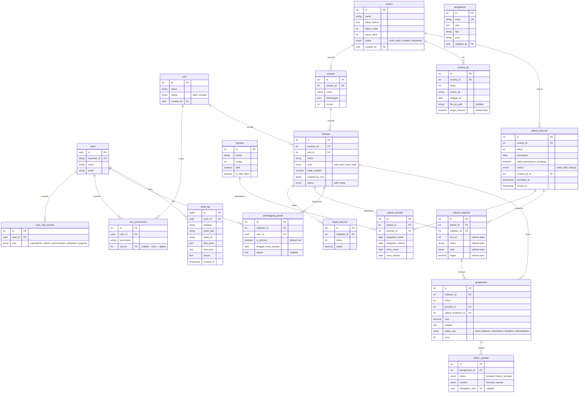

# PRD — SAKIP LLDIKTI Wilayah XVI

**Nama Produk:** SAKIP — Sistem Akuntabilitas Kinerja Instansi Pemerintah  
**Instansi:** LLDIKTI Wilayah XVI  
**Fase:** Fase Awal (MVP)  
**Versi Dokumen:** 1.1 (Finalized post Grill-Me)  
**Tanggal:** September 2026

---

## Daftar Isi

1. [Ringkasan Produk](#1-ringkasan-produk)
2. [Stakeholder & Pengguna](#2-stakeholder--pengguna)
3. [Cakupan Fase Awal (MVP)](#3-cakupan-fase-awal-mvp)
4. [Tech Stack & Arsitektur](#4-tech-stack--arsitektur)
5. [Requirement Fungsional per Modul](#5-requirement-fungsional-per-modul)
6. [Requirement Non-Fungsional](#6-requirement-non-fungsional)
7. [Data Model Utama](#7-data-model-utama)
8. [Matriks Peran & Hak Akses](#8-matriks-peran--hak-akses)
9. [Business Rules & Constraint Kritis](#9-business-rules--constraint-kritis)
10. [UI/UX Guidelines](#10-uiux-guidelines)
11. [Fase Lanjutan (Roadmap)](#11-fase-lanjutan-roadmap)
12. [Kriteria Penerimaan](#12-kriteria-penerimaan)

---

## 1. Ringkasan Produk

### 1.1 Latar Belakang Masalah

LLDIKTI Wilayah XVI saat ini mengelola Sistem Akuntabilitas Kinerja Instansi Pemerintah (SAKIP) menggunakan sistem berbasis **Excel**. Kondisi ini menimbulkan beberapa permasalahan operasional yang mendesak:

| Masalah | Dampak |
|---------|--------|
| **Data tidak terpusat** | Bukti dukung tersimpan sporadis di berbagai lokasi, sulit dilacak |
| **Tidak ada data historis** | Setiap perubahan data sering hilang, tidak ada jejak audit perubahan nilai |
| **Tidak ada mekanisme tenggat waktu** | Tim perencanaan harus menagih pengisian secara face-to-face kepada setiap unit/tim kerja |
| **Tekanan deadline ganda** | Kementerian (sistem pusat) memberikan deadline pengisian SAKIP, sementara LLDIKTI harus mengejar-ngejar unit internal untuk memenuhi deadline tersebut |
| **Tidak ada visualisasi capaian** | Sulit melihat tren kinerja per triwulan/tahun dalam bentuk grafik atau infografis |

### 1.2 Visi Produk

Membangun aplikasi web SAKIP LLDIKTI Wilayah XVI yang **terpusat**, **teraudit**, dan **terjadwal** untuk mendigitalisasi proses pengukuran kinerja instansi — mulai dari penyusunan Rencana Strategis (Renstra), penjadwalan triwulanan, penginputan realisasi indikator kinerja, verifikasi bertingkat, hingga pemantauan capaian IKU melalui dashboard visual.

### 1.3 Tujuan Utama

1. **Sentralisasi data** — Seluruh data kinerja (Renstra, indikator, target, realisasi, bukti dukung) tersimpan di satu tempat
2. **Riwayat historis** — Setiap perubahan data tercatat otomatis dengan jejak audit lengkap (siapa, kapan, nilai lama/baru, alasan)
3. **Penjadwalan & tenggat waktu** — Sistem deadline otomatis per periode triwulanan yang dikontrol oleh tim perencanaan
4. **Visualisasi kinerja** — Dashboard grafik dan infografis capaian IKU per triwulan/tahun untuk pemantauan pimpinan
5. **Verifikasi bertingkat** — Alur verifikasi dan pengesahan pengukuran oleh tim perencanaan sebelum data final diklaim
6. **Pemisahan tugas** — Role dan permission terstruktur yang memisahkan pengelola sistem (Admin) dari pengelola data kinerja (Perencanaan)

### 1.4 Dasar Regulasi

Aplikasi SAKIP LLDIKTI Wilayah XVI diturunkan dari hierarki regulasi berikut:

```
Keputusan Menteri Nomor 358 Tahun 2025
  └── Indikator Kinerja Utama (IKU) LLDIKTI
        └── Rencana Strategis (Renstra) — per 5 tahun
              └── Sasaran & Indikator
                    └── Perjanjian Kinerja (PK) — per tahun (ditandatangani Kepala)
                          └── Target Tahunan per Indikator
                                └── Jadwal & Pengukuran — per triwulan
                                      └── Status Capaian
```

Sewaktu-waktu dapat terbit **Keputusan Menteri (Kepmen) IKU baru** yang merevisi indikator di tengah periode Renstra berjalan. Sistem mengakomodasi hal ini melalui **siklus hidup status indikator (`aktif` ↔ `diarsipkan`)**:
- Indikator lama yang dicabut/diganti diberi status `diarsipkan` dengan batas tahun/triwulan berlaku, sehingga seluruh data pelaporan triwulan/tahun lampau tetap utuh, valid, dan dapat diaudit kapan saja.
- Indikator baru dari Kepmen revisi diinput dengan tahun mulai berlaku yang baru dan dikaitkan pada jadwal berjalan tanpa merusak snapshot historis.

---

## 2. Stakeholder & Pengguna

### 2.1 Stakeholder Utama

| Stakeholder | Kepentingan |
|-------------|------------|
| **Kepala LLDIKTI Wilayah XVI** | Memantau capaian kinerja instansi secara keseluruhan; menandatangani Perjanjian Kinerja tahunan |
| **Tim Perencanaan LLDIKTI** | Pengelola utama data SAKIP — menyusun Renstra, menetapkan jadwal, memverifikasi dan mengesahkan pengukuran, mengevaluasi capaian |
| **Kementerian (Pusat)** | Menerima laporan capaian kinerja LLDIKTI; memiliki deadline pengisian di sistem SAKIP pusat |

### 2.2 Peran Pengguna (User Roles)

Aplikasi memiliki **5 role preset** dengan pemisahan tugas yang tegas:

| Role | Label Tampilan | Deskripsi |
|------|---------------|-----------|
| **Superadmin** | Superadmin | Akses penuh ke seluruh fitur tanpa kecuali — gabungan wewenang administratif dan substantif |
| **Admin** | Administrator | Pengelola sistem: akun pengguna, unit organisasi, dan setelan aplikasi — **tanpa wewenang** atas data kinerja substantif |
| **Perencanaan** | Tim Perencanaan | Pengelola data kinerja: menyusun Renstra, jadwal, memverifikasi dan mengesahkan pengukuran, mengisi realisasi lintas unit tanpa batas deadline |
| **Pimpinan** | Pimpinan Lembaga | Pemantau: melihat dashboard dan laporan capaian secara read-only. Pada Fase Awal tidak memiliki aksi approval aktif |
| **Pegawai** | Penanggung Jawab (PIC) | Pengisi realisasi: menginput nilai realisasi target per indikator untuk unit yang ditugaskan, tunduk pada deadline jendela pengisian |

### 2.3 Persona & Kebutuhan

#### Persona 1: Perencanaan (Bu Yusna — Tim Perencanaan)
- **Masalah utama:** Harus menagih pengisian data ke setiap unit secara manual, kewalahan mengejar deadline kementerian
- **Kebutuhan:** Sistem yang otomatis memberikan deadline ke PIC, bisa mengisi data atas nama unit yang terlambat, dan melihat status pengisian secara real-time
- **Konteks kerja:** Laptop/komputer kantor, lingkungan terang, memproses data numerik dan dokumen formal

#### Persona 2: Penanggung Jawab/PIC (Pegawai Unit)
- **Masalah utama:** Tidak tahu kapan harus mengisi data kinerja, format pengisian sering berubah
- **Kebutuhan:** Notifikasi deadline yang jelas, form pengisian yang sederhana, bisa melihat target vs realisasi
- **Konteks kerja:** Mengisi data realisasi per triwulan sesuai indikator yang ditugaskan

#### Persona 3: Pimpinan (Kepala LLDIKTI)
- **Masalah utama:** Tidak punya gambaran cepat tentang capaian kinerja instansi
- **Kebutuhan:** Dashboard visual yang menampilkan grafik capaian per indikator, per triwulan, dan per tahun — tanpa perlu mengelola data
- **Konteks kerja:** Melihat ringkasan capaian untuk pengambilan keputusan dan evaluasi

---

## 3. Cakupan Fase Awal (MVP)

### 3.1 Termasuk dalam MVP

| # | Modul | Deskripsi Singkat |
|---|-------|-------------------|
| 1 | **Autentikasi & Akses** | Login via Keycloak SSO, manajemen role & permission, pengelolaan unit |
| 2 | **Master Renstra** | CRUD Renstra, Sasaran, Indikator (dengan arah naik_baik/turun_baik), Target Tahunan, Perjanjian Kinerja |
| 3 | **Periode & Jadwal** | Master periode, Jadwal Tahunan, jadwal_periode (jendela per triwulan), snapshot beku, aktivasi dengan 3 gerbang validasi |
| 4 | **Penugasan** | Penetapan dan pergantian Penanggung Jawab per indikator |
| 5 | **Pengukuran** | Input realisasi (draft → diajukan), deadline jendela periode, optimistic locking |
| 6 | **Reviu & Pengesahan** | Antrean verifikasi, pengesahan langsung oleh Perencanaan (tanpa approval Pimpinan), buka-kembali 2 lapis, status capaian manual |
| 7 | **Dashboard & Visualisasi** | Stat cards ringkasan, grafik ApexCharts target vs realisasi, filter reaktif, toolbar unduh gambar (PNG/SVG) untuk paparan pimpinan |
| 8 | **Laporan & Ekspor** | Tabel laporan terfilter, ekspor ke Excel (.xlsx) dengan Format Matriks Resmi LLDIKTI XVI |
| 9 | **Setelan Aplikasi** | Identitas instansi (teks), preferensi tampilan/laporan — hanya teks & presentasional |
| 10 | **Audit & Histori** | Pencatatan append-only, alasan wajib pada aksi sensitif, Sentral Audit Log Viewer + In-line History Drawer |

### 3.2 Tidak Termasuk dalam MVP (Fase Lanjutan)

- Approval Pimpinan dalam alur pengesahan pengukuran
- Ekspor PDF cetak buku LkjIP formal
- Integrasi status capaian otomatis dari sistem sumber data eksternal (API pusat)
- UI matrix permission penuh (centang bebas per pengguna)
- Impor data massal dari Excel/sistem lain
- Revisi target di tengah tahun (yang snapshot-nya sudah terbentuk)

---

## 4. Tech Stack & Arsitektur

### 4.1 Arsitektur: The Modern Monolith (Laravel + Inertia.js + React)

Aplikasi dibangun dalam satu repositori terpadu menggunakan **Inertia.js** sebagai bridge antara backend Laravel dan frontend React — **tanpa REST API terpisah**.

```
React + TypeScript (Inertia Pages & Components via Vite)
       ↕ (Inertia Protocol / Automatic XHR Props / Web Session & CSRF)
Laravel (Controller, Service, Policy/Gate, Middleware HandleInertiaRequests)
       ↓
PostgreSQL 18 (Database Relasional)
```

### 4.2 Komponen Teknologi

| Komponen | Teknologi | Peran |
|----------|-----------|-------|
| **Backend** | Laravel (v12/v13) | Single Source of Truth: routing controller (`Inertia::render`), validasi bisnis (`FormRequest`), otorisasi (`Policy`/`Gate`), state machine, audit log |
| **Adapter/Bridge** | Inertia.js (`@inertiajs/react` & `inertiajs/inertia-laravel`) | Protokol komunikasi data Laravel↔React, passing data sebagai props otomatis, navigasi SPA via `<Link>`, form handling via `useForm` |
| **Frontend** | React + TypeScript + Vite | Presentation & Interaction Layer: halaman Inertia (`resources/js/Pages`), komponen UI reaktif |
| **Styling** | Tailwind CSS v4 | Token desain institusi (blue `#122E92` + gold `#D6AC48`) via `@theme {}` |
| **Database** | PostgreSQL 18 | Data relasional, integritas constraint, snapshot beku JSONB, audit log append-only |
| **Containerization** | Podman 5.8 & Podman-compose 1.6 | Standardisasi container OCI rootless untuk isolasi runtime, deployment, dan Keycloak SSO orchestration |
| **Autentikasi/SSO** | Keycloak via Socialite (OIDC Authorization Code Flow) | Single Sign-On institusi, session cookie/CSRF, dual-mode switcher saat dev |
| **Visualisasi** | ApexCharts (`react-apexcharts`) | Grafik interaktif target vs realisasi dengan toolbar download bawaan |
| **Backend Testing** | Pest (Inertia Testing) | Pengujian fungsional controller via `$response->assertInertia(...)`, Policy, database assertions |
| **Frontend Testing** | Vitest + React Testing Library | Pengujian render komponen React, kalkulator formula, mock props testing |

### 4.3 Struktur Folder Utama

```
sakip/
├── app/
│   ├── Http/Controllers/        # Controller Inertia (render, store, update)
│   ├── Services/                # Business logic layer
│   ├── Models/                  # Eloquent models
│   └── Policies/                # Authorization policies
├── resources/
│   ├── js/
│   │   ├── Pages/               # Inertia page components (React)
│   │   ├── Components/          # Reusable UI components
│   │   ├── Layouts/             # AppLayout, Sidebar, Navbar
│   │   └── types/               # TypeScript interfaces
│   ├── css/                     # Tailwind CSS v4 tokens
│   └── views/
│       └── app.blade.php        # Root Inertia template (satu-satunya Blade)
├── routes/
│   └── web.php                  # Semua rute web (Inertia)
├── database/
│   ├── migrations/              # Skema database
│   └── seeders/                 # Data seed pengembangan
└── tests/
    ├── Feature/                 # Pest feature tests
    └── js/                      # Vitest frontend tests
```

### 4.4 Pola Komunikasi Data

1. **Server → Client:** Controller Laravel mengirim data sebagai **props Inertia** ke halaman React — tidak ada REST API endpoint terpisah
2. **Client → Server:** Form submission menggunakan `useForm` hook dari `@inertiajs/react` yang mengirim request XHR otomatis ke controller Laravel
3. **Navigasi:** Semua navigasi internal menggunakan komponen `<Link>` dari `@inertiajs/react` (SPA-like, tanpa full page reload)
4. **Auth sharing:** Data `auth.user`, `auth.permissions`, dan `flash` di-share ke seluruh halaman React via middleware `HandleInertiaRequests`

---

## 5. Requirement Fungsional per Modul

### Modul 1 — Autentikasi & Akses

#### FR-1.1: Login via Keycloak SSO
- Pengguna diarahkan ke halaman Keycloak (OIDC Authorization Code Flow) saat mengakses aplikasi
- Setelah login berhasil di Keycloak, sistem callback ke Laravel, melakukan mapping `keycloak_id` ke user lokal (`firstOrCreate`), dan membentuk sesi Laravel
- Login ulang pengguna yang sama tidak membuat baris duplikat di tabel `users` (constraint unique `keycloak_id`)
- Sinkronisasi `nama`/`email` dari klaim token setiap login

#### FR-1.2: Manajemen Unit Organisasi
- CRUD unit (create, read, update, delete) oleh Admin dan Superadmin
- Transisi status unit: aktif ↔ nonaktif
- **Guard integritas:** Unit yang masih memiliki indikator terkait tidak dapat dihapus, terlepas dari role pemohon

#### FR-1.3: Role Preset & Assign Role
- Superadmin/Admin dapat menetapkan satu role preset kepada pengguna: Superadmin, Admin, Perencanaan, Pimpinan, atau Pegawai
- Saat role preset di-assign, seluruh permission preset terkait disalin ke `user_permissions`
- Detail permission per preset:
  - **Perencanaan:** `pengukuran:create`/`update` dengan `unit_id = NULL` (global), `pengukuran:buka_kembali`, plus seluruh permission data kinerja
  - **Admin:** `pengguna:read`, `akses:update`, `unit:create/read/update/delete`, `pengaturan:update`, `audit:read`, `dashboard:read`, `laporan:read` — **tanpa** permission substantif data kinerja
  - **Superadmin:** Seluruh permission katalog tanpa kecuali

#### FR-1.4: Assign Scope Unit untuk Pengukuran
- Superadmin/Admin dapat memberikan permission `pengukuran:create` dan `pengukuran:update` yang di-scope ke unit tertentu untuk role Pegawai (PIC)
- Baris permission tersimpan dengan `unit_id` terisi (bukan NULL), membatasi akses PIC hanya ke indikator milik unit tersebut

#### FR-1.5: Evaluasi Permission (Gate Akses Backend)
- Setiap request dievaluasi melalui middleware/Policy Laravel
- Permission `pengukuran:create`/`update`:
  - Baris `unit_id = NULL` → akses global lintas unit (Perencanaan/Superadmin)
  - Baris `unit_id` terisi → hanya berlaku untuk indikator milik unit tersebut (PIC)
- Proteksi seluruh rute ditegakkan mutlak di backend; frontend React hanya mengatur visibilitas UI berdasarkan shared props

#### FR-1.6: Katalog Permission
- Seluruh permission didefinisikan sebagai konstanta terpusat di backend (PHP enum/class) dan TypeScript types di frontend
- Mencakup permission: `unit:*`, `renstra:*`, `sasaran:*`, `indikator:*`, `target:*`, `pk:*`, `jadwal:*`, `penanggung_jawab:*`, `pengukuran:*`, `status_capaian:*`, `pengguna:*`, `akses:*`, `pengaturan:*`, `audit:*`, `dashboard:*`, `laporan:*`

---

### Modul 2 — Master Renstra (Renstra, Sasaran, Indikator, Target, PK)

#### FR-2.1: CRUD Renstra
- Create/edit/list/delete Renstra dengan field: nama, keterangan, dasar_hukum, tahun_mulai, tahun_akhir
- Status Renstra: `draft` → `aktif` → `nonaktif` → `diarsipkan`
- Transisi hanya mengikuti urutan tersebut (tidak bisa langsung draft→diarsipkan)
- Permission: `renstra:create/read/update/delete`

#### FR-2.2: Aktivasi Renstra
- Validasi aktivasi:
  1. `dasar_hukum` wajib terisi
  2. Tidak ada Renstra aktif lain dengan rentang tahun beririsan
- Jika validasi lolos → status berubah menjadi `aktif`

#### FR-2.3: Guard Nonaktifkan Renstra
- Transisi `aktif → nonaktif` ditolak selama masih ada `jadwal_tahunan` berstatus `aktif` yang merujuk Renstra tersebut
- Jadwal harus ditutup lebih dulu sebelum Renstra dapat dinonaktifkan
- Transisi `nonaktif → diarsipkan` berlaku tanpa syarat tambahan

#### FR-2.4: Revisi Renstra In Place
- Saat Kepmen IKU direvisi, Renstra yang sudah aktif diedit langsung pada baris yang sama (bukan membuat baris baru)
- Validasi tambahan: alasan wajib diisi setiap kali Renstra berstatus `aktif` diedit (memuat nomor & tanggal Kepmen)
- Perubahan tercatat di audit log dengan `nilai_lama`/`nilai_baru`

#### FR-2.5: CRUD Sasaran
- Sasaran dibuat di bawah Renstra tertentu (relasi parent-child)
- Field: nama, keterangan, urutan
- Fitur reorder urutan
- Sasaran yang masih memiliki Indikator tidak dapat dihapus

#### FR-2.6: CRUD Indikator
- Indikator dibuat di bawah Sasaran, wajib memilih:
  - **Unit pemilik** (`unit_id` NOT NULL)
  - **Arah penilaian:** `naik_baik` (default) atau `turun_baik`
- Field tambahan: `wajib_catatan` (boolean), `created_by_role`
- Status: `aktif` ↔ `arsip`
- Indikator arsip tidak muncul sebagai opsi pengisian baru, tetapi data riwayat tetap terbaca
- **Guard:** `pengukuran:create` untuk indikator arsip ditolak untuk siapa pun

#### FR-2.7: Fitur Pindah Unit pada Indikator
- Aksi khusus untuk mengubah `unit_id` suatu indikator
- Wajib konfirmasi eksplisit
- Audit log mencatat `nilai_lama.unit_id` dan `nilai_baru.unit_id`

#### FR-2.8: Target Tahunan
- Input target per indikator per tahun
- Constraint unique `(indikator_id, tahun)` — update baris, bukan duplikat
- Nilai `0` adalah sah dan dibedakan dari belum diisi (`null`)

#### FR-2.9: Perjanjian Kinerja (PK) & Penguncian Target
- Input nomor_pk, tanggal_pk per tahun per Renstra (ditandatangani resmi oleh Kepala LLDIKTI Wilayah XVI)
- Constraint unique `(renstra_id, tahun)`
- **Penguncian Target Tahunan:** Pengesahan PK secara otomatis mengunci seluruh target tahunan indikator pada tahun bersangkutan (`target_terkunci = true`). Target tidak dapat diubah secara bebas setelah PK disahkan.
- **Upload Berkas Fisik PK:** Fasilitas upload berkas digital PDF dokumen Perjanjian Kinerja yang telah ditandatangani basah/elektronik oleh Kepala Lembaga (`file_pk_path`) untuk kepatuhan audit formal.
- **Fitur koreksi PK:** Mengubah nomor/tanggal/dokumen PK mewajibkan input alasan eksplisit dan mencatat jejak audit log lengkap.

---

### Modul 3 — Periode & Jadwal

#### FR-3.1: Master Periode
- CRUD periode (nama, urutan, aktif, is_nilai_akhir)
- Validasi: tepat satu baris `is_nilai_akhir = true` pada satu waktu
- Contoh: Triwulan I, Triwulan II, Triwulan III, Triwulan IV, Tahunan

#### FR-3.2: Jadwal Tahunan
- Create/edit Jadwal Tahunan berstatus draft
- Field: Renstra (pilih), tahun, tanggal penutupan
- Status: `draft` → `aktif` → `ditutup`
- **Tidak** memiliki kolom jendela pengisian/reviu (dipindahkan ke `jadwal_periode`)

#### FR-3.3: Jadwal Periode (Jendela Per Triwulan)
- Tabel pivot `jadwal_periode` menghubungkan Jadwal Tahunan dengan Periode
- Per baris: `pengisian_mulai`, `pengisian_selesai`, `reviu_mulai`, `reviu_selesai`
- Validasi urutan tanggal: `pengisian_mulai ≤ pengisian_selesai ≤ reviu_mulai ≤ reviu_selesai`
- Satu jadwal dapat memiliki beberapa baris (mis. 4 baris untuk Triwulan I–IV)

#### FR-3.4: Aktivasi Jadwal — Tiga Gerbang Validasi
- **Gerbang 1:** Perjanjian Kinerja untuk `(renstra_id, tahun)` sudah tercatat dan target telah terkunci
- **Gerbang 2:** Seluruh indikator aktif milik Renstra tersebut memiliki `target_tahunan` untuk tahun jadwal
- **Gerbang 3:** Tahun jadwal berada dalam rentang `[tahun_mulai, tahun_akhir]` Renstra
- Jika seluruh gerbang lolos: status → `aktif`, `renstra_pk_id` terisi, `activated_at` tercatat
- Setiap penolakan tercatat sebagai audit log percobaan gagal

#### FR-3.5: Jadwal Snapshot (Pembekuan Data) & Reversibilitas Aktivasi
- Saat jadwal diaktifkan, sistem membuat salinan (snapshot) untuk setiap pasangan `(jadwal_id, indikator_id)`
- Data yang disalin: nama, definisi, satuan, presisi, desimal_tampilan, unit_id, arah, target
- **Idempoten:** baris yang sudah ada dilewati, tidak ditimpa
- **Reversibilitas Aktivasi (Belum Ada Pengukuran):** Jika jadwal telah berstatus `aktif` namun **belum ada satupun pengukuran** yang dibuat atau disubmit oleh PIC, Tim Perencanaan dapat mengembalikan status jadwal kembali ke `draft` untuk perbaikan parameter tanpa prosedur pembukaan formal.
- **Imutabilitas (Sudah Ada Pengukuran):** Begitu ada baris pengukuran yang merujuk snapshot jadwal tersebut, status jadwal terkunci penuh. Koreksi target atau data jadwal hanya dapat dilakukan melalui protokol audit formal `jadwal:buka_kembali`.

#### FR-3.6: Tutup & Buka Kembali Jadwal
- Tutup: `aktif → ditutup` (mengisi `closed_at`)
- Buka kembali: `ditutup → aktif` — alasan wajib, memicu ulang trigger snapshot idempoten
- Buka kembali adalah **mekanisme standar** untuk:
  - Koreksi pengukuran pasca-penutupan
  - Memasukkan indikator baru di tengah tahun (akibat revisi Kepmen IKU)

#### FR-3.7: Aktivasi Jadwal Retroaktif (Backfill)
- Jadwal tahun lampau dalam rentang Renstra dapat diaktifkan lewat tiga gerbang yang sama
- `activated_at` mencatat waktu aktivasi sebenarnya (bukan tanggal retroaktif)
- PIC otomatis terkunci karena seluruh jendela pengisian sudah lewat
- Hanya Perencanaan yang dapat mengisi data retroaktif

#### FR-3.8: Tampilan Status Jendela Waktu
- Halaman detail jadwal menampilkan status per periode: "Masa pengisian Triwulan II", "Masa reviu Triwulan II", "Periode Triwulan I ditutup"
- Dihitung berdasarkan tanggal hari ini vs data `jadwal_periode`

---

### Modul 4 — Penugasan (Penanggung Jawab)

#### FR-4.1: Penugasan Penanggung Jawab (PIC Unit & PIC Utama)
- Perencanaan/Superadmin menetapkan Penanggung Jawab per indikator berdasarkan Unit Kerja pemilik.
- Setiap unit kerja memiliki **1 PIC Utama (Primary PIC)** (`is_primary = true`) yang memegang tanggung jawab formal atas pengajuan (submission) pengukuran ke Tim Perencanaan.
- Pengguna lain dalam unit kerja yang sama (`unit_id` identik) memiliki akses kolaboratif/view untuk memantau data indikator unit mereka.
- Field penugasan: `user_id`, `indikator_id`, `is_primary`, `tanggal_mulai_berlaku`.
- Alasan tidak wajib untuk penugasan pertama.

#### FR-4.2: Pergantian Penanggung Jawab
- Menambah baris penugasan baru (baris lama tidak dihapus/dimodifikasi — riwayat penugasan lengkap).
- Jika ada penugasan PIC Utama baru, baris aktif lama otomatis menjadi non-primary.
- Alasan pergantian wajib diisi.
- Tercatat di audit log.

#### FR-4.3: Resolusi Penanggung Jawab Efektif
- PJ efektif = baris dengan `tanggal_mulai_berlaku` maksimum yang ≤ tanggal acuan.
- Digunakan untuk menentukan siapa PIC saat pengisian pengukuran dan notifikasi reminder.

---

### Modul 5 — Pengukuran

#### FR-5.1: Buat Draft Pengukuran
- PIC (scoped per unit) atau Perencanaan (global) membuat baris pengukuran baru berstatus `draft`
- Terhubung ke `jadwal_snapshot_id` yang relevan
- PIC hanya untuk indikator unit-nya; Perencanaan untuk unit mana pun
- Constraint unique `(indikator_id, tahun, periode_id)`
- `pengukuran:create` untuk indikator arsip ditolak untuk siapa pun

#### FR-5.2: Edit Draft & Penanganan Konflik Konkurensi (Optimistic Locking UX)
- Edit nilai dan catatan pada pengukuran berstatus draft
- Setiap kali data disimpan, kolom `versi` dinaikkan secara otomatis
- **Pengalaman Pengguna Saat Terjadi Konflik:** Jika pengguna menyimpan dengan `versi` usang (telah diubah pengguna lain lebih dulu):
  - Sistem menampilkan banner peringatan informatif: *"Data telah diperbarui oleh rekan lain saat Anda sedang mengedit"*.
  - Menampilkan angka realisasi terbaru dari database.
  - Memberikan opsi **"Muat Ulang Data Terbaru"** tanpa menghapus draft teks analisis/kendala yang sedang diketik pengguna di form.

#### FR-5.3: Guard Deadline Jendela Pengisian
- **PIC:** ditolak create/update/ajukan begitu tanggal hari ini melewati `jadwal_periode.pengisian_selesai`
- **Perencanaan:** dikecualikan dari batas jendela periode, hanya dibatasi `jadwal_tahunan.penutupan`
- Frontend menampilkan banner deadline dan menonaktifkan form jika waktu habis
- **Backend tetap menjadi pengawas mutlak**

#### FR-5.4: Ajukan Pengukuran
- Transisi `draft → diajukan`
- Validasi catatan wajib:
  - Jika nilai **memburuk** menurut arah indikator dibanding pengukuran Disahkan terakhir:
    - `naik_baik`: nilai turun → catatan wajib
    - `turun_baik`: nilai naik → catatan wajib
    - Nilai stagnan → catatan tidak wajib
    - Pengukuran pertama tanpa pembanding → catatan tidak wajib
  - Jika `indikator.wajib_catatan = true` → catatan selalu wajib

#### FR-5.5: Verifikasi oleh Perencanaan
- Transisi `diajukan → diverifikasi`
- Permission: `pengukuran:verifikasi`

#### FR-5.6: Kembalikan dengan Alasan
- Transisi `diajukan atau diverifikasi → dikembalikan`
- Alasan wajib diisi
- Data kembali dapat diedit oleh PIC/Perencanaan

#### FR-5.7: Revisi Pasca-Dikembalikan
- Pengukuran berstatus `dikembalikan` dapat diedit dan diajukan kembali
- Validasi deadline dan catatan wajib tetap berlaku pada pengajuan ulang

#### FR-5.8: Sahkan oleh Perencanaan
- Transisi `diverifikasi → disahkan`
- Fase Awal: langsung oleh Perencanaan, tanpa approval Pimpinan
- Permission: `pengukuran:sahkan`

#### FR-5.9: Buka-Kembali Pengukuran Disahkan
- Transisi `disahkan → dikembalikan`
- Permission: `pengukuran:buka_kembali` (Perencanaan/Superadmin)
- Alasan wajib
- **Hanya tersedia selama jadwal belum penutupan**
- Setelah dikembalikan, mengikuti alur revisi biasa

#### FR-5.10: Larangan Penghapusan Data Bermakna
- Baris pengukuran dengan `nilai` atau `catatan` terisi tidak dapat dihapus permanen
- Guard di backend (Policy/Observer) berlaku di seluruh titik masuk

#### FR-5.11: State Machine Status Alur Pengukuran

```
[*] → Draft → Diajukan → Diverifikasi → Disahkan → [*]
                  ↓              ↓              ↓
              Dikembalikan ← ← ← ← ← ← ← ← ←
                  ↓
               Draft (revisi, lalu ajukan ulang)
```

5 status: **Draft**, **Diajukan**, **Diverifikasi**, **Disahkan**, **Dikembalikan**

#### FR-5.12: Formula Kalkulasi Capaian & Kebijakan Capping 100%
- Persentase Capaian Kinerja per indikator dihitung otomatis:
  - Untuk arah `naik_baik`: `Capaian (%) = (Realisasi / Target) * 100%`
  - Untuk arah `turun_baik`: `Capaian (%) = (Target / Realisasi) * 100%` (jika Realisasi > 0; jika Realisasi = 0, dihitung 100% jika Target = 0, atau formula batas disesuaikan)
- **Kebijakan Capping Agregat Institusi (Standar KemenPAN-RB):**
  - Pada perhitungan rata-rata indeks capaian tingkat Sasaran Strategis, Renstra, dan Dashboard Eksekutif Pimpinan, nilai capaian per IKU **dibatasi (capped) maksimal 100%**. Hal ini mencegah IKU over-performed mengaburkan IKU yang belum tercapai pada indeks komposit institusi.
- **Pelestarian Nilai Capaian Riil:**
  - Nilai capaian riil (uncapped, misal: 125%) **tetap disimpan utuh di database** dan ditampilkan secara transparan pada tabel detail indikator/laporan untuk apresiasi kinerja riil unit kerja.

---

### Modul 6 — Reviu & Pengesahan

#### FR-6.1: Dashboard Kerja Perencanaan — Antrean
- **Antrean Diajukan:** Daftar pengukuran berstatus `diajukan` menunggu verifikasi
- **Antrean Diverifikasi:** Daftar pengukuran berstatus `diverifikasi` siap disahkan
- **Antrean Disahkan:** Daftar pengukuran berstatus `disahkan` (jadwal belum penutupan) dengan aksi buka-kembali
- Filter per Renstra/Tahun/Periode/Unit

#### FR-6.2: Penetapan Status Capaian (Auto-Default Formula + Manual Override)
- Saat pengukuran berstatus `disahkan`, sistem secara otomatis menetapkan status capaian awal berdasarkan formula matematika:
  - Capaian ≥ 100% → default status: `tercapai`
  - Capaian < 100% → default status: `belum_tercapai`
  - Sumber awal tercatat sebagai `formula`.
- **Manual Override oleh Tim Perencanaan:** Tim Perencanaan/Superadmin memiliki kewenangan untuk mengubah (override) status capaian tersebut secara manual bila terdapat pertimbangan kualitatif resmi.
- Tindakan override mencatat `sumber = manual`, `ditetapkan_oleh: user_id`, dan alasan override ke audit log.
- Revisi status capaian menggunakan mekanisme penambahan baris baru (soft replace), sehingga baris lama tetap tersimpan sebagai riwayat.

---

### Modul 7 — Dashboard & Visualisasi Kinerja

#### FR-7.1: Ringkasan Status Capaian
- Komponen stat cards menampilkan jumlah indikator per kategori:
  - **Tercapai** | **Belum Tercapai** | **Belum Ditetapkan** | **Belum Mengisi** | **Tidak Mengisi**
- Dihitung per kombinasi `indikator × periode` (dari `jadwal_periode`), bukan per tahun
- Indikator berstatus `arsip` dikecualikan dari perhitungan

#### FR-7.2: Grafik ApexCharts Target vs Realisasi & Toolbar Unduh
- Grafik interaktif: deret target (dari snapshot) vs realisasi (nilai pengukuran disahkan) per indikator/periode
- Menggunakan `react-apexcharts` dengan toolbar unduh gambar bawaan (PNG/SVG) yang tetap aktif sebagai kemudahan bagi Pimpinan dan Tim Perencanaan menyiapkan slide paparan dinas.

#### FR-7.3: Filter Dashboard Reaktif
- Filter: Renstra, Tahun, Periode, Sasaran, Unit
- Menggunakan `router.get()` dari `@inertiajs/react` dengan `preserveState: true`
- Memperbarui ringkasan dan grafik tanpa reload halaman

#### FR-7.4: Akses Dashboard Universal
- Seluruh role (termasuk Pegawai dan Admin) memiliki akses baca dashboard
- Permission: `dashboard:read`

---

### Modul 8 — Laporan & Ekspor

#### FR-8.1: Halaman Laporan Tabular
- Tabel pengukuran dengan filter: Renstra/Tahun/Periode/Sasaran/Unit/Status
- Kolom: nama indikator, unit, tahun, periode, nilai, status_alur, status_capaian
- Permission: `laporan:read`

#### FR-8.2: Ekspor ke Excel (Format Matriks Hierarkis Resmi LLDIKTI XVI)
- Ekspor hasil laporan kinerja ke format `.xlsx` via `maatwebsite/excel`
- **Struktur Matriks Resmi Sesuai Template LLDIKTI XVI:**
  - Header resmi instansi dan judul periode laporan
  - Pengelompokan baris hierarkis berdasarkan Sasaran Strategis
  - Kolom lengkap: Nomor, Sasaran Strategis, Indikator Kinerja Utama (IKU), Target Tahunan/Triwulan, Realisasi Triwulan I, Realisasi Triwulan II, Realisasi Triwulan III, Realisasi Triwulan IV, Capaian Tahunan (%), Analisis Faktor Pendorong/Kendala, dan Tindak Lanjut
- Berkas diunduh langsung melalui browser
- Permission: `laporan:ekspor` (terpisah dari `laporan:read`)

---

### Modul 9 — Setelan Aplikasi

#### FR-9.1: Tabel Key-Value Pengaturan (Murni Teks Form Fields)
- Kunci unik, nilai, tipe, grup, updated_by, updated_at
- Form input murni berupa field teks dan numerik untuk metadata resmi:
  - **Identitas instansi:** Nama Instansi ("LLDIKTI Wilayah XVI"), Nama Kepala Lembaga, NIP Kepala Lembaga, Alamat Kantor, Telepon, Surel Dinas, Website Resmi
  - **Identitas aplikasi:** Nama Aplikasi ("SAKIP"), Label Unit Kerja
  - **Preferensi tampilan/laporan:** Zona waktu (WITA), Format Tanggal, Format Angka, Header/Footer teks pada ekspor laporan
- **Aset Logo:** Gambar logo resmi LLDIKTI XVI dan logo Tut Wuri Handayani dikelola secara statis di dalam aset aplikasi (`resources/images`), tidak memerlukan form upload file dinamis pada MVP.

#### FR-9.2: Accessor dengan Cache
- Service/helper `Pengaturan::get('kunci', $default)` dengan layer cache Laravel
- Cache diinvalidasi otomatis saat nilai diperbarui

#### FR-9.3: Form Setelan Aplikasi
- Halaman terkelompok per tab/grup (instansi, aplikasi, preferensi)
- Validasi whitelist kunci — hanya kunci terdefinisi yang dapat diubah
- Permission: `pengaturan:update`

#### FR-9.4: Batas Tegas Cakupan
- Modul ini **hanya** untuk teks dan preferensi presentasional
- **Tidak** menyediakan jalur untuk mengubah enum, status, nama permission, atau aturan bisnis apa pun

---

### Modul 10 — Audit & Histori

#### FR-10.1: Infrastruktur Audit Log
- Tabel `audit_log` append-only (tidak ada rute update/delete)
- Service terpusat `AuditLogger::catat(...)` dipanggil seluruh controller/service
- Kolom: actor_id, tindakan, objek_tipe, objek_id, nilai_lama (JSON), nilai_baru (JSON), alasan, created_at

#### FR-10.2: Alasan Wajib pada Aksi Sensitif
- Daftar tindakan sensitif yang mewajibkan alasan:
  - Koreksi PK
  - Pengembalian pengukuran (`pengukuran:kembalikan`)
  - Buka-kembali pengukuran (`pengukuran:buka_kembali`)
  - Pergantian penanggung jawab
  - Penghapusan unit
  - Buka-kembali jadwal (`jadwal:buka_kembali`)
  - Revisi Renstra in place
- Pemanggilan `AuditLogger::catat(...)` untuk tindakan ini tanpa alasan → ditolak/exception

#### FR-10.3: Audit untuk Percobaan yang Ditolak
- Setiap penolakan eksplisit (percobaan hapus data bermakna, aktivasi gagal gerbang, create pengukuran indikator arsip) menghasilkan baris audit log bertindakan "ditolak"/"percobaan"

#### FR-10.4: Antarmuka Audit Log (Sentral Viewer & In-Line Drawer)
- **Sentral Audit Log Viewer (Menu Khusus):**
  - Tersedia bagi Superadmin dan Admin untuk memantau seluruh aktivitas sistem secara makro.
  - Filter: aktor/user, jenis tindakan, tipe objek, rentang tanggal.
  - Tampilan diff nilai_lama vs nilai_baru secara human-readable.
  - Permission: `audit:read`.
- **In-Line History Drawer (Halaman Pengukuran & Verifikasi):**
  - Panel riwayat kronologis tersemat langsung di halaman detail pengisian pengukuran (PIC) dan antrean verifikasi (Tim Perencanaan).
  - Menampilkan rekam jejak revisi angka, catatan pengembalian, dan alasan perubahan secara kontekstual tanpa mengharuskan pengguna berpindah halaman.

---

## 6. Requirement Non-Fungsional

### 6.1 Performa

| Aspek | Standar |
|-------|---------|
| **Waktu muat halaman** | ≤ 2 detik untuk halaman list/dashboard dengan data seed standar |
| **Query dashboard** | Menggunakan index database yang relevan; `EXPLAIN ANALYZE` tidak menunjukkan sequential scan penuh pada tabel besar |
| **Navigasi SPA** | Transisi halaman instan via Inertia (tanpa full page reload) |
| **Filter reaktif** | Partial reload Inertia tanpa perceivable delay |

### 6.2 Keamanan

| Aspek | Standar |
|-------|---------|
| **Autentikasi** | OIDC Authorization Code Flow via Keycloak, session terproteksi cookie + CSRF |
| **Otorisasi** | Ditegakkan mutlak di backend (Policy/Gate Laravel); frontend hanya mengontrol visibilitas |
| **Data integrity** | Foreign key constraint, unique constraint, NOT NULL di level database |
| **Audit trail** | Append-only, tidak ada endpoint untuk mengubah/menghapus log |
| **Optimistic locking** | Kolom `versi` pada pengukuran mencegah overwrite data secara bersamaan |

### 6.3 Aksesibilitas & Kompatibilitas

| Aspek | Standar |
|-------|---------|
| **Kontras teks** | Body text ≥ 4.5:1 terhadap background |
| **Responsive** | Mobile responsive — sidebar off-canvas di mobile, tanpa horizontal overflow |
| **Browser** | Chrome, Firefox, Edge versi terbaru |
| **Tema** | Light only (konsistensi dokumen formal instansi) |

### 6.4 Testing

| Jenis | Framework | Cakupan |
|-------|-----------|---------|
| **Backend Feature** | Pest | Setiap controller action, policy, validasi bisnis, gate akses, audit log |
| **Frontend Unit** | Vitest + React Testing Library | Render komponen, interaksi pengguna, mock props |
| **Inertia Assertion** | Pest `assertInertia(...)` | Memverifikasi component name dan props yang dikirim controller |

---

## 7. Data Model Utama

### 7.1 Entity Relationship Diagram



### 7.2 Constraint Penting

| Tabel | Constraint | Tipe |
|-------|-----------|------|
| `users` | `keycloak_id` | UNIQUE |
| `user_permissions` | `(user_id, permission, unit_id)` | UNIQUE |
| `target_tahunan` | `(indikator_id, tahun)` | UNIQUE |
| `renstra_pk` | `(renstra_id, tahun)` | UNIQUE |
| `pengukuran` | `(indikator_id, tahun, periode_id)` | UNIQUE |
| `pengaturan` | `kunci` | UNIQUE |
| `indikator` | `unit_id` | NOT NULL |
| `audit_log` | — | Append-only (no UPDATE/DELETE) |

---

## 8. Matriks Peran & Hak Akses

| Aksi / Modul | Superadmin | Admin | Perencanaan | Pimpinan | Pegawai (PIC) |
|---|:---:|:---:|:---:|:---:|:---:|
| Kelola Renstra/Sasaran/Indikator/Target/PK | ✅ | ❌ | ✅ | ❌ | ❌ |
| Kelola Periode & Jadwal (termasuk aktivasi) | ✅ | ❌ | ✅ | ❌ | ❌ |
| Kelola Penanggung Jawab | ✅ | ❌ | ✅ | ❌ | ❌ |
| Buat/ubah Pengukuran (Draft) | ✅ (global) | ❌ | ✅ (global, tanpa batas jendela) | ❌ | ✅ (scope unit, tunduk jendela) |
| Ajukan Pengukuran | ✅ (global) | ❌ | ✅ (global) | ❌ | ✅ (scope unit, tunduk jendela) |
| Verifikasi / Kembalikan Pengukuran | ✅ | ❌ | ✅ | ❌ | ❌ |
| Sahkan Pengukuran | ✅ | ❌ | ✅ | ❌ | ❌ |
| Buka-kembali Pengukuran (`pengukuran:buka_kembali`) | ✅ | ❌ | ✅ | ❌ | ❌ |
| Buka-kembali Jadwal (`jadwal:buka_kembali`) | ✅ | ❌ | ✅ | ❌ | ❌ |
| Tetapkan Status Capaian | ✅ | ❌ | ✅ | ❌ | ❌ |
| Kelola Unit (`unit:*`) | ✅ | ✅ | ❌ | ❌ | ❌ |
| Kelola Akses (`akses:update`, `pengguna:read`) | ✅ | ✅ | ❌ | ❌ | ❌ |
| Ubah Setelan Aplikasi (`pengaturan:update`) | ✅ | ✅ | ❌ | ❌ | ❌ |
| Lihat Dashboard (`dashboard:read`) | ✅ | ✅ | ✅ | ✅ | ✅ |
| Lihat Laporan (`laporan:read`) | ✅ | ✅ | ✅ | ✅ | ❌* |
| Ekspor Laporan (`laporan:ekspor`) | ✅ | ❌ | ✅ | ✅ | ❌* |
| Lihat Audit Log (`audit:read`) | ✅ | ✅ | ✅ | ✅ | ❌ |

> **Legenda:** ✅ = termasuk preset default; ❌ = tidak termasuk preset default; ❌* = dapat diberikan secara eksplisit sebagai pengecualian.

**Pemisahan tugas kunci:** Admin memegang wewenang administratif (akses, unit, setelan) **tanpa** wewenang substantif atas data kinerja — pemisahan yang disengaja dari role Perencanaan.

---

## 9. Business Rules & Constraint Kritis

### 9.1 Aturan Berjenjang (Cascade Dependency)

```
Renstra harus ada dan aktif
  └── Sasaran harus ada di bawah Renstra
        └── Indikator harus ada di bawah Sasaran (dengan unit_id & arah)
              └── Target Tahunan harus ada per indikator per tahun
                    └── Perjanjian Kinerja (PK) disahkan & mengunci target tahunan
                          └── Jadwal Tahunan baru bisa diaktifkan (3 gerbang)
                                └── Snapshot terbentuk (beku)
                                      └── Pengukuran bisa dibuat (draft)
```

### 9.2 Aturan Penguncian Target Tahunan oleh Perjanjian Kinerja (PK)

- Pengesahan Perjanjian Kinerja tahunan yang ditandatangani Kepala Lembaga secara otomatis **mengunci target tahunan** seluruh indikator aktif (`target_terkunci = true`).
- Dokumen fisik/PDF bertandatangan diunggah sebagai bukti kepatuhan audit.
- Target tahunan yang telah terkunci tidak dapat dimodifikasi secara bebas tanpa prosedur koreksi PK formal yang mewajibkan input alasan dan mencatat jejak audit log.

### 9.3 Aturan Deadline Dua Lapis

| Lapis | Berlaku untuk | Batas waktu | Setelah lewat |
|-------|--------------|-------------|---------------|
| **Jendela Periode** | PIC (scope unit) | `jadwal_periode.pengisian_selesai` | PIC tidak bisa create/update/ajukan |
| **Penutupan Jadwal** | Perencanaan (global) | `jadwal_tahunan.penutupan` | Perencanaan tidak bisa create/update/ajukan; harus `jadwal:buka_kembali` |

### 9.4 Aturan Buka-Kembali Dua Lapis & Reversibilitas Aktivasi

| Lapis | Permission | Transisi | Syarat & Kondisi |
|-------|-----------|----------|------------------|
| **Reversibilitas Draft** | `jadwal:update` | `aktif → draft` | Diizinkan **hanya jika belum ada pengukuran** yang dibuat/disubmit oleh PIC pada jadwal tersebut |
| **Lapis 1 — Pengukuran** | `pengukuran:buka_kembali` | `Disahkan → Dikembalikan` | Sebelum `jadwal.penutupan`; mewajibkan alasan |
| **Lapis 2 — Jadwal** | `jadwal:buka_kembali` | `ditutup → aktif` | Setelah `jadwal.penutupan` / jadwal `ditutup`; memicu snapshot ulang idempoten; mewajibkan alasan |

### 9.5 Aturan Snapshot (Pembekuan Data)

- Snapshot bersifat **idempoten**: baris yang sudah ada tidak ditimpa saat trigger dijalankan ulang
- Snapshot yang **sudah dirujuk** pengukuran bersifat **abadi** — tidak dapat diubah
- Snapshot yang **belum dirujuk** boleh dikoreksi selama jadwal berstatus `aktif`, dengan audit log
- Mengubah data master (mis. `indikator.nama`) setelah snapshot terbentuk **tidak** mengubah snapshot yang sudah dibekukan

### 9.6 Kebijakan Capping Capaian 100% (Standar KemenPAN-RB)

- Formula kalkulasi capaian kinerja per indikator:
  - Arah `naik_baik`: `(Realisasi / Target) * 100%`
  - Arah `turun_baik`: `(Target / Realisasi) * 100%`
- **Capping Maksimal 100% untuk Nilai Komposit:**
  - Pada perhitungan agregasi/rata-rata capaian pada tingkat Sasaran Strategis, Renstra, dan Indeks Kinerja Institusi di Dashboard Eksekutif, capaian setiap IKU **dibatasi maksimal 100%**. Kebijakan ini mengikuti pedoman evaluasi akuntabilitas kinerja KemenPAN-RB agar indikator yang melampaui target tidak mengaburkan indikator yang kinerjanya masih di bawah target.
- **Pelestarian Nilai Riil (Uncapped):**
  - Nilai capaian riil (misal 125%) **tetap dipreservasi dan ditampilkan pada detail tabel IKU** untuk transparansi dan apresiasi pencapaian riil unit kerja.

### 9.7 Aturan Catatan Wajib

Catatan wajib diisi saat mengajukan pengukuran jika:
1. Nilai memburuk menurut arah indikator dibanding Disahkan terakhir (stagnan dikecualikan), **ATAU**
2. `indikator.wajib_catatan = true`

### 9.8 Aturan Integritas Data

- Unit dengan indikator terkait tidak dapat dihapus
- Sasaran dengan indikator terkait tidak dapat dihapus
- Pengukuran dengan `nilai`/`catatan` terisi tidak dapat dihapus permanen
- `pengukuran:create` untuk indikator arsip ditolak untuk siapa pun

### 9.9 Aturan Penugasan PIC & Akses Kolaboratif Unit

- Penugasan indikator berbasis Unit Kerja dengan menetapkan **1 PIC Utama (Primary PIC)**.
- Hanya PIC Utama yang memiliki hak formal untuk menekan tombol **"Ajukan Pengukuran"** ke Tim Perencanaan.
- Anggota lain dalam unit kerja yang sama diberikan izin akses kolaboratif/view untuk membantu penyusunan draf angka dan berkas bukti dukung.

### 9.10 Aturan Perubahan Regulasi (Kepmen IKU)

| Jenis Perubahan | Penanganan |
|-----------------|-----------|
| Revisi atribut Renstra | Edit in place baris yang sama, alasan wajib (nomor & tanggal Kepmen) |
| Indikator dihapus dari Kepmen | Arsipkan indikator (aktif → arsip), data lama tetap utuh |
| Indikator baru ditambahkan | Buat indikator baru → isi target → `jadwal:buka_kembali` → snapshot baru terbentuk |

### 9.11 Aturan Nilai Periode Akhir

Nilai periode dengan `is_nilai_akhir = true` (mis. Tahunan) diisi **manual** — tidak ada perhitungan agregasi otomatis dari periode-periode di bawahnya.

---

## 10. UI/UX Guidelines

### 10.1 Prinsip Desain

- **Legible & Scannable** — Berorientasi pada kepadatan data kinerja tinggi
- **Profesional & Berwibawa** — Formal instansi pemerintah tanpa kaku
- **Light only** — Tidak ada dark mode (konsistensi dokumen formal)
- **SPA Feel** — Navigasi instan tanpa reload via `<Link>` Inertia
- **Mobile Responsive** — Sidebar off-canvas, tanpa horizontal overflow

### 10.2 Design Tokens

| Token | Nilai | Peran |
|-------|-------|-------|
| `--color-primary` | `#122E92` | Brand utama, CTA, active sidebar |
| `--color-secondary` | `#D6AC48` | Aksen emas, highlight target |
| `--color-page` | `#F8FAFC` | Background body |
| `--color-surface` | `#FFFFFF` | Card, panel, sidebar |
| `--color-ink` | `#0F172A` | Teks utama, judul, angka |
| `--color-muted` | `#64748B` | Label, metadata, placeholder |
| `--color-success` | `#16A34A` | Disahkan, Tercapai, Aktif |
| `--color-warning` | `#EAB308` | Diajukan, pengingat deadline H-3 |
| `--color-danger` | `#DC2626` | Dikembalikan, Belum Tercapai, deadline H-1 |
| `--color-info` | `#2563EB` | Diverifikasi, arah Naik Baik |
| `--color-border` | `#E2E8F0` | Garis pemisah, border input/card |
| `--color-soft` | `#F1F5F9` | Header tabel, hover menu |

### 10.3 Typography

- **Font utama:** Poppins (Google Fonts) via `font-sans`
- **Font monospace:** `font-mono` untuk angka target, persentase, kode indikator, NIP
- Semua didefinisikan via Tailwind CSS v4 `@theme {}`

### 10.4 Komponen UI Reusable

| Komponen | Lokasi | Kegunaan |
|----------|--------|----------|
| `Button` | `Components/UI/Button.tsx` | 8 variant (primary, secondary, success, warning, danger, danger-solid, ghost, link) × 4 size |
| `Badge` | `Components/UI/Badge.tsx` | Status mapping: alur pengukuran, status capaian, status Renstra/Jadwal |
| `ModalAlasan` | `Components/UI/ModalAlasan.tsx` | Dialog input alasan wajib untuk aksi audit sensitif |
| `FlashMessages` | `Components/UI/FlashMessages.tsx` | Notifikasi flash dari backend (sukses, error, warning) |
| `Sidebar` | `Components/Layouts/Sidebar.tsx` | Navigasi utama dengan `<Link>` Inertia |
| `Navbar` | `Components/Layouts/Navbar.tsx` | Header atas dengan toggle sidebar mobile |

### 10.5 Pola Form

- Semua form menggunakan `useForm` hook dari `@inertiajs/react`
- Error binding otomatis dari Laravel FormRequest validation
- State loading ditangani via `processing` dari `useForm`

### 10.6 Badge Mapping Status

| Domain | Nilai | Warna Badge |
|--------|-------|-------------|
| Status Alur | Draft | Muted (abu-abu) |
| Status Alur | Diajukan | Warning (kuning) |
| Status Alur | Diverifikasi | Info (biru) |
| Status Alur | Disahkan | Success (hijau) |
| Status Alur | Dikembalikan | Danger (merah) |
| Status Capaian | Tercapai | Success (hijau) |
| Status Capaian | Belum Tercapai | Danger (merah) |
| Status Capaian | Belum Ditetapkan | Muted (abu-abu) |

---

## 11. Fase Lanjutan (Roadmap)

Fitur berikut secara sengaja **tidak dibangun** pada Fase Awal (MVP). Dicantumkan sebagai catatan cakupan masa depan:

| # | Fitur | Deskripsi |
|---|-------|-----------|
| 1 | **Approval Pimpinan** | Mengaktifkan `pakai_persetujuan_pimpinan`, jendela persetujuan, dan permission `pengukuran:setujui` untuk peran aktif Pimpinan dalam state machine |
| 2 | **Ekspor PDF** | Rekap laporan formal (mis. lampiran LKj) dalam format PDF |
| 3 | **Ekspor Gambar Grafik** | PNG/SVG dari grafik dashboard untuk disisipkan ke dokumen/presentasi |
| 4 | **Integrasi Status Capaian Otomatis** | Jalur `sumber = data_sumber` dari sistem eksternal — job/API yang menghitung status capaian secara otomatis |
| 5 | **UI Matrix Permission Penuh** | Antarmuka centang bebas seluruh permission per pengguna, menggantikan form preset |
| 6 | **Impor Data Massal** | Impor dari Excel/sistem lain — memerlukan keputusan produk tersendiri |
| 7 | **Revisi Target Tengah Tahun** | Mekanisme revisi target pada tahun yang snapshot-nya sudah terbentuk (saat ini memakai `jadwal:buka_kembali` + koreksi manual) |

> **Catatan teknis:** Kolom `pakai_persetujuan_pimpinan`, `persetujuan_mulai`, dan `persetujuan_selesai` pada tabel `jadwal_tahunan` sudah disiapkan di skema Fase Awal (dengan default `false`/`null`) tanpa mempengaruhi logic saat ini.

---

## 12. Kriteria Penerimaan

### Modul 1 — Autentikasi & Akses

| ID | Kriteria | Metode Verifikasi |
|----|---------|-------------------|
| AC-1.1 | Aplikasi berjalan via `php artisan serve` tanpa error, Inertia merender React via Vite | Test Pest + manual |
| AC-1.2 | Login Keycloak redirect dan callback berhasil membentuk sesi Laravel | Test Pest |
| AC-1.3 | Login ulang user yang sama tidak membuat baris duplikat `users` | Test Pest: login 2x, count tetap 1 |
| AC-1.4 | Shared props `auth.user` tersedia di seluruh halaman React | Test Vitest: `usePage().props.auth` |
| AC-1.5 | Rute terproteksi tanpa permission → 403 Forbidden | Test Pest feature |
| AC-1.6 | Assign role preset menyalin permission sesuai katalog; Admin tidak punya permission substantif | Test Pest: bandingkan baris `user_permissions` |
| AC-1.7 | User scope unit A ditolak create pengukuran unit B, diizinkan unit A | Test Pest |
| AC-1.8 | CRUD unit berfungsi; unit dengan indikator tidak bisa dihapus | Test Pest + Vitest |

### Modul 2 — Master Renstra

| ID | Kriteria | Metode Verifikasi |
|----|---------|-------------------|
| AC-2.1 | CRUD Renstra berfungsi, status default `draft` | Test Pest |
| AC-2.2 | Aktivasi Renstra tanpa `dasar_hukum` ditolak; dengan rentang beririsan ditolak | Test Pest |
| AC-2.3 | Nonaktifkan Renstra dengan jadwal aktif ditolak | Test Pest |
| AC-2.4 | Edit Renstra aktif tanpa alasan ditolak; dengan alasan → audit log tercatat | Test Pest |
| AC-2.5 | CRUD Sasaran dengan reorder; hapus Sasaran berisi Indikator ditolak | Test Pest + Vitest |
| AC-2.6 | Indikator tanpa `unit_id` ditolak; default `arah = naik_baik` | Test Pest |
| AC-2.7 | Pindah unit indikator → audit log `nilai_lama.unit_id` / `nilai_baru.unit_id` | Test Pest |
| AC-2.8 | Target `0` sah, dibedakan dari `null`; unique constraint `(indikator_id, tahun)` | Test Pest |
| AC-2.9 | Koreksi PK tanpa alasan ditolak; pengesahan PK mengunci target tahunan; upload berkas fisik PDF PK tersimpan | Test Pest |

### Modul 3 — Periode & Jadwal

| ID | Kriteria | Metode Verifikasi |
|----|---------|-------------------|
| AC-3.1 | Periode kedua `is_nilai_akhir=true` ditolak | Test Pest |
| AC-3.2 | Validasi urutan tanggal `jadwal_periode` di backend | Test Pest |
| AC-3.3 | Aktivasi gagal masing-masing 3 gerbang → pesan spesifik + audit log percobaan gagal | Test Pest terpisah per gerbang |
| AC-3.4 | Aktivasi lolos → N baris snapshot, trigger ulang (idempoten) tidak menambah baris | Test Pest |
| AC-3.5 | Jadwal aktif tanpa pengukuran dapat dikembalikan ke draft; jadwal aktif dengan pengukuran terkunci & hanya bisa dibuka via jadwal:buka_kembali | Test Pest |
| AC-3.6 | Buka kembali jadwal tanpa alasan ditolak; snapshot baru terbentuk untuk indikator baru | Test Pest |
| AC-3.7 | Jadwal retroaktif: PIC ditolak (jendela lewat), Perencanaan berhasil | Test Pest |

### Modul 4 — Penugasan

| ID | Kriteria | Metode Verifikasi |
|----|---------|-------------------|
| AC-4.1 | Penugasan PIC Utama per unit kerja; hanya PIC Utama yang bisa mengajukan pengukuran; rekan seunit memiliki hak akses kolaboratif | Test Pest |
| AC-4.2 | Resolusi PJ efektif mengembalikan baris benar untuk berbagai tanggal acuan | Test Pest |

### Modul 5 — Pengukuran

| ID | Kriteria | Metode Verifikasi |
|----|---------|-------------------|
| AC-5.1 | PIC scope unit A → buat pengukuran unit A berhasil, unit B ditolak 403 | Test Pest |
| AC-5.2 | Perencanaan global → buat pengukuran unit mana pun berhasil | Test Pest |
| AC-5.3 | Create pengukuran indikator arsip ditolak (PIC dan Perencanaan) | Test Pest |
| AC-5.4 | Edit versi usang memicu peringatan konflik & muat data terbaru tanpa menghapus draft teks analisis | Test Pest + Vitest |
| AC-5.5 | PIC setelah `pengisian_selesai` → ditolak; Perencanaan → berhasil (sebelum penutupan) | Test Pest `Carbon::setTestNow()` |
| AC-5.6 | Ajukan: nilai turun (naik_baik) tanpa catatan ditolak; stagnan tanpa catatan diterima | Test Pest per arah |
| AC-5.7 | Verifikasi/kembalikan/sahkan → status berubah + audit log | Test Pest |
| AC-5.8 | Buka-kembali pengukuran setelah penutupan jadwal ditolak | Test Pest |
| AC-5.9 | Delete pengukuran dengan nilai terisi ditolak | Test Pest |
| AC-5.10 | Capping 100% pada rata-rata agregat komposit institusi di dashboard, nilai capaian riil tersimpan utuh di level IKU | Test Pest + kalkulator |

### Modul 6 — Reviu & Pengesahan

| ID | Kriteria | Metode Verifikasi |
|----|---------|-------------------|
| AC-6.1 | Antrean menampilkan hanya baris dengan status yang sesuai; filter berfungsi | Test Pest `assertInertia` + Vitest |
| AC-6.2 | Status capaian otomatis terisi oleh formula (tercapai ≥ 100%, belum < 100%); override manual oleh Perencanaan mencatat audit log | Test Pest |

### Modul 7 — Dashboard & Visualisasi

| ID | Kriteria | Metode Verifikasi |
|----|---------|-------------------|
| AC-7.1 | Props ringkasan stat cards akurat (5 kategori, arsip dikecualikan) | Test Pest `assertInertia` |
| AC-7.2 | Grafik ApexCharts render tanpa error dengan toolbar unduh aktif | Test Vitest + manual |
| AC-7.3 | Filter query string menghasilkan props yang sesuai | Test Pest |
| AC-7.4 | Pegawai dan Admin dapat mengakses dashboard (200 OK) | Test Pest |

### Modul 8 — Laporan & Ekspor

| ID | Kriteria | Metode Verifikasi |
|----|---------|-------------------|
| AC-8.1 | Tabel laporan terfilter menampilkan kolom yang diperlukan | Test Pest + Vitest |
| AC-8.2 | Ekspor `.xlsx` mereplikasi format matriks hierarkis resmi LLDIKTI XVI (Header, Sasaran, IKU, Target, TW I-IV, Realisasi, Analisis, Tindak Lanjut); tanpa permission → 403 | Test Pest (PHPSpreadsheet reader) |

### Modul 9 — Setelan Aplikasi

| ID | Kriteria | Metode Verifikasi |
|----|---------|-------------------|
| AC-9.1 | `migrate:fresh --seed` → seluruh kunci default terisi | Test Pest |
| AC-9.2 | Accessor cache: perubahan nilai → pembacaan berikutnya mengembalikan nilai baru | Test Pest |
| AC-9.3 | Submit kunci di luar whitelist ditolak; Perencanaan/Pimpinan/Pegawai → 403 | Test Pest |
| AC-9.4 | Perubahan 2 kunci → 2 baris `audit_log` terpisah | Test Pest |

### Modul 10 — Audit & Histori

| ID | Kriteria | Metode Verifikasi |
|----|---------|-------------------|
| AC-10.1 | `AuditLogger::catat(...)` menghasilkan baris dengan kolom wajib terisi; tidak ada rute update/delete | Test Pest |
| AC-10.2 | Aksi sensitif tanpa alasan → ditolak/exception | Test Pest |
| AC-10.3 | Penolakan eksplisit (5 skenario: hapus data bermakna, 3 gerbang aktivasi, create indikator arsip) → baris audit log | Test Pest lintas modul |
| AC-10.4 | Sentral Audit Viewer (filter lengkap) dan In-line History Drawer berfungsi; Pegawai tanpa hak → 403 | Test Pest + Vitest |

### Seed Data

| ID | Kriteria | Metode Verifikasi |
|----|---------|-------------------|
| AC-S.1 | `php artisan migrate:fresh --seed` berjalan tanpa error | Manual + CI |
| AC-S.2 | Hasil seed: ≥1 Renstra aktif, ≥1 jadwal aktif + snapshot, ≥1 user per 5 role preset | Test Pest |

---

## Dokumen Referensi

| Dokumen | Lokasi |
|---------|--------|
| Rencana Pengembangan (Plan Teknis) | `document/SAKIP - Plan Pengembangan.md` |
| Workflow Detail | `document/SAKIP - Workflow.md` |
| Design System | `document/design-system.md` |
| Transkrip Rapat Pemantapan Konsep | `document/Rapat Pemantapan Konsep Pengembangan SAKIP - Hasil Rapi.txt` |
| Matriks Resmi Kinerja Triwulan | `document/Pengukuran Kinerja  Triwulan 2026.xlsx` |

---

*PRD v1.1 — SAKIP LLDIKTI Wilayah XVI — Fase Awal (MVP) — September 2026 (Finalized post Grill-Me)*
