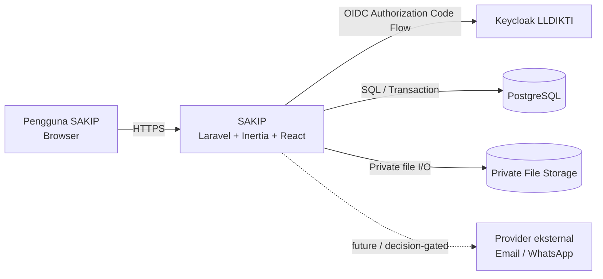
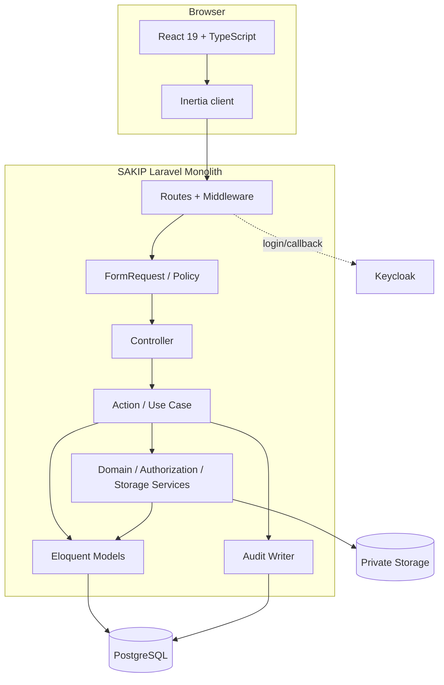
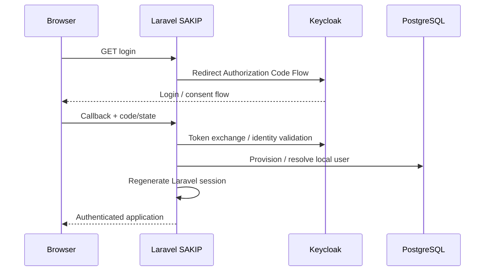
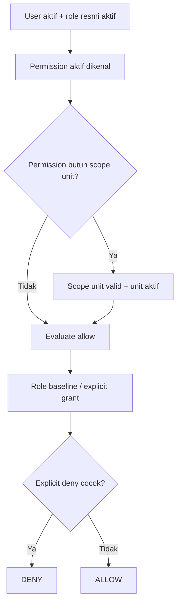
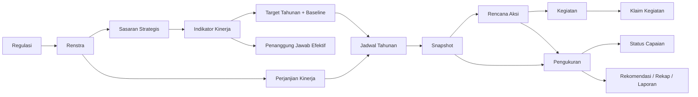
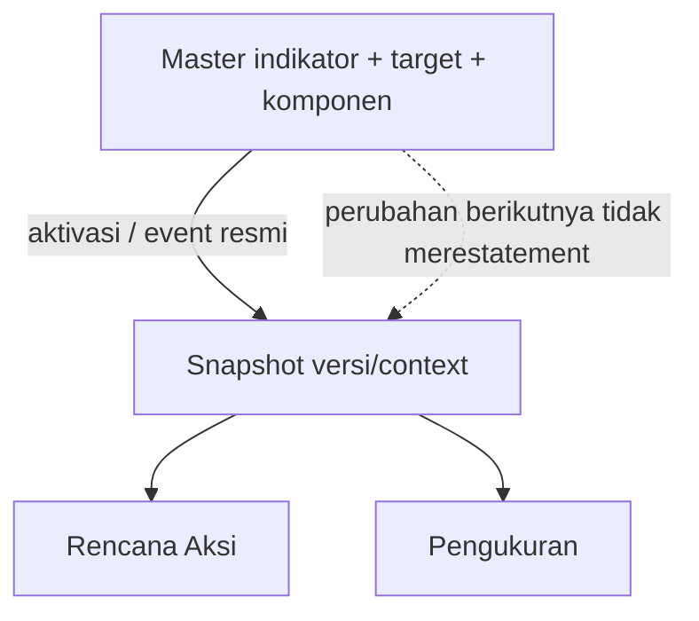
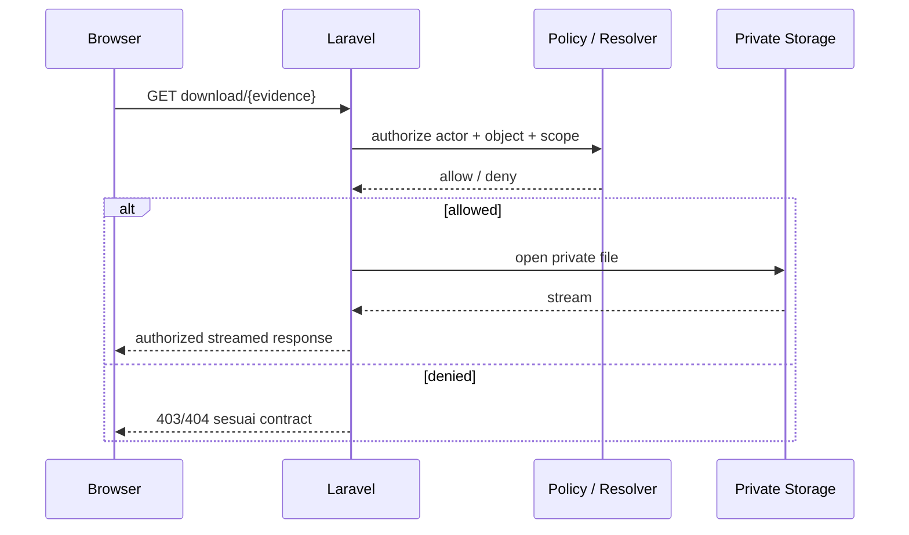

# SAKIP — System Architecture

> **Status dokumen:** Draft untuk review tim. Dokumen ini merangkum keputusan arsitektur yang sudah ditegaskan oleh PRD, Data Model, Workflow, Plan Pengembangan, Keputusan Penyelarasan, dan SAKIP Engineering Standards. Dokumen ini **tidak membuat requirement bisnis baru** dan bukan tracker status implementasi.
>
> **Prinsip penggunaan:** bila isi dokumen ini bertentangan dengan keputusan/addendum SAKIP yang lebih baru dan sudah disetujui, keputusan yang lebih baru berlaku. Status implementasi aktual tetap harus diverifikasi dari source code, migration, test, konfigurasi, dan HEAD branch yang relevan.

## 1. Tujuan

Dokumen ini memberikan gambaran arsitektur sistem SAKIP LLDIKTI Wilayah XVI pada level sistem, aplikasi, domain, data, keamanan, dan deployment. Tujuannya adalah agar engineer, reviewer, QA, dan agent dapat memahami bentuk sistem secara menyeluruh tanpa harus menyusun ulang gambaran arsitektur dari beberapa dokumen domain.

Dokumen ini menjawab terutama pertanyaan berikut:

- komponen utama sistem dan batas tanggung jawabnya;
- bagaimana browser, Laravel, Inertia, React, PostgreSQL, Keycloak, dan private storage berinteraksi;
- bagaimana request mengalir dari route sampai mutation/audit;
- bagaimana authentication dan authorization dipisahkan;
- bagaimana domain kinerja dan snapshot historis dibatasi;
- bagaimana concurrency, audit, file privat, dan state frontend diperlakukan;
- batas integrasi yang belum boleh diasumsikan sebagai fitur aktif.

Dokumen ini **bukan** pengganti:

- `SAKIP - PRD.md` untuk requirement produk;
- `SAKIP - Data Model.md` untuk struktur data dan constraint;
- `SAKIP - Workflow.md` untuk state transition dan business flow;
- `SAKIP - Plan Pengembangan.md` untuk task/dependency/DoD;
- `SAKIP_ENGINEERING_STANDARDS.md` untuk aturan teknis rinci;
- `design-system.md` untuk kontrak UI;
- ADR untuk alasan keputusan arsitektural tertentu.

---

## 2. Prinsip Arsitektur Utama

Arsitektur SAKIP dibangun di atas prinsip berikut.

1. **Laravel monolith dengan Inertia + React.** Routing, session, authorization, validasi, orchestration, domain mutation, dan persistence tetap berada di server Laravel. React adalah presentation/interaksi client, bukan business-rule engine kedua.
2. **Tidak ada API publik terpisah untuk UI internal.** Endpoint JSON terbatas boleh digunakan bila dibutuhkan oleh editor/autocomplete/preview, tetapi tetap berada dalam boundary monolith, session auth, authorization, dan validation yang sama.
3. **Server authoritative.** Permission, business invariant, kalkulasi indikator, workflow transition, snapshot, dan audit ditentukan server.
4. **Satu canonical permission resolver.** Effective permission diturunkan dari role baseline, grant eksplisit, explicit deny, scope, status user/unit, dan invariant domain. Deny yang cocok menang dan akses fail-closed.
5. **Action/use-case boundary untuk mutasi.** Controller adalah adapter tipis; orchestration, transaction, locking, audit, dan mutation berada di Action/use-case boundary atau service domain yang relevan.
6. **PostgreSQL sebagai domain database.** Constraint, unique key, FK, numeric semantics, transaction, dan concurrency protection tidak digantikan oleh validasi UI.
7. **Snapshot menjaga histori.** Perubahan master tidak boleh diam-diam mengubah makna histori yang sudah dibekukan.
8. **Audit adalah bagian dari mutation contract.** Audit success ditulis atomik bersama mutation bila sesuai; audit penolakan yang diwajibkan harus tetap tersimpan tanpa mutation domain.
9. **Berkas sensitif bersifat privat.** File bukti tidak dipublikasikan sebagai static URL; akses menggunakan route ber-authorization.
10. **Scope produk dan arsitektur tidak diwarisi dari SIMPEG.** SAKIP memiliki kode, database, model akses, dan workflow sendiri.

---

## 3. System Context

### 3.1 Aktor dan sistem eksternal



### 3.2 Batas sistem

**Di dalam SAKIP:**

- Laravel application;
- Inertia response lifecycle;
- React/TypeScript UI;
- PostgreSQL schema SAKIP;
- private file storage SAKIP;
- session aplikasi;
- audit log SAKIP;
- permission resolver SAKIP.

**Di luar SAKIP:**

- Keycloak sebagai identity provider;
- provider notifikasi eksternal bila kelak diaktifkan melalui keputusan/scope yang sah;
- workbook referensi, dokumen legal, dan sistem lain yang tidak menjadi database bersama SAKIP.

SAKIP tidak boleh bergantung pada database SIMPEG atau membagi tabel dengan SIMPEG.

---

## 4. Container / Runtime Architecture



### 4.1 Runtime utama

- **Backend:** Laravel 13.
- **Frontend:** Inertia 3 + React 19 + TypeScript + Tailwind 4.
- **Database:** PostgreSQL ≥ 15 untuk seluruh lingkungan (produksi, staging/QA, development, CI); development/CI memakai 17. Versi server produksi wajib diverifikasi pemilik infrastruktur sebelum deployment yang memuat migration `2026_10_09_100000_satukan_index_unik_target_rencana_aksi`; bila di bawah 15, deployment ditahan ([keputusan K1 PR #77](https://github.com/LLDIKTI-XVI-TEAM/SAKIP/pull/77#issuecomment-6096268634)).
- **Authentication:** Keycloak/OIDC Authorization Code Flow berbasis session Laravel.
- **Frontend toolchain:** Bun + Vite.
- **Deployment target:** VPS LLDIKTI; detail domain, host, dan topology fisik mengikuti environment aktual dan tidak boleh ditebak dari dokumen ini.

Versi patch dependency dan runtime aktual harus diverifikasi dari manifest/lockfile/environment saat pekerjaan dilakukan.

---

## 5. Struktur Aplikasi Laravel

Struktur logika mengikuti Action Pattern proyek.

```text
Route
→ Middleware / authentication
→ FormRequest / Policy
→ Controller
→ Action / use case
→ Service / Model
→ DB / Audit
→ Inertia props / redirect / JSON response
```

### 5.1 Route

Tanggung jawab route:

- URL;
- HTTP method;
- middleware;
- route model binding;
- naming.

Route tidak menjadi tempat transaction, query domain berat, formula, atau authorization algorithm.

### 5.2 FormRequest / Policy

Tanggung jawab:

- shape validation request;
- authorization awal yang relevan;
- field-level validation;
- error mapping request.

Authorization/invariant yang dapat berubah selama request **tidak cukup** hanya diperiksa di awal. Mutation berisiko harus mengevaluasi ulang kondisi relevan di boundary yang telah memperoleh lock/state authoritative.

### 5.3 Controller

Controller adalah adapter:

- menerima request/model binding;
- memanggil satu Action/use-case yang relevan;
- membentuk response.

Controller tidak menjadi owner transaction, kalkulasi resmi, audit, atau domain workflow.

### 5.4 Action

Action mengorkestrasi satu use case. Tanggung jawab dapat mencakup:

- load + lock state authoritative;
- live authorization re-check;
- invariant/state transition;
- transaction;
- pemanggilan service kalkulasi/domain;
- persistence;
- audit;
- result contract.

Action tidak harus dipecah per row bila invariant hanya valid pada final state kolektif. Contoh resmi adalah perubahan definisi indikator/komponen secara atomik.

### 5.5 Service

Service digunakan untuk perilaku domain yang dipakai ulang atau boundary khusus, misalnya:

- `App\Services\Authorization\PermissionResolver`;
- `App\Services\Authorization\ResolveLockedActor`;
- `App\Services\Kinerja\IndikatorPerhitunganService`;
- `App\Services\Kinerja\KomponenMutationService`;
- `App\Services\AuditLogger`;
- service storage/attachment.

Service/DTO/repository bukan lapisan wajib untuk setiap use case.

---

## 6. Frontend Architecture

Frontend menggunakan Inertia + React/TypeScript dalam monolith yang sama.

```text
Laravel route/controller
→ Inertia props / JSON contract terbatas
→ Page
→ Feature component
→ Reusable component
→ useForm / local UI state
→ request kembali ke Laravel
```

### 6.1 Boundary frontend

Frontend boleh:

- menampilkan `can.*` dari server;
- mengelola modal/tab/filter/draft form;
- melakukan validasi UX tambahan yang tidak menggantikan server validation;
- menampilkan hasil kalkulasi server;
- melakukan preview melalui endpoint server bila kontrak memerlukan hasil authoritative.

Frontend tidak boleh menjadi sumber keputusan untuk:

- effective permission;
- unit/data scope;
- official workflow transition;
- kalkulasi indikator resmi;
- audit;
- snapshot correction;
- invariant domain.

### 6.2 State dan response safety

Untuk mutation penting:

- gunakan `useForm` sebagai baseline;
- state server dan state form dipisahkan;
- pending/error/success harus eksplisit;
- stale response tidak boleh menimpa selection terbaru;
- hasil mutation ambigu tidak boleh diasumsikan sukses;
- optimistic update hanya untuk interaksi yang aman dipulihkan.

---

## 7. Authentication Architecture

Target authentication adalah Keycloak/OIDC Authorization Code Flow berbasis session.



### 7.1 Prinsip

- SAKIP tidak menyimpan password pengguna.
- Identity eksternal dipetakan ke user lokal.
- User lokal tetap memiliki status/role/permission state yang dapat membuat akses fail-closed meski identity Keycloak valid.
- Session Laravel adalah boundary auth untuk UI monolith.
- Claim, realm, URL, client secret, dan config environment tidak boleh ditebak atau disimpan pada dokumen publik/repo.

Implementasi saat ini memiliki boundary auth terpisah di `app/Services/Auth/` dan controller auth di `app/Http/Controllers/Auth/`.

---

## 8. Authorization Architecture

### 8.1 Canonical resolver

Implementasi canonical berada pada:

`App\Services\Authorization\PermissionResolver`

Compatibility wrapper `App\Services\PermissionResolver` sudah dihapus; seluruh consumer runtime dan test memakai namespace canonical di atas, sehingga tidak ada resolver kedua.

### 8.2 Effective permission



Prinsip utama:

- explicit deny yang cocok menang;
- unknown permission, inactive user, no-role, invalid scope → fail-closed;
- PIC bukan role sistem;
- role baseline, grant, deny, dan unit scope tidak dihitung ulang di React;
- object/state/window/business invariant tetap gate terpisah dari keputusan permission murni.

### 8.3 Live authorization pada mutation

Mutation sensitif dapat memakai `ResolveLockedActor` atau pola lock/recheck setara untuk:

- mengunci aktor/ACL terkait;
- membaca state izin terbaru;
- mencegah race antara pemeriksaan awal dan persistence.

Authorization awal di FormRequest/Policy tetap berguna untuk fail-fast dan UX, tetapi tidak menggantikan mutation-boundary check ketika state relevan dapat berubah.

---

## 9. Domain Architecture

Rantai domain utama SAKIP:



### 9.1 Bounded domain secara logis

Walau aplikasi tetap monolith, domain logic dipisah secara konseptual:

- Authentication & Access;
- Regulasi/Renstra;
- Sasaran & Indikator;
- Target Tahunan & PK;
- Periode/Jadwal/Snapshot;
- Penanggung Jawab;
- Rencana Aksi;
- Kegiatan & Klaim;
- Pengukuran & Verifikasi;
- Bukti Dukung;
- Status Capaian & Rekomendasi;
- Dashboard/Laporan;
- Pengaturan;
- Audit.

Pemisahan ini bukan microservice boundary dan tidak memberi izin membuat API/service terpisah.

---

## 10. Calculation Architecture

Nilai indikator authoritative dihitung di server.

### 10.1 Komponen indikator

Untuk indikator non-manual, definisi komponen berada pada data domain dan dibekukan bersama snapshot ketika diperlukan histori.

Jenis formula dan detail numeric mengikuti PRD/Data Model, bukan hardcode berdasarkan workbook.

### 10.2 Mutation definisi indikator

Canonical mutation transport untuk Phase D adalah:

`PATCH /perencanaan/indikator/{indikator}/formula`

Mutation dapat memuat perubahan metadata formula dan intent tambah/ubah/nonaktif/hapus komponen dalam satu final-state transaction.

Tiga route mutation per-row legacy telah diputuskan untuk dipensiunkan setelah caller didukung bermigrasi:

- `POST /indikator/{indikator}/komponen`;
- `PUT /indikator/{indikator}/komponen/{komponen}`;
- `DELETE /indikator/{indikator}/komponen/{komponen}`.

Read/editor contract `GET /indikator/{indikator}/komponen` tetap berbeda dari writer atomic.

Detail keputusan dicatat pada ADR atomic indicator definition.

---

## 11. Snapshot Architecture

Snapshot adalah boundary historis antara master yang dapat berubah dan konteks yang harus tetap dapat direproduksi.

### 11.1 Invariant

- perubahan master setelah snapshot terbentuk tidak boleh melakukan restatement diam-diam terhadap histori;
- snapshot menyalin field yang diperlukan untuk interpretasi historis;
- definisi komponen yang relevan ikut dibekukan;
- koreksi histori harus menggunakan mekanisme correction/version yang disahkan domain, bukan overwrite bebas;
- snapshot yang sudah digunakan oleh alur downstream harus diperlakukan sesuai aturan imutabilitas Data Model/Workflow.

### 11.2 Data flow



### 11.3 Concurrency

Publisher snapshot dan consumer yang bergantung pada snapshot harus mengikuti locking/transaction yang menjaga:

- parent dan child snapshot konsisten;
- version/identity token mendeteksi stale state;
- intermediate unpublished state tidak dianggap final;
- correction tidak menimpa konteks historis tanpa version transition yang sah.

Detail field, trigger, dan lifecycle mengikuti Data Model + Workflow + implementation issue terkait; dokumen arsitektur ini hanya menetapkan invariant.

---

## 12. Database & Concurrency Architecture

PostgreSQL adalah source of truth persistence.

### 12.1 Constraint ownership

Invariant yang merupakan integritas data lintas writer harus diproteksi pada lapisan yang tepat, termasuk bila perlu:

- primary/foreign key;
- unique constraint/index;
- check constraint;
- transaction;
- row lock;
- optimistic token/version;
- database trigger untuk invariant yang tidak dapat dijaga aman hanya dari satu Action.

UI validation tidak menggantikan constraint server/database.

### 12.2 Concurrency principles

- hindari last-write-wins diam-diam pada state kritis;
- lock order harus konsisten;
- sequential test bukan bukti race safety;
- concurrency-sensitive contract perlu integration test multi-connection pada PostgreSQL disposable;
- idempotency harus dibuktikan bila operasi dapat dikirim ulang.

---

## 13. Audit Architecture

Audit merupakan domain append-only sesuai kontrak.

### 13.1 Jalur audit

```text
Mutation Action
→ construct old/new limited snapshot
→ permission provenance / reason
→ AuditLogger / WriteAuditLog
→ audit_log
```

Implementasi utama saat ini:

- `App\Services\AuditLogger`;
- `App\Actions\Audit\WriteAuditLog`.

### 13.2 Prinsip

Audit dapat menyimpan:

- actor/provenance yang sah;
- action/event;
- object type + id;
- timestamp;
- nilai lama/baru yang di-allowlist;
- alasan bila diwajibkan;
- `dasar_izin` untuk aksi yang relevan.

Audit tidak boleh menyimpan credential, cookie, token, isi file privat, atau seluruh raw request.

Audit success mutation umumnya berada dalam transaction mutation. Audit penolakan yang wajib harus ditempatkan agar rollback mutation yang ditolak tidak ikut menghapus bukti penolakan.

---

## 14. File & Evidence Architecture

SAKIP mendukung bukti/attachment sesuai kontrak domain, termasuk mode file, tautan, dan teks pada area yang disahkan.

### 14.1 Private file storage

File mode `file` disimpan pada storage privat, bukan disk/public URL.



Prinsip:

- path dari user tidak menjadi filesystem path bebas;
- download selalu melalui object authorization;
- nama storage aman;
- tidak membuat public symlink sebagai bypass;
- storage mutation dan DB transaction harus menangani failure masing-masing secara eksplisit.

---

## 15. Inertia Data Contract

### 15.1 Props

Props Inertia hanya mengirim field yang diperlukan UI.

Jangan mengirim:

- seluruh permission catalog tanpa kebutuhan;
- credential/token;
- relasi sensitif mentah;
- model penuh hanya karena mudah diserialisasi.

Capability UI dikirim sebagai `can.*` atau kontrak setara. Capability adalah snapshot respons dan bukan jaminan bahwa izin mutation tetap valid saat tombol akhirnya ditekan.

### 15.2 JSON endpoint terbatas

Endpoint JSON internal dapat digunakan untuk:

- autocomplete;
- editor data fragment;
- server preview;
- bounded lookup.

Endpoint tersebut tetap wajib melalui session/auth/authorization/validation yang sama dan tidak dianggap sebagai REST API publik terpisah.

---

## 16. Integration & Background Work

Integrasi eksternal belum boleh diasumsikan aktif hanya karena roadmap menyebutnya.

Jika queue/job/notifikasi eksternal diaktifkan pada task yang sah:

- adapter/provider detail diisolasi dari controller/UI;
- side effect eksternal dilakukan setelah state domain aman di-commit bila diperlukan;
- retry memiliki idempotency/correlation identity;
- `accepted/queued` bukan bukti delivery;
- penerima/channel/config berasal dari requirement + environment, bukan asumsi;
- test menggunakan fake/sink kecuali explicit integration test diizinkan.

---

## 17. Deployment Architecture

Target deployment adalah VPS LLDIKTI.

Baseline environment yang didokumentasikan:

- PHP sesuai Laravel 13;
- PostgreSQL khusus SAKIP;
- web server Nginx/Apache yang meneruskan ke `public/index.php`;
- HTTPS;
- Bun untuk install/build frontend;
- Keycloak client khusus SAKIP;
- private storage di bawah storage aplikasi.

Urutan release rinci dan recovery procedure sebaiknya berada pada dokumen Deployment & Operations tersendiri. Dokumen ini tidak menetapkan hostname, domain, credential, atau topology yang belum diverifikasi.

---

## 18. Security Boundaries

Boundary yang harus selalu diperlakukan sebagai trust boundary:

1. Browser → Laravel request.
2. Laravel → Keycloak identity data.
3. Laravel → PostgreSQL.
4. Laravel → private storage.
5. Laravel → provider eksternal (bila kelak aktif).
6. Request actor → object/unit/domain state.

Control minimum:

- authentication session;
- CSRF untuk mutation browser;
- server-side authorization;
- object/unit scope validation;
- strict request validation;
- output escaping/default React safety;
- private download authorization;
- transaction/locking;
- audit provenance;
- secret tidak masuk props/log/fixture/public comment.

Threat model formal dapat disimpan pada dokumen Security Architecture terpisah bila dibutuhkan menuju UAT/produksi.

---

## 19. Testing Architecture

Testing mengikuti risiko, bukan hanya jumlah file.

### 19.1 Layer

```text
Unit
→ pure/domain helper

Feature / Integration
→ HTTP contract, auth, DB, workflow, transaction

Concurrency integration
→ multi-connection PostgreSQL races

Frontend component
→ interaction, form state, errors, rendering contract

Browser / E2E
→ integration boundary, session, upload, navigation, responsive UX
```

### 19.2 Database-sensitive tests

UUID/JSON/FK/index/locking/transaction/concurrency harus diuji pada PostgreSQL disposable bila behavior DB menjadi bagian contract.

### 19.3 Exact-head evidence

Hasil test/CI selalu melekat pada SHA/diff yang diuji. CI lama tidak membuktikan HEAD baru setelah commit tambahan atau conflict resolution.

---

## 20. Performance Architecture

Prinsip default:

- query server-side;
- pagination/filter/sort untuk dataset tumbuh;
- eager load eksplisit;
- payload Inertia bounded;
- tidak memuat seluruh dataset ke React;
- tidak menambah polling global tanpa kebutuhan;
- ukur sebelum caching/memoization/infrastruktur tambahan.

Optimization tidak boleh mengubah authorization, scope, atau official state semantics.

---

## 21. Architectural Boundaries yang Tidak Boleh Dilanggar

- Jangan membuat database bersama dengan SIMPEG.
- Jangan memindahkan permission/business rule ke React.
- Jangan membuat API/service terpisah tanpa requirement.
- Jangan menciptakan role PIC.
- Jangan bypass explicit deny.
- Jangan overwrite snapshot historis secara oportunistis.
- Jangan menerima calculated official value dari client sebagai source of truth.
- Jangan membuat public URL langsung untuk file privat.
- Jangan menaruh transaction/audit/domain mutation di controller bila use case memerlukan Action boundary.
- Jangan mengubah route/field/schema contract sebagai efek samping refactor tanpa decision + regression evidence.
- Jangan menganggap roadmap/deferred feature sudah aktif sebelum implementation + gate yang relevan selesai.

---

## 22. Repository Mapping

Contoh mapping implementasi current yang sesuai arsitektur:

```text
app/
├── Actions/
│   ├── Access/
│   ├── Audit/
│   ├── Auth/
│   ├── Jadwal/
│   ├── Pengukuran/
│   ├── Perencanaan/
│   └── ...
├── Http/
│   ├── Controllers/
│   └── Requests/
├── Policies/
├── Services/
│   ├── Authorization/
│   ├── Kinerja/
│   ├── Storage/
│   └── ...
└── Models/

resources/js/
├── Pages/
├── Components/
├── hooks/
└── types/

database/
└── migrations/

tests/
├── Unit/
├── Feature/
├── Integration/
└── Frontend/
```

Mapping ini contoh struktur yang terverifikasi, bukan daftar final seluruh folder.

---

## 23. Decision Records

Keputusan arsitektural yang mempunyai trade-off lintas fitur dicatat sebagai ADR agar tidak hanya hidup di issue/review thread.

ADR awal yang menyertai dokumen ini:

1. ADR-0001 — Laravel + Inertia Monolith.
2. ADR-0002 — Canonical Permission Resolver dan Deny-Wins.
3. ADR-0003 — Action Pattern untuk Use Case Server.
4. ADR-0004 — Snapshot Historis Immutable/Versioned.
5. ADR-0005 — Atomic Indicator Definition Writer.
6. ADR-0006 — Private File Storage dan Authorized Streaming.
7. ADR-0007 — Target Manual Rencana Aksi `komponen_id = NULL`.
8. ADR-0008 — Kolom Alasan Deviasi Target PK pada Rencana Aksi.

ADR tidak menggantikan PRD/Data Model/Workflow. ADR menjelaskan **mengapa** keputusan teknis tertentu dipilih dan konsekuensinya.

---

## 24. Source of Truth dan Referensi

Dokumen ini diturunkan dari keputusan yang sudah ada pada:

- `document/SAKIP - PRD.md`
  - §5 Ruang Lingkup;
  - §6 Arsitektur & Stack Teknis;
  - §7 Hak Akses;
  - §12 Jadwal/Snapshot;
  - §17 Komponen Indikator & Mesin Perhitungan;
  - §18 Bukti Dukung;
  - §25 Audit & Histori;
  - §27 Integritas Data.
- `document/SAKIP - Data Model.md`
  - entity/constraint domain;
  - Algoritma Resolusi Izin;
  - Segregation of Duties;
  - Q32 alignment.
- `document/SAKIP - Workflow.md`
  - workflow end-to-end;
  - snapshot;
  - pengukuran;
  - permission evaluation;
  - access management.
- `document/SAKIP - Plan Pengembangan.md`
  - P.1 environment;
  - P.2 deployment baseline;
  - P.3 aturan penempatan logika.
- `document/SAKIP - Keputusan Penyelarasan.md`
  - Q32 sebagai baseline role/PIC/access;
  - addendum keputusan yang disahkan.
- `document/SAKIP_ENGINEERING_STANDARDS.md`
  - §2 architecture;
  - §3 authorization;
  - §5 database/concurrency;
  - §6 domain calculation;
  - §7 evidence/audit;
  - §9 frontend;
  - §10 performance;
  - §11 testing;
  - §12 quality gate/review.
- GitHub Issue #46 untuk keputusan Phase D atomic indicator-definition writer dan retirement legacy mutation routes.

Jika referensi di atas berubah, dokumen arsitektur harus ditinjau hanya pada bagian yang terdampak; perubahan source code semata tidak otomatis mengubah requirement arsitektur.
