# WORKFLOW — SAKIP LLDIKTI Wilayah XVI

---

## 1. Alur Penggunaan Utama End-to-End (Fase Awal)

Diagram berikut menggambarkan urutan penuh dari login hingga dashboard terupdate.

```
👤 Pengguna
  1. Buka aplikasi SAKIP → diarahkan ke Keycloak (OIDC Authorization Code Flow)
  2. Login dengan kredensial masing-masing
     → Gagal: kembali ke halaman login
     → Berhasil: sistem callback, mapping keycloak_id ke user lokal, sesi Laravel terbentuk

📋 Perencanaan
  3. Menyusun Renstra baru: nama, dasar_hukum, rentang tahun
  4. Menyusun Sasaran dan Indikator di bawah Renstra tersebut — tiap indikator diberi unit pemilik
     dan arah penilaian (naik_baik/turun_baik)
  5. Mengisi Target Tahunan untuk tiap indikator
  6. Mencatat Perjanjian Kinerja (renstra_pk) tahun berjalan: ditandatangani resmi oleh Kepala Lembaga,
     unggah berkas fisik PDF dokumen PK (`file_pk_path`), dan otomatis mengunci target tahunan indikator
     (`target_terkunci = true`)
  7. Mengaktifkan Renstra
     → Validasi gagal (dasar_hukum kosong atau beririsan dengan Renstra aktif lain): kembali ke langkah 3
     → Validasi lolos: Renstra berstatus AKTIF
  8. Membuat Jadwal Tahunan yang merujuk Renstra X, Tahun Y → status: draft
  9. Menyusun daftar Periode yang diharapkan tahun ini (jadwal_periode) beserta jendela
     pengisian dan reviu masing-masing periode (mis. Triwulan I–IV)
  10. Mengaktifkan Jadwal Tahunan
     → Gerbang 1 gagal (renstra_pk tahun Y belum tercatat & target belum terkunci): kembali ke langkah 6
     → Gerbang 2 gagal (ada indikator aktif tanpa target_tahunan tahun Y): kembali ke langkah 5
     → Gerbang 3 gagal (tahun Y di luar rentang tahun Renstra): kembali ke langkah 8
     → Seluruh gerbang lolos: Jadwal AKTIF, sistem membuat jadwal_snapshot untuk setiap pasangan
       (jadwal, indikator) yang belum punya baris.
     Catatan reversibilitas: Bila jadwal telah aktif namun BELUM ADA pengukuran yang dibuat/disubmit
     oleh PIC, status dapat dikembalikan ke draft. Bila sudah ada pengukuran, terkunci penuh dan memerlukan
     jalur jadwal:buka_kembali (§7).

📋 Perencanaan / ⚙️ Superadmin
  11. Menugaskan Penanggung Jawab per unit kerja dengan menetapkan 1 PIC Utama (Primary PIC) yang berhak
      mengajukan pengukuran; anggota lain di unit yang sama memiliki hak akses kolaboratif/view

🎯 Penanggung Jawab (PIC Utama & Rekan Unit)
  12. Mengisi nilai realisasi dan catatan/analisis kendala dalam jendela pengisian periode berjalan
      (dari jadwal_periode) → Status: Draft. Sistem menerapkan Optimistic Locking UX (jika ada konflik
      penyimpanan bersamaan, menampilkan pesan informatif & angka terbaru tanpa menghapus draft teks analisis)
  13. PIC Utama mengajukan pengukuran sebelum jendela pengisian periode itu berakhir → Status: Diajukan
      (notifikasi terkirim ke Perencanaan)
      → Jendela pengisian sudah lewat: PIC tidak dapat lagi membuat/mengubah/mengajukan;
        hanya Perencanaan yang masih dapat mengisi (lihat §5)

📋 Perencanaan
  14. Memverifikasi pengukuran yang diajukan
      → Ditolak, perlu revisi: Status: Dikembalikan + alasan wajib diisi, kembali ke Penanggung
        Jawab (langkah 12)
      → Disetujui teknis: Status: Diverifikasi
  15. Mengesahkan pengukuran (Fase Awal: langsung, tanpa approval Pimpinan) → Status: Disahkan
  16. Penetapan Status Capaian:
      → Sistem otomatis menetapkan status capaian awal by formula: Capaian ≥ 100% = 'Tercapai',
        Capaian < 100% = 'Belum Tercapai' (sumber: formula)
      → Perencanaan/Superadmin dapat melakukan override manual bila diperlukan, mencatat alasan & audit log
  17. Dashboard dan Laporan otomatis menampilkan capaian terbaru dengan kebijakan capping maksimal 100%
      pada agregasi indeks kinerja institusi/sasaran (standar KemenPAN-RB), sementara persentase riil (uncapped)
      tetap terpelihara di detail IKU

✍️ Pimpinan
  18. Memantau capaian lewat dashboard visual (ApexCharts dengan fitur unduh gambar PNG/SVG) dan laporan
      matriks hierarkis resmi LLDIKTI XVI (ekspor Excel .xlsx) — sifatnya read-only, tanpa aksi approval pada Fase Awal
```

```mermaid
flowchart TD
    A[Pengguna membuka SAKIP] --> B[Redirect ke Keycloak - OIDC Authorization Code Flow]
    B --> C{Login berhasil?}
    C -- Tidak --> B
    C -- Ya --> D[Callback: mapping keycloak_id ke users lokal, sesi Laravel terbentuk]
    D --> E[Perencanaan menyusun Renstra: nama, dasar_hukum, rentang tahun]
    E --> F[Perencanaan menyusun Sasaran & Indikator\ndi bawah Renstra - unit pemilik + arah penilaian]
    F --> G[Perencanaan mengisi Target Tahunan per indikator]
    G --> H[Perencanaan mencatat Perjanjian Kinerja\nrenstra_pk untuk tahun berjalan]
    H --> I{Validasi aktivasi Renstra lolos?\ndasar_hukum terisi & tidak beririsan\ndengan Renstra aktif lain}
    I -- Tidak --> E
    I -- Ya --> J[Renstra berstatus AKTIF]
    J --> K[Perencanaan membuat Jadwal Tahunan draft\nmerujuk Renstra X, Tahun Y]
    K --> K2[Perencanaan menyusun jadwal_periode:\ndaftar periode diharapkan + jendela\npengisian/reviu masing-masing]
    K2 --> L{Tiga gerbang validasi aktivasi lolos?\n1 PK tahun Y ada\n2 seluruh indikator aktif punya target tahun Y\n3 tahun Y dalam rentang Renstra}
    L -- Tidak --> K
    L -- Ya --> M[Jadwal AKTIF: sistem membuat jadwal_snapshot\nidempoten untuk pasangan jadwal-indikator\nyang belum ada barisnya]
    M --> N[Perencanaan/Superadmin menugaskan\nPenanggung Jawab per indikator]
    N --> O[PIC mengisi nilai/catatan dalam jendela\npengisian periode aktif - Pengukuran Draft]
    O --> P[PIC mengajukan sebelum jendela pengisian\nperiode berakhir - status jadi Diajukan]
    P --> Q{Perencanaan memverifikasi}
    Q -- Ditolak, perlu revisi --> R[Status Dikembalikan + alasan wajib]
    R --> O
    Q -- Disetujui teknis --> S[Status Diverifikasi]
    S --> T[Perencanaan langsung mengesahkan\nTANPA approval Pimpinan pada Fase Awal]
    T --> U[Status Disahkan]
    U --> V[Perencanaan/Superadmin menetapkan\nStatus Capaian secara manual]
    V --> W[Dashboard & Laporan otomatis\nmenampilkan capaian terbaru]
    W --> X[Pimpinan memantau via dashboard/laporan\nread-only + ekspor Excel, tanpa aksi approval]
```

---

## 2. Alur Siklus Renstra & Validasi Aktivasi

```
📋 Perencanaan
  1. Membuat Renstra baru → Status: draft
  2. Menyusun Sasaran dan Indikator di bawah Renstra
  3. Mengisi dasar_hukum
  4. Menjalankan aksi aktivasi Renstra
     → Sistem cek dasar_hukum terisi?
       Tidak: Aktivasi DITOLAK, kembali ke langkah 3
       Ya: sistem cek apakah ada Renstra aktif lain dengan rentang tahun beririsan
         Ya: Aktivasi DITOLAK, kembali ke langkah 2
         Tidak: Status: aktif
  5. Renstra berstatus aktif siap dirujuk oleh Jadwal Tahunan (lanjut ke alur §4)
  6. Sewaktu-waktu bisa menonaktifkan Renstra
     → Sistem cek: masih ada jadwal_tahunan berstatus aktif yang merujuk Renstra ini?
       Ya: Nonaktifkan DITOLAK — tutup dulu seluruh jadwal aktif terkait (lihat §7)
       Tidak: Status: nonaktif (data historis tetap terbaca, tidak menerima jadwal baru)
  7. Setelah nonaktif, bisa mengarsipkan Renstra → Status: diarsipkan (final)
```

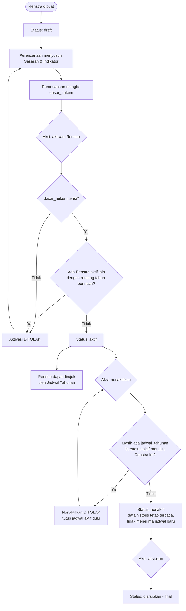

**Catatan kritis:** validasi pada node F dan H adalah gerbang kualitas terakhir sebelum data master berpotensi dibekukan ke `jadwal_snapshot` saat Jadwal Tahunan diaktifkan (§4). Guard pada node K2 mencegah Renstra menjadi nonaktif selagi masih ada jadwal operasional yang bergantung padanya — jadwal harus ditutup lebih dulu lewat alur §7. Kesalahan yang lolos di titik ini jauh lebih mahal untuk dikoreksi setelah snapshot terbentuk.

---

## 3. Struktur Periode & Jadwal (`jadwal_periode`)

Jendela waktu pengisian dan reviu tidak lagi melekat pada `jadwal_tahunan` secara langsung, melainkan pada tabel pivot `jadwal_periode` yang menghubungkan satu Jadwal Tahunan dengan tiap Periode yang diharapkan pada tahun itu. Susunan ini memungkinkan setiap periode (mis. Triwulan I, II, III, IV) memiliki jendela pengisian dan reviu masing-masing, alih-alih satu jendela tunggal untuk seluruh tahun.

```
periode (master global)          jadwal_tahunan (payung tahun)
  - nama                            - renstra_id, tahun
  - urutan                          - penutupan (pembekuan akhir tahun)
  - aktif                           - status: draft / aktif / ditutup
  - is_nilai_akhir                  - renstra_pk_id, activated_at, closed_at

              \                          /
               \                        /
                v                      v
                     jadwal_periode
                (jadwal_id, periode_id)
                - pengisian_mulai / pengisian_selesai
                - reviu_mulai / reviu_selesai
```

```
📋 Perencanaan
  1. Membuat Jadwal Tahunan (draft): pilih Renstra, tahun, tanggal penutupan
  2. Untuk tahun tsb, memilih periode-periode mana yang diharapkan (mis. Triwulan I–IV dari
     master periode aktif) dan mengisi jendela pengisian_mulai/selesai serta reviu_mulai/selesai
     untuk masing-masing periode → tersimpan sebagai baris jadwal_periode
  3. Sistem memvalidasi urutan tanggal logis per baris: pengisian_mulai ≤ pengisian_selesai ≤
     reviu_mulai ≤ reviu_selesai
  4. Jadwal Tahunan siap diaktifkan (lanjut ke alur §4)
```

**Aturan penting:**
- Kolom `pengisian_mulai`, `pengisian_selesai`, `reviu_mulai`, `reviu_selesai` **tidak lagi ada** pada `jadwal_tahunan` — seluruhnya berpindah ke `jadwal_periode`, satu baris per periode yang diharapkan.
- `jadwal_tahunan.penutupan` **tetap ada** dan berlaku sebagai pembekuan akhir di tingkat tahun, terpisah dari jendela per periode — lihat §5 dan §7 untuk perannya dalam batas akses Perencanaan.
- Nilai periode dengan `is_nilai_akhir = true` (mis. Tahunan) diisi manual oleh yang berwenang — tidak ada perhitungan agregasi otomatis dari periode-periode di bawahnya.

---

## 4. Alur Aktivasi Jadwal & Pembentukan Snapshot

```
📋 Perencanaan
  1. Membuat Jadwal Tahunan baru untuk Renstra X, Tahun Y → Status: draft
  2. Menyusun jadwal_periode (§3)
  3. Menjalankan aksi aktivasi jadwal (jadwal:aktivasi)
     → Sistem menjalankan tiga gerbang validasi secara berurutan:
       Gerbang 1 — renstra_pk untuk (Renstra X, Tahun Y) sudah tercatat?
         Belum: Aktivasi DITOLAK, kembali lengkapi PK
       Gerbang 2 — seluruh indikator aktif milik Renstra X memiliki target_tahunan Tahun Y?
         Ada yang belum: Aktivasi DITOLAK, kembali lengkapi target
       Gerbang 3 — Tahun Y berada dalam rentang [tahun_mulai, tahun_akhir] Renstra X?
         Tidak: Aktivasi DITOLAK, kembali koreksi tahun jadwal atau rentang Renstra
     → Seluruh gerbang lolos: lanjut ke langkah 4

⚙️ Sistem (otomatis begitu aktivasi lolos validasi)
  4. Mengubah Jadwal Tahunan → Status: aktif, terhubung ke renstra_pk_id, activated_at tercatat
  5. Mengambil seluruh indikator aktif milik Renstra X (melalui Sasaran)
  6. Untuk tiap indikator, memeriksa apakah baris jadwal_snapshot untuk pasangan
     (jadwal_id, indikator_id) ini sudah ada
     → Sudah ada: dilewati (tidak ditimpa) — pembuatan snapshot bersifat idempoten
     → Belum ada: mengambil target_tahunan tahun Y lalu menyalin nama, definisi, satuan,
       presisi, desimal_tampilan, unit_id, arah, dan target ke jadwal_snapshot baru
  7. Mencatat audit_log pembuatan snapshot dengan actor_id = Perencanaan yang menjalankan
     aktivasi (jejak menempel pada aksi manusianya, bukan pada proses sistem)

📋 Perencanaan
  8. Menerima konfirmasi: Jadwal AKTIF, snapshot sudah terbentuk dan bisa diverifikasi lewat query
     (Fase Lanjutan, belum dibangun: jika pakai_persetujuan_pimpinan=true, akan ada jendela
     persetujuan_mulai–persetujuan_selesai tambahan setelah reviu, sebelum jadwal benar-benar aktif)
```

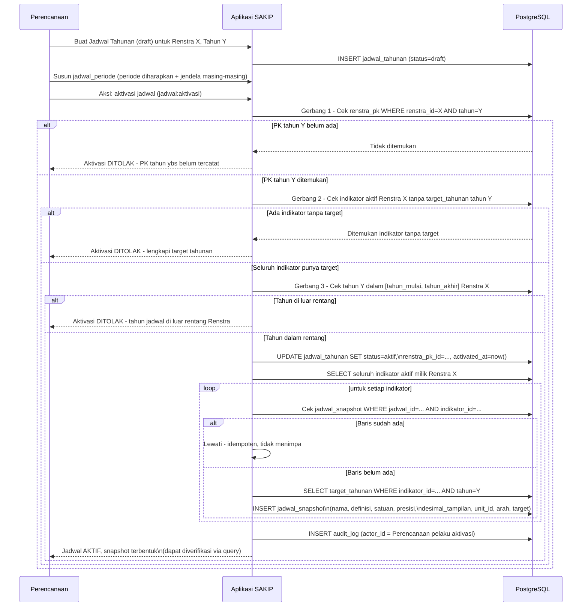

**Fase Lanjutan (belum dibangun):** jika `pakai_persetujuan_pimpinan = true` di masa depan, diagram ini akan bercabang tambahan untuk membuka jendela `persetujuan_mulai`–`persetujuan_selesai` setelah reviu. Detail cabang itu tidak digambarkan di sini karena berada di luar cakupan MVP.

**Sifat idempoten dan imutabilitas snapshot:** logika pembuatan snapshot pada langkah 6 dipanggil ulang, dengan perilaku yang sama, setiap kali `jadwal:buka_kembali` dijalankan (§7) — mis. saat indikator baru ditambahkan di tengah tahun. Baris snapshot yang **sudah dirujuk** oleh minimal satu `pengukuran` bersifat abadi dan tidak dapat diubah lagi. Sebelum dirujuk pengukuran manapun, baris snapshot boleh dikoreksi hanya selama jadwal berstatus `aktif`, dan setiap koreksi wajib tercatat di `audit_log`. Tidak ada restatement data historis.

---

## 5. Alur Pengisian per Periode

Jendela pengisian dan reviu kini berlaku per periode (§3), bukan satu jendela untuk seluruh tahun. Batasan waktu ini berlaku berbeda bagi Penanggung Jawab (PIC) dibandingkan Perencanaan.

```
🎯 Penanggung Jawab (PIC, akses pengukuran:create/update di-scope per unit)
  1. Membuka daftar indikator dalam scope unit-nya untuk periode berjalan
  2. Selama tanggal hari ini berada dalam [pengisian_mulai, pengisian_selesai] periode tsb
     (dari jadwal_periode): dapat membuat/mengubah/mengajukan pengukuran
  3. Begitu tanggal hari ini melewati pengisian_selesai periode tsb:
     → PIC TIDAK DAPAT LAGI membuat, mengubah, atau mengajukan pengukuran untuk periode itu
     → Deadline ini bersifat mutlak — tidak ada jendela toleransi tambahan bagi PIC
     → Satu-satunya jalur lanjutan adalah Perencanaan mengisikan sendiri (langkah 4) atau
       jadwal:buka_kembali (§7) bila koreksi diperlukan setelah penutupan

📋 Perencanaan (akses pengukuran:create/update bersifat GLOBAL, tanpa scope unit)
  4. Dikecualikan dari batas jendela periode — dapat membuat/mengubah/mengajukan pengukuran
     untuk indikator unit mana pun, kapan pun, selama Jadwal Tahunan belum mencapai penutupan
  5. Sering dipakai untuk: mengisikan data atas nama unit yang lewat tenggat, backfill (§9),
     atau koreksi tanpa harus membuka-kembali jadwal terlebih dahulu

⚙️ Sistem (perhitungan status tampilan)
  6. Status "Belum mengisi"/"Tidak mengisi" dihitung per kombinasi indikator × periode yang
     diharapkan (dari jadwal_periode) — bukan per tahun secara keseluruhan
  7. Indikator berstatus arsip TIDAK dihitung sebagai kewajiban pengisian pada periode manapun
  8. Untuk periode dengan is_nilai_akhir=true, nilai diisi manual — tidak dihitung otomatis
     dari agregasi periode-periode di bawahnya
```

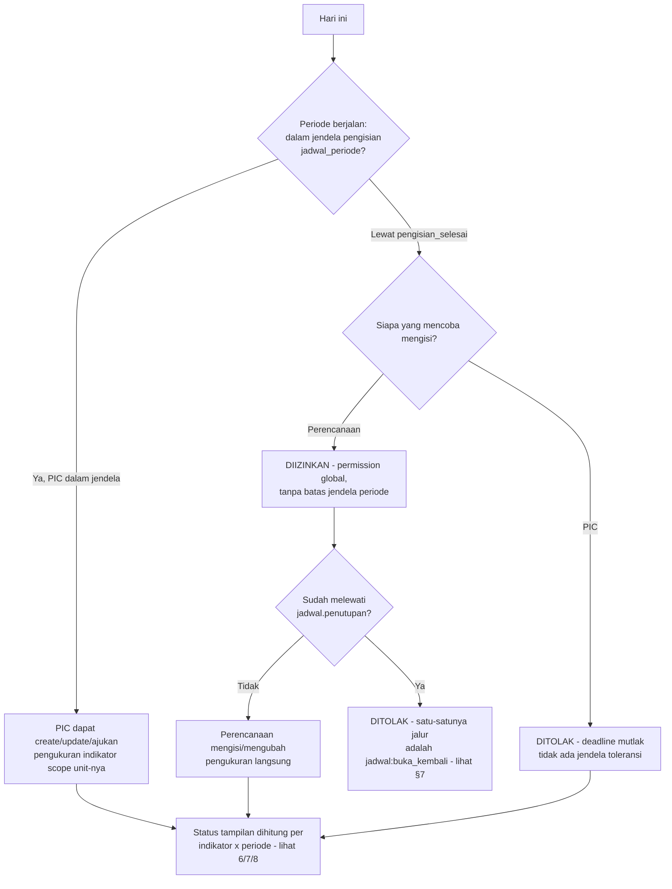

**Konsekuensi permission (lihat §12):** karena Perencanaan dikecualikan dari batas jendela per periode, baris `user_permissions` milik role Perencanaan untuk `pengukuran:create`/`pengukuran:update` disimpan dengan `unit_id = NULL` (global) — bukan di-scope ke unit tertentu seperti milik PIC. Evaluasi permission di backend memperlakukan baris global ini sebagai izin penuh lintas unit, sementara pengecekan deadline periode tetap dijalankan sebagai lapisan validasi bisnis terpisah dari lapisan permission.

---

## 6. Alur Status Data Pengukuran (5 Status + Jalur Kembali)

```
🎯 Penanggung Jawab / 📋 Perencanaan
  1. Membuat pengukuran baru untuk indikator → Status: Draft
     PIC: hanya untuk indikator dalam scope unit miliknya, dalam jendela pengisian periode aktif
     Perencanaan: untuk indikator unit mana pun, tanpa batas jendela periode (hanya dibatasi
     jadwal.penutupan)
  2. Mengedit nilai/catatan selama masih Draft (bisa berkali-kali)
  3. Mengajukan pengukuran → Status: Diajukan
     Catatan wajib diisi jika:
       a. Nilai pada periode ini MEMBURUK menurut arah indikator (naik_baik: nilai turun;
          turun_baik: nilai naik) dibanding pengukuran berstatus Disahkan terakhir secara
          kronologis untuk indikator yang sama — nilai STAGNAN tidak memicu kewajiban ini;
          pengukuran pertama tanpa pembanding Disahkan tidak wajib catatan, atau
       b. indikator.wajib_catatan = true (wajib pada setiap pengajuan, terlepas arah nilai)

📋 Perencanaan
  4. Memverifikasi pengukuran yang Diajukan
     → Setuju: Status: Diverifikasi
     → Perlu revisi: Status: Dikembalikan + alasan wajib diisi
  5. Untuk pengukuran yang sudah Diverifikasi, masih bisa dikembalikan bila belakangan ditemukan
     masalah → Status: Dikembalikan + alasan wajib diisi
  6. Mengesahkan pengukuran yang Diverifikasi → Status: Disahkan (Fase Awal: langsung final,
     tanpa approval Pimpinan)

🎯 Penanggung Jawab / 📋 Perencanaan
  7. Jika status Dikembalikan, merevisi nilai/catatan → Status kembali ke Draft, lanjut lagi
     dari langkah 2 (tunduk batas jendela periode yang sama bagi PIC)

📋 Perencanaan / ⚙️ Superadmin
  8. Untuk pengukuran yang sudah Disahkan, masih dapat dibuka-kembali (pengukuran:buka_kembali)
     menjadi Dikembalikan, dengan alasan wajib, selama Jadwal Tahunan belum penutupan — lihat §7

(Fase Lanjutan, belum dibangun: pengukuran yang sudah Disahkan bisa memerlukan tahap tambahan
pengukuran:setujui oleh Pimpinan sebelum benar-benar dianggap final, jika
pakai_persetujuan_pimpinan=true)
```

```mermaid
stateDiagram-v2
    [*] --> Draft: pengukuran:create\n(PIC: scoped unit + jendela periode;\nPerencanaan: global, tanpa batas jendela)
    Draft --> Draft: pengukuran:update (edit nilai/catatan)
    Draft --> Diajukan: ajukan (validasi catatan wajib\njika nilai memburuk menurut arah,\natau indikator.wajib_catatan=true)
    Diajukan --> Diverifikasi: pengukuran:verifikasi (Perencanaan)
    Diajukan --> Dikembalikan: pengukuran:kembalikan (Perencanaan, alasan wajib)
    Diverifikasi --> Dikembalikan: pengukuran:kembalikan (Perencanaan, alasan wajib)
    Diverifikasi --> Disahkan: pengukuran:sahkan (Perencanaan)\nFASE AWAL: langsung, tanpa approval Pimpinan
    Dikembalikan --> Draft: penanggung jawab/Perencanaan merevisi
    Disahkan --> Dikembalikan: pengukuran:buka_kembali\n(Perencanaan/Superadmin, alasan wajib,\nhanya sebelum jadwal.penutupan)
    Disahkan --> [*]: status final Fase Awal\n(sampai jadwal.penutupan)

    note right of Disahkan
        FASE LANJUTAN (belum dibangun):
        Disahkan dapat memerlukan tahap
        tambahan pengukuran:setujui oleh
        Pimpinan sebelum dianggap final,
        jika pakai_persetujuan_pimpinan=true
    end note

    note right of Dikembalikan
        Ada DUA jalur menuju Dikembalikan:
        1. Pra-pengesahan (dari Diajukan/Diverifikasi)
           via pengukuran:kembalikan
        2. Pasca-pengesahan (dari Disahkan)
           via pengukuran:buka_kembali - §7
    end note
```

**Aturan penting yang tidak tergambar eksplisit di diagram state di atas:**
- Setiap transisi menaikkan kolom `versi` pada baris `pengukuran` (optimistic locking) — permintaan dengan `versi` usang ditolak.
- Baris dengan `nilai`/`catatan` terisi tidak pernah dihapus permanen di transisi manapun.
- Transisi `pengukuran:create`/`update` oleh PIC hanya diizinkan jika `unit_id` scope pemohon cocok dengan `indikator.unit_id` target, **dan** tanggal hari ini masih dalam jendela pengisian periode terkait (§5). Transisi oleh Perencanaan tidak tunduk pengecekan `unit_id` (permission global) maupun jendela periode, hanya dibatasi `jadwal.penutupan`.
- `pengukuran:create` untuk indikator berstatus `arsip` ditolak sistem, siapa pun pemohonnya.

---

## 7. Alur Buka-Kembali

Koreksi data pengukuran/jadwal disediakan lewat dua permission berbeda, masing-masing untuk situasi yang berbeda:

| Lapis | Permission | Transisi | Alasan | Batasan waktu | Pelaku |
|---|---|---|---|---|---|
| 1 — Pengukuran | `pengukuran:buka_kembali` | `Disahkan → Dikembalikan` | Wajib | Hanya **sebelum** `jadwal.penutupan` | Perencanaan / Superadmin |
| 2 — Jadwal | `jadwal:buka_kembali` | `ditutup → aktif` | Wajib | Hanya **setelah** `jadwal.penutupan` (atau kapan saja jadwal berstatus `ditutup`) | Perencanaan / Superadmin |

```
📋 Perencanaan / ⚙️ Superadmin
  Lapis 1 — Sebelum penutupan jadwal:
  1. Menemukan pengukuran berstatus Disahkan yang perlu dikoreksi
  2. Menjalankan aksi pengukuran:buka_kembali, wajib mengisi alasan
     → Jadwal sudah penutupan: aksi DITOLAK — jalur ini sudah tertutup, lanjut ke Lapis 2
     → Jadwal belum penutupan: Status pengukuran kembali ke Dikembalikan
  3. Penanggung jawab/Perencanaan merevisi nilai/catatan (kembali ke alur §6 langkah 7)

  Lapis 2 — Setelah penutupan jadwal (mekanisme standar, bukan sekadar darurat):
  4. Menjalankan aksi jadwal:buka_kembali pada Jadwal Tahunan berstatus ditutup, wajib
     mengisi alasan → Status jadwal kembali ke aktif
  5. Dipakai untuk dua skenario:
     a. Koreksi pengukuran pasca-penutupan — begitu jadwal aktif kembali, Lapis 1
        (pengukuran:buka_kembali) tersedia lagi untuk baris yang relevan
     b. Memasukkan indikator baru di tengah tahun (mis. akibat revisi Kepmen IKU, §8) —
        begitu jadwal aktif kembali, trigger snapshot idempoten (§4 langkah 6) berjalan ulang
        dan membuat baris jadwal_snapshot baru khusus untuk indikator yang belum punya
        pasangan snapshot pada jadwal ini, tanpa menyentuh baris snapshot lama
  6. Setelah koreksi/penambahan selesai, menjalankan jadwal:tutup kembali → Status: ditutup

Seluruh transisi pada kedua lapis tercatat di audit_log.
```

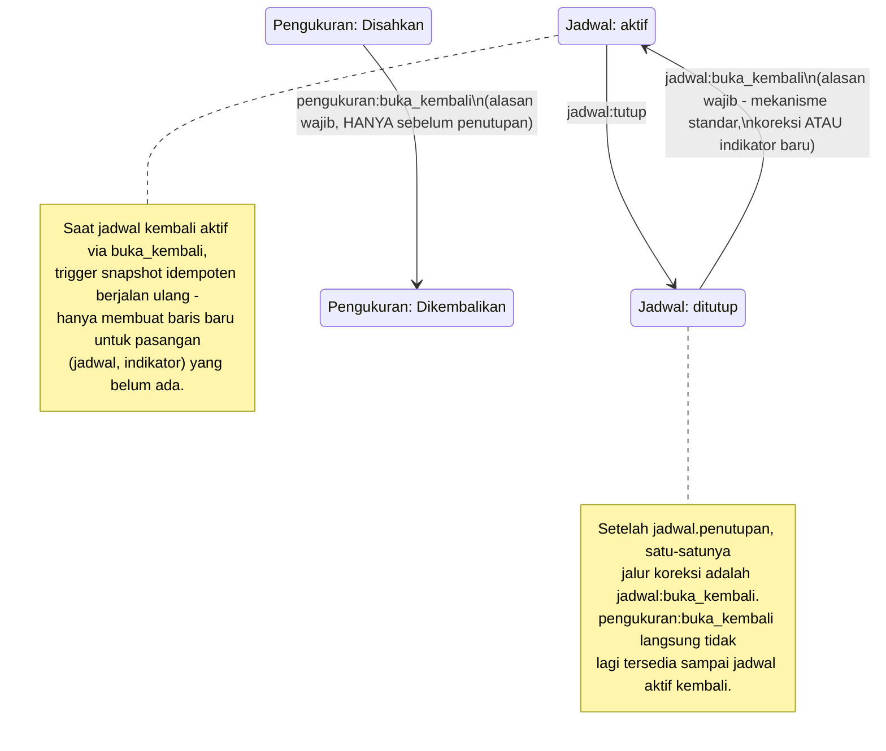

**Perbedaan mendasar dengan versi sebelumnya:** `jadwal:buka_kembali` bukan sekadar jalur darurat, melainkan **mekanisme standar** untuk dua kebutuhan operasional yang sama pentingnya: koreksi data setelah penutupan, dan penambahan indikator baru di tengah tahun berjalan (§8). Kedua kebutuhan ini memakai gerbang permission yang sama sehingga jejak auditnya konsisten.

---

## 8. Alur Perubahan Kepmen IKU & Revisi Renstra

Terbitnya Kepmen IKU baru dapat mengubah, menghapus, atau menambah indikator yang wajib diukur. Alur berikut menegaskan bagaimana perubahan itu direfleksikan ke sistem tanpa kehilangan riwayat data yang sudah ada.

```
📋 Perencanaan
  1. Kepmen IKU baru terbit, menggantikan/merevisi Kepmen sebelumnya

  Kasus A — Revisi atribut Renstra (nama, dasar_hukum, rentang tahun, dsb):
  2a. Mengedit baris Renstra yang SAMA secara langsung (in place) — BUKAN membuat Renstra baru
  3a. Sistem mencatat audit_log dengan nilai_lama/nilai_baru dari field yang berubah, dan
      alasan wajib memuat nomor & tanggal Kepmen yang melandasi revisi

  Kasus B — Indikator dihapus dari Kepmen baru:
  2b. Mengarsipkan indikator terkait (status: aktif → arsip) — TIDAK menghapus baris
  3b. Data pengukuran lama pada indikator ini tetap utuh, tetap muncul di laporan historis
      dengan penanda status arsip
  4b. pengukuran:create untuk indikator ini ditolak sistem sejak saat itu (lihat §4, §6)

  Kasus C — Indikator baru ditambahkan oleh Kepmen baru:
  2c. Membuat indikator baru di bawah Sasaran yang sesuai (unit pemilik + arah penilaian)
  3c. Mengisi target_tahunan tahun berjalan untuk indikator baru tsb
  4c. Merevisi Perjanjian Kinerja tahun berjalan agar mencakup target indikator baru
  5c. Menjalankan jadwal:buka_kembali (§7) pada Jadwal Tahunan tahun berjalan — ini
      MEKANISME STANDAR untuk memasukkan indikator baru di tengah tahun, termasuk untuk
      mengisi periode-periode yang tersisa pada tahun berjalan
  6c. Trigger snapshot idempoten membuat baris jadwal_snapshot baru khusus indikator ini;
      indikator kini dapat diukur untuk periode-periode berikutnya pada jadwal yang sama
```

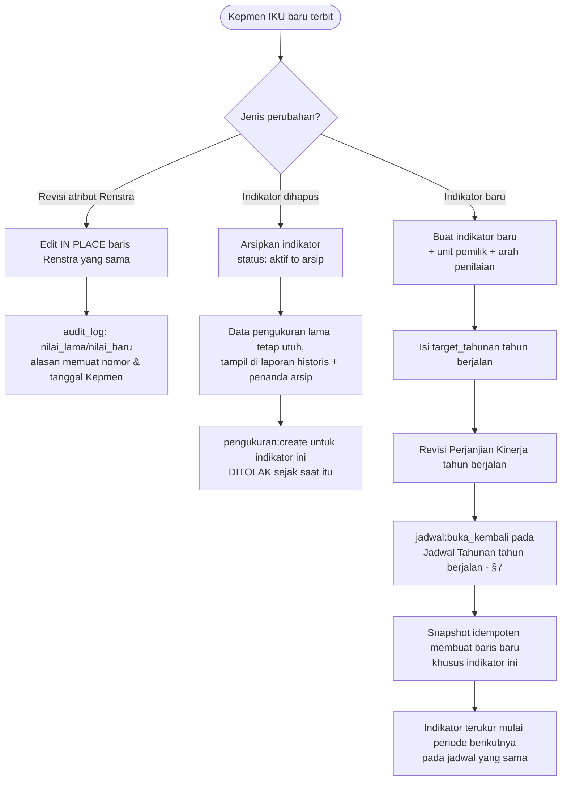

**Konsekuensi desain yang disadari:** indikator baru yang dibuat setelah jadwal aktif **tanpa** melewati `jadwal:buka_kembali` tidak otomatis terukur pada tahun berjalan — baru terukur mulai jadwal tahun berikutnya diaktifkan. `jadwal:buka_kembali` (Kasus C langkah 5c) adalah satu-satunya jalur agar indikator baru dapat diukur pada sisa tahun berjalan yang sama.

---

## 9. Alur Backfill Data Historis

Digunakan Perencanaan untuk memasukkan data kinerja tahun-tahun lampau (sebelum aplikasi mulai dipakai) ke dalam sistem, tanpa mendistorsi mekanisme jendela pengisian normal.

```
📋 Perencanaan
  1. Memastikan Perjanjian Kinerja (renstra_pk) tahun lampau yang akan di-backfill sudah
     tercatat — wajib ada sebelum jadwal retroaktif dapat diaktifkan
  2. Membuat Jadwal Tahunan retroaktif untuk tahun lampau tsb, dengan syarat tahun tersebut
     berada dalam rentang [tahun_mulai, tahun_akhir] Renstra yang berlaku pada tahun itu
  3. Menyusun jadwal_periode untuk tahun retroaktif tsb (§3)
  4. Mengaktifkan jadwal retroaktif — melewati tiga gerbang validasi seperti biasa (§4);
     activated_at mencatat WAKTU AKTIVASI SEBENARNYA (tanggal hari ini, jujur) — bukan
     tanggal retroaktif yang dipura-purakan
  5. Snapshot terbentuk seperti alur normal
  6. Mengisi sendiri seluruh pengukuran untuk tahun retroaktif tsb — PIC TIDAK dapat mengisi
     jadwal ini karena seluruh jendela pengisian periode retroaktif sudah otomatis terlewati
     pada saat aktivasi (deadline mutlak §5 berlaku sama, hanya saja seluruhnya sudah lewat
     sejak awal); pengisian sepenuhnya menjadi tanggung jawab Perencanaan
  7. Mengajukan, memverifikasi, dan mengesahkan sendiri seluruh baris (Perencanaan memegang
     seluruh permission yang relevan)
```

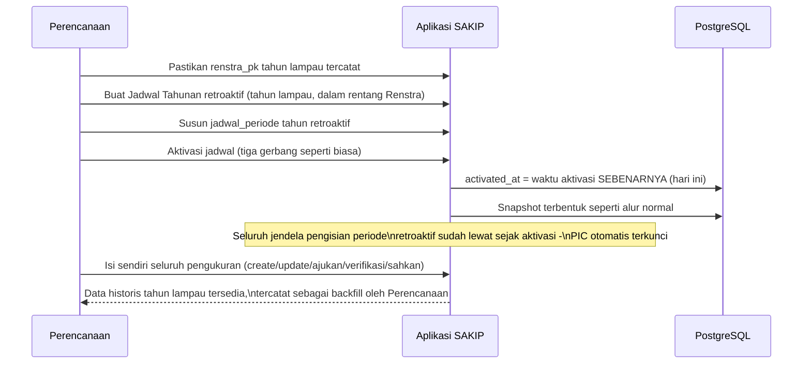

**Revisi target antar-tahun (mis. menaikkan target 2027–2029 setelah 2026 terlampaui):** cukup mengubah master `target_tahunan` untuk tahun-tahun yang belum dibekukan — snapshot tahun tersebut baru terbentuk saat jadwal tahun itu diaktifkan, dan otomatis membawa nilai revisi terbaru pada saat itu. Tahun yang jadwalnya sudah beku (snapshot sudah terbentuk) tidak tersentuh oleh revisi ini.

---

## 10. Alur Penetapan Status Capaian (Auto-Default Formula + Manual Override)

```
⚙️ Sistem (Kalkulasi Otomatis saat Pengukuran Disahkan)
  1. Begitu pengukuran mencapai status 'Disahkan', sistem mengeksekusi formula kalkulasi:
     - Arah naik_baik: Capaian (%) = (Realisasi / Target) * 100%
     - Arah turun_baik: Capaian (%) = (Target / Realisasi) * 100%
  2. Sistem secara otomatis membuat baris status_capaian awal (default):
     - Jika Capaian (%) ≥ 100% → status: 'Tercapai'
     - Jika Capaian (%) < 100% → status: 'Belum Tercapai'
     - Kolom sumber: 'formula', ditetapkan_oleh: NULL
  3. Status capaian otomatis ini langsung aktif dan terefleksi di dashboard/laporan

📋 Perencanaan / ⚙️ Superadmin (Kewenangan Manual Override)
  4. Bila terdapat evaluasi kualitatif khusus atau kebijakan pimpinan:
     Perencanaan/Superadmin dapat melakukan override manual atas status capaian tersebut
  5. Sistem menyimpan baris status_capaian baru sebagai status aktif (sumber: 'manual',
     ditetapkan_oleh: user_id yang login), baris lama tetap tersimpan sebagai riwayat audit (soft replace)
  6. Wajib mencatat alasan override pada audit_log
```

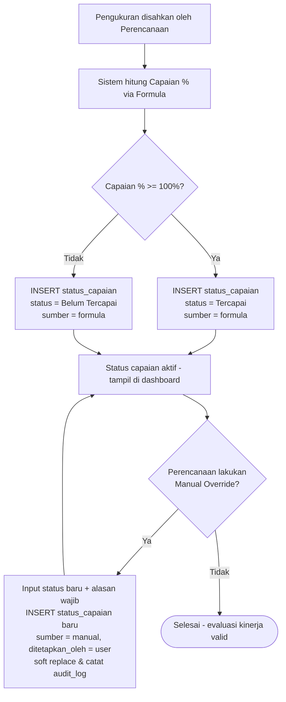

Penetapan awal status capaian berjalan secara instan dan bebas repot berkat kalkulasi formula otomatis. Namun integritas manajerial tetap terjaga karena Tim Perencanaan memegang kendali untuk melakukan intervensi (override) manual berlandaskan alasan formal yang tercatat di audit log.

---

## 11. Alur Setelan Aplikasi

Modul terbatas yang memungkinkan Superadmin maupun Admin mengubah nilai teks dan preferensi presentasional aplikasi tanpa perlu deploy ulang kode.

```
⚙️ Superadmin / Admin
  1. Membuka halaman Setelan Aplikasi, terkelompok per grup: identitas instansi (nama,
     alamat, telepon, surel, laman, logo), identitas aplikasi (nama aplikasi, label unit),
     preferensi tampilan/laporan (zona waktu, format tanggal, format angka, header/footer
     ekspor)
  2. Mengubah satu atau beberapa nilai kunci pengaturan
  3. Menyimpan perubahan
     → Sistem memvalidasi kunci yang dikirim berada dalam whitelist kunci terdefinisi —
       kunci di luar whitelist ditolak
     → Kunci valid: baris pengaturan terkait diperbarui (nilai, updated_by, updated_at)

⚙️ Sistem
  4. Mencatat audit_log untuk tiap kunci yang berubah (nilai_lama/nilai_baru)
  5. Menginvalidasi cache accessor pengaturan terkait, sehingga pembacaan berikutnya
     mengambil nilai terbaru

👤 Pengguna lain
  6. Membaca nilai pengaturan terjadi otomatis saat render halaman (mis. label unit di form
     Indikator, header laporan ekspor) — TANPA memerlukan permission khusus untuk membaca
```

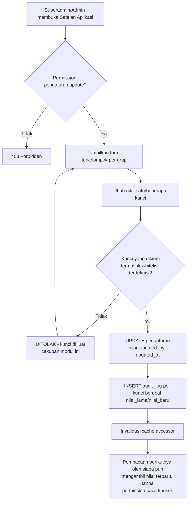

**Batas tegas cakupan modul ini:** yang boleh dinamis melalui Setelan Aplikasi **hanya teks dan preferensi presentasional**. Modul ini secara sengaja **tidak** menyediakan jalur untuk mengubah nilai enum/status, nama permission, atau aturan bisnis apa pun — seluruh hal tersebut tetap didefinisikan di kode, bukan di tabel `pengaturan`.

**Catatan cakupan:** branding halaman login Keycloak berada di luar cakupan aplikasi ini — diatur di level realm Keycloak, bukan lewat modul Setelan Aplikasi.

---

## 12. Alur Evaluasi Permission Saat Request

Menggambarkan bagaimana backend Laravel mengevaluasi otorisasi pada setiap request.

```
👤 Pengguna
  1. Melakukan suatu aksi X pada entitas Y (opsional menyasar unit Z tertentu)

⚙️ Sistem (Middleware/Policy)
  2. Mengambil user_id dari sesi yang sedang login
  3. Query union permission: ambil seluruh baris permission + unit_id milik user_id tsb dari
     user_permissions
  4. Mengecek apakah permission 'entitas:aksi' yang relevan ada di hasil query
     → Tidak ada: 403 Forbidden, proses berhenti
     → Ada: lanjut ke langkah 5
  5. Mengecek apakah aksi termasuk pengukuran:create atau pengukuran:update
     → Bukan: aksi diizinkan langsung (permission global sudah cukup)
     → Ya: lanjut ke langkah 6
  6. Mengecek baris permission user yang relevan:
     → Ada baris dengan unit_id = NULL (global, mis. milik Perencanaan/Superadmin): aksi
       diizinkan lintas unit tanpa perlu kecocokan lebih lanjut
     → Ada baris dengan unit_id yang SAMA dengan indikator.unit_id target (mis. milik PIC
       yang di-scope): aksi diizinkan untuk indikator itu
     → Tidak ada baris yang cocok: 403 Forbidden
  7. Untuk pengukuran:create/update yang diizinkan pada langkah 6 lewat baris ber-scope unit
     (bukan global), sistem selanjutnya memeriksa jendela pengisian periode (§5) sebagai
     lapisan validasi bisnis terpisah dari lapisan permission — baris global (Perencanaan)
     dikecualikan dari pengecekan ini, hanya dibatasi jadwal.penutupan
  8. Aksi dieksekusi; kalau termasuk peristiwa teraudit, perubahan dicatat ke audit_log
```

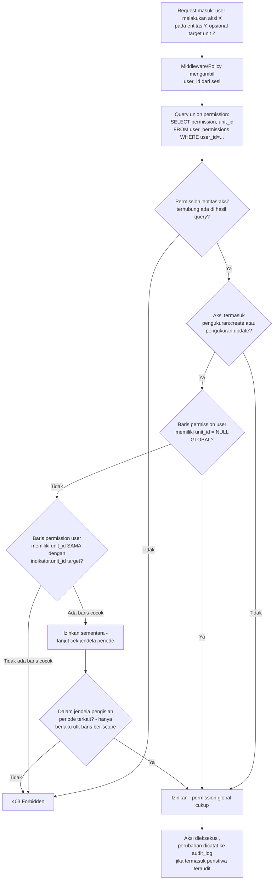

**Catatan implementasi:** `user_permissions` sudah berisi hasil union (baris disalin dari `user_role_presets` saat assignment role + baris tambahan eksplisit/manual), sehingga query pada node C tidak perlu join real-time ke tabel preset; preset hanya dipakai sebagai "template" saat pengisian awal. Permission `pengukuran:create`/`pengukuran:update` milik role **Perencanaan** disalin dari preset dengan `unit_id = NULL` (global) — berbeda dari milik **Pegawai (PIC)**, yang selalu di-scope eksplisit per unit lewat form assign scope (§1).

---

## 13. Alur Pengelolaan Akses, Unit, dan Setelan (Admin/Superadmin)

Role kelima, **Admin** (label tampilan: Administrator), memegang wewenang administratif atas akun pengguna, unit organisasi, dan setelan aplikasi — tanpa wewenang substantif atas data kinerja (Renstra, Indikator, Target, PK, Jadwal, Pengukuran, Status Capaian). Pemisahan ini menegakkan pemisahan tugas: pengelola akun/unit/setelan tidak otomatis memegang kendali atas data kinerja yang dilaporkan.

```
⚙️ Admin / Superadmin
  1. Mengelola Unit: membuat, membaca, mengubah, menghapus unit (unit:create/read/update/delete)
     → Unit dengan indikator terkait tidak dapat dihapus (aturan tetap berlaku)
  2. Mengelola Akses Pengguna: assign role preset (Superadmin/Admin/Perencanaan/Pimpinan/Pegawai)
     dan assign scope unit untuk pengukuran:create/update milik Pegawai (akses:update)
  3. Membaca daftar pengguna (pengguna:read)
  4. Mengubah Setelan Aplikasi (pengaturan:update) — lihat §11
  5. Membaca Audit Log (audit:read) dan Dashboard/Laporan (dashboard:read, laporan:read) untuk
     keperluan pemantauan administratif — TANPA hak ekspor laporan (laporan:ekspor tidak
     termasuk preset Admin)

⚙️ Sistem
  6. Menolak (403) setiap percobaan Admin mengakses aksi substantif atas data kinerja:
     renstra/sasaran/indikator/target/pk/periode/jadwal (termasuk aktivasi/buka_kembali),
     penanggung_jawab:update, seluruh aksi pengukuran (create/update/verifikasi/kembalikan/
     sahkan/buka_kembali), status_capaian:update, dan laporan:ekspor
  7. Mencatat audit_log untuk setiap aksi administratif yang berhasil (perubahan unit, akses,
     setelan) sebagaimana berlaku untuk role lain
```

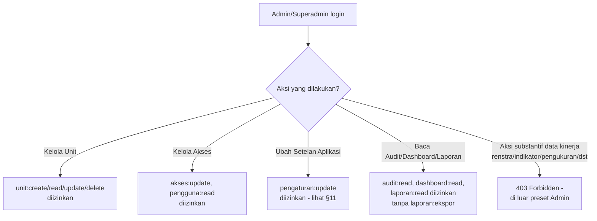

**Perbedaan Admin vs Superadmin:** Superadmin memiliki seluruh permission tanpa kecuali (termasuk seluruh wewenang substantif di atas). Admin adalah subset yang sengaja dibatasi hanya pada permukaan administratif — pengelolaan akun, unit, dan setelan — agar peran administrator sistem terpisah dari peran pengelola data kinerja (Perencanaan).

---

## 14. Tabel Peran vs Aksi (Ringkas — Fase Awal)

| Aksi / Modul | Superadmin | Admin | Perencanaan | Pimpinan | Pegawai (Penanggung Jawab) |
|---|:---:|:---:|:---:|:---:|:---:|
| Kelola Renstra/Sasaran/Indikator/Target/PK | ✅ | ❌ | ✅ | ❌ | ❌ |
| Kelola Periode & Jadwal (termasuk aktivasi) | ✅ | ❌ | ✅ | ❌ | ❌ |
| Kelola Penanggung Jawab | ✅ | ❌ | ✅ | ❌ | ❌ |
| Buat/ubah Pengukuran (Draft) | ✅ (global) | ❌ | ✅ (global, tanpa scope, tanpa batas jendela sampai penutupan) | ❌ | ✅ (hanya jika diberi scope unit eksplisit, tunduk jendela periode) |
| Ajukan Pengukuran | ✅ (global) | ❌ | ✅ (global) | ❌ | ✅ (jika di-scope, tunduk jendela periode) |
| Verifikasi / Kembalikan Pengukuran | ✅ | ❌ | ✅ | ❌ | ❌ |
| Sahkan Pengukuran | ✅ | ❌ | ✅ | ❌ *(Fase Lanjutan: `pengukuran:setujui` disiapkan, belum aktif)* | ❌ |
| Buka-kembali Pengukuran Disahkan (`pengukuran:buka_kembali`) | ✅ | ❌ | ✅ | ❌ | ❌ |
| Buka-kembali Jadwal (`jadwal:buka_kembali`) | ✅ | ❌ | ✅ | ❌ | ❌ |
| Tetapkan Status Capaian | ✅ | ❌ | ✅ | ❌ | ❌ |
| Kelola Unit (`unit:*`) | ✅ | ✅ | ❌ *(kecuali diberi eksplisit)* | ❌ | ❌ |
| Kelola Akses (role preset & scope, `akses:update`, `pengguna:read`) | ✅ | ✅ | ❌ *(kecuali diberi eksplisit)* | ❌ | ❌ |
| Ubah Setelan Aplikasi (`pengaturan:update`) | ✅ | ✅ | ❌ | ❌ | ❌ |
| Lihat Dashboard (`dashboard:read`) | ✅ | ✅ | ✅ | ✅ | ✅ |
| Lihat Laporan (`laporan:read`) | ✅ | ✅ | ✅ | ✅ | ❌ *(kecuali diberi eksplisit)* |
| Ekspor Laporan (`laporan:ekspor`) | ✅ | ❌ | ✅ | ✅ | ❌ *(kecuali diberi eksplisit)* |
| Lihat Audit Log (`audit:read`) | ✅ | ✅ | ✅ | ✅ | ❌ |

Legenda: ✅ = memiliki akses via role preset default; ❌ = tidak termasuk preset default, dapat diberikan eksplisit sebagai pengecualian melalui mekanisme assign scope/akses. Baris "Buat/ubah Pengukuran" dan "Ajukan Pengukuran" membedakan sifat scope: Perencanaan bersifat global lintas unit sejak preset, sementara Pegawai selalu memerlukan pemberian scope unit eksplisit dan tunduk deadline jendela periode yang mutlak. Kolom **Admin** merepresentasikan permukaan administratif murni (akses, unit, setelan, bacaan pemantauan) — tanpa wewenang substantif apa pun atas data kinerja, sebagai pemisahan tugas yang disengaja dari role Perencanaan.

---

## 15. Alur Pelaporan Matriks Hierarkis Resmi & Capping Dashboard

### 15.1 Kebijakan Kalkulasi Capping Maksimal 100% pada Dashboard
- **Level IKU (Detail):** Persentase capaian riil (misal: 125%) tetap disimpan utuh di database dan ditampilkan pada tabel detail pengukuran untuk menjaga transparansi dan mengapresiasi kinerja unggul unit.
- **Level Agregasi Komposit (Sasaran & Dashboard Eksekutif):** Sistem menerapkan *capping* maksimal 100% pada capaian setiap indikator sebelum menghitung nilai rata-rata Sasaran Strategis maupun Indeks Kinerja Institusi (sesuai standar evaluasi akuntabilitas kinerja KemenPAN-RB). Hal ini memastikan kelebihan capaian satu IKU tidak menutupi kelemahan IKU lain.

### 15.2 Ekspor Excel Format Matriks Hierarkis Resmi LLDIKTI XVI
- Laporan diekspor ke file Excel (.xlsx) mengikuti layout matriks kanonis dari `document/Pengukuran Kinerja  Triwulan 2026.xlsx`:
  1. **Kop/Header Formal:** Judul laporan kinerja triwulanan dan identitas LLDIKTI Wilayah XVI.
  2. **Struktur Matriks Baris:** Sasaran Strategis sebagai baris induk (parent), memayungi Indikator Kinerja Utama (IKU) di bawahnya.
  3. **Kolom Data:** Nomor, Sasaran Strategis, IKU, Target Tahunan, Target Triwulan, Realisasi TW I s.d. TW IV, Realisasi Tahunan, Persentase Capaian (%), Analisis Faktor Pendorong / Kendala, dan Rencana Tindak Lanjut.

---

*Workflow v1.1 — SAKIP LLDIKTI Wilayah XVI — Fase Awal (MVP) — September 2026 (Finalized post Grill-Me)*
