# WORKFLOW — SAKIP LLDIKTI Wilayah XVI

> Baseline penyelarasan: 18 September 2026. Rekomendasi klarifikasi grill Q1–Q30 diadopsi atas instruksi pengguna; pembaruan PM tentang Q4 dipertahankan dengan pengingat H-7, H-3, dan H-1. Ini bukan klaim pengesahan seluruh stakeholder. Parameter operasional dan definisi IKU yang masih menunggu Tim Perencanaan tetap ditandai pada PRD.

---

## 1. Alur Penggunaan Utama End-to-End (Fase Awal)

Diagram berikut menggambarkan urutan penuh dari login hingga dashboard terupdate, termasuk pengelolaan dokumen dasar (`regulasi` beserta lampirannya, lampiran Renstra dan Perjanjian Kinerja), tahap penyusunan rencana aksi, kegiatan, klaim kegiatan, bukti dukung tiga mode (file/tautan/teks) pada tiap induk lampiran, dan pengukuran berbasis komponen yang disisip di antara penugasan Penanggung Jawab dan pengisian pengukuran.

```
👤 Pengguna
  1. Buka aplikasi SAKIP → diarahkan ke Keycloak (OIDC Authorization Code Flow)
  2. Login dengan kredensial masing-masing
     → Gagal: kembali ke halaman login
     → Berhasil: sistem callback, mapping keycloak_id ke user lokal, sesi Laravel terbentuk

📋 Perencanaan / ⚙️ Superadmin
  3. Mencatat dokumen dasar (regulasi): jenis (kepmen/permen/perpres/keputusan_lainnya), nomor,
     tahun, tentang, tanggal, tautan_sumber — dapat melampirkan dokumen regulasi (mode file/
     tautan/teks) sebagai bukti fisik dasar aturan — lihat §3

📋 Perencanaan
  4. Menyusun Renstra baru: nama, dasar_hukum (ringkasan), rentang tahun, merujuk regulasi_id
     (opsional) sebagai dasar aturan terstruktur
  5. Melampirkan dokumen Renstra (mode file/tautan/teks) — lihat §3
  6. Menyusun Sasaran dan Indikator di bawah Renstra tersebut — tiap indikator diberi unit pemilik,
     arah penilaian (naik_baik/turun_baik), tipe_perhitungan (rasio_persen/penjumlahan/manual),
     dan regulasi_id (opsional) sebagai dasar aturan per indikator
  7. Untuk indikator bertipe rasio_persen/penjumlahan, mendefinisikan indikator_komponen
     (kode, label, peran, bobot) — lihat §7
  8. Mengisi Target Tahunan (beserta baseline) untuk tiap indikator
  9. Mencatat Perjanjian Kinerja (renstra_pk) untuk tahun berjalan: nomor_pk, tanggal_pk
  10. Melampirkan dokumen Perjanjian Kinerja (mode file/tautan/teks) pada renstra_pk tahun
      berjalan — lihat §3
  11. Mengaktifkan Renstra
     → Validasi gagal (dasar_hukum kosong atau beririsan dengan Renstra aktif lain): kembali ke
       langkah 4
     → Validasi lolos: Renstra berstatus AKTIF
  12. Membuat Jadwal Tahunan yang merujuk Renstra X, Tahun Y → status: draft
  13. Menyusun daftar Periode yang diharapkan tahun ini (jadwal_periode) beserta jendela
      pengisian dan reviu masing-masing periode (mis. Triwulan I–IV)
  14. Mengisi jendela penyusunan rencana aksi tingkat tahun pada jadwal_tahunan:
      rencana_aksi_mulai, rencana_aksi_selesai
  15. Mengaktifkan Jadwal Tahunan
     → Gerbang 1 gagal (renstra_pk tahun Y belum tercatat): kembali ke langkah 9
     → Gerbang 2 gagal (ada indikator aktif tanpa target_tahunan tahun Y): kembali ke langkah 8
     → Gerbang 3 gagal (tahun Y di luar rentang tahun Renstra): kembali ke langkah 12
     → Gerbang 4 gagal (renstra_pk tahun Y belum memiliki minimal satu lampiran dokumen):
       kembali ke langkah 10 — mode lampiran bebas (file/tautan/teks) sehingga gerbang ini
       tidak memacetkan alur; bila unggahan file sedang dimatikan pada setelan aplikasi,
       berlaku penanda tidak_dapat_dipenuhi (lihat §10.5)
     → Seluruh gerbang lolos: Jadwal AKTIF, sistem membuat jadwal_snapshot (termasuk
       jadwal_snapshot_komponen untuk indikator berkomponen) untuk setiap pasangan
       (jadwal, indikator) yang belum punya baris

📋 Perencanaan / ⚙️ Superadmin
  16. Menugaskan Penanggung Jawab per indikator
  16a. Menetapkan persyaratan bukti dukung (jenis_berkas) untuk tiap tahap yang relevan
       (rencana_aksi/pengukuran/kegiatan): nama, tahap, mode yang diizinkan (file/tautan/teks),
       wajib/opsional, semua_mode_wajib — lihat §10

🎯 Penanggung Jawab (PIC, di-scope per unit)
  17. Menyusun Rencana Aksi untuk indikator × tahun miliknya, dalam jendela
      rencana_aksi_mulai–rencana_aksi_selesai: mengisi target per periode: nilai langsung untuk tipe manual, nilai komponen untuk tipe nonmanual
      (basis kumulatif mengikuti target); sistem menampilkan skor target yang sebanding dengan PK
     → Nilai suatu periode lebih kecil dari periode sebelumnya: sistem menampilkan PERINGATAN
       (tidak memblokir)
     → Skor target periode terakhir tidak setara target PK tahunan: sistem
       menampilkan PERINGATAN dan MEWAJIBKAN alasan saat pengajuan
  18. Melengkapi bukti dukung wajib bertahap rencana_aksi (jenis_berkas.tahap = rencana_aksi),
      memilih salah satu atau kombinasi mode yang diizinkan (unggah file, isi tautan, tulis
      keterangan teks) sebelum mengajukan
  19. Mengajukan Rencana Aksi → Status: diajukan
     → Target manual atau komponen snapshot kosong pada periode yang berlaku: pengajuan
       DITOLAK, kembali lengkapi target; periode sebelum mulai berlaku tampil N/A
     → Bukti dukung wajib tahap rencana_aksi belum lengkap (sesuai mode yang dipilih dan aturan
       semua_mode_wajib): pengajuan DITOLAK

📋 Perencanaan
  20. Memverifikasi Rencana Aksi yang diajukan
     → Ditolak, perlu revisi: Status: dikembalikan + alasan wajib, kembali ke Penanggung Jawab
       (langkah 17)
     → Disetujui teknis: Status: diverifikasi
  21. Mengesahkan Rencana Aksi → Status: disahkan; verifikasi/pengesahan tunduk F1/F2 (§20)

🎯 Penanggung Jawab (PIC) / 📋 Perencanaan
  22. Menyusun Kegiatan per periode (unit pemilik, rencana pelaksanaan)
  23. Mengklaim kegiatan terhadap Rencana Aksi: memilih kegiatan mana yang mendukung rencana
      aksi/indikator dan komponen mana yang terdampak (menambah/mengurangi) — klaim boleh dibuat
      di tahap ini (sumber_klaim = rencana_aksi) maupun saat pengisian pengukuran (langkah 26)
  23a. Melaksanakan kegiatan sesuai rencana, lalu memperbarui status:
     a. Terlaksana sesuai rencana: melengkapi bukti dukung wajib bertahap kegiatan
        (jenis_berkas.tahap = kegiatan — mis. daftar hadir, laporan, dokumentasi, dalam mode
        file/tautan/teks sesuai yang diizinkan), lalu mengubah Status → terlaksana
        → GERBANG: ada bukti dukung wajib bertahap kegiatan yang belum terpenuhi → transisi
          ke terlaksana DITOLAK
     b. Tidak terlaksana / ditunda / dibatalkan: Status → tidak_terlaksana / ditunda / batal,
        WAJIB mengisi justifikasi — TIDAK memerlukan bukti dukung pelaksanaan, kegiatan TIDAK
        DIHAPUS
  23b. Bila digeser ke periode berikutnya, membuat baris kegiatan baru dengan kegiatan_asal_id
       menunjuk kegiatan asal

🎯 Penanggung Jawab (PIC indikator aktif + permission create/update pada unit yang cocok)
  24. Mengisi nilai tiap komponen aktif untuk periode berjalan, dalam jendela pengisian periode
      (dari jadwal_periode) → Status: Draft. Untuk indikator bertipe rasio_persen/penjumlahan,
      nilai indikator dihitung sistem sebagai turunan dari nilai komponen (read-only)
  25. Sambil mengisi, dapat menambah klaim kegiatan (sumber_klaim = pengukuran) — daftar kegiatan
      yang sudah diklaim untuk periode itu tampil sebagai pengingat/pembanding, tanpa mengubah
      nilai komponen secara otomatis
  26. Melengkapi bukti dukung wajib bertahap pengukuran (jenis_berkas.tahap = pengukuran),
      memilih mode yang diizinkan
  27. Mengajukan pengukuran sebelum jendela pengisian periode itu berakhir → Status: Diajukan
      (notifikasi in-app terkirim ke Perencanaan: banner/counter badge lonceng & masuk antrean tugas verifikasi; integrasi pengiriman WhatsApp & Email dijadwalkan sebelum 9 November 2026)
     → GERBANG: rencana_aksi (indikator × tahun) belum berstatus disahkan → pengajuan DITOLAK
     → GERBANG: nilai manual kosong atau komponen snapshot bernilai null → pengajuan DITOLAK
     → GERBANG: bukti dukung wajib tahap pengukuran belum lengkap → pengajuan DITOLAK
     → Ketiga gerbang di atas DIKECUALIKAN pada jadwal retroaktif (backfill, §15)
     → Jendela pengisian sudah lewat: PIC terkunci kecuali ada pembukaan resmi beralasan (§13);
       Perencanaan dapat mengisi sampai penutupan atau sesi koreksi resmi, tetap tunduk gerbang

📋 Perencanaan
  28. Memverifikasi pengukuran yang diajukan
      → Ditolak, perlu revisi: Status: Dikembalikan + alasan wajib diisi, kembali ke Penanggung
        Jawab (notifikasi in-app pengembalian beserta alasan instan diterima Penanggung Jawab; pengiriman instan WhatsApp & Email menyusul sebelum 9 November 2026) (langkah 24)
      → Disetujui teknis: Status: Diverifikasi
      → GERBANG PEMISAHAN TUGAS (§20): PIC pengaju pada versi pengajuan yang dibekukan
        tidak boleh memverifikasi/mengesahkan pengajuannya sendiri; jalur Perencanaan
        boleh self-approval dengan penanda audit dan laporan
  29. Mengesahkan pengukuran (Fase Awal: langsung, tanpa approval Pimpinan) → Status: Disahkan

📋 Perencanaan
  30. Menetapkan Rekomendasi Pimpinan untuk indikator × periode — dapat dilakukan setelah rapat
      evaluasi triwulan, tanpa menunggu pengukuran periode itu berstatus Disahkan

📋 Perencanaan / ⚙️ Superadmin
  31. Menetapkan Status Capaian secara manual (Tercapai / Belum Tercapai) untuk pengukuran yang
      sudah Disahkan
  32. Dashboard dan Laporan otomatis menampilkan capaian terbaru, rekapitulasi indikator ×
      periode, progres rencana aksi, dan status kegiatan

✍️ Pimpinan
  33. Memantau capaian, rencana aksi, kegiatan, dan rekomendasi lewat dashboard/laporan, bisa
      ekspor Excel — sifatnya read-only, tanpa aksi approval pada Fase Awal
```

```mermaid
flowchart TD
    A[Pengguna membuka SAKIP] --> B[Redirect ke Keycloak - OIDC Authorization Code Flow]
    B --> C{Login berhasil?}
    C -- Tidak --> B
    C -- Ya --> D[Callback: mapping keycloak_id ke users lokal, sesi Laravel terbentuk]
    D --> D2[Perencanaan/Superadmin mencatat regulasi:\njenis, nomor, tahun, tentang - + lampiran dokumen]
    D2 --> E[Perencanaan menyusun Renstra: nama, dasar_hukum,\nrentang tahun, regulasi_id opsional]
    E --> E2[Perencanaan melampirkan dokumen Renstra\nmode file / tautan / teks]
    E2 --> F[Perencanaan menyusun Sasaran & Indikator\ndi bawah Renstra - unit pemilik, arah,\ntipe_perhitungan, regulasi_id opsional]
    F --> F2[Perencanaan mendefinisikan indikator_komponen\nuntuk indikator rasio_persen/penjumlahan]
    F2 --> G[Perencanaan mengisi Target Tahunan\n+ baseline per indikator]
    G --> H[Perencanaan mencatat Perjanjian Kinerja\nrenstra_pk - nomor_pk, tanggal_pk]
    H --> H2[Perencanaan melampirkan dokumen PK\nmode file / tautan / teks]
    H2 --> I{Validasi aktivasi Renstra lolos?\ndasar_hukum terisi & tidak beririsan\ndengan Renstra aktif lain}
    I -- Tidak --> E
    I -- Ya --> J[Renstra berstatus AKTIF]
    J --> K[Perencanaan membuat Jadwal Tahunan draft\nmerujuk Renstra X, Tahun Y]
    K --> K2[Perencanaan menyusun jadwal_periode:\ndaftar periode + jendela pengisian/reviu]
    K2 --> K3[Perencanaan mengisi jendela rencana_aksi_mulai/\nrencana_aksi_selesai pada jadwal_tahunan]
    K3 --> L{Empat gerbang validasi aktivasi lolos?\n1 PK tahun Y ada\n2 seluruh indikator aktif punya target tahun Y\n3 tahun Y dalam rentang Renstra\n4 renstra_pk tahun Y punya lampiran dokumen}
    L -- Tidak --> K
    L -- Ya --> M[Jadwal AKTIF: sistem membuat jadwal_snapshot\n+ jadwal_snapshot_komponen, idempoten,\nuntuk pasangan jadwal-indikator yang belum ada]
    M --> N[Perencanaan/Superadmin menugaskan\nPenanggung Jawab per indikator]
    N --> N2[Perencanaan menetapkan persyaratan bukti dukung\njenis_berkas per tahap - rencana_aksi/pengukuran/kegiatan\nmode file/tautan/teks, wajib, semua_mode_wajib]
    N2 --> O[PIC menyusun Rencana Aksi indikator x tahun:\ntarget manual atau komponen per periode - kumulatif]
    O --> O2{Peringatan tampil?\nnilai periode < periode sebelumnya,\natau skor target akhir tidak setara target PK}
    O2 --> O3[PIC melengkapi bukti dukung wajib tahap rencana_aksi\npilih mode: file / tautan / teks]
    O3 --> P[PIC mengajukan Rencana Aksi]
    P --> Q{Kelengkapan target & bukti dukung lolos?}
    Q -- Tidak --> O
    Q -- Ya --> R[Status: diajukan]
    R --> S{Perencanaan verifikasi Rencana Aksi}
    S -- Dikembalikan + alasan --> O
    S -- Disahkan --> T[Rencana Aksi: disahkan]
    T --> U[PIC/Perencanaan menyusun Kegiatan per periode]
    U --> U2[PIC/Perencanaan mengklaim kegiatan\nke Rencana Aksi - komponen + arah dampak]
    U2 --> U3{Kegiatan terlaksana sesuai rencana?}
    U3 -- Tidak/ditunda/batal --> U4[Status berubah - justifikasi WAJIB,\nTANPA bukti dukung pelaksanaan]
    U3 -- Ya --> U5[Lengkapi bukti dukung wajib tahap kegiatan\npilih mode: file / tautan / teks]
    U5 --> U6{Bukti dukung wajib\ntahap kegiatan lengkap?}
    U6 -- Tidak --> U7[Transisi ke terlaksana DITOLAK]
    U7 --> U5
    U6 -- Ya --> U8[Status: terlaksana]
    U4 --> V[PIC mengisi nilai tiap komponen aktif\nperiode berjalan - Pengukuran Draft]
    U8 --> V
    V --> W2[Nilai indikator dihitung otomatis - turunan\nuntuk tipe rasio_persen/penjumlahan]
    W2 --> X[PIC dapat menambah klaim kegiatan susulan\nsaat pengisian - tidak mengubah nilai otomatis]
    X --> Y[PIC melengkapi bukti dukung wajib tahap pengukuran\npilih mode: file / tautan / teks]
    Y --> Z{PIC mengajukan sebelum jendela pengisian berakhir}
    Z --> Z2{GERBANG: rencana aksi disahkan?\nnilai manual/komponen lengkap?\nbukti dukung wajib lengkap?\nDIKECUALIKAN utk jadwal retroaktif}
    Z2 -- Tidak --> Y
    Z2 -- Ya --> AA[Status: Diajukan]
    AA --> AB{Perencanaan memverifikasi\nGERBANG pemisahan tugas §21}
    AB -- Ditolak, perlu revisi --> AC[Status Dikembalikan + alasan wajib]
    AC --> V
    AB -- Disetujui teknis --> AD[Status Diverifikasi]
    AD --> AE[Perencanaan langsung mengesahkan\nTANPA approval Pimpinan pada Fase Awal]
    AE --> AF[Status Disahkan]
    AF --> AG[Perencanaan menetapkan Rekomendasi Pimpinan\nindikator x periode - tak perlu tunggu pengesahan]
    AG --> AH[Perencanaan/Superadmin menetapkan\nStatus Capaian secara manual]
    AH --> AI[Dashboard & Laporan otomatis menampilkan\ncapaian, rencana aksi, kegiatan, rekomendasi]
    AI --> AJ[Pimpinan memantau via dashboard/laporan\nread-only + ekspor Excel, tanpa aksi approval]
```

---

## 2. Alur Siklus Renstra & Validasi Aktivasi

```
📋 Perencanaan
  1. Membuat Renstra baru → Status: draft
  2. Menyusun Sasaran dan Indikator di bawah Renstra
  3. Mengisi dasar_hukum (ringkasan teks, wajib) dan, bila relevan, merujuk regulasi_id
     (dasar aturan terstruktur — lihat §3) serta melampirkan dokumen Renstra
  4. Menjalankan aksi aktivasi Renstra
     → Sistem cek dasar_hukum terisi?
       Tidak: Aktivasi DITOLAK, kembali ke langkah 3
       Ya: sistem cek apakah ada Renstra aktif lain dengan rentang tahun beririsan
         Ya: Aktivasi DITOLAK, kembali ke langkah 2
         Tidak: Status: aktif
  5. Renstra berstatus aktif siap dirujuk oleh Jadwal Tahunan (lanjut ke alur §5)
  6. Sewaktu-waktu bisa menonaktifkan Renstra
     → Sistem cek: masih ada jadwal_tahunan berstatus aktif yang merujuk Renstra ini?
       Ya: Nonaktifkan DITOLAK — tutup dulu seluruh jadwal aktif terkait (lihat §13)
       Tidak: Status: nonaktif (data historis tetap terbaca, tidak menerima jadwal baru)
  7. Setelah nonaktif, bisa mengarsipkan Renstra → Status: diarsipkan (final)
```

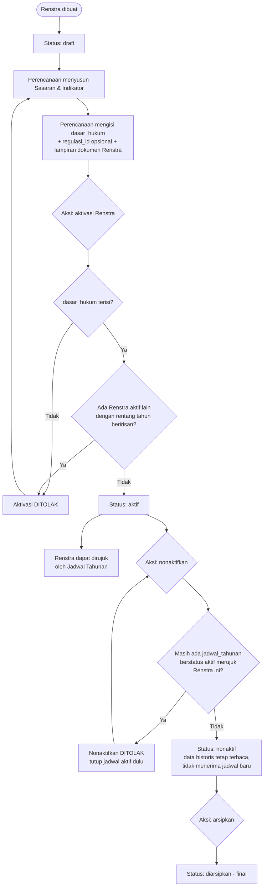

**Catatan kritis:** validasi pada node F dan H adalah gerbang kualitas terakhir sebelum data master berpotensi dibekukan ke `jadwal_snapshot` saat Jadwal Tahunan diaktifkan (§5). Guard pada node K2 mencegah Renstra menjadi nonaktif selagi masih ada jadwal operasional yang bergantung padanya — jadwal harus ditutup lebih dulu lewat alur §13. Kesalahan yang lolos di titik ini jauh lebih mahal untuk dikoreksi setelah snapshot terbentuk, apalagi setelah rencana aksi dan pengukuran menumpuk di atasnya. Validasi aktivasi Renstra **tidak** mensyaratkan `regulasi_id` maupun lampiran dokumen — keduanya bersifat pelengkap penelusuran, sedangkan `dasar_hukum` tetap satu-satunya syarat tekstual yang bergerbang keras di sini.

---

## 3. Alur Dokumen Dasar: Regulasi, Lampiran Renstra & Perjanjian Kinerja

Dokumen dasar adalah produk hukum (Kepmen/Permen/Perpres/keputusan lainnya) yang menjadi acuan penyusunan Renstra maupun penetapan indikator kinerja. Entitas `regulasi` menyimpan dasar aturan itu secara terstruktur dan dapat dirujuk berulang dari `renstra` (`renstra.regulasi_id`) maupun `indikator` (`indikator.regulasi_id`), tanpa perlu mengunggah dokumen yang sama berulang kali. Halaman "Dasar Aturan" menjadi tempat CRUD `regulasi` beserta lampirannya; halaman Renstra dan halaman Perjanjian Kinerja masing-masing menampilkan lampiran dokumennya sendiri.

### 3.1 Entitas `regulasi` dan wewenang

Substansi dasar aturan (jenis produk hukum, nomor, tahun, tentang, tanggal, tautan sumber resmi) adalah wewenang **Perencanaan** dan **Superadmin** lewat permission granular `regulasi:create`/`regulasi:read`/`regulasi:update`/`regulasi:delete` (`update` dan `delete` bertanda `sensitif = true`). Seluruh peran lain (**Admin**, **Pimpinan**, **Pegawai/PIC**) memegang `regulasi:read` saja — dasar aturan tampil di halaman Renstra dan indikator agar konteksnya terbaca tanpa memberi wewenang substantif kepada Admin.

```
📋 Perencanaan / ⚙️ Superadmin (permission regulasi:create/read/update/delete)
  1. Membuka halaman "Dasar Aturan"
  2. Mencatat regulasi baru: jenis (kepmen/permen/perpres/keputusan_lainnya), nomor, tahun,
     tentang, tanggal (opsional), tautan_sumber (opsional — JDIH/laman kementerian), catatan
     → Kombinasi (jenis, nomor, tahun) harus unik — percobaan duplikat DITOLAK
  3. Melampirkan dokumen regulasi (mode file/tautan/teks, sama seperti bukti dukung tiga mode
     lain — lihat §10) sebagai bukti fisik/tautan resmi produk hukum tsb
  4. Menyimpan → regulasi berstatus aktif = true (default)

👤 Seluruh peran (permission regulasi:read)
  5. Membaca daftar regulasi dan lampirannya dari halaman "Dasar Aturan", halaman Renstra
     (bila renstra.regulasi_id terisi), maupun halaman Indikator (bila indikator.regulasi_id
     terisi)

📋 Perencanaan / ⚙️ Superadmin
  6. Mengubah/menonaktifkan regulasi (regulasi:update, sensitif — dasar_izin tercatat)
     → Menghapus regulasi yang masih dirujuk Renstra atau indikator aktif DITOLAK
       (regulasi:delete, sensitif) — lepaskan rujukan terlebih dahulu
  7. Lampiran regulasi tidak dapat dihapus selama regulasi masih dirujuk Renstra atau
     indikator aktif (lihat §10.6 untuk aturan imutabilitas per induk lampiran)
```

### 3.2 Rujukan regulasi dari Renstra dan Indikator

```
📋 Perencanaan
  1. Saat menyusun/mengedit Renstra: memilih regulasi_id (opsional) sebagai rujukan
     terstruktur ke dasar aturan, DI SAMPING mengisi dasar_hukum (ringkasan teks, tetap wajib
     sebelum aktivasi — §2)
  2. Saat menyusun/mengedit Indikator: memilih regulasi_id (opsional) sebagai dasar aturan per
     indikator (mis. produk hukum yang menetapkan IKU tersebut) — memungkinkan penelusuran
     dasar hukum per indikator tanpa mengunggah dokumen yang sama berulang

👤 Seluruh peran
  3. Halaman Renstra menampilkan: lampiran dokumen Renstra, rujukan regulasi (bila ada, lengkap
     dengan jenis/nomor/tahun/tentang), dan ringkasan dasar_hukum berdampingan
  4. Halaman Perjanjian Kinerja menampilkan: lampiran dokumen PK beserta nomor_pk dan
     tanggal_pk (lihat §3.3)
```

### 3.3 Lampiran dokumen Perjanjian Kinerja (gerbang keempat aktivasi jadwal)

```
📋 Perencanaan
  1. Mencatat renstra_pk tahun berjalan: nomor_pk, tanggal_pk (§2)
  2. Melampirkan dokumen Perjanjian Kinerja pada renstra_pk tsb (mode file/tautan/teks, minimal
     satu lampiran) — halaman Perjanjian Kinerja menampilkan lampiran ini beserta nomor_pk/
     tanggal_pk

⚙️ Sistem (gerbang keempat aktivasi Jadwal Tahunan — lihat §5)
  3. Aktivasi jadwal:aktivasi kini mensyaratkan EMPAT gerbang, bukan tiga:
     Gerbang 1 — renstra_pk tahun tsb tercatat
     Gerbang 2 — seluruh indikator aktif punya target_tahunan tahun tsb
     Gerbang 3 — tahun jadwal dalam rentang Renstra
     Gerbang 4 (BARU) — renstra_pk tahun tsb memiliki MINIMAL SATU lampiran dokumen
     → Keempat gerbang harus lolos sebelum Jadwal Tahunan dapat AKTIF
  4. Mode lampiran PK bersifat bebas (file/tautan/teks) sehingga gerbang 4 TIDAK memacetkan
     alur — Perencanaan dapat memenuhi lewat tautan atau keterangan teks bila unggahan file
     tidak praktis
     → Bila unggahan file sedang DIMATIKAN pada setelan aplikasi (berkas.unggahan_aktif =
       false, §18) SEMENTARA belum ada lampiran PK bermode tautan/teks, persyaratan ini
       ditandai tidak_dapat_dipenuhi — gerbang 4 dianggap terpenuhi secara administratif,
       tercatat audit_log, dan tampil di halaman kerja Perencanaan (pengecualian khusus PK, berbeda dari
       waiver per mode untuk persyaratan bertahap, §10.5)
```

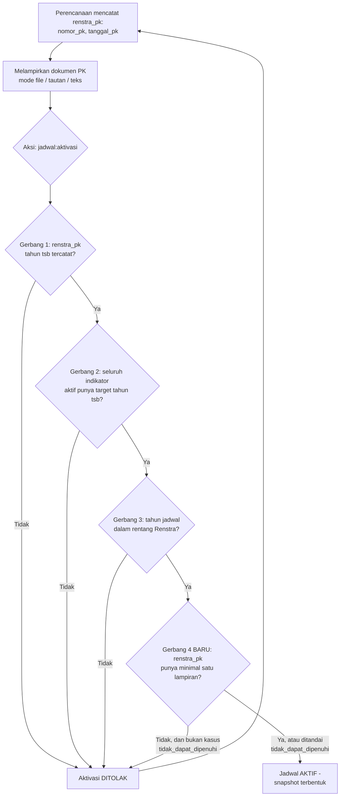

**Mengapa gerbang keempat ditambahkan:** dokumen Perjanjian Kinerja adalah bukti formal legalitas target tahunan yang dibekukan ke snapshot — menyamakan perlakuannya dengan gerbang bukti dukung lain (rencana aksi, pengukuran, kegiatan) memastikan Jadwal Tahunan hanya aktif ketika dasar formalnya terdokumentasi, tanpa mengorbankan fleksibilitas mode maupun risiko memacetkan alur operasional (lihat §10.5 untuk mekanisme anti-macet dan pengecualian khusus PK).

---

## 4. Struktur Periode & Jadwal (`jadwal_periode`, jendela rencana aksi)

Jendela waktu pengisian dan reviu tidak lagi melekat pada `jadwal_tahunan` secara langsung, melainkan pada tabel pivot `jadwal_periode` yang menghubungkan satu Jadwal Tahunan dengan tiap Periode yang diharapkan pada tahun itu. Susunan ini memungkinkan setiap periode (mis. Triwulan I, II, III, IV) memiliki jendela pengisian dan reviu masing-masing, alih-alih satu jendela tunggal untuk seluruh tahun. `jadwal_tahunan` sendiri kini juga membawa jendela tingkat tahun untuk penyusunan rencana aksi.

```
periode (master global)          jadwal_tahunan (payung tahun)
  - nama                            - renstra_id, tahun
  - urutan                          - penutupan (pembekuan akhir tahun)
  - aktif                           - status: draft / aktif / ditutup
  - is_nilai_akhir                  - renstra_pk_id, activated_at, closed_at
                                     - rencana_aksi_mulai, rencana_aksi_selesai (nullable)

              \                          /
               \                        /
                v                      v
                     jadwal_periode
                (jadwal_id, periode_id)
                - pengisian_mulai / pengisian_selesai
                - reviu_mulai / reviu_selesai
```

```
📋 Perencanaan
  1. Membuat Jadwal Tahunan (draft): pilih Renstra, tahun, tanggal penutupan
  2. Untuk tahun tsb, memilih periode-periode mana yang diharapkan (mis. Triwulan I–IV dari
     master periode aktif) dan mengisi jendela pengisian_mulai/selesai serta reviu_mulai/selesai
     untuk masing-masing periode → tersimpan sebagai baris jadwal_periode
  3. Sistem memvalidasi urutan tanggal logis per baris: pengisian_mulai ≤ pengisian_selesai ≤
     reviu_mulai ≤ reviu_selesai
  4. Mengisi jendela rencana_aksi_mulai / rencana_aksi_selesai pada jadwal_tahunan — jendela ini
     berada pada tingkat tahun (bukan per periode), karena rencana aksi disusun sekali per
     indikator × tahun, bukan per periode (§7)
  5. Jadwal Tahunan siap diaktifkan (lanjut ke alur §5)
```

**Aturan penting:**
- Jendela RA normal harus terisi dan berurutan `rencana_aksi_mulai ≤ rencana_aksi_selesai < pengisian_mulai` periode pertama. Ini validasi keras untuk jadwal normal; pengecualian terbatas adalah backfill, revisi resmi, atau indikator baru dengan alasan dan scope eksplisit (§13–§15).
- Reviu Perencanaan boleh berlangsung sampai penutupan tahunan atau dalam sesi koreksi resmi. Lewat `reviu_selesai` diberi penanda **terlambat**, tidak otomatis menolak verifikasi/pengesahan; `reviu_mulai` tetap awal jendela normal.
- Kolom `pengisian_mulai`, `pengisian_selesai`, `reviu_mulai`, `reviu_selesai` **tidak lagi ada** pada `jadwal_tahunan` — seluruhnya berpindah ke `jadwal_periode`, satu baris per periode yang diharapkan.
- Kolom baru `rencana_aksi_mulai`, `rencana_aksi_selesai` (date, nullable) hidup di `jadwal_tahunan`, bukan di `jadwal_periode` — rencana aksi disusun sekali per (indikator × tahun), sehingga jendelanya adalah jendela tingkat tahun, bukan per periode.
- `jadwal_tahunan.penutupan` **tetap ada** dan berlaku sebagai pembekuan akhir di tingkat tahun, terpisah dari jendela per periode maupun jendela rencana aksi — lihat §11 dan §13 untuk perannya dalam batas akses Perencanaan.
- Pola batas waktu jendela rencana aksi mengikuti pola pengukuran: **deadline efektif mengikat PIC**, dengan perubahan hanya melalui pembukaan resmi beralasan (§13); **Perencanaan dikecualikan** (permission `rencana_aksi:create`/`update`/`ajukan` bersifat global tanpa scope unit, dibatasi penutupan atau sesi koreksi resmi §13).
- Periode `is_nilai_akhir = true` (mis. Tahunan) menerima input tersendiri oleh aktor berwenang: komponen untuk indikator nonmanual lalu dihitung menurut snapshot, atau nilai final langsung untuk tipe manual. Tidak ada agregasi otomatis lintas periode. Pengecualian skor akhir tanpa komponen hanya melalui backfill historis resmi (§15).

---

## 5. Alur Aktivasi Jadwal & Pembentukan Snapshot

```
📋 Perencanaan
  1. Membuat Jadwal Tahunan baru untuk Renstra X, Tahun Y → Status: draft
  2. Menyusun jadwal_periode (§4)
  3. Mengisi jendela rencana_aksi_mulai/rencana_aksi_selesai (§4)
  4. Menjalankan aksi aktivasi jadwal (jadwal:aktivasi)
     → Sistem menjalankan EMPAT gerbang validasi secara berurutan:
       Gerbang 1 — renstra_pk untuk (Renstra X, Tahun Y) sudah tercatat?
         Belum: Aktivasi DITOLAK, kembali lengkapi PK
       Gerbang 2 — seluruh indikator aktif milik Renstra X memiliki target_tahunan Tahun Y?
         Ada yang belum: Aktivasi DITOLAK, kembali lengkapi target
       Gerbang 3 — Tahun Y berada dalam rentang [tahun_mulai, tahun_akhir] Renstra X?
         Tidak: Aktivasi DITOLAK, kembali koreksi tahun jadwal atau rentang Renstra
       Gerbang 4 (BARU, §3.3) — renstra_pk untuk (Renstra X, Tahun Y) memiliki MINIMAL SATU
       lampiran dokumen (mode file/tautan/teks)?
         Belum, dan bukan kasus tidak_dapat_dipenuhi: Aktivasi DITOLAK, kembali lampirkan
         dokumen PK
         Sudah, atau ditandai tidak_dapat_dipenuhi (unggahan file sedang dimatikan pada
         setelan aplikasi, §18): lanjut
     → Seluruh gerbang lolos: lanjut ke langkah 5

⚙️ Sistem (otomatis begitu aktivasi lolos validasi)
  5. Mengubah Jadwal Tahunan → Status: aktif, terhubung ke renstra_pk_id, activated_at tercatat
  6. Mengambil seluruh indikator aktif milik Renstra X (melalui Sasaran)
  7. Untuk tiap indikator, memeriksa apakah baris jadwal_snapshot untuk pasangan
     (jadwal_id, indikator_id) ini sudah ada
     → Sudah ada: dilewati (tidak ditimpa) — pembuatan snapshot bersifat idempoten
     → Belum ada: mengambil target_tahunan tahun Y lalu menyalin nama, definisi, satuan,
       presisi, desimal_tampilan, unit_id, arah, tipe_perhitungan, baseline, dan target ke
       jadwal_snapshot baru
  8. Untuk indikator bertipe rasio_persen/penjumlahan (memiliki indikator_komponen aktif),
     menyalin seluruh definisi komponen (kode, label, peran, bobot, urutan) ke tabel anak
     jadwal_snapshot_komponen, satu baris per komponen aktif pada saat aktivasi
  9. Mencatat audit_log pembuatan snapshot dengan actor_id = Perencanaan yang menjalankan
     aktivasi (jejak menempel pada aksi manusianya, bukan pada proses sistem)

📋 Perencanaan
  10. Menerima konfirmasi: Jadwal AKTIF, snapshot (termasuk snapshot komponen) sudah terbentuk
      dan bisa diverifikasi lewat query
      (Fase Lanjutan, belum dibangun: jika pakai_persetujuan_pimpinan=true, akan ada jendela
      persetujuan_mulai–persetujuan_selesai tambahan setelah reviu, sebelum jadwal benar-benar
      aktif)
```

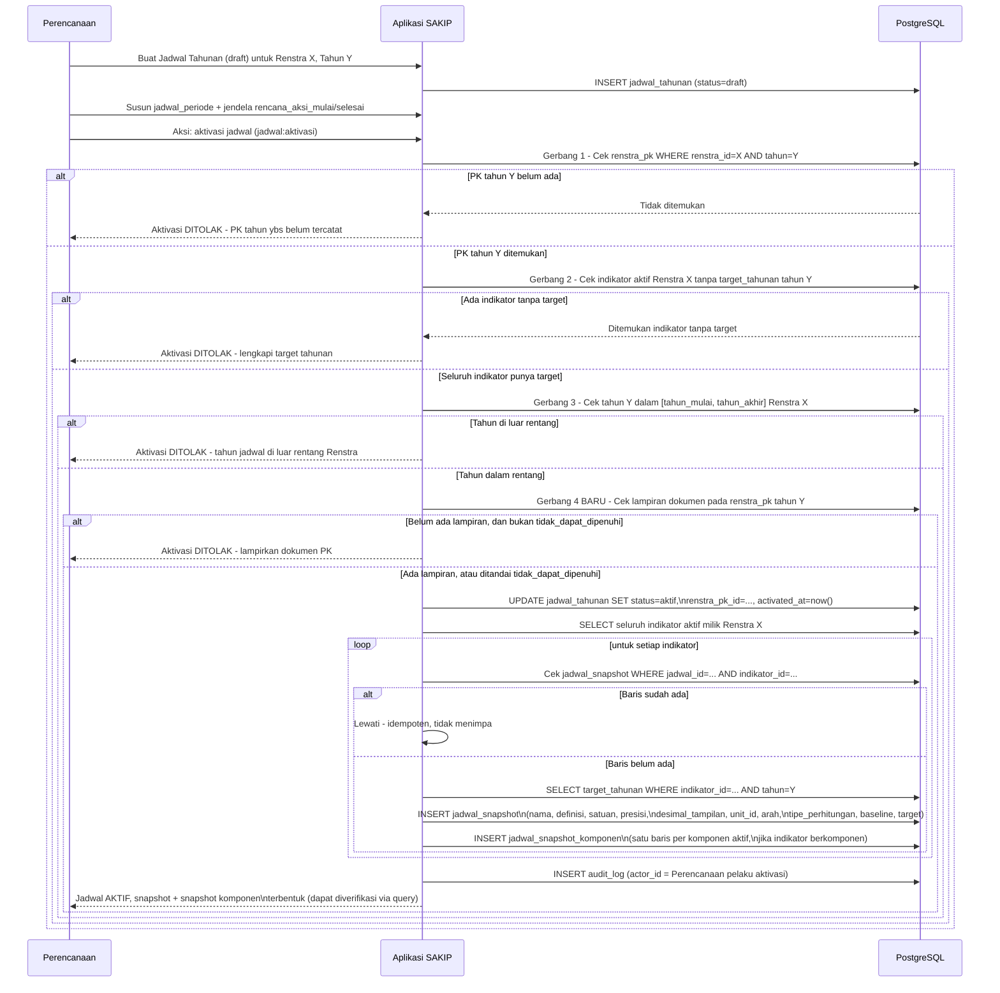

**Fase Lanjutan (belum dibangun):** jika `pakai_persetujuan_pimpinan = true` di masa depan, diagram ini akan bercabang tambahan untuk membuka jendela `persetujuan_mulai`–`persetujuan_selesai` setelah reviu. Detail cabang itu tidak digambarkan di sini karena berada di luar cakupan MVP.

**Gerbang keempat tidak memacetkan alur:** karena lampiran dokumen PK boleh dipenuhi lewat mode file/tautan/teks (§3.3, §10), gerbang 4 tidak pernah menjadi penghalang keras yang tidak dapat diatasi — bila unggahan file dimatikan pada setelan aplikasi dan belum ada lampiran mode lain, sistem menandai persyaratan `tidak_dapat_dipenuhi` dan tetap meloloskan gerbang secara administratif, sesuai pengecualian khusus lampiran PK; persyaratan bertahap memakai pengecualian per mode (§10.5).

**Sifat idempoten dan imutabilitas snapshot:** aktivasi/buka kembali hanya membuat snapshot awal untuk pasangan jadwal–indikator yang belum memilikinya; versi yang sudah ada tidak ditimpa. Snapshot beserta komponennya yang sudah dirujuk rencana aksi atau pengukuran tetap imutabel. Koreksi salah input yang terbukti dari dokumen resmi, terutama target PK yang sudah digunakan, dilakukan dengan **versi snapshot baru** (`nomor_versi`, `menggantikan_id`) oleh Perencanaan berizin `target:update`, disertai alasan dan rujukan PK resmi. Ini bukan jalur bebas mengganti formula/kebijakan indikator atau menulis ulang histori; perubahan substansi memerlukan keputusan produk yang sesuai. Versi baru memiliki `periode_mulai_id` yang eksplisit. Pengajuan baru memakai versi efektif yang sesuai, sedangkan laporan/pengukuran yang telah disahkan tetap merujuk versi lama sampai koreksi dan pengesahan ulang dilakukan secara eksplisit. Perubahan master tidak mengubah histori secara otomatis. Snapshot yang belum dirujuk boleh dikoreksi pada jadwal aktif dengan audit.

---

## 6. Alur Komponen Indikator & Mesin Perhitungan

Perhitungan nilai indikator bersifat **data-driven**, bukan hardcode per indikator. Kolom baru `indikator.tipe_perhitungan` enum(`rasio_persen`, `penjumlahan`, `manual`) menentukan bagaimana nilai indikator diturunkan dari komponen-komponennya.

```
📋 Perencanaan (permission komponen:create/update)
  1. Menetapkan indikator.tipe_perhitungan saat membuat/mengubah indikator:
     a. rasio_persen — nilai = (Σ(komponen pembilang_i × bobot_i) ÷ (komponen penyebut × bobot))
        × 100. Menutup varian multi-suku seperti (a + b) / t × 100 maupun berbobot Σ(n_i × k_i) / t × 100
     b. penjumlahan — nilai = Σ(komponen penjumlah_i × bobot_i), mis. jumlah dosen naik jabatan
        fungsional (Lektor + Lektor Kepala + Guru Besar)
     c. manual — nilai diketik langsung, komponen tidak wajib (perilaku lama tetap berlaku)
  2. Untuk tipe rasio_persen/penjumlahan, mendefinisikan baris indikator_komponen: kode, label,
     peran (pembilang/penyebut/penjumlah), bobot, urutan, satuan
     → Validasi definisi: rasio_persen wajib punya ≥1 komponen pembilang aktif dan tepat 1
       komponen penyebut aktif; penjumlahan wajib punya ≥1 komponen penjumlah aktif — penyimpanan
       ditolak bila tidak terpenuhi
  3. Indikator siap dirujuk pengukuran; definisi komponen ikut dibekukan ke jadwal_snapshot_komponen
     saat jadwal diaktifkan (§5)

🎯 Penanggung Jawab (saat pengisian rencana aksi §7 atau pengukuran §11)
  4. Mengisi nilai tiap komponen aktif (pengukuran_komponen.nilai atau rencana_aksi_target.nilai)
  5. Sistem menghitung nilai turunan sesuai tipe_perhitungan:
     → Pembagian dengan penyebut 0: nilai TIDAK DAPAT DIHITUNG (disimpan null, ditampilkan
       sebagai "tidak dapat dihitung") — bukan 0, bukan galat sistem
     → Penyebut 0 faktual dengan seluruh input lengkap boleh diajukan/disahkan dengan alasan;
       status_perhitungan = tidak_dapat_dihitung, berbeda dari belum_diisi akibat input kosong
     → Nilai dibulatkan sesuai snapshot presisi, ditampilkan sesuai snapshot desimal_tampilan
  6. Untuk tipe manual, pengukuran.nilai tetap diketik langsung (kolom sumber_nilai = manual);
     untuk tipe rasio_persen/penjumlahan, pengukuran.nilai menjadi READ-ONLY di UI, terisi
     otomatis dari mesin perhitungan (sumber_nilai = komponen)

📋 Perencanaan (permission komponen:update/delete)
  7. Sewaktu-waktu dapat menambah/mengubah/menonaktifkan definisi komponen (mis. saat Kepmen IKU
     berubah), tanpa penyesuaian kode — setiap perubahan tercatat audit_log (nilai_lama/nilai_baru)
```

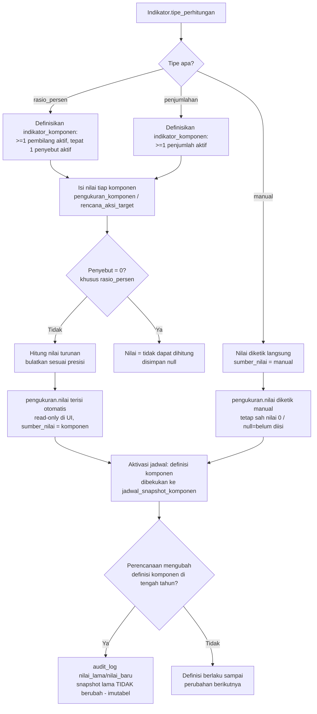

**Batas mesin dan IKU 3:** mesin mendukung satu tingkat rasio atau penjumlahan berbobot; mesin formula bertingkat generik tetap di luar MVP. IKU 3 memakai `penjumlahan` dengan lima input: `perencanaan_kinerja`, `pengukuran_kinerja`, `pelaporan_kinerja`, `evaluasi_internal`, dan `zi`, masing-masing bobot `0,5`. Rumusnya `0,5 × (P + U + L + E + ZI)`, bukan rata-rata kelima input. UI menampilkan subtotal SAKIP `P + U + L + E`; empat subskor sudah berupa nilai berbobot sehingga tidak dikalikan lagi dengan 30/30/15/25. Contoh workbook: `23 + 24 + 11,5 + 19 = 77,5`, lalu `(77,5 + 75)/2 = 76,25`. Contoh TW II memberi subtotal `79,75` dan IKU `66,395`. Angka contoh bukan pengesahan target/baseline resmi; baseline `74,2` yang hanya SAKIP dan interpretasi target TW II masih perlu konfirmasi Tim Perencanaan. Definisi penyebut IKU 8 juga tetap memerlukan konfirmasi, bukan mengambil angka `84` sebagai aturan.

**Gerbang kelengkapan komponen:** pengajuan pengukuran ditolak bila ada komponen pada snapshot yang nilainya masih `null` (lihat §11, §12) — di samping aturan catatan wajib berbasis `arah` dan `wajib_catatan` yang tetap berlaku, kini dibandingkan pada nilai turunan.

---

## 7. Alur Penyusunan & Pengesahan Rencana Aksi

Rencana aksi adalah tahap yang disisipkan setelah penugasan Penanggung Jawab dan sebelum penyusunan kegiatan maupun pengisian pengukuran. Rencana aksi memiliki satu header per **indikator × tahun** dengan versi pengajuan/pengesahan yang dipertahankan. Target per periode berisi satu nilai langsung untuk indikator `manual` (`komponen_id = null`), atau nilai tiap komponen untuk indikator nonmanual; tidak membuat komponen semu.

```
🎯 Penanggung Jawab (PIC rencana aksi = PIC indikator yang berlaku, akses di-scope per unit)
  1. Membuka form Rencana Aksi untuk indikator × tahun miliknya, dalam jendela
     rencana_aksi_mulai–rencana_aksi_selesai (dari jadwal_tahunan, §4) → Status: draft
  2. Mengisi rencana_aksi_target pada setiap periode yang berlaku: tipe manual menerima satu
     nilai target langsung (komponen_id = null); tipe nonmanual menerima nilai setiap komponen
     snapshot (mis. n = jumlah responden puas, t = total layanan), bukan skor final
  3. Sistem menampilkan target langsung untuk tipe manual; untuk nonmanual, menampilkan
     perkiraan skor turunan dari komponen (§6), bukan input skor tambahan
     → Target triwulan bersifat KUMULATIF: nilai periode berjalan mencakup periode sebelumnya
       (mis. target Triwulan II = capaian Januari–Juni)
     → Nilai suatu periode lebih kecil dari periode sebelumnya: sistem menampilkan PERINGATAN
       (tidak memblokir penyimpanan draft)
  4. Melengkapi bukti dukung wajib bertahap rencana_aksi (jenis_berkas.tahap = rencana_aksi)
     yang berlaku untuk indikator ini — memilih mode yang diizinkan (unggah file, isi tautan,
     tulis keterangan teks, atau kombinasi bila semua_mode_wajib = true)

🎯 Penanggung Jawab
  5. Mengajukan Rencana Aksi → Status: diajukan
     → GERBANG: target manual kosong atau ada komponen snapshot tanpa target pada periode
       yang berlaku bagi indikator → pengajuan DITOLAK; periode sebelum mulai berlaku = N/A
     → GERBANG: bukti dukung wajib tahap rencana_aksi belum lengkap (menurut mode yang dipilih
       dan aturan semua_mode_wajib) → pengajuan DITOLAK
     → PERINGATAN + ALASAN WAJIB: skor target periode terakhir tidak setara dengan
       target PK tahunan indikator ini — target tahunan tetap hanya dapat diubah lewat revisi PK
       resmi (§9); deviasi wajib terlihat dan tercatat, bukan disesuaikan diam-diam
     → Deadline rencana_aksi_selesai mengikat PIC; pengecualian hanya melalui pembukaan
       resmi beralasan, scope, dan tenggat baru (§13), bukan toleransi otomatis

📋 Perencanaan (akses rencana_aksi:create/update/ajukan bersifat GLOBAL, tanpa scope unit;
                dikecualikan dari batas jendela, tunduk penutupan/sesi koreksi resmi §13)
  6. Memverifikasi Rencana Aksi yang diajukan
     → Ditolak, perlu revisi: Status: dikembalikan + alasan wajib diisi, kembali ke Penanggung
       Jawab (langkah 1–4)
     → Disetujui teknis: Status: diverifikasi
  7. Mengesahkan Rencana Aksi yang diverifikasi → Status: disahkan

📋 Perencanaan / ⚙️ Superadmin
  8. Untuk Rencana Aksi yang sudah disahkan, masih dapat dibuka-kembali
     (permission rencana_aksi:buka_kembali) menjadi dikembalikan, dengan alasan wajib, sebelum penutupan atau dalam sesi koreksi resmi (§13) — lihat §13

⚙️ Sistem
  9. Gerbang keras di tahap pengukuran (§11): pengajuan pengukuran untuk periode P pada
     indikator I DITOLAK selama rencana_aksi (I × tahun) belum berstatus disahkan
```

```mermaid
stateDiagram-v2
    [*] --> draft: rencana_aksi:create\n(PIC: grant unit + PIC aktif + jendela resmi;\nPerencanaan: global, sampai penutupan\natau sesi koreksi resmi)
    draft --> draft: rencana_aksi:update\n(isi target manual atau komponen per periode;\nlengkapi bukti dukung mode file/tautan/teks)
    draft --> diajukan: rencana_aksi:ajukan\n(gerbang: target manual/komponen lengkap\npada periode berlaku;\nbukti dukung wajib tahap rencana_aksi lengkap;\nperingatan+alasan bila skor target akhir tak setara target PK)
    diajukan --> diverifikasi: rencana_aksi:verifikasi (Perencanaan, F1/F2 §20)
    diajukan --> dikembalikan: rencana_aksi:kembalikan (Perencanaan, alasan wajib)
    diverifikasi --> dikembalikan: rencana_aksi:kembalikan (Perencanaan, alasan wajib)
    diverifikasi --> disahkan: rencana_aksi:sahkan (Perencanaan, F1/F2 §20)
    dikembalikan --> draft: penanggung jawab/Perencanaan merevisi
    disahkan --> dikembalikan: rencana_aksi:buka_kembali\n(Perencanaan/Superadmin, alasan wajib,\nsebelum penutupan atau sesi koreksi resmi §13)
    disahkan --> [*]: gerbang pengukuran terbuka -\npengukuran indikator ini dapat diajukan (§11)

    note right of disahkan
        Begitu status = disahkan, gerbang keras
        pada pengajuan pengukuran (§11) terbuka
        untuk indikator x tahun ini. Sebelum
        disahkan, pengajuan pengukuran DITOLAK.
    end note
```

**Rekonsiliasi dengan PK tahunan:** skor target periode terakhir seharusnya setara dengan target PK tahunan indikator. Bila tidak setara, sistem menampilkan peringatan dan mewajibkan alasan pada saat pengajuan — bukan memblokir — karena target tahunan tetap hanya dapat diubah lewat revisi PK resmi (asumsi operasional §9), sementara target komponen per periode pada rencana aksi memang dapat direvisi lewat `rencana_aksi:buka_kembali` (alasan wajib, ter-audit).

**Versi pengajuan:** setiap pengajuan membentuk `rencana_aksi_versi` dengan nomor versi, pengaju, waktu, jalur pengajuan, dasar izin, dan snapshot target/persyaratan/bukti yang dibekukan. Pengembalian memungkinkan perbaikan draft, lalu pengajuan berikutnya membuat versi baru. Pengesahan merujuk versi yang diperiksa, bukan isi draft hidup. Buka kembali tidak menimpa versi sah lama.

**Penugasan PIC rencana aksi:** PIC rencana aksi = PIC indikator yang ditunjuk Perencanaan lewat `penanggung_jawab` (§ Alur Penugasan) — tidak ada penugasan terpisah. Bila PIC indikator berganti di tengah tahun, `rencana_aksi.penanggung_jawab_id` mencatat PIC yang berlaku saat penyusunan (jejak historis), sementara hak pengisian tetap mengikuti `penanggung_jawab` yang berlaku saat itu.

---

## 8. Alur Kegiatan per Periode, Bukti Pelaksanaan & Geser Periode

Kegiatan disusun per **periode** dan terikat tahun; kegiatan milik satu `unit` (unit pemilik indikator/unit pelaksana), dan **tidak** dimiliki oleh satu rencana aksi/indikator tunggal — hubungannya ke rencana aksi dibuat lewat klaim (§9). Sejak persyaratan bukti dukung diperluas ke tahap `kegiatan` (§10), transisi status kegiatan dari `rencana` menjadi `terlaksana` tunduk pada **gerbang kelengkapan bukti dukung** — sementara transisi ke status gagal (`tidak_terlaksana`/`ditunda`/`batal`) tetap hanya membutuhkan `justifikasi`, tanpa bukti pelaksanaan apa pun.

```
🎯 Penanggung Jawab (unit pelaksana) / 📋 Perencanaan (global)
  1. Membuat Kegiatan untuk suatu periode (periode RENCANA pelaksanaan): nama, tujuan, sasaran
     peserta, keterangan peserta, lokasi, tanggal_rencana → Status: rencana
     Anggaran tidak ditampilkan, diinput, atau divalidasi pada MVP; kolom hanya cadangan skema
  2. Menjalankan/melaksanakan kegiatan sesuai rencana
  3. Setelah masa pelaksanaan, memperbarui kegiatan sesuai hasilnya:
     a. Terlaksana sesuai rencana:
        i.  Mengisi tanggal_realisasi, realisasi_peserta, uraian_pelaksanaan, kendala,
            strategi_tindaklanjut
        ii. Melengkapi bukti dukung wajib bertahap kegiatan (jenis_berkas.tahap = kegiatan yang
            berlaku untuk indikator/unit terkait — mis. daftar hadir, laporan pelaksanaan,
            dokumentasi), memilih mode yang diizinkan: unggah file, isi tautan, tulis keterangan
            teks, atau kombinasi bila semua_mode_wajib = true
        iii. Mengajukan transisi Status → terlaksana
             → GERBANG: ada bukti dukung wajib bertahap kegiatan yang belum terpenuhi (menurut
               mode yang dipilih dan aturan semua_mode_wajib) → transisi DITOLAK, kembali ke (ii)
             → Seluruh bukti dukung wajib terpenuhi → Status: terlaksana
     b. Tidak terlaksana / ditunda / dibatalkan: Status → tidak_terlaksana / ditunda / batal,
        WAJIB mengisi justifikasi — TIDAK memerlukan bukti dukung pelaksanaan apa pun, karena
        kegiatan yang gagal justru tidak memiliki dokumen pertanggungjawaban pelaksanaan —
        kegiatan TIDAK DIHAPUS
  4. Bila kegiatan yang tidak terlaksana/ditunda hendak dilaksanakan pada periode berikutnya:
     membuat BARIS KEGIATAN BARU pada periode tujuan, dengan kegiatan_asal_id menunjuk ke
     kegiatan asal
     → Konsekuensi yang disadari: kegiatan yang sama tampil di dua periode (periode asal +
       periode tujuan) — keduanya sah, dibedakan status dan tautan kegiatan_asal_id

🎯 Penanggung Jawab / 📋 Perencanaan
  5. Kegiatan dapat diperbarui (status, realisasi, narasi, bukti dukung) selama jadwal_tahunan
     belum penutupan; setelah penutupan hanya lewat jadwal:buka_kembali
  6. Kegiatan berstatus batal/tidak_terlaksana TETAP BOLEH DIKLAIM (§9) — bukti mengapa
     komponen tidak bergerak sesuai rencana; statusnya ikut tampil di rekapitulasi

⚙️ Sistem (anti-macet)
  7. Bila persyaratan bukti dukung tahap kegiatan yang wajib hanya mengizinkan mode file,
     sementara unggahan file sedang dinonaktifkan pada setelan aplikasi (§18), persyaratan itu
     ditandai tidak_dapat_dipenuhi — TIDAK memblokir transisi ke terlaksana, tercatat
     audit_log, dan tampil di rekapitulasi serta halaman kerja Perencanaan (lihat §10)
```

```mermaid
stateDiagram-v2
    [*] --> rencana: kegiatan:create\n(unit_id pemilik, periode rencana pelaksanaan)
    rencana --> terlaksana: update status\n(tanggal_realisasi, realisasi_peserta,\nuraian_pelaksanaan, kendala, strategi_tindaklanjut;\nGERBANG: bukti dukung wajib tahap kegiatan lengkap)
    rencana --> tidak_terlaksana: update status\n(justifikasi WAJIB, tanpa bukti dukung)
    rencana --> ditunda: update status\n(justifikasi WAJIB, tanpa bukti dukung)
    rencana --> batal: update status\n(justifikasi WAJIB, tanpa bukti dukung)
    tidak_terlaksana --> [*]: kegiatan tetap ada,\ntetap dapat diklaim (§9)
    ditunda --> [*]: dapat digeser ke\nperiode berikutnya
    batal --> [*]: kegiatan tetap ada,\ntetap dapat diklaim (§9)
    terlaksana --> [*]: siap diklaim ke\nrencana aksi (§9)

    ditunda --> KegiatanBaru: geser periode -\nbuat baris baru pada\nperiode tujuan
    state KegiatanBaru {
        [*] --> rencana2: kegiatan_asal_id ->\nkegiatan asal (ditunda)
        rencana2 --> [*]
    }

    note right of terlaksana
        Gerbang kelengkapan bukti dukung (§10)
        berlaku KHUSUS pada transisi menuju
        terlaksana. Transisi ke tidak_terlaksana/
        ditunda/batal tidak pernah digerbangi
        bukti dukung - hanya justifikasi.
    end note
```

**Narasi per kegiatan:** kolom `uraian_pelaksanaan`, `kendala`, `strategi_tindaklanjut` diisi per kegiatan, bukan diketik ulang sebagai satu blok panjang di level indikator. Kolom "Progress Kegiatan / Kendala dan Masalah / Strategi tindaklanjut" pada rekapitulasi indikator × periode **dihasilkan otomatis** dari daftar kegiatan yang diklaim pada rencana aksi indikator itu (§9, §17.1); laporan resmi memakai narasi yang dibekukan pada versi pengajuan yang disahkan.

**Validasi kepemilikan unit:** kegiatan bersifat kolaboratif dalam unit: pemegang permission kegiatan dengan grant unit yang cocok dapat mengelolanya, tidak harus PIC indikator tertentu. Perencanaan memakai jalur global. Mutasi rencana aksi/pengukuran pada jalur PIC tetap mensyaratkan grant unit **dan** penugasan PIC indikator yang aktif.

**Mengapa gerbang hanya menyasar `terlaksana`:** kegiatan yang gagal (`tidak_terlaksana`/`ditunda`/`batal`) memang tidak memiliki dokumen pertanggungjawaban pelaksanaan untuk dilampirkan — mewajibkan bukti dukung pada transisi tersebut justru memaksa PIC membuat dokumen fiktif. Sebaliknya, `justifikasi` menjelaskan **mengapa** kegiatan gagal, sedangkan bukti dukung tahap kegiatan membuktikan **bahwa** kegiatan benar terlaksana — dua kebutuhan yang berbeda, digerbangi secara berbeda.

---

## 9. Alur Klaim Kegiatan

Klaim menyatakan **kegiatan mana yang mendukung rencana aksi/indikator dan berdampak pada komponen mana** — bukan mekanisme penghitungan otomatis.

```
🎯 Penanggung Jawab (unit yang sama dengan rencana aksi/kegiatan) / 📋 Perencanaan (global)
  1. Memilih kegiatan (miliknya sendiri atau kegiatan unit yang sama) untuk diklaim terhadap
     suatu Rencana Aksi
  2. Menentukan komponen yang terdampak (opsional — komponen_id nullable, kegiatan boleh
     diklaim sebagai pendukung rencana aksi tanpa menunjuk komponen tertentu) dan arah_dampak:
     menambah atau mengurangi
  3. Klaim dapat dibuat pada DUA titik siklus, dibedakan oleh sumber_klaim:
     a. Saat penyusunan Rencana Aksi (§7) → sumber_klaim = rencana_aksi
     b. Saat pengisian Pengukuran (§11) → sumber_klaim = pengukuran, pengukuran_id terisi
  4. Sistem menolak klaim bila kegiatan.unit_id berbeda dengan unit rencana aksi/indikator
     (validasi lintas unit)
  5. Sistem menolak klaim duplikat pada kombinasi (rencana_aksi_id, kegiatan_id, komponen_id)

⚙️ Sistem
  6. KLAIM TIDAK MENGUBAH NILAI KOMPONEN SECARA OTOMATIS — nilai komponen tetap diisi manual
     oleh PIC di layar pengukuran (§11). Fungsi klaim murni:
     a. Dokumentasi dukungan & arah dampak kegiatan terhadap komponen
     b. Bahan rekapitulasi otomatis (narasi kegiatan per indikator × periode, §17)
     c. Pengingat di layar pengisian — daftar kegiatan yang sudah diklaim untuk periode itu
        ditampilkan sebagai pembanding saat PIC mengisi angka komponen, membantu PIC menghindari
        lupa atau salah hitung, TANPA menjumlahkan otomatis (mencegah penghitungan ganda, mis.
        satu PTS yang hadir di tiga kegiatan tetap dihitung satu kali pada komponen "jumlah PTS
        yang menerima fasilitasi")

🎯 Penanggung Jawab (pembuat klaim) / 📋 Perencanaan
  7. Klaim sumber rencana_aksi dapat diubah/dihapus saat RA draft/dikembalikan; klaim sumber
     pengukuran mengikuti status pengukuran terkait (draft/dikembalikan), bukan status RA.
     Saat diajukan/diverifikasi/disahkan, klaim beku; koreksi melalui pengembalian/buka kembali
     dan versi pengajuan baru. Riwayat yang telah disahkan tetap utuh dan ter-audit.
  8. Klaim baru atas kegiatan terlaksana memeriksa tambahan persyaratan indikator yang diklaim.
     Bila belum lengkap, klaim belum dapat disimpan; status kegiatan tidak diturunkan.
```

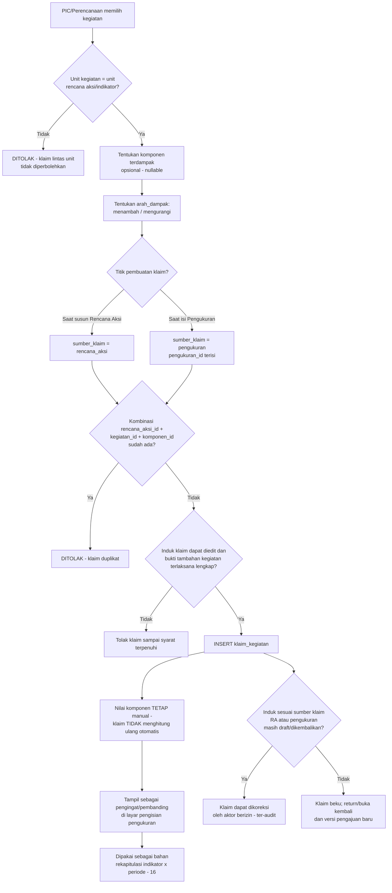

**Kegiatan berstatus batal/tidak_terlaksana tetap boleh diklaim** (§8) — kegiatan yang diklaim tapi gagal justru menjadi bukti mengapa komponen tidak bergerak sesuai rencana; statusnya ikut ditampilkan pada rekapitulasi (§17) sebagai bagian narasi kendala.

---

## 10. Alur Bukti Dukung: Persyaratan, Tiga Mode & Enam Induk Lampiran

Bukti dukung dikaitkan ke **enam induk** lewat kolom `berkas.berkasable_type`: tiga induk bergerbang persyaratan (`rencana_aksi`, `pengukuran`, `kegiatan` — dengan gerbang kelengkapan berbasis `jenis_berkas`) dan tiga induk dokumen dasar (`renstra`, `renstra_pk`, `regulasi` — lampiran bebas tanpa persyaratan `jenis_berkas`, kecuali gerbang keempat aktivasi jadwal khusus `renstra_pk`, §3.3/§5). Mode bukti (file/tautan/teks) dan seluruh aturan mode berlaku sama untuk keenam induk. Persyaratan bukti dukung bergerbang ditentukan Tim Perencanaan lewat tabel `jenis_berkas` (nama tabel dipertahankan meski kini mencakup lebih dari sekadar berkas fisik — UI memakai label "Bukti Dukung"), bukan hardcode. Substansi persyaratan (nama, tahap, mode yang diizinkan, wajib/opsional, `semua_mode_wajib`) adalah wewenang **Perencanaan** (`jenis_berkas:create/update/delete`); kebijakan teknis unggahan tingkat aplikasi (saklar unggahan, ukuran/format default) adalah wewenang **Admin dan Superadmin** (`pengaturan:update`, grup `berkas` — lihat §18). Kedua wewenang ini terpisah secara sengaja.

### 10.1 Tiga mode bukti dukung

Sistem mengenal tiga mode pemenuhan bukti dukung pada entitas `berkas`:

| Mode | Kolom terisi | Keterangan |
|---|---|---|
| `file` | `nama_asli`, `path`, `mime`, `ukuran_bytes` | Unggahan langsung ke disk VPS |
| `tautan` | `tautan` (varchar 2048, skema http/https) | URL ke dokumen yang disimpan di tempat lain |
| `teks` | `isi_teks` (text) | Keterangan tertulis langsung di sistem |

Satu persyaratan (`jenis_berkas`) dapat mengizinkan lebih dari satu mode sekaligus melalui kolom `izinkan_file`/`izinkan_tautan`/`izinkan_teks`; PIC memilih di antara mode yang diizinkan. Bila `semua_mode_wajib = true`, **seluruh** mode yang diizinkan harus terpenuhi; bila `false`, **minimal satu** mode terisi sudah dianggap memenuhi persyaratan. Satu persyaratan dapat dipenuhi oleh lebih dari satu baris `berkas` (mis. laporan sebagai file + dokumentasi sebagai tautan), terutama ketika `semua_mode_wajib = true`.

### 10.2 Alur penetapan persyaratan (Perencanaan)

```
📋 Perencanaan (permission jenis_berkas:create/update/delete)
  1. Mendefinisikan jenis_berkas: nama, tahap (rencana_aksi / pengukuran / kegiatan),
     indikator_id (nullable — null berarti berlaku untuk semua indikator)
  2. Mencentang mode yang diizinkan: izinkan_file, izinkan_tautan, izinkan_teks
     → Minimal satu mode harus dicentang — sistem menolak penyimpanan bila ketiganya kosong
  3. Menandai wajib/opsional (kolom wajib)
  4. Menentukan semua_mode_wajib:
     → true: seluruh mode yang dicentang pada langkah 2 harus terpenuhi PIC
     → false (default): minimal satu dari mode yang dicentang sudah cukup
  5. Bila izinkan_file = true, mengisi format_diizinkan dan ukuran_maks_kb (opsional — kosong
     berarti memakai nilai default dari setelan aplikasi grup berkas, §18)
  6. Menyimpan
     → PERINGATAN saat penyimpanan: bila wajib = true dan HANYA mode file yang diizinkan,
       sementara unggahan file sedang dinonaktifkan pada setelan aplikasi (berkas.unggahan_aktif
       = false, §18), sistem memperingatkan bahwa persyaratan ini berpotensi tidak dapat
       dipenuhi (lihat §10.4) — penyimpanan tetap diizinkan, peringatan bukan blokir
```

**Versi persyaratan:** perubahan substansi berlaku untuk pengajuan berikutnya. Saat RA/pengukuran diajukan, daftar persyaratan beserta mode, kewajiban, bukti, dan waiver dibekukan dalam snapshot versi pengajuan. Pengajuan dalam reviu tidak dievaluasi ulang diam-diam terhadap master baru; bila persyaratan baru harus diterapkan, kembalikan dengan alasan dan minta pengajuan ulang. Pengajuan yang telah disahkan tidak menjadi tidak sah secara retroaktif.

**Persyaratan kegiatan:** saat menuju `terlaksana`, evaluasi gabungan persyaratan global tahap kegiatan dan persyaratan seluruh indikator yang diklaim, deduplikasi berdasarkan identitas persyaratan. Jika belum ada klaim, persyaratan global tetap berlaku. Klaim baru pada kegiatan terlaksana memeriksa persyaratan tambahan indikator sebelum klaim diterima, lalu menyimpan dasar evaluasinya; status kegiatan dan riwayat pemenuhan sebelumnya tetap utuh.

### 10.3 Alur pemenuhan atas enam induk (tiga mode)

```
🎯 Penanggung Jawab (unit terkait) / 📋 Perencanaan / ⚙️ Superadmin (sesuai induk)
  1. Membuka daftar lampiran untuk induknya — enam nilai berkasable_type:
     a. berkasable_type = rencana_aksi — persyaratan tahap rencana_aksi (dilampirkan saat
        menyusun/mengajukan Rencana Aksi, §7), bergerbang jenis_berkas
     b. berkasable_type = pengukuran — persyaratan tahap pengukuran (dilampirkan saat mengisi/
        mengajukan Pengukuran, §11), bergerbang jenis_berkas
     c. berkasable_type = kegiatan — persyaratan tahap kegiatan (dilampirkan saat mengubah
        status kegiatan menjadi terlaksana, §8), bergerbang jenis_berkas
     d. berkasable_type = renstra — lampiran dokumen Renstra (§3.2), TANPA jenis_berkas —
        pelengkap penelusuran, bukan persyaratan bergerbang
     e. berkasable_type = renstra_pk — lampiran dokumen Perjanjian Kinerja (§3.3), TANPA
        jenis_berkas untuk pemenuhannya, TETAPI minimal satu lampiran menjadi GERBANG KEEMPAT
        aktivasi Jadwal Tahunan (§5)
     f. berkasable_type = regulasi — lampiran dokumen dasar aturan (§3.1), TANPA jenis_berkas —
        pelengkap penelusuran, bukan persyaratan bergerbang
     Bukti dukung TANPA jenis_berkas_id (lampiran bebas) tetap tersedia di seluruh enam induk
     sebagai pelengkap; pada tiga induk pertama ia melengkapi persyaratan bergerbang, pada tiga
     induk dokumen dasar ia MEMANG SATU-SATUNYA bentuk lampiran (tidak ada jenis_berkas untuk
     ketiganya)
  2. Untuk induk bertahap (a–c), sistem menampilkan mode yang diizinkan per persyaratan
     (file/tautan/teks) sesuai jenis_berkas; untuk induk dokumen dasar (d–f), mode dipilih bebas
     tanpa daftar persyaratan yang mengikat
  3. Memilih dan mengisi salah satu atau kombinasi mode:
     a. mode = file: mengunggah berkas — divalidasi format_diizinkan & ukuran_maks_kb (fallback
        ke setelan grup berkas bila jenis_berkas tidak mengisinya sendiri) dan saklar
        berkas.unggahan_aktif
     b. mode = tautan: mengisi URL (divalidasi skema http/https)
     c. mode = teks: menulis keterangan
     → Mode yang dipilih HARUS termasuk mode yang diizinkan pada jenis_berkas terkait —
       permintaan dengan mode di luar daftar DITOLAK sistem
  4. Daftar bukti yang sudah dikirim tampil beserta mode masing-masing pada halaman kerja
     induknya

⚙️ Sistem (gerbang kelengkapan — lihat §10.4 untuk rincian per tahap)
  5. Pada pengajuan rencana_aksi/pengukuran atau perubahan status kegiatan menjadi terlaksana,
     memeriksa persyaratan yang berlaku pada pengajuan/transisi ini: apakah seluruh kewajiban
     terpenuhi menurut mode dan semua_mode_wajib setelah pengecualian mode file (§10.5);
     dasar evaluasinya dibekukan, tidak mengikuti perubahan master secara retroaktif
     → Mode wajib masih kurang setelah waiver file §10.5: transisi/pengajuan DITOLAK
     → Terpenuhi: lanjut

🎯 Penanggung Jawab (unit pemilik bukti) / 📋 Perencanaan (bukti mana pun)
  6. Dapat menghapus bukti milik unitnya (PIC) atau bukti mana pun (Perencanaan) SELAMA
     induknya belum dalam keadaan sah (untuk rencana_aksi/pengukuran: belum disahkan; untuk
     kegiatan: belum terlaksana) dan tidak sedang dibekukan dalam pengajuan/reviu; setiap
     penghapusan tercatat audit_log. Bukti dalam versi pengajuan lama tetap dapat ditelusuri
  7. Imutabilitas mengikuti status induk masing-masing (rincian per induk — §10.6a):
     rencana_aksi/pengukuran: setelah disahkan; kegiatan: setelah terlaksana; renstra: setelah
     Renstra aktif; renstra_pk: setelah Jadwal Tahunan tahun itu aktif; regulasi: selama masih
     dirujuk Renstra/indikator aktif. Sebelum batas itu, PIC/Perencanaan (dan pengunggah) dapat
     menghapus; setiap penghapusan tercatat audit_log. Setelah jadwal_tahunan.penutupan, koreksi
     lampiran rencana_aksi/pengukuran/kegiatan hanya lewat jadwal:buka_kembali
```

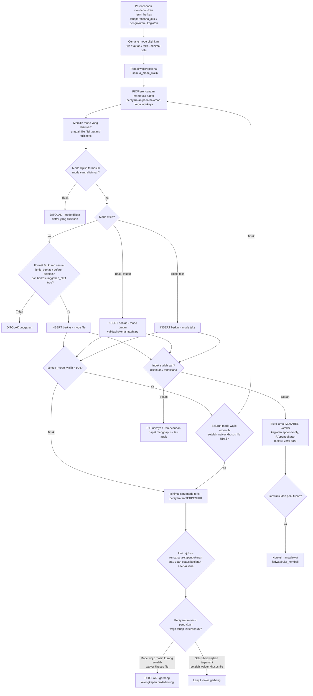

### 10.4 Gerbang kelengkapan per induk

Dari enam induk, **empat** memiliki gerbang kelengkapan; **dua** (`renstra`, `regulasi`) murni lampiran pelengkap tanpa gerbang:

- **Rencana aksi & pengukuran** (§7, §11): transisi `draft → diajukan` ditolak bila ada persyaratan `wajib` pada tahap tersebut yang belum terpenuhi — "terpenuhi" kini dibaca sesuai mode (file terunggah, tautan terisi, atau teks terisi) dan aturan `semua_mode_wajib`.
- **Kegiatan** (§8): transisi status `rencana → terlaksana` DITOLAK bila ada persyaratan `wajib` bertahap `kegiatan` yang belum terpenuhi. Transisi ke `tidak_terlaksana`/`ditunda`/`batal` **tidak pernah** digerbangi bukti dukung — syaratnya tetap `justifikasi`, karena kegiatan yang gagal tidak memiliki dokumen pertanggungjawaban pelaksanaan.
- **renstra_pk** (§3.3, §5, BARU): aktivasi `jadwal:aktivasi` (gerbang keempat) DITOLAK bila `renstra_pk` tahun tsb belum memiliki minimal satu lampiran — gerbang ini TIDAK memakai `jenis_berkas` (tanpa daftar persyaratan bernama), cukup "ada minimal satu baris `berkas`" pada induk tsb, mode apa pun.
- **renstra** dan **regulasi**: TIDAK memiliki gerbang kelengkapan — lampiran pada kedua induk ini murni pelengkap penelusuran (§3.1, §3.2), tidak pernah memblokir transisi status apa pun.
- Tiga induk bertahap mengikuti `semua_mode_wajib` setelah pengecualian mode file §10.5: `true` mensyaratkan seluruh kewajiban tersisa dan `false` cukup satu mode sah. Lampiran `renstra_pk` memakai gerbang minimal satu lampiran dan pengecualian khusus PK, bukan daftar persyaratan bertahap.
- Gerbang rencana_aksi, pengukuran, dan kegiatan DIKECUALIKAN pada jadwal retroaktif (backfill, §15). Gerbang `renstra_pk` (gerbang keempat aktivasi jadwal) TIDAK dikecualikan pada jadwal retroaktif — backfill tetap memerlukan PK tahun tsb beserta lampirannya, karena PK adalah dasar legal yang mendahului aktivasi jadwal, bukan bagian dari alur pengisian rutin yang dikecualikan.

### 10.5 Aturan anti-macet: penanda `tidak_dapat_dipenuhi`

Saat `berkas.unggahan_aktif = false`, yang dikecualikan hanya kewajiban **mode file** yang tidak dapat dipenuhi. Penanda/waiver disimpan bersama alasan, waktu, dan audit, serta tampil di rekapitulasi dan halaman Perencanaan.

| Persyaratan wajib | Perlakuan ketika file tidak tersedia |
|---|---|
| Hanya file diizinkan | Mode file diberi waiver `tidak_dapat_dipenuhi`; gerbang tidak macet |
| File + tautan/teks, `semua_mode_wajib = false` | Wajib memenuhi minimal satu mode nonfile yang diizinkan; tidak membebaskan seluruh persyaratan |
| File + tautan/teks, `semua_mode_wajib = true` | Hanya file diberi waiver; seluruh mode nonfile yang diizinkan tetap wajib |
| Bukti file sah sudah tersedia | Tetap sah; saklar tidak membatalkan bukti lama |

**Pengecualian khusus lampiran PK tetap berlaku:** karena `renstra_pk` tidak memakai persyaratan `jenis_berkas`, ketika file dimatikan dan belum ada lampiran tautan/teks, gerbang keempat aktivasi boleh diberi penanda `tidak_dapat_dipenuhi` dan lolos administratif (§3.3/§5). Ini pengecualian eksplisit tersendiri; jangan menerapkannya untuk membebaskan mode nonfile pada persyaratan RA/pengukuran/kegiatan.

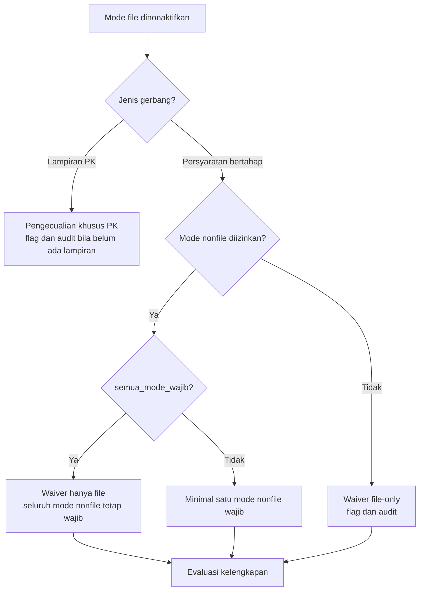

Mengaktifkan kembali file atau mengubah persyaratan berlaku untuk pengajuan berikutnya; versi pengajuan/sah lama mempertahankan waiver dan dasar evaluasi saat itu.

---

### 10.6 Imutabilitas per induk & audit

**10.6a — Imutabilitas mengikuti status induk, berbeda-beda per keenam induk:**

| Induk (`berkasable_type`) | Lampiran tidak dapat dihapus setelah | Sebelum batas itu, dapat dihapus oleh |
|---|---|---|
| `rencana_aksi` | induk berstatus `disahkan` | PIC unit terkait, Perencanaan |
| `pengukuran` | induk berstatus `disahkan` | PIC unit terkait, Perencanaan |
| `kegiatan` | induk berstatus `terlaksana` | PIC unit terkait, Perencanaan |
| `renstra` | Renstra berstatus `aktif` | Perencanaan |
| `renstra_pk` | Jadwal Tahunan tahun tsb berstatus `aktif` | Perencanaan |
| `regulasi` | masih dirujuk Renstra atau indikator aktif (bukan status waktu, melainkan status rujukan) | Perencanaan/Superadmin |

**Koreksi bukti kegiatan terlaksana:** tambahkan bukti baru yang merujuk `menggantikan_id` dan memuat `alasan_koreksi`; bukti lama tidak dihapus/diganti, dan status kegiatan tidak dikembalikan ke `rencana`. Koreksi hanya dalam waktu/otorisasi yang diizinkan, termasuk sesi koreksi resmi setelah penutupan. Laporan yang telah disahkan tetap memakai versi bukti saat pengesahan; koreksi baru tampil pada data kerja atau laporan revisi yang disahkan.

Setiap penghapusan sebelum beku tercatat `audit_log` (soft delete lewat `dihapus_pada`/`dihapus_oleh`). Setelah batas imutabilitas tercapai: bukti dukung TIDAK DAPAT dihapus maupun diganti isinya pada mode apa pun. Untuk `rencana_aksi`/`pengukuran`/`kegiatan`, koreksi pasca-`jadwal_tahunan.penutupan` hanya lewat `jadwal:buka_kembali`; untuk `renstra`/`renstra_pk`/`regulasi`, tidak ada jalur koreksi otomatis serupa — perubahan dokumen dasar setelah induknya beku memerlukan revisi in place pada induknya sendiri (§14) yang tercatat beralasan, bukan penghapusan lampiran lama.

**10.6b — Audit:**

- Penetapan/ubah persyaratan (`jenis_berkas`) — termasuk perubahan mode yang diizinkan, `wajib`, dan `semua_mode_wajib` — dicatat dengan `nilai_lama`/`nilai_baru` dan `alasan`.
- Pengiriman bukti mencatat `mode` dan sumbernya: untuk `file` — nama asli, ukuran, mime; untuk `tautan` — nilai tautan tersimpan utuh pada baris `berkas` dan dicatat sebagai perubahan biasa; untuk `teks` — panjang teks, bukan salinannya. Berlaku sama pada keenam induk.
- Pembuatan/ubah/hapus `regulasi` (nilai_lama/nilai_baru + alasan), perubahan `renstra.regulasi_id`/`indikator.regulasi_id`, unggah/hapus lampiran dokumen dasar (mode + sumber), dan penandaan `tidak_dapat_dipenuhi` pada gerbang keempat aktivasi jadwal — seluruhnya tercatat `audit_log`.
- Penyimpanan file fisik tetap di disk VPS (`storage/app/berkas/...`), diakses lewat route ber-permission (streamed download) — **bukan** URL publik, konsisten dengan model akses berbasis permission yang berlaku di seluruh aplikasi, untuk keenam induk. Mode `tautan` dan `teks` tidak memakai storage aplikasi sama sekali.

---

## 11. Alur Pengisian Pengukuran per Periode

Jendela pengisian dan reviu berlaku per periode (§4), bukan satu jendela untuk seluruh tahun. Batasan waktu ini berlaku berbeda bagi Penanggung Jawab (PIC) dibandingkan Perencanaan, dan pengajuan pengukuran tunduk pada tiga gerbang tambahan: rencana aksi disahkan, komponen lengkap, dan bukti dukung lengkap.

```
🎯 Penanggung Jawab (PIC indikator aktif + permission create/update pada unit yang cocok)
  1. Membuka daftar indikator dalam scope unit-nya untuk periode berjalan; kemampuan mengisi
     hanya pada indikator dengan penugasan PIC aktif yang cocok
  2. Selama tanggal hari ini berada dalam [pengisian_mulai, pengisian_selesai] periode tsb
     (dari jadwal_periode): dapat membuat/mengubah pengukuran, mengisi nilai tiap komponen aktif
     (§6), menambah klaim kegiatan susulan (§9), dan melengkapi bukti dukung wajib tahap
     pengukuran (§10)
  3. Mengajukan pengukuran → GERBANG (ditolak bila salah satu tidak terpenuhi):
     a. rencana_aksi (indikator × tahun) belum berstatus disahkan
     b. nilai manual belum diisi atau ada komponen snapshot pada indikator ini bernilai null
     c. bukti dukung wajib bertahap pengukuran belum lengkap setelah waiver khusus mode file
        (§10.5); keberadaan flag tidak membebaskan kewajiban tautan/teks yang masih berlaku
     → Ketiga gerbang di atas DIKECUALIKAN pada jadwal retroaktif (backfill, §15) — jadwal
       retroaktif dipakai justru untuk memasukkan data historis yang mungkin tidak melalui
       proses rencana aksi/bukti dukung formal pada masanya
  4. Begitu tanggal hari ini melewati pengisian_selesai periode tsb:
     → PIC TIDAK DAPAT LAGI membuat, mengubah, atau mengajukan pengukuran untuk periode itu
     → Tidak ada toleransi otomatis; perubahan deadline hanya melalui pembukaan resmi (§13)
     → Jalur lanjutan: Perencanaan mengisi sendiri atau membuka/perpanjang jendela PIC resmi
       dengan alasan, tenggat baru, scope, dan audit (§13); setelah penutupan harus melalui
       sesi koreksi jadwal. Tanpa pembukaan resmi, PIC tetap terkunci

📋 Perencanaan (akses pengukuran:create/update bersifat GLOBAL, tanpa scope unit)
  5. Dikecualikan dari batas jendela periode — dapat membuat/mengubah/mengajukan pengukuran
     untuk indikator unit mana pun sebelum penutupan, atau dalam scope/durasi sesi koreksi resmi (§13)
     → TETAP TUNDUK pada ketiga gerbang kelengkapan (rencana aksi disahkan, komponen lengkap,
       bukti dukung lengkap) — pengecualian Perencanaan hanya berlaku pada batas WAKTU, bukan
       pada gerbang KELENGKAPAN DATA
  6. Sering dipakai untuk: mengisikan data atas nama unit yang lewat tenggat, backfill (§15),
     atau koreksi tanpa harus membuka-kembali jadwal terlebih dahulu — bila Perencanaan yang
     mengisi juga hendak memverifikasi/mengesahkan pengukuran ini sendiri, berlaku aturan
     pemisahan tugas F2 (§20): diizinkan, ditandai self_approval di audit_log

⚙️ Sistem (perhitungan status tampilan)
  7. Status "Belum mengisi"/"Tidak mengisi" dihitung per kombinasi indikator × periode yang
     diharapkan (dari jadwal_periode) — bukan per tahun secara keseluruhan
  8. Periode sebelum jadwal_snapshot.periode_mulai_id tampil N/A dan tidak masuk kewajiban
     target, pengisian, missing count, atau denominator kelengkapan. Arsip menghentikan
     kewajiban baru; nilai dan kewajiban historis pada periode yang berlaku tetap terlacak
  9. Pada periode is_nilai_akhir=true, indikator nonmanual tetap diisi melalui komponen dan
     dihitung menurut snapshot; tipe manual menerima nilai final. Tidak ada agregasi otomatis
     lintas periode. Skor historis tanpa komponen hanya melalui jalur backfill resmi (§15).
```

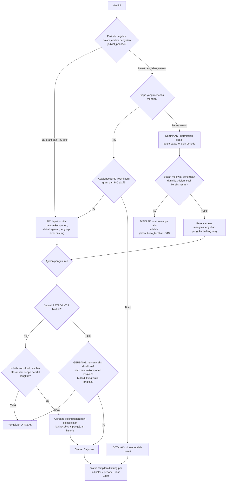

**Basis realisasi:** realisasi menggunakan basis periode yang sama dengan target RA. Untuk target kumulatif, realisasi adalah kumulatif sejak awal tahun sampai periode terkait, bukan penjumlahan nilai persen antartriwulan. Rasio dihitung ulang dari pembilang/penyebut dengan cakupan yang sama; satu PTS/responden/objek tidak dihitung ulang karena muncul pada beberapa kegiatan/periode. Klaim hanya pendukung, tidak menambahkan angka otomatis. Periode nilai akhir tetap menerima input berwenang tersendiri menurut tipe indikator: komponen untuk nonmanual, nilai final untuk manual, atau skor historis melalui pengecualian backfill resmi. Sistem tidak otomatis menjumlahkan triwulan.

**Null dan gerbang:** `belum_diisi` (input wajib hilang) ditolak; `tidak_dapat_dihitung` karena penyebut faktual nol dengan semua komponen lengkap boleh diajukan/disahkan dengan catatan alasan. Tampilan/laporan membedakan keduanya, mempertahankan nilai null, dan tidak mengganti null dengan nol atau menandai missing hanya karena hasil null.

**Konsekuensi permission (lihat §19):** karena permission hasil peran (`role_permissions`) selalu bersifat global (§19), permission `pengukuran:create`/`pengukuran:update` milik peran Perencanaan otomatis berlaku lintas unit tanpa baris tambahan apa pun. Permission yang sama milik PIC (peran Pegawai) hanya aktif bila diberikan eksplisit lewat grant (`user_permission_granted`) dengan `unit_id` terisi sesuai unit PIC. Evaluasi izin di backend memperlakukan baris peran sebagai izin penuh lintas unit dan baris grant sebagai izin terbatas ke unit tersebut, sementara pengecekan deadline periode dan ketiga gerbang kelengkapan tetap dijalankan sebagai lapisan validasi bisnis terpisah dari lapisan izin, dan gerbang kelengkapan berlaku bagi PIC maupun Perencanaan tanpa kecuali (di luar jadwal retroaktif).

---

## 12. Alur Status Data Pengukuran (5 Status + Jalur Kembali)

```
🎯 Penanggung Jawab / 📋 Perencanaan
  1. Membuat pengukuran baru untuk indikator → Status: Draft
     PIC: grant unit cocok dan PIC indikator aktif, dalam
     jendela pengisian periode aktif
     Perencanaan: untuk indikator unit mana pun (permission global lewat role_permissions), tanpa
     batas jendela periode (dibatasi penutupan atau sesi koreksi resmi §13)
  2. Mengedit nilai komponen/catatan selama masih Draft (bisa berkali-kali); untuk indikator
     bertipe rasio_persen/penjumlahan, nilai indikator terhitung otomatis sebagai turunan (§6)
  3. Mengajukan pengukuran → Status: Diajukan (memicu notifikasi in-app ke Perencanaan; saluran WhatsApp/Email aktif sebelum 9 November 2026)
     GERBANG (§11): rencana_aksi disahkan, nilai manual/komponen lengkap, bukti dukung wajib tahap
     pengukuran lengkap — dikecualikan untuk jadwal retroaktif
     Catatan wajib diisi jika:
       a. Nilai pada periode ini MEMBURUK menurut arah indikator (naik_baik: nilai turun;
          turun_baik: nilai naik) dibanding pengukuran berstatus Disahkan terakhir secara
          kronologis untuk indikator yang sama — nilai STAGNAN tidak memicu kewajiban ini;
          pengukuran pertama tanpa pembanding Disahkan tidak wajib catatan, atau
       b. indikator.wajib_catatan = true (wajib pada setiap pengajuan, terlepas arah nilai), atau
       c. hasil tidak_dapat_dihitung karena penyebut faktual nol (§11); alasan tetap wajib
          meskipun ini pengajuan pertama tanpa pembanding

📋 Perencanaan
  4. Memverifikasi pengukuran yang Diajukan
     → Setuju: Status: Diverifikasi
     → Perlu revisi: Status: Dikembalikan + alasan wajib diisi (notifikasi in-app pengembalian beserta catatan revisi instan diterima PIC; pengiriman instan WhatsApp & Email menyusul sebelum 9 November 2026)
     GERBANG PEMISAHAN TUGAS (§20, aturan F1): ditolak bila aktor yang memverifikasi adalah PIC
     yang sama dengan diajukan_by pada pengukuran_versi berjalur pic — tidak berlaku bagi
     jalur_pengajuan perencanaan yang dibekukan saat pengajuan (F2)
  5. Untuk pengukuran yang sudah Diverifikasi, masih bisa dikembalikan bila belakangan ditemukan
     masalah → Status: Dikembalikan + alasan wajib diisi
  6. Mengesahkan pengukuran yang Diverifikasi → Status: Disahkan (Fase Awal: langsung final,
     tanpa approval Pimpinan)
     GERBANG PEMISAHAN TUGAS (§20, aturan F1) berlaku sama pada pengesahan

🎯 Penanggung Jawab / 📋 Perencanaan
  7. Jika status Dikembalikan, merevisi nilai/catatan → Status kembali ke Draft, lanjut lagi
     dari langkah 2 (tunduk batas jendela periode yang sama bagi PIC, dan gerbang §11 pada
     pengajuan ulang)

📋 Perencanaan / ⚙️ Superadmin
  8. Untuk pengukuran yang sudah Disahkan, masih dapat dibuka-kembali (pengukuran:buka_kembali)
     menjadi Dikembalikan, dengan alasan wajib, sebelum penutupan atau dalam sesi koreksi resmi — lihat §13

(Fase Lanjutan, belum dibangun: pengukuran yang sudah Disahkan bisa memerlukan tahap tambahan
pengukuran:setujui oleh Pimpinan sebelum benar-benar dianggap final, jika
pakai_persetujuan_pimpinan=true)
```

```mermaid
stateDiagram-v2
    [*] --> Draft: pengukuran:create\n(PIC: grant unit + PIC aktif + jendela resmi;\nPerencanaan: role global, sampai penutupan\natau sesi koreksi resmi)
    Draft --> Draft: pengukuran:update\n(edit nilai komponen/catatan;\nnilai indikator turunan otomatis jika berkomponen)
    Draft --> Diajukan: ajukan (GERBANG: rencana aksi disahkan,\nnilai manual/komponen lengkap, bukti dukung lengkap -\ndikecualikan utk jadwal retroaktif;\nplus validasi catatan wajib berbasis arah)
    Diajukan --> Diverifikasi: pengukuran:verifikasi (Perencanaan,\ntunduk gerbang pemisahan tugas F1/F2 §20)
    Diajukan --> Dikembalikan: pengukuran:kembalikan (Perencanaan, alasan wajib)
    Diverifikasi --> Dikembalikan: pengukuran:kembalikan (Perencanaan, alasan wajib)
    Diverifikasi --> Disahkan: pengukuran:sahkan (Perencanaan)\nFASE AWAL: langsung, tanpa approval Pimpinan\ntunduk gerbang pemisahan tugas F1/F2 §20
    Dikembalikan --> Draft: penanggung jawab/Perencanaan merevisi
    Disahkan --> Dikembalikan: pengukuran:buka_kembali\n(Perencanaan/Superadmin, alasan wajib,\nsebelum penutupan atau sesi koreksi resmi §13)
    Disahkan --> [*]: status final Fase Awal\n(sampai jadwal.penutupan) -\nsiap direkomendasikan Pimpinan (§17)\ndan ditetapkan status capaiannya (§16)

    note right of Disahkan
        FASE LANJUTAN (belum dibangun):
        Disahkan dapat memerlukan tahap
        tambahan pengukuran:setujui oleh
        Pimpinan sebelum dianggap final,
        jika pakai_persetujuan_pimpinan=true
    end note

    note right of Dikembalikan
        Ada DUA jalur menuju Dikembalikan:
        1. Pra-pengesahan (dari Diajukan/Diverifikasi)
           via pengukuran:kembalikan
        2. Pasca-pengesahan (dari Disahkan)
           via pengukuran:buka_kembali - §13
    end note
```

**Aturan penting yang tidak tergambar eksplisit di diagram state di atas:**
- Setiap transisi menaikkan kolom `versi` pada baris `pengukuran` (optimistic locking) — permintaan dengan `versi` usang ditolak.
- Baris dengan `nilai`/`catatan` terisi tidak pernah dihapus permanen di transisi manapun.
- Transisi `pengukuran:create`/`update` oleh PIC hanya diizinkan jika terdapat grant `user_permission_granted` dengan `unit_id` yang cocok dengan unit snapshot target, **dan** merupakan PIC indikator aktif, **dan** tanggal hari ini masih dalam jendela pengisian periode terkait (§11). Transisi oleh Perencanaan tidak tunduk pengecekan `unit_id` (permission global lewat peran) maupun jendela periode, dibatasi penutupan atau sesi koreksi resmi §13 dan gerbang kelengkapan.
- `pengukuran:create` untuk indikator berstatus `arsip` ditolak sistem, siapa pun pemohonnya.
- Untuk indikator bertipe `rasio_persen`/`penjumlahan`, kolom `pengukuran.nilai` adalah nilai turunan (`sumber_nilai = komponen`); PIC mengedit `pengukuran_komponen`, bukan `pengukuran.nilai` langsung.
- Transisi `diajukan → diverifikasi` dan `diverifikasi → disahkan` tunduk pada aturan pemisahan tugas F1/F2 (§20), yang dievaluasi **setelah** aktor dinyatakan memiliki permission yang relevan (§19).

---

## 13. Alur Buka-Kembali dan Koreksi Berbatas

| Lapis | Aksi | Syarat | Dampak |
|---|---|---|---|
| Rencana aksi | `rencana_aksi:buka_kembali` | Alasan wajib; jadwal aktif sebelum penutupan atau berada dalam sesi koreksi resmi | `disahkan → dikembalikan`; versi sah lama tetap terbaca |
| Pengukuran | `pengukuran:buka_kembali` | Syarat waktu sama; alasan wajib | `disahkan → dikembalikan`; versi sah dan status capaian lama menjadi histori |
| Jadwal tahunan | `jadwal:buka_kembali` | Alasan, `koreksi_mulai`, `koreksi_sampai`, dan `lingkup_koreksi` eksplisit | Membuka akses koreksi Perencanaan/Superadmin pada indikator/periode/domain yang ditunjuk |
| Jendela PIC | Perpanjangan/pembukaan resmi melalui pengelolaan jadwal | Alasan, jendela baru, scope indikator/periode, dan audit jendela lama–baru | PIC memperoleh kesempatan baru hanya pada scope dan jendela yang dibuka |

1. Sebelum penutupan, Perencanaan/Superadmin dapat membuka kembali RA atau pengukuran yang disahkan dengan alasan. Setelah penutupan, lakukan `jadwal:buka_kembali` terlebih dahulu.
2. Sesi koreksi tahunan **tidak mengubah tanggal `penutupan` asli**. Validasi waktu mengizinkan aktor Perencanaan/Superadmin selama `koreksi_mulai–koreksi_sampai` dan scope `lingkup_koreksi` cocok, meskipun tanggal penutupan asli sudah lewat. Di luar sesi/scope itu mutasi tetap ditolak.
3. Buka kembali jadwal secara default hanya membuka jalur Perencanaan/Superadmin; jendela PIC tidak otomatis terbuka. Agar PIC dapat merevisi setelah tenggat, Perencanaan/Superadmin harus menetapkan pembukaan/perpanjangan resmi dengan alasan dan tenggat baru. Setelah penutupan asli, jendela PIC baru wajib berada di dalam waktu dan lingkup sesi koreksi tahunan: **kedua gerbang** diperiksa pada setiap tindakan, sehingga jendela PIC tidak dapat melewati `koreksi_sampai` atau memperluas `lingkup_koreksi`. Tanpa pembukaan terpisah itu, PIC tetap terkunci. Grant/PIC aktif dan gerbang kelengkapan tetap berlaku.
4. Setelah RA dibuka kembali, pengukuran yang sudah diajukan pada periode lain tetap merujuk versi RA yang dibekukan pada pengajuannya. Pengajuan baru memerlukan RA disahkan lagi.
5. Koreksi RA/pengukuran memakai draft baru dan versi pengajuan baru; nilai/target/narasi/bukti dalam versi lama tidak ditimpa. Pengesahan ulang pengukuran menghasilkan versi sah baru dengan status capaian **Belum ditetapkan** sampai keputusan baru dibuat (§16).
6. Aktivasi ulang menjalankan pembuatan snapshot secara idempoten. Indikator baru mendapat versi awal dengan periode mulai berlaku eksplisit; koreksi snapshot existing menggunakan versi baru dan bukti resmi (§5, §14).
7. Selesai koreksi, jalankan `jadwal:tutup`. Saat durasi koreksi habis, hak mutasi koreksi tertutup meskipun proses penutupan status belum berjalan; jangan bergantung hanya pada status `aktif`.

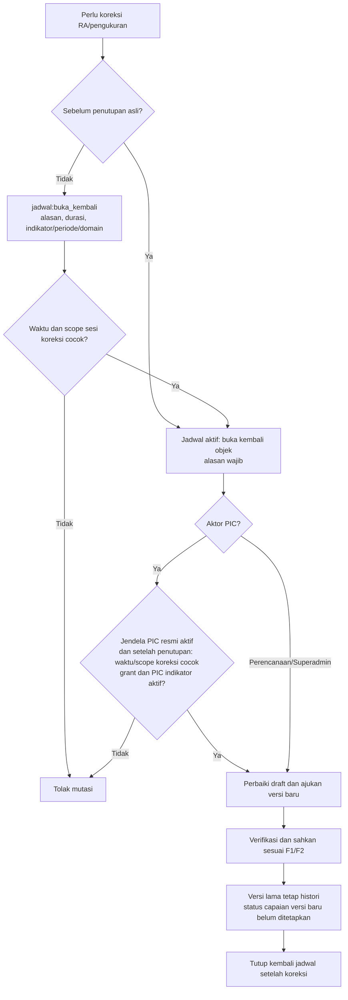

Seluruh perubahan jendela, pembukaan, scope/durasi, koreksi, dan penutupan tercatat pada audit. Pembukaan indikator baru ketika jadwal sudah aktif tetap merupakan aksi resmi beralasan; tidak perlu memalsukan tanggal penutupan atau menutup jadwal semata-mata untuk melewati validasi status.

---

## 14. Alur Perubahan Kepmen IKU & Revisi Renstra

Terbitnya Kepmen IKU baru dapat mengubah, menghapus, atau menambah indikator yang wajib diukur. Alur berikut menegaskan bagaimana perubahan itu direfleksikan ke sistem tanpa kehilangan riwayat data yang sudah ada.

```
📋 Perencanaan
  1. Kepmen IKU baru terbit, menggantikan/merevisi Kepmen sebelumnya

  Kasus A — Revisi atribut Renstra (nama, dasar_hukum, rentang tahun, dsb):
  2a. Mengedit baris Renstra yang SAMA secara langsung (in place) — BUKAN membuat Renstra baru
  3a. Sistem mencatat audit_log dengan nilai_lama/nilai_baru dari field yang berubah, dan
      alasan wajib memuat nomor & tanggal Kepmen yang melandasi revisi

  Kasus B — Indikator dihapus dari Kepmen baru:
  2b. Mengarsipkan indikator terkait (status: aktif → arsip) — TIDAK menghapus baris
  3b. Data pengukuran lama pada indikator ini tetap utuh, tetap muncul di laporan historis
      dengan penanda status arsip; rencana aksi dan kegiatan historisnya juga tetap terbaca
  4b. pengukuran:create dan rencana_aksi:create untuk indikator ini ditolak sistem sejak saat
      itu (lihat §5, §7, §12)

  Kasus C — Indikator baru ditambahkan oleh Kepmen baru:
  2c. Membuat indikator baru di bawah Sasaran yang sesuai (unit pemilik, arah penilaian,
      tipe_perhitungan, dan indikator_komponen bila diperlukan)
  3c. Mengisi target_tahunan (beserta baseline) tahun berjalan untuk indikator baru tsb
  4c. Merevisi Perjanjian Kinerja tahun berjalan agar mencakup target indikator baru
  5c. Menjalankan jadwal:buka_kembali (§13) pada Jadwal Tahunan tahun berjalan — ini
      MEKANISME STANDAR untuk memasukkan indikator baru di tengah tahun, termasuk untuk
      mengisi periode-periode yang tersisa pada tahun berjalan
  6c. Tetapkan periode_mulai_id; snapshot idempoten membuat versi awal beserta komponennya.
      Periode sebelumnya N/A, tidak wajib target/mengisi dan tidak dihitung sebagai missing.
      Susun/sahkan RA untuk periode yang berlaku; pembukaan jendela khusus indikator baru
      beralasan diperbolehkan meskipun jendela RA normal tahun itu sudah lewat (§7, §13)
```

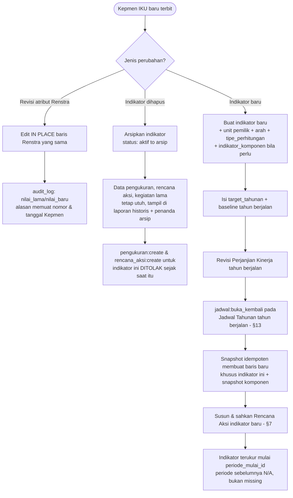

**Konsekuensi desain yang disadari:** indikator baru yang dibuat setelah jadwal aktif **tanpa** melewati `jadwal:buka_kembali` tidak otomatis terukur pada tahun berjalan — baru terukur mulai jadwal tahun berikutnya diaktifkan. `jadwal:buka_kembali` (Kasus C langkah 5c) adalah satu-satunya jalur agar indikator baru dapat diukur pada sisa tahun berjalan yang sama, dan rencana aksinya tetap wajib disusun-disahkan sebelum pengukuran pertamanya dapat diajukan.

---

## 15. Alur Backfill Data Historis

Digunakan Perencanaan untuk memasukkan data kinerja tahun-tahun lampau (sebelum aplikasi mulai dipakai) ke dalam sistem, tanpa mendistorsi mekanisme jendela pengisian normal.

```
📋 Perencanaan
  1. Memastikan Perjanjian Kinerja (renstra_pk) tahun lampau yang akan di-backfill sudah
     tercatat — wajib ada sebelum jadwal retroaktif dapat diaktifkan
  2. Membuat Jadwal Tahunan retroaktif untuk tahun lampau tsb, dengan syarat tahun tersebut
     berada dalam rentang [tahun_mulai, tahun_akhir] Renstra yang berlaku pada tahun itu
  3. Menyusun jadwal_periode untuk tahun retroaktif tsb, serta jendela rencana_aksi_mulai/selesai
     (§4) — jendela-jendela ini sudah otomatis berada di masa lalu
  4. Mengaktifkan jadwal retroaktif — melewati empat gerbang validasi seperti biasa (§5);
     activated_at mencatat WAKTU AKTIVASI SEBENARNYA (tanggal hari ini, jujur) — bukan
     tanggal retroaktif yang dipura-purakan
  5. Snapshot (+ snapshot komponen) terbentuk seperti alur normal
  6. Mengisi sendiri data historis yang tersedia (RA/kegiatan/klaim tidak dipaksa direkonstruksi)
     dan pengukuran untuk tahun
     retroaktif tsb — PIC TIDAK dapat mengisi jadwal ini karena seluruh jendela pengisian
     periode maupun jendela rencana aksi retroaktif sudah otomatis terlewati pada saat
     aktivasi (deadline mutlak §7/§11 berlaku sama, hanya saja seluruhnya sudah lewat sejak
     awal); pengisian sepenuhnya menjadi tanggung jawab Perencanaan
  7. GERBANG KELENGKAPAN (rencana aksi disahkan, nilai manual/komponen lengkap, bukti dukung lengkap) pada
     §11 langkah 3 DIKECUALIKAN untuk jadwal retroaktif — data historis lampau sering kali
     tidak melalui proses rencana aksi maupun bukti dukung formal pada masanya, sehingga
     mewajibkan kelengkapan itu justru akan menghalangi backfill yang sah
  8. Mengajukan, memverifikasi, dan mengesahkan sendiri seluruh baris rencana aksi dan
     pengukuran (Perencanaan memegang seluruh permission yang relevan) — mengesahkan
     pengukuran yang diisinya sendiri diizinkan lewat aturan pemisahan tugas F2 (§20), ditandai
     self_approval di audit_log
```

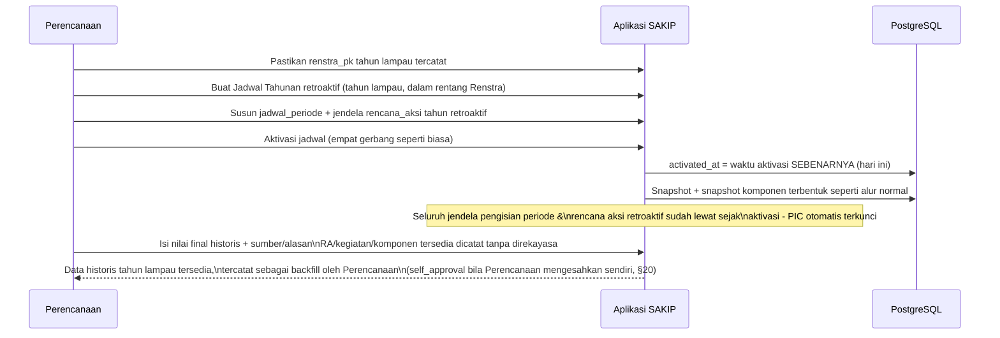

**Backfill nilai final:** bila data historis hanya tersedia sebagai nilai akhir, Perencanaan boleh memasukkan nilai itu dengan `sumber_nilai = historis`, `status_perhitungan = terhitung`, `sumber_historis`, dan `alasan_historis` wajib. Komponen tidak direkayasa dan tipe perhitungan master/snapshot tidak diubah menjadi manual. Semua tampilan/ekspor memberi penanda backfill. Pengisian berlangsung dalam jadwal retroaktif/sesi koreksi beralasan dengan scope dan durasi eksplisit; empat gerbang aktivasi (termasuk PK dan lampiran) tetap berlaku. Pengesahan tunduk F2 dan versi historis tetap dibekukan.

**Revisi target antar-tahun (mis. menaikkan target 2027–2029 setelah 2026 terlampaui):** cukup mengubah master `target_tahunan` untuk tahun-tahun yang belum dibekukan — snapshot tahun tersebut baru terbentuk saat jadwal tahun itu diaktifkan, dan otomatis membawa nilai revisi terbaru pada saat itu. Tahun yang jadwalnya sudah beku (snapshot sudah terbentuk) tidak tersentuh oleh revisi ini.

---

## 16. Alur Penetapan Status Capaian

```
📋 Perencanaan / ⚙️ Superadmin
  1. Membuka daftar pengukuran berstatus Disahkan yang belum punya status_capaian aktif
  2. Memilih status: Tercapai atau Belum Tercapai untuk tiap pengukuran
  3. Sistem menyimpan baris status_capaian baru dengan sumber=manual, ditetapkan_oleh=user
     yang login, dan pengukuran_versi_id menunjuk versi yang telah disahkan
  4. Status capaian itu langsung aktif untuk versi pengukuran tsb dan tampil di dashboard
  5. Kalau suatu saat perlu direvisi, pilih status baru
     → sistem menyimpan baris status_capaian baru sebagai status aktif, baris lama tetap
       tersimpan sebagai riwayat (soft replace, bukan update/hapus)
  6. Kalau tidak ada revisi, proses selesai — status capaian tetap tampil di dashboard

(Fase Lanjutan, belum dibangun: jalur ini digambar sebagai referensi desain, di mana sistem
eksternal/job terjadwal menghitung status_capaian otomatis dengan sumber=data_sumber,
ditetapkan_oleh=NULL — belum ada job yang menjalankan jalur ini di Fase Awal)
```

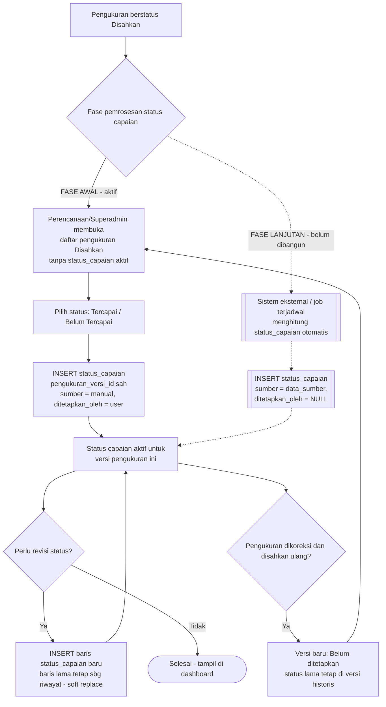

**Koreksi pengukuran dan status capaian:** `status_capaian` terikat `pengukuran_versi_id` yang disahkan. Saat buka kembali, keputusan lama tetap tersedia pada versi historis dan tidak diwariskan ke draft/revisi baru. Setelah pengesahan ulang, versi baru tampil **Belum ditetapkan** sampai Perencanaan/Superadmin membuat penetapan baru. Ini juga berlaku bila hasil numerik tidak berubah; keputusan baru tidak boleh dibuat otomatis.

Garis putus-putus menandai jalur `data_sumber` sebagai referensi desain masa depan, bukan sesuatu yang aktif pada Fase Awal — tidak ada job/integrasi yang mengeksekusi cabang tersebut saat ini. Status capaian tetap ditetapkan manual dan terpisah dari transisi status alur `Disahkan` — keduanya adalah dua momen berbeda, dan juga terpisah dari Rekomendasi Pimpinan (§17), yang merupakan momen ketiga yang berbeda lagi.

---

## 17. Alur Rekomendasi Pimpinan

Rekomendasi Pimpinan melekat pada **indikator × periode**, terpisah dari status alur `pengukuran` — dapat diisi setelah rapat evaluasi triwulan tanpa menunggu pengukuran periode itu berstatus disahkan.

```
📋 Perencanaan (permission rekomendasi:tetapkan)
  1. Setelah rapat evaluasi triwulan/berkala, membuka form Rekomendasi Pimpinan untuk suatu
     indikator × periode × tahun
     → TIDAK perlu menunggu pengukuran periode itu berstatus disahkan — rekomendasi dapat
       ditetapkan berdasarkan hasil rapat, sebelum atau sesudah pengesahan
  2. Mengisi isi rekomendasi (teks) berdasarkan hasil rapat evaluasi
  3. Menyimpan → INSERT baris rekomendasi_pimpinan baru dengan ditetapkan_oleh = Perencanaan
     yang login
     → Pola "aktif": baris terbaru per (indikator_id, tahun, periode_id) adalah yang berlaku;
       baris lama tetap sebagai riwayat (soft replace, tidak dihapus) — sama seperti
       status_capaian (§16)

✍️ Pimpinan
  4. Membaca rekomendasi yang sudah ditetapkan lewat dashboard/laporan — READ-ONLY, tidak
     mengisi sendiri pada Fase Awal karena alur approval/persetujuan Pimpinan masih ditunda
     ke Fase Lanjutan dan Pimpinan belum masuk flow substantif

⚙️ Sistem
  5. Rekomendasi tampil pada rekapitulasi indikator × periode (§ rekapitulasi, dashboard/
     laporan) berdampingan dengan target, capaian, komponen, dan narasi kegiatan
```

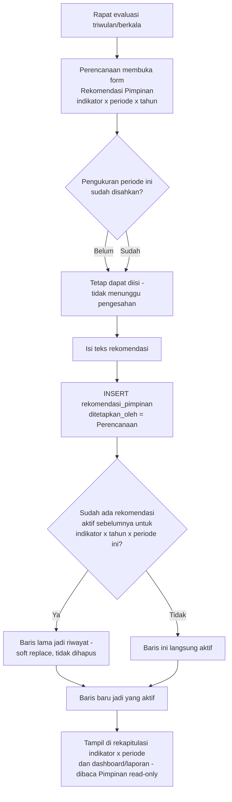

**Pengisi pada Fase Awal: Perencanaan, bukan Pimpinan** — karena alur approval/persetujuan Pimpinan masih ditunda ke Fase Lanjutan dan Pimpinan belum masuk flow substantif. Pimpinan tetap read-only atas data ini, sebagaimana atas seluruh data kinerja lainnya.

---

### 17.1 Laporan operasional dan laporan resmi per versi

Saat pengukuran diajukan, `pengukuran_versi` membekukan nilai, komponen, snapshot indikator/target tahunan, versi RA/target periode, klaim kegiatan, narasi kegiatan, dan referensi isi bukti beserta persyaratan/waiver. Verifikasi/pengesahan merujuk versi ini; `disahkan_by/at` diisi sekali. Versi sah merupakan dasar laporan resmi periode, sehingga revisi RA, kegiatan, atau bukti berikutnya tidak mengubah laporan lama diam-diam. Rekomendasi pimpinan tetap append-only dan terpisah, ditampilkan dengan waktu/versi penetapannya.

Dashboard kerja boleh menampilkan keadaan terkini dengan label status/versi. Ekspor resmi memakai versi pengesahan yang dipilih dan mencantumkan penanda revisi/backfill/self-approval/waiver. Koreksi laporan memerlukan pengajuan dan pengesahan versi baru, sementara versi sebelumnya tetap dapat direproduksi.

Kolom **baseline**, **target tahunan**, **target periode**, **realisasi**, dan **persentase pencapaian** harus terpisah. Jangan menyalin posisi atau judul kolom workbook yang tidak konsisten. Template Excel final beserta contoh hasil perlu diterima Tim Perencanaan; workbook referensi bukan otomatis template final yang telah disetujui. Baseline dengan cakupan berbeda diberi konteks dan tidak dipakai untuk klaim tren sebanding sebelum dikonfirmasi.

---

## 18. Alur Setelan Aplikasi

Modul terbatas yang memungkinkan Superadmin maupun Admin mengubah nilai teks, preferensi presentasional, dan kebijakan teknis operasional aplikasi tanpa perlu deploy ulang kode.

### 18.1 Setelan umum (identitas, preferensi, grup `berkas`)

```
⚙️ Superadmin / Admin
  1. Membuka halaman Setelan Aplikasi, terkelompok per grup: identitas instansi (nama,
     alamat, telepon, surel, laman, logo), identitas aplikasi (nama aplikasi, label unit),
     preferensi tampilan/laporan (zona waktu, format tanggal, format angka, header/footer
     ekspor), dan grup berkas — kebijakan bukti dukung tingkat aplikasi:
       - berkas.unggahan_aktif (boolean) — saklar aktif/nonaktif mode unggahan file secara
         aplikasi-wide
       - berkas.ukuran_maks_kb (integer) — batas ukuran default bila jenis_berkas.ukuran_maks_kb
         kosong
       - berkas.format_diizinkan (teks) — daftar format default bila jenis_berkas.format_diizinkan
         kosong
       - berkas.tautan_selalu_diizinkan (boolean) — penanda bahwa mode tautan dan teks selalu
         tersedia sebagai jalur alternatif tanpa memakai storage
  2. Mengubah satu atau beberapa nilai kunci pengaturan
  3. Menyimpan perubahan
     → Sistem memvalidasi kunci yang dikirim berada dalam whitelist kunci terdefinisi —
       kunci di luar whitelist ditolak
     → Kunci valid: baris pengaturan terkait diperbarui (nilai, updated_by, updated_at)

⚙️ Sistem
  4. Mencatat audit_log untuk tiap kunci yang berubah (nilai_lama/nilai_baru)
  5. Menginvalidasi cache accessor pengaturan terkait, sehingga pembacaan berikutnya
     mengambil nilai terbaru
  6. Bila berkas.unggahan_aktif diubah menjadi false: seluruh endpoint unggah file pada
     KEEMPAT gerbang (rencana_aksi/pengukuran/kegiatan/renstra_pk) dan pada lampiran bebas
     induk renstra/regulasi menolak unggahan sejak saat itu; persyaratan/gerbang wajib yang
     membutuhkan file dievaluasi per mode sesuai §10.5: waiver hanya mode file, kewajiban
     nonfile tetap berlaku. Pengecualian khusus lampiran PK tetap berlaku (§5)

📋 Perencanaan (permission jenis_berkas:create/update/delete, TANPA pengaturan:update)
  7. Menampilkan panel READ-ONLY "Penggunaan Penyimpanan Bukti Dukung" pada halaman Setelan
     Aplikasi: jumlah bukti mode file beserta total ukuran_bytes, dan jumlah bukti mode
     tautan/teks (lintas keenam induk) — dipakai sebagai dasar keputusan "mana yang perlu
     diunggah, mana yang cukup tautan" berdasarkan angka, bukan perkiraan. Panel ini dapat
     dilihat oleh siapa pun yang memiliki jenis_berkas:read (dipegang seluruh peran) atau
     pengaturan:update; perubahan kebijakan grup berkas tetap hanya lewat langkah 1–3 di atas,
     digerbangi pengaturan:update

👤 Pengguna lain
  8. Membaca nilai pengaturan terjadi otomatis saat render halaman (mis. label unit di form
     Indikator, header laporan ekspor, batas ukuran unggahan di form bukti dukung) — TANPA
     memerlukan permission khusus untuk membaca
```

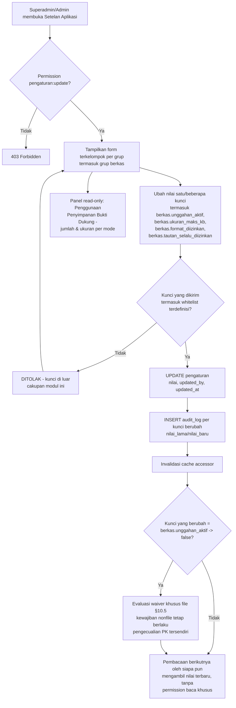

### 18.2 Halaman "Batas unggahan berkas" (per persyaratan)

Berbeda dari grup `berkas` di §18.1 (kebijakan default/saklar tingkat aplikasi), halaman ini adalah layar **khusus** di Setelan Aplikasi yang mendaftar SELURUH `jenis_berkas` (aktif maupun nonaktif, lintas tahap rencana_aksi/pengukuran/kegiatan) dan memungkinkan Admin/Superadmin mengubah **dua kolom saja** per baris persyaratan: `format_diizinkan` dan `ukuran_maks_kb`. Halaman ini TIDAK menerima perubahan atas kolom substantif persyaratan.

```
⚙️ Admin / Superadmin (permission pengaturan:update)
  1. Membuka halaman "Batas unggahan berkas" pada Setelan Aplikasi
  2. Sistem menampilkan daftar SELURUH jenis_berkas (aktif maupun nonaktif) sebagai baris,
     dengan HANYA dua kolom yang dapat diedit inline: format_diizinkan, ukuran_maks_kb
     → Kolom substantif (nama, tahap, wajib, izinkan_file, izinkan_tautan, izinkan_teks,
       semua_mode_wajib, indikator_id) DITAMPILKAN sebagai referensi tetapi TIDAK DAPAT diubah
       dari halaman ini — payload yang menyertakan kolom di luar dua kolom tsb DITOLAK sistem
       sama sekali, terlepas nilai yang dikirim
  3. Mengubah ukuran_maks_kb dan/atau format_diizinkan pada satu atau beberapa baris
  4. Menyimpan perubahan
     → Validasi: ukuran_maks_kb minimal 100 (KB) bila diisi — nilai di bawah itu DITOLAK
     → Validasi: format_diizinkan WAJIB terisi bila izinkan_file = true pada persyaratan
       tersebut — mengosongkannya pada persyaratan yang mengizinkan mode file DITOLAK
     → Perubahan bersifat GRANDFATHERED: bukti yang sudah terlanjur diunggah dengan
       format/ukuran lama TIDAK menjadi tidak sah karena perubahan batas ini
     → Bila perubahan MENYEMPITKAN daftar format sementara sudah ada bukti berformat yang
       tidak lagi termasuk daftar baru: sistem menampilkan PERINGATAN (bukan menolak
       penyimpanan) — bukti lama tetap sah, hanya unggahan baru yang tunduk format baru

⚙️ Sistem
  5. Mencatat audit_log PER PERSYARATAN yang berubah: persyaratan mana (jenis_berkas_id),
     kolom apa (format_diizinkan/ukuran_maks_kb), nilai lama → nilai baru, oleh siapa
  6. Menginvalidasi cache accessor terkait sehingga validasi unggahan berikutnya memakai
     nilai baru

📋 Perencanaan (permission jenis_berkas:create/update/delete, TANPA pengaturan:update)
  7. Tetap satu-satunya pemegang wewenang atas kolom substantif persyaratan — perubahan
     substansi (nama, tahap, wajib, mode yang diizinkan, semua_mode_wajib, indikator_id)
     tetap lewat CRUD jenis_berkas (§10.2), TIDAK lewat halaman ini
```

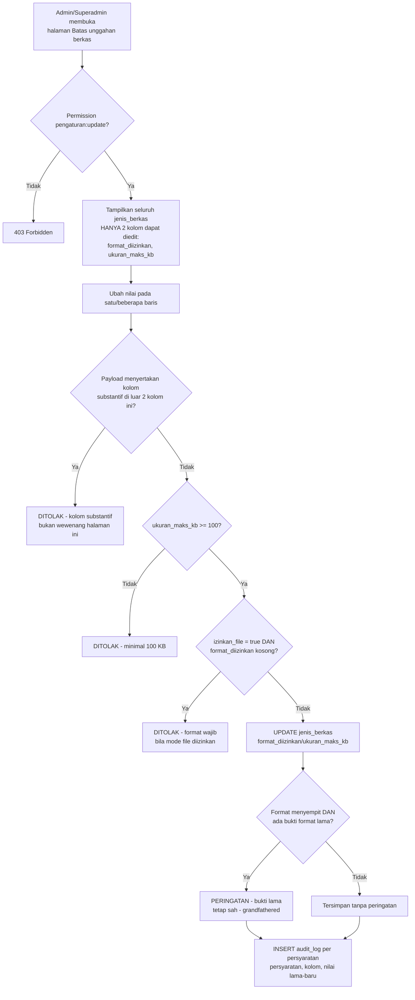

**Pembagian kewenangan ditegaskan:** **substansi persyaratan bukti dukung** (nama, tahap, wajib/opsional, mode yang diizinkan, `semua_mode_wajib`, per indikator) adalah wewenang **Perencanaan** (`jenis_berkas:create/update/delete`, §10.2). **Kebijakan teknis unggahan** — baik saklar/format/ukuran default tingkat aplikasi (§18.1, grup `berkas`) maupun format/ukuran per persyaratan (§18.2, halaman "Batas unggahan berkas") — adalah wewenang **pemegang `pengaturan:update`** (Admin dan Superadmin), yang juga memegang `jenis_berkas:read` untuk melihat daftar persyaratan saat menilai kebutuhan storage. Kedua wewenang ini terpisah secara sengaja: Admin dapat mengakomodasi kebijakan format/ukuran unggahan tanpa memperoleh kendali atas kewajiban substantif yang ditetapkan Perencanaan.

**Batas tegas cakupan modul ini:** yang boleh dinamis melalui Setelan Aplikasi **hanya teks, preferensi presentasional, dan kebijakan teknis operasional bukti dukung** (saklar unggahan, ukuran/format default tingkat aplikasi, ukuran/format per persyaratan, penanda ketersediaan tautan) — seluruhnya dipegang **Admin maupun Superadmin** lewat `pengaturan:update`. Substansi persyaratan bukti dukung per indikator/tahap (isi tabel `jenis_berkas`: apa yang wajib, mode apa yang diizinkan, untuk indikator mana, `semua_mode_wajib`) tetap wewenang Perencanaan lewat `jenis_berkas:create/update/delete` (§10) — kedua wewenang ini terpisah: Admin/Superadmin mengatur kebijakan default/saklar tingkat aplikasi maupun batas teknis per persyaratan, Perencanaan menetapkan persyaratan substantif per indikator. Modul ini secara sengaja **tidak** menyediakan jalur untuk mengubah nilai enum/status, nama permission, atau aturan bisnis apa pun — seluruh hal tersebut tetap didefinisikan di kode, bukan di tabel `pengaturan`.

**Catatan cakupan:** branding halaman login Keycloak berada di luar cakupan aplikasi ini — diatur di level realm Keycloak, bukan lewat modul Setelan Aplikasi.

---

## 19. Alur Evaluasi Permission Saat Request

Model akses SAKIP adalah **RBAC hidup dengan pengecualian eksplisit**: peran (`roles`) memuat daftar permission sebagai data (`role_permissions`), dievaluasi **saat request** — bukan disalin ke baris per pengguna. Di atas peran, dua mekanisme tambahan memberi fleksibilitas terkendali: **grant** (`user_permission_granted`) memberi izin tambahan bersifat scope-unit, dan **deny** (`user_permission_denied`) mencabut izin — baik yang berasal dari peran maupun dari grant — secara eksplisit dan beralasan. Pembedaan ini penting karena sistem harus bisa membedakan **"tidak diberi"** dari **"sengaja dicabut"**, terutama saat evaluasi AKIP/ZI mempertanyakan mengapa seseorang tidak dapat melakukan sesuatu meski perannya memungkinkan.

Pertanyaan yang dijawab sistem pada setiap request: **"boleh(kode_permission, unit_target?)"** untuk aktor yang sedang login. Pertanyaan tanpa `unit_target` hanya sah untuk permission bertipe `global` (`permissions.butuh_scope = global`).

```
👤 Pengguna
  1. Melakukan suatu aksi X pada entitas Y (opsional menyasar unit target U)

⚙️ Sistem (Policy/Gate/service resolusi izin — HANYA berjalan di server)
  2. FAIL CLOSED: mengecek apakah ada baris permissions aktif dengan kode 'entitas:aksi' yang
     diminta
     → Tidak ada / tidak aktif: TOLAK langsung, proses berhenti di sini
  3. Menyusun himpunan ALLOW:
     a. Seluruh permission dari peran pengguna (user_roles → role_permissions) — diperlakukan
        SELALU GLOBAL, tabel role_permissions tidak memiliki kolom unit_id
     b. Baris user_permission_granted milik pengguna untuk permission yang diminta
  4. Menyusun himpunan DENY: baris user_permission_denied milik pengguna untuk permission
     yang diminta
  5. PENCOCOKAN SCOPE terhadap unit_target U (bila pertanyaan menyasar unit tertentu):
     → deny cocok bila unit_id IS NULL (deny global) ATAU unit_id = U
     → grant cocok bila unit_id = U; grant global unit_id IS NULL juga cocok untuk
       permission bertipe global, tetap memeriksa deny pada unit induk
     Untuk pertanyaan TANPA unit_target (permission global): deny ber-unit_id TIDAK
     menghalangi (izin untuk unit lain tetap berlaku); deny dengan unit_id IS NULL selalu
     menghalangi
  6. PRESEDENS: DENY MENANG
     → Ada deny yang cocok: TOLAK — catat percobaan ke audit_log
     → Tidak ada deny cocok, TETAPI ada allow yang cocok: IZINKAN SEMENTARA, lanjut langkah 7
     → Tidak ada allow yang cocok: TOLAK
  7. Untuk aksi yang lolos langkah 6: lapisan VALIDASI BISNIS berjalan TERPISAH dari lapisan
     izin — jendela waktu (jadwal_periode, rencana_aksi_mulai/selesai), status alur entitas, PIC indikator aktif untuk RA/pengukuran,
     dan kepemilikan unit dicek di sini, BUKAN sebagai bagian resolusi izin. Kontraknya: izin
     menjawab "apakah boleh", validasi bisnis menjawab "apakah masih dalam waktunya/untuk
     record yang benar"
     → Validasi bisnis gagal: TOLAK dengan pesan spesifik sesuai kontrak aksi; pelanggaran
       authorization data/PIC tetap fail-closed, bukan dijadikan akses lolos karena grant unit
     → Validasi bisnis lolos: lanjut langkah 8
  8. Untuk permission bertanda permissions.sensitif = true: mencatat dasar_izin ke audit_log —
     daftar sumber izin yang membuat aksi diizinkan (peran mana / grant mana), atau deny mana
     yang memicu penolakan pada langkah 6
  9. Aksi dieksekusi; perubahan dicatat ke audit_log sesuai peristiwa yang relevan

👤 Antarmuka (React/Inertia)
  10. HANYA menyembunyikan tombol/menu berdasarkan hasil evaluasi izin yang dikirim server
      (mis. lewat props Inertia) — TIDAK PERNAH mengevaluasi izin sendiri di klien; server
      tetap menjalankan ulang seluruh langkah 2–8 pada SETIAP permintaan, termasuk permintaan
      yang menyasar endpoint langsung tanpa melalui tombol UI manapun
```

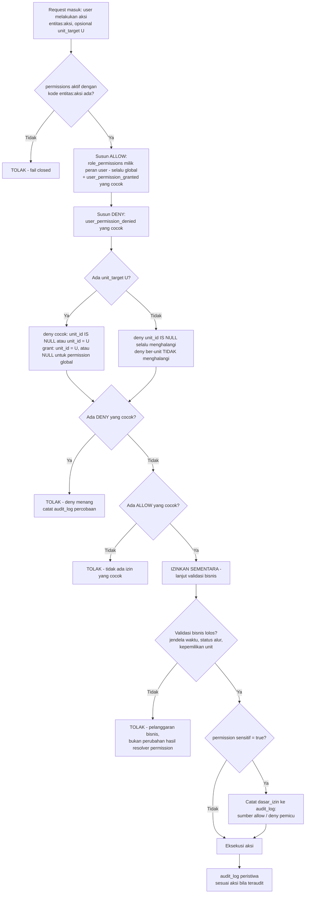

**Baca operasional dan mutasi:** `rencana_aksi:read` dan `kegiatan:read` mengikuti scope unit bagi jalur PIC. Permission `berkas:read` tetap global dalam katalog, tetapi akses bukti wajib mengikuti scope dan izin induknya. Untuk PIC, allow operasi bukti diperoleh dari izin baca/mutasi induk yang sesuai tanpa grant berkas tersendiri; resolver tetap memeriksa permission katalog aktif serta deny berkas dan deny induk pada unit target sebelum mengizinkan. Jalur ini tidak membuat seluruh berkas global dapat dibaca PIC. Deny global/unit tetap menang pada daftar, detail, dan unduhan langsung. Ringkasan dashboard global mengikuti baseline peran, bukan pintu masuk ke detail/bukti lintas unit. Untuk create/update/ajukan RA atau pengukuran, grant unit saja tidak cukup: aktor harus PIC aktif indikator target. Perencanaan/Superadmin memiliki jalur global yang tetap tunduk deny dan invariant bisnis. Kegiatan dapat dikerjakan bersama oleh pemegang izin pada unit yang sama tanpa wajib PIC indikator tertentu.

**Larangan evaluasi izin di klien:** komponen React tidak pernah menyimpan atau menghitung ulang hasil resolusi izin secara mandiri — ia hanya merender apa yang dikirim server (mis. `can.pengukuran_sahkan: true/false` sebagai props Inertia). Menyembunyikan tombol di klien adalah kenyamanan tampilan, bukan lapisan keamanan; seluruh keamanan bertumpu pada langkah 2–8 yang berjalan ulang di server pada setiap permintaan, termasuk permintaan yang membypass antarmuka.

**Pemisahan izin dari validasi bisnis:** langkah 7 sengaja ditempatkan setelah resolusi izin (langkah 2–6) selesai, bukan bercampur di dalamnya. Contoh: PIC yang memiliki grant `pengukuran:create` di unit A tetap **diizinkan** secara RBAC untuk indikator unit A kapan pun ditanya, tetapi **ditolak secara bisnis** begitu tanggal hari ini melewati `jadwal_periode.pengisian_selesai` (§11) — dua alasan penolakan yang berbeda, dengan pesan yang berbeda, dan resolusi izin sama sekali tidak perlu "mengetahui" tentang jendela waktu.

**Dasar izin untuk aksi sensitif:** karena izin dievaluasi hidup (bukan disalin ke baris statis), jejak "kenapa orang ini boleh melakukan X" tidak bisa lagi dibaca langsung dari satu baris tabel. Untuk seluruh permission bertanda `sensitif = true` pada katalog (di antaranya `pengukuran:sahkan`, `pengukuran:verifikasi`, `pengukuran:buka_kembali`, `rencana_aksi:verifikasi`, `rencana_aksi:sahkan`, `rencana_aksi:buka_kembali`, `jadwal:aktivasi`, `jadwal:tutup`, `jadwal:buka_kembali`, `status_capaian:update`, `rekomendasi:tetapkan`, `komponen:update`, `komponen:delete`, `jenis_berkas:update`, `jenis_berkas:delete`, `regulasi:update`, `regulasi:delete`, `akses:update`, `pengaturan:update`, `berkas:delete`, `kegiatan:delete`), `audit_log` menyimpan kolom tambahan `dasar_izin` berisi sumber allow yang berlaku (peran tertentu, atau grant tertentu) atau, pada kasus penolakan, deny mana yang memicu penolakan tersebut. Perhatikan bahwa `komponen:read`/`jenis_berkas:read`/`regulasi:read` (bacaan biasa, dipegang seluruh peran) tidak termasuk sensitif — varian `update`/`delete` pada ketiga katalog tersebut memakai `sensitif = true` dan mencatat `dasar_izin`. Aksi `create` tetap teraudit, tetapi tidak diberi flag sensitif di luar daftar katalog yang disepakati.

---

## 20. Alur Pemisahan Tugas (Segregation of Duties)

F1/F2 berlaku untuk **rencana aksi dan pengukuran**, pada verifikasi serta pengesahan. Aturan diperiksa setelah permission/deny normal (§19), bukan digantikan oleh nama role atau grant.

1. Pada setiap pengajuan, sistem membuat `rencana_aksi_versi` atau `pengukuran_versi`, membekukan `diajukan_by`, `diajukan_at`, `jalur_pengajuan` (`pic`/`perencanaan`), dan `dasar_izin_pengajuan` bersama snapshot isi pengajuan. `created_by` tetap provenance pembuatan header; **bukan** identitas pengaju untuk F1.
2. **F1:** bila jalur pengajuan versi itu `pic` dan aktor reviu sama dengan `diajukan_by`, verifikasi/pengesahan ditolak, sekalipun aktor sekarang memegang permission atau role berbeda. Pergantian PIC/peran setelah pengajuan tidak mengubah provenance yang dibekukan.
3. Aktor reviu yang berbeda dapat melanjutkan hanya bila permission efektif, scope, status, dan waktu valid. Grant tambahan tidak dapat menonaktifkan F1.
4. **F2:** pada jalur Perencanaan yang mengajukan atas nama unit, pengaju yang sama boleh memverifikasi/mengesahkan. Kejadian tersebut wajib ditandai `self_approval` pada audit serta dashboard/laporan, pada kedua domain.
5. Koreksi setelah dikembalikan membentuk versi pengajuan berikutnya dengan provenance saat pengajuan baru; versi lama tetap utuh. Sekadar perubahan role tidak mengubah jalur versi pengajuan yang sedang direviu.

```mermaid
flowchart TD
    A[Verifikasi/sahkan RA atau pengukuran] --> B{Permission efektif dan deny lolos?}
    B -- Tidak --> C[Tolak]
    B -- Ya --> D{Aktor sama dengan diajukan_by\npada versi yang direviu?}
    D -- Tidak --> E[Periksa status, waktu, scope\nlalu lanjut bila valid]
    D -- Ya --> F{jalur_pengajuan beku?}
    F -- pic --> C
    F -- perencanaan --> G[Izinkan sesuai validasi bisnis\naudit dan tampilkan self_approval]
```

Pengecualian F2 menjaga jalur Perencanaan mengisi sendiri tetap operasional tanpa menyembunyikan self-approval. F1 tetap melarang pengaju PIC memeriksa sendiri pada kedua domain.

---

## 21. Alur Pengelolaan Akses, Unit, dan Setelan (Admin/Superadmin)

Role kelima, **Admin** (label tampilan: Administrator), memegang wewenang administratif atas akun pengguna, unit organisasi, dan setelan aplikasi (termasuk kebijakan teknis grup `berkas` dan halaman "Batas unggahan berkas") — tanpa permission substantif data kinerja pada peran default. Permission tambahan boleh diberikan secara eksplisit, beralasan, dan teraudit melalui mekanisme yang sesuai scope; nama role Admin bukan larangan keras. Pemisahan ini menegakkan pemisahan tugas: pengelola akun/unit/setelan tidak otomatis memegang kendali atas data kinerja yang dilaporkan.

Pengelolaan akses pada Fase Awal disediakan lewat **tiga form** terpisah, ditambah satu halaman transparansi:

1. **Form Assign Peran** — menetapkan peran (`user_roles`) seorang pengguna.
2. **Form Kelola Grant Izin per Unit** — memberikan izin tambahan bersifat scope-unit (`user_permission_granted`).
3. **Form Kelola Deny Izin** — mencabut izin, baik global maupun ber-unit (`user_permission_denied`).
4. **Halaman "Jelaskan izin pengguna"** — transparansi izin efektif, bukan form pengeditan.

UI matrix permission penuh (pencentangan bebas seluruh permission katalog per pengguna) **ditunda ke Fase Lanjutan** — pada Fase Awal, seluruh pengecualian ditangani lewat kombinasi ketiga form di atas untuk scope yang didukung; pemberian permission global di luar form unit memakai mekanisme administratif beralasan dan teraudit.

```
⚙️ Admin / Superadmin
  1. Mengelola Unit: membuat, membaca, mengubah, menghapus unit (unit:create/read/update/delete)
     → Unit dengan indikator terkait tidak dapat dihapus (aturan tetap berlaku)

  2. FORM 1 — Assign Peran (akses:update):
     a. Memilih pengguna dan menetapkan SATU peran (Superadmin/Admin/Perencanaan/Pimpinan/
        Pegawai) — pada Fase Awal, user_roles dibatasi unique(user_id): satu pengguna tepat
        satu peran
     b. Mengisi alasan penetapan/pergantian peran
     c. Menyimpan → INSERT/UPDATE user_roles (diberikan_oleh = Admin/Superadmin yang login);
        bila pengguna sebelumnya sudah punya peran lain, sistem mencatat nilai_lama (peran
        lama) dan nilai_baru (peran baru) ke audit_log

  3. FORM 2 — Kelola Grant Izin per Unit (akses:update):
     a. Memilih pengguna, permission bertipe butuh_scope=unit (mis. pengukuran:create,
        rencana_aksi:create/update/ajukan, kegiatan:create/update), dan unit tujuan
     b. Mengisi alasan (wajib — grant adalah pengecualian administratif)
     c. Menyimpan → INSERT user_permission_granted (unit_id terisi, diberikan_oleh = Admin/
        Superadmin yang login); percobaan grant untuk permission bertipe global DITOLAK sistem
     d. Dapat mencabut grant yang sudah ada — pencabutan tercatat audit_log

  4. FORM 3 — Kelola Deny Izin (akses:update):
     a. Memilih pengguna, permission, dan unit (nullable — kosong berarti pencabutan
        menyeluruh/global)
     b. Mengisi alasan (wajib — inilah yang membedakan "sengaja dicabut" dari "belum pernah
        diberi")
     c. Menyimpan → INSERT user_permission_denied (ditetapkan_oleh = Admin/Superadmin yang
        login); deny dapat mencabut permission yang berasal dari peran MAUPUN dari grant
     d. Dapat mencabut baris deny yang sudah ada — pencabutan tercatat audit_log

  5. HALAMAN "Jelaskan izin pengguna" (digerbangi pengguna:read — tidak ada permission baru):
     a. Memilih seorang pengguna
     b. Sistem menampilkan daftar izin EFEKTIF pengguna tsb per unit, lengkap dengan ASAL tiap
        izin (peran mana, atau grant mana) dan DENY yang berlaku beserta alasannya
     c. Halaman ini murni tampilan (read-only) — perubahan izin tetap lewat Form 1–3

  6. Membaca daftar pengguna (pengguna:read)
  7. Mengubah Setelan Aplikasi (pengaturan:update), termasuk grup berkas — lihat §18
  8. Membaca Audit Log (audit:read) dan Dashboard/Laporan (dashboard:read, laporan:read) untuk
     keperluan pemantauan administratif — TANPA hak ekspor laporan (laporan:ekspor tidak
     termasuk peran Admin)

⚙️ Sistem
  9. Memeriksa permission efektif untuk setiap aksi data kinerja. Admin tanpa allow yang cocok
     ditolak 403; grant eksplisit yang sah dapat mengizinkan aksi sesuai scope, tetap tunduk
     deny, PIC aktif (bila jalur PIC), F1/F2, jendela, dan seluruh invariant bisnis. Jangan
     menolak hanya karena nama role Admin. Permission global tambahan yang tidak didukung
     form unit memakai mekanisme administratif teraudit, bukan query tanpa jejak atau UI matrix baru.
  10. Mencatat audit_log untuk SETIAP perubahan akses:
     a. Perubahan isi peran (role_permissions) — nilai_lama/nilai_baru (daftar permission
        sebelum/sesudah) + alasan; perubahan berlaku langsung bagi seluruh pemegang peran
        tersebut, sehingga wajib ter-audit meski dilakukan lewat rilis kode + seeder
     b. Penambahan/pergantian/penghapusan user_roles — alasan wajib
     c. Penambahan/penghapusan user_permission_granted — alasan wajib
     d. Penambahan/penghapusan user_permission_denied — alasan wajib
```

```mermaid
flowchart TD
    A[Admin/Superadmin login] --> B{Aksi yang dilakukan?}
    B -- Kelola Unit --> C[unit:create/read/update/delete\ndiizinkan]
    B -- Form 1: Assign Peran --> D1[akses:update -\nINSERT/UPDATE user_roles\naudit nilai_lama/nilai_baru peran]
    B -- Form 2: Grant per Unit --> D2[akses:update -\nINSERT user_permission_granted\nalasan wajib, hanya permission butuh_scope=unit]
    B -- Form 3: Deny Izin --> D3[akses:update -\nINSERT user_permission_denied\nalasan wajib, global atau ber-unit]
    B -- Halaman Jelaskan Izin --> D4[pengguna:read -\ntampilkan izin efektif + asal + deny\nread-only]
    B -- Ubah Setelan Aplikasi\ntermasuk grup berkas --> E[pengaturan:update\ndiizinkan - lihat §18]
    B -- Baca Audit/Dashboard/Laporan --> F[audit:read, dashboard:read,\nlaporan:read diizinkan\ntanpa laporan:ekspor]
    B -- Aksi substantif data kinerja\nrenstra/indikator/rencana aksi/\nkegiatan/komponen/pengukuran/\njenis_berkas substansi/dst --> G[Evaluasi izin efektif - §19\ndefault ditolak; exception sah tetap tunduk bisnis]
    D1 --> H[audit_log tercatat]
    D2 --> H
    D3 --> H
    E --> H
```

**Perbedaan Admin vs Superadmin:** Superadmin memiliki seluruh permission tanpa kecuali (termasuk seluruh wewenang substantif di atas). Admin pada peran default adalah subset yang dibatasi pada permukaan administratif — pengelolaan akun, unit, dan setelan (termasuk kebijakan teknis grup `berkas`) — agar peran administrator sistem terpisah dari peran pengelola data kinerja (Perencanaan).

**Perubahan isi peran (`role_permissions`) sebagai peristiwa tersendiri:** menambah atau mencabut permission dari suatu peran (mis. menambahkan `komponen:update` ke peran Pimpinan) bukan bagian dari ketiga form di atas — perubahan katalog isi peran dilakukan lewat mekanisme terpisah yang tetap wajib ter-audit dengan `nilai_lama`/`nilai_baru`/`alasan`, karena perubahannya otomatis berlaku bagi seluruh pemegang peran tersebut, bukan satu pengguna.

---

## 22. Alur Notifikasi & Pengingat (In-App & Eksternal WhatsApp/Email)

Merujuk pada keputusan penyelarasan ruang lingkup (Keputusan Q4 — PRD §28, transkrip koordinasi baris 225–229):
- **Baseline Scope MVP (Tertulis)**: Notifikasi berbasis antarmuka aplikasi (*in-app notification*: banner kontekstual, indikator/badge lonceng pada navbar, dan daftar tugas aksi) merupakan dasar kriteria penerimaan fungsional utama.
- **Penyempurnaan Saluran Eksternal (WhatsApp & Email)**: Dikonfigurasi dan diintegrasikan di bagian akhir sebelum batas waktu **9 November 2026** (sebelum memasuki periode evaluasi dan revisi final 16–30 November 2026).

```mermaid
flowchart TD
    subgraph INAPP["Baseline Scope MVP: In-App Notification"]
        A1[Event Pemicu Sistem] --> B1{Jenis Pengguna / Penerima}
        B1 -- PIC Unit Kerja --> C1[Banner Pengingat Dashboard\n- Jendela Rencana Aksi berjalan/tenggat\n- Periode Pengisian aktif & hitung mundur\n- Status Belum/Tidak Mengisi]
        B1 -- PIC Unit Kerja --> C2[Lonceng Notifikasi Navbar\n- Berkas Dikembalikan + cuplikan alasan\n- Jadwal baru dibuka]
        B1 -- PIC Unit Kerja --> C3[Daftar Tugas Aksi / Task List\n- Perlu Pengisian\n- Perlu Revisi / Perbaikan]
        B1 -- Perencanaan --> D1[Lonceng & Task List Verifikasi\n- Pengajuan Rencana Aksi baru\n- Pengajuan Pengukuran baru]
        B1 -- Perencanaan --> D2[Banner Penanda Masalah\n- Persyaratan tidak_dapat_dipenuhi\n- Peringatan PK belum ada lampiran]
        B1 -- Admin / Superadmin --> E1[Notifikasi Status Akses & Anomali]
    end

    subgraph EKSTERNAL["Konfigurasi Akhir: Sebelum 9 November 2026"]
        A2[Pemicu Jadwal / Cron Scheduler / Action] --> B2{Event Eksternal}
        B2 -- Pembukaan Jadwal Pengisian --> F1[Broadcast WhatsApp & Email ke seluruh PIC Unit]
        B2 -- EWS H-7, H-3, H-1 Pengisian --> F2[Scheduler mengecek harian; kirim hanya H-7/H-3/H-1 ke WA/Email PIC belum selesai]
        B2 -- Rekapitulasi Berkala --> F3[Pesan Rekap Status Pengisian ke WA/Email Tim Perencanaan H-3 & H-1]
        B2 -- Pengembalian Berkas --> F4[Notifikasi Instan WA/Email ke PIC terkait + tautan & catatan revisi]
    end
```

### 22.1 Notifikasi Dalam Aplikasi (In-App) — Baseline Scope MVP

Seluruh pengguna menerima alert kontekstual dan notifikasi secara langsung saat membuka dan beraktivitas di aplikasi:

1. **Banner Kontekstual Beranda & Halaman Kerja**:
   - Menampilkan peringatan jendela penyusunan Rencana Aksi yang sedang berjalan atau mendekati batas akhir (`rencana_aksi_selesai`).
   - Menampilkan countdown/hitung mundur hari tersisa menuju batas akhir pengisian triwulan berjalan (`pengisian_selesai`).
   - Menampilkan daftar indikator yang masih berstatus "Belum Mengisi" atau "Tidak Mengisi" pada unit kerja terkait.
   - Menampilkan penanda `tidak_dapat_dipenuhi` bagi Perencanaan jika ada persyaratan bukti dukung terkendala saklar unggahan file (§10.5).

2. **Indikator Lonceng Notifikasi (Navbar Header)**:
   - Komponen lonceng di navbar header dengan badge angka yang belum dibaca (*unread counter*).
   - Menampilkan daftar notifikasi:
     - **Bagi PIC**: Notifikasi saat Rencana Aksi atau Pengukuran **dikembalikan** oleh Perencanaan (lengkap dengan catatan perbaikan), dan notifikasi saat jadwal pengisian periode baru dibuka.
     - **Bagi Perencanaan**: Notifikasi saat ada Rencana Aksi atau Pengukuran yang **diajukan** oleh PIC unit kerja dan siap diverifikasi.
     - **Bagi Admin**: Notifikasi log audit penting atau perubahan akses.

3. **Daftar Tugas & Aksi Tertunda (*Action Items / Task List*)**:
   - Dashboard PIC menyajikan daftar prioritas: "Perlu Pengisian", "Perlu Revisi (Dikembalikan)", dan "Menunggu Verifikasi".
   - Dashboard Perencanaan menyajikan antrean verifikasi aktif.

### 22.2 Integrasi Saluran Eksternal (WhatsApp & Email Gateway) — Target Sebelum 9 November 2026

Saluran komunikasi eksternal melengkapi alert in-app untuk menjamin responsivitas operasional di luar aplikasi:

1. **Siaran Pembukaan Jadwal (Broadcast)**:
   - Begitu jadwal pengisian triwulan aktif (`jadwal_periode.pengisian_mulai`), sistem mengeksekusi background job untuk mengirimkan notifikasi via WhatsApp dan Email ke seluruh PIC unit kerja terkait.
2. **Early Warning System (EWS) pada H-7, H-3, dan H-1**:
   - Scheduled task harian mengecek seluruh indikator aktif pada periode berjalan.
   - Pengiriman ke PIC yang belum menyelesaikan pengisian dilakukan **hanya H-7, H-3, dan H-1** terhadap `pengisian_selesai`, bukan setiap hari H-7 sampai H-1. Scheduler boleh memeriksa setiap hari; satu penerima/event/periode/channel tidak dikirim ganda akibat pengulangan job. Tugas yang dikembalikan dan belum diajukan ulang termasuk pekerjaan yang belum selesai.
3. **Rekapitulasi Pemantauan Tim Perencanaan**:
   - Menjelang tenggat waktu (H-3 dan H-1), sistem mengirimkan ringkasan rekapitulasi progres pengisian unit kerja ke WhatsApp/Email Tim Perencanaan untuk keperluan koordinasi pimpinan.
4. **Notifikasi Instan Pengembalian Berkas**:
   - Saat Perencanaan mengembalikan pengajuan (Rencana Aksi / Pengukuran) untuk direvisi, sistem secara otomatis mengirimkan notifikasi instan ke nomor WhatsApp dan Email PIC terkait, berisi tautan langsung ke halaman perbaikan serta catatan revisi wajib.

---

## 23. Tabel Peran vs Aksi (Ringkas — Fase Awal)

| Aksi / Modul | Superadmin | Admin | Perencanaan | Pimpinan | Pegawai (Penanggung Jawab) |
|---|:---:|:---:|:---:|:---:|:---:|
| Kelola Renstra/Sasaran/Indikator/Target/PK | ✅ | ❌ | ✅ | ❌ | ❌ |
| Kelola Dokumen Dasar (`regulasi:create/update/delete`) | ✅ | ❌ *(hanya `read`)* | ✅ | ❌ *(hanya `read`)* | ❌ *(hanya `read`)* |
| Kelola Komponen Indikator (`komponen:create/update/delete`) | ✅ | ❌ *(hanya `read`)* | ✅ | ❌ *(hanya `read`)* | ❌ *(hanya `read`)* |
| Kelola Periode & Jadwal (termasuk aktivasi) | ✅ | ❌ | ✅ | ❌ | ❌ |
| Kelola Penanggung Jawab | ✅ | ❌ | ✅ | ❌ | ❌ |
| Susun/ubah Rencana Aksi (Draft) | ✅ (global) | ❌ | ✅ (global via peran, sampai penutupan atau sesi koreksi resmi §13) | ❌ | ✅ (grant scope unit eksplisit + PIC indikator aktif, tunduk jendela rencana_aksi_mulai/selesai) |
| Ajukan Rencana Aksi | ✅ (global) | ❌ | ✅ (global) | ❌ | ✅ (grant unit + PIC indikator aktif, tunduk jendela) |
| Verifikasi/Kembalikan/Sahkan Rencana Aksi | ✅ | ❌ | ✅ *(verifikasi/sahkan tunduk F1/F2 §20)* | ❌ | ❌ |
| Buka-kembali Rencana Aksi (`rencana_aksi:buka_kembali`) | ✅ | ❌ | ✅ | ❌ | ❌ |
| Susun/ubah Kegiatan | ✅ (global) | ❌ | ✅ (global) | ❌ | ✅ (grant scope unit) |
| Ubah status Kegiatan → terlaksana (tunduk gerbang bukti dukung §10) | ✅ | ❌ | ✅ | ❌ | ✅ (kegiatan unitnya) |
| Hapus Kegiatan | ✅ | ❌ | ✅ | ❌ | ✅ (kegiatan unitnya, sebelum penutupan) |
| Klaim Kegiatan ke Rencana Aksi | ✅ | ❌ | ✅ | ❌ | ✅ (grant scope unit yang sama) |
| Kelola Jenis Berkas / substansi persyaratan bukti dukung (`jenis_berkas:create/update/delete`) | ✅ | ❌ *(hanya `read`)* | ✅ | ❌ *(hanya `read`)* | ❌ *(hanya `read`)* |
| Kirim Bukti Dukung — mode file/tautan/teks (`berkas:upload`) | ✅ | ❌ | ✅ | ❌ | ✅ (induk miliknya) |
| Hapus Bukti Dukung (`berkas:delete`) | ✅ (mana pun) | ❌ | ✅ (mana pun) | ❌ | ✅ (miliknya, sebelum induk sah) |
| Ubah kebijakan teknis grup `berkas` & Batas unggahan berkas per persyaratan (saklar unggahan, ukuran/format default & per persyaratan — `pengaturan:update`) | ✅ | ✅ | ❌ | ❌ | ❌ |
| Buat/ubah Pengukuran (Draft) | ✅ (global) | ❌ | ✅ (global via peran, sampai penutupan atau sesi koreksi resmi §13) | ❌ | ✅ (grant scope unit eksplisit + PIC indikator aktif, tunduk jendela periode) |
| Ajukan Pengukuran | ✅ (global) | ❌ | ✅ (global) | ❌ | ✅ (grant unit + PIC indikator aktif, tunduk jendela periode) |
| Verifikasi / Kembalikan Pengukuran | ✅ | ❌ | ✅ *(tunduk pemisahan tugas F1/F2, §20)* | ❌ | ❌ |
| Sahkan Pengukuran | ✅ | ❌ | ✅ *(tunduk pemisahan tugas F1/F2, §20)* | ❌ *(Fase Lanjutan: `pengukuran:setujui` disiapkan, belum aktif)* | ❌ |
| Buka-kembali Pengukuran Disahkan (`pengukuran:buka_kembali`) | ✅ | ❌ | ✅ | ❌ | ❌ |
| Buka-kembali Jadwal (`jadwal:buka_kembali`) | ✅ | ❌ | ✅ | ❌ | ❌ |
| Tetapkan Rekomendasi Pimpinan (`rekomendasi:tetapkan`) | ✅ | ❌ | ✅ | ❌ *(read-only)* | ❌ |
| Tetapkan Status Capaian | ✅ | ❌ | ✅ | ❌ | ❌ |
| Kelola Unit (`unit:*`) | ✅ | ✅ | ❌ *(kecuali diberi eksplisit)* | ❌ | ❌ |
| Kelola Akses (assign peran, grant per unit, deny — `akses:update`, `pengguna:read`) | ✅ | ✅ | ❌ *(kecuali diberi eksplisit)* | ❌ | ❌ |
| Lihat penjelasan izin pengguna (`pengguna:read`) | ✅ | ✅ | ❌ *(kecuali diberi eksplisit)* | ❌ | ❌ |
| Ubah Setelan Aplikasi (`pengaturan:update`) | ✅ | ✅ | ❌ | ❌ | ❌ |
| Lihat Dashboard (`dashboard:read`) | ✅ | ✅ | ✅ | ✅ | ✅ |
| Lihat Laporan (`laporan:read`) | ✅ | ✅ | ✅ | ✅ | ❌ *(kecuali diberi eksplisit)* |
| Ekspor Laporan (`laporan:ekspor`) | ✅ | ❌ | ✅ | ✅ | ❌ *(kecuali diberi eksplisit)* |
| Lihat Audit Log (`audit:read`) | ✅ | ✅ | ✅ | ✅ | ❌ |
| Baca Rencana Aksi/Kegiatan/Bukti Dukung (`*:read`) | ✅ | ❌ | ✅ | ✅ | ✅ (grant baca unit untuk RA/kegiatan; bukti mengikuti induk dan deny) |

Legenda: ✅ = memiliki akses via peran default (`role_permissions`); ❌ = tidak termasuk peran default, dapat diberikan eksplisit beralasan lewat Form Grant untuk permission unit, atau mekanisme administratif teraudit untuk permission global (§21), dan dapat pula dicabut kembali lewat Form Kelola Deny Izin (§21) meski awalnya berasal dari peran. Baris-baris yang membedakan sifat scope (Rencana Aksi, Kegiatan, Pengukuran) mengikuti pola yang sama: Perencanaan bersifat global lintas unit sejak peran (`role_permissions` tidak memiliki kolom `unit_id`), sementara Pegawai memerlukan grant unit eksplisit (`user_permission_granted`), serta PIC indikator aktif untuk mutasi RA/pengukuran, dan tunduk jendela efektif termasuk pembukaan resmi §13 (jendela rencana aksi tingkat tahun atau jendela pengisian per periode, sesuai konteksnya). Kolom **Admin** merepresentasikan permukaan administratif murni (akses, unit, setelan termasuk kebijakan teknis grup `berkas` dan halaman "Batas unggahan berkas", bacaan pemantauan) — tidak otomatis memiliki permission substantif. Pengecualian eksplisit yang sah tetap dimungkinkan, tanpa melewati deny maupun invariant bisnis. Baris Verifikasi/Sahkan Rencana Aksi maupun Pengukuran oleh Perencanaan tunduk pada aturan pemisahan tugas F1/F2 (§20) di atas evaluasi izin RBAC (§19): permission tabel ini adalah syarat perlu, bukan syarat cukup, untuk pengesahan pengukuran yang diisi sendiri oleh aktor yang sama.

---
